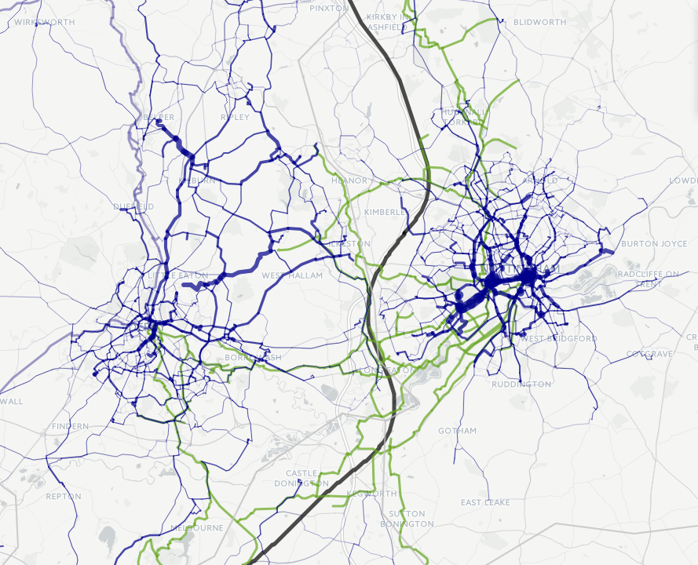
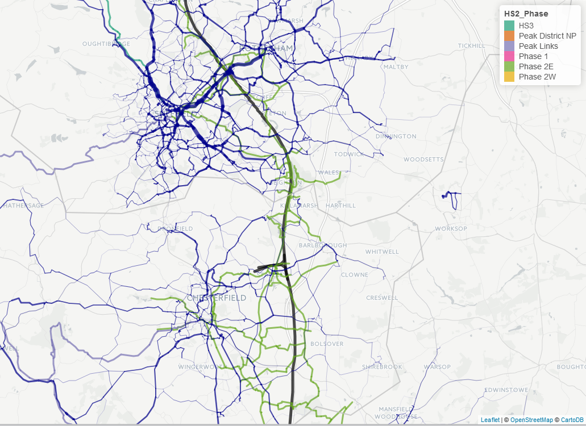
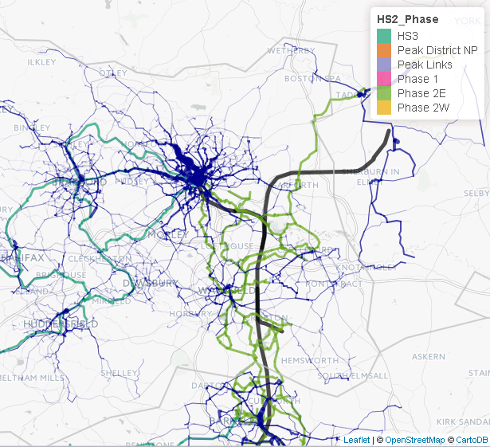

```{r setup, include=FALSE}
knitr::opts_chunk$set(echo =FALSE, warning=FALSE, message=FALSE, echo = FALSE, fig.align = "center", out.width = "100%")
source("../pct-load/set-up.R")
```

# Introduction

The original aim of this analysis (as set out in Deliverable 5.2 in the December 2014 Stage 2 contract) was to assess the cycling potential along the HS2 *train* route.  The revised plan, based on subsequent feedback from Shane Snow about what would be most useful, is to assess the cycling potential along the *cycle path network* designed to be constructed in tandem with construction of the HS2 route. We refer to this cycle network, which has a **total length of 3,213 km** as the HS2 Cycle Path Network (HS2CN).

This document reports on the level of overlap between the HS2CN and the Route Network layer generated by the PCT. Both have complex and at times intricate shapes that are not conducive to simple quantification (as was the case with the comparatively simple route analysed in the '[Lewes Uckfield report](https://github.com/npct/pct/blob/master/lewes-uckfield.Rmd)'. Furthermore, both layers should be interpreted in the context of the local demographic, transport and physical environment. Therefore this report is based on visual inspection and interpretation of each layer in tandem, based on which some suggestions are made.

Thus, for the local results the format of the report is as follows: it will begin with a map of the local area (which readers are encouraged to inspect in detail, in combination with the online results, described below) and proceed with text describing the analyst's interpretation of the data. The interpretation stage was based on the assessment of the following questions:

- What is the overall correspondence between the HS2CN and the Route Network generated by the PCT?
- Where are there notable discrepancies between the two layers?
- What recommendations could stem from these differences, taking into account the data on which the PCT is based (2011 commute data at the MSOA level)?

## Online vs full versions of the data

We base the following analysis on the Government Target scenario in the PCT, based on the target of doubling cycling nationally. Please refer to the main PCT interface at www.pct.bike for an in-depth exploration of areas of interest, which provides additional scenarios and levels of visualisation (Quietest Route, Fastest Route, and Desire Line levels).

There is only so much information that can be displayed on printed images. To overcome this issue, and to encourage decision makers at the DfT and elsewhere to draw their own conclusions from the data, we have, as with the PCT itself, made the results of the work available on an interactive web map: see [npct0.vs.mythic-beasts.com/hs2cn.html](http://npct0.vs.mythic-beasts.com/hs2cn.html).

Note that the map hosted at npct0.vs.mythic-beasts.com omits much of the detail of the full PCT to enable the HS2CN and the PCT's Route Network layer to load on a normal web browser.  Any analysis based on this online map (but not the images provided in the report) should take these simplifications into account: 

- Simplification: Both the HS2CN and PCT Route Network Layer were 'simplified' so that intricate details of the path were removed. For this reason at high zoom levels the route segments will not always perfectly follow roads exactly.
- Only segments with **200 or more cycle commuters under the Government Target** were included from the Route Network layer.
- Only segments of the Route Network with a distance of at least 50 m were included.
- Only segments within 10km straight-line distance of the proposed HS2 route are included.

To enable an analysis of the data based on the complete data, the full Route Network associated with the HS2CN will be made available. The figures presented at the local level are based on the full Route Network data.

## Descriptive analysis of route

An overview of this plan is presented in Figure \@ref(fig:overview). The proposal is split the HS2CN into 6 phases, including Phase 1, Phase 2 (East and West), Peak District links and HS3. The analysts at Royal Haskoning have done some preliminary analysis on the proposed HS2CN, which is briefly summarised below for context. 

```{r overview, out.width="100%", fig.cap="Overview of the HS2 cycle network (HS2CN)."}
library(knitr)
include_graphics("figures/hs2-overview.png")
```

```{r, echo=FALSE, warnings=FALSE, message = FALSE}
source("R/load-infrastructure.R")
over_table = hs2net@data %>% 
  group_by(HS2_Phase) %>% 
  summarise(
    `Lenth (km)` = sum(Shape_Leng) / 1000,
    `Main county` = names(which.max(table(CountyUA))),
    `Main nearest city` = names(which.max(table(NearestCit)))
  )
kable(over_table, digits = 1, row.names = F, caption = "Summary of the length and main county/city related to each Phase of the planned cycle network surrounding HS2.")
```

\newpage

# The propensity to cycle around the HS2 cycle network

The first stage in the analysis was to subset the Route Network layer generated by the PCT to include only segments within a close distance to the HS2CN. This was set to 10 km, based on the knowledge that most people will not cycle more than around 8 miles to work (8 mile route distance correponds to around 10 km Euclidean distance, depending on how circuitous the roads are in the local area).

To do this, all PCT regions that the HS2CN passed through were identified (Figure \@ref(fig:regions)).
<!-- The distance of cycle paths associated with these regions is summarised in Table @\ref -->
These were: Buckinghamshire, Cheshire, Derbyshire, Greater Manchester, 
 Hertfordshire, Leicestershire, Liverpool City Region, London, 
 Northamptonshire, North Yorkshire, Nottinghamshire, Oxfordshire, 
 South Yorkshire, Staffordshire, Warwickshire, West Midlands and
 West Yorkshire.

```{r, echo=FALSE}
# library(sf)
library(sp)
# regions = st_read("../pct-data/regions.geojson")
regions = geojson_read("../pct-data/regions.geojson", what = "sp")
proj4string(regions) = proj4string(hs2net)
regions$region_name = capitalize_region(regions$Region)
# hs2sf = st_as_sf(hs2net)
hs2points = spsample(hs2net, n = 1000, type = "random")
hs2buff = stplanr::buff_geo(hs2points, width = 10000)
# hs2buff = rgeos::gBuffer(hs2net, width = 10000)
regions_sel = regions[hs2net,]
region_names = regions$Region
# plot(regions_sel, lty = 3)
# plot(regions, add = TRUE, lty = 3)
# plot(regions_sel, col = "yellow", add = TRUE, lty = 3)
# plot(hs2buff, col = "grey", add = TRUE)
# plot(hs2net, add = T, col = hs2net$HS2_Phase)
# plot(regions_sel, lty = 3, col = NA, add = T)
```

```{r regions, fig.cap="Regions that HS2 pass through (dotted lines, highlighted in yess) and the HS2CN surrounded by a 10 km buffer (grey area)."}
include_graphics("figures/hs2-over-reg.png")
```


<!-- The route network was extracted from our analysis for each of these regions using the following commands: -->

<!-- ```{r, eval=FALSE} -->
<!-- rnet = readRDS("../pct-data/avon/rnet.Rds") -->
<!-- for(i in 2:length(region_names)){ -->
<!--   f = paste0("../pct-data/", region_names[i], "/rnet.Rds") -->
<!--   rnet = bind(rnet, readRDS(f)) -->
<!-- } -->
<!-- saveRDS(rnet, "../pct-bigdata/rnet-england-msoa.Rds") -->
<!-- ``` -->

```{r, echo=FALSE, eval=FALSE}
# rnet = readRDS("../pct-bigdata/rnet-england-msoa.Rds")
# rnet = rnet[hs2buff,]
# saveRDS(rnet, "input-data/rnet-hs2.Rds")
rnet = readRDS("input-data/rnet-hs2.Rds")
scen = "govtarget_slc"
rnet@data[,scen][rnet@data[,scen] > 5000] = 5000
summary(rnet$govtarget_slc)
rnet_high = rnet[rnet$govtarget_slc > 200,]
tmap_mode("view")
tm_shape(hs2) +
  tm_lines(col = "black", lwd = 5) +
  tm_shape(hs2net) +
  tm_lines(col = "HS2_Phase", lwd = 3, palette = "Dark2") +
  tm_shape(rnet) +
  tm_lines(col = "darkblue", lwd = "govtarget_slc", scale = 50) +
  tm_shape(regions) +
  tm_borders(col = "grey", lwd = 2) +
  tm_scale_bar()

# Create simple, usable output
object.size(hs2net) / 1000000
object.size(rnet) / 1000000
object.size(rnet_high) / 1000000

rnet_high$length = stplanr::line_length(rnet_high)
summary(rnet_high$length)
rnet_high = rnet_high[rnet_high$length > 50,]

rnet_high_simple = ms_simplify(rnet_high)
hs2net_simple = ms_simplify(hs2net)
object.size(rnet_high_simple) / 1000000
object.size(hs2net_simple) / 1000000

mpub =   tm_shape(hs2) +
  tm_lines(col = "black", lwd = 5) +
  tm_shape(rnet_high_simple) +
  tm_lines(col = "darkblue", lwd = 3) +
  tm_shape(hs2net_simple) +
  tm_lines(col = "HS2_Phase", lwd = 2) +
  tm_shape(regions) +
  tm_borders(col = "grey", lwd = 2) 

mpub

saveRDS(mpub, "input-data/hs2mpub.Rds")
save_tmap(mpub, "hs2cn.html")
```

\newpage

## Overall pattern at the national level

An overview of the overlap between the HS2CN and the national Route Network layer produced by the PCT is displayed in Figure \@ref(fig:rnetover). 

```{r rnetover, echo=FALSE, fig.cap="National overview of the overlap between the Route Network generated by the PCT and the HS2CN. The Route Network is displayed in dark blue, with thickness corresponding to cycling potential under the Government Target scenario, with width representing a maximum of 5000 (although the results go to 20000 in London) and a minimum of 200 estimated commuters per segment. See npct0.vs.mythic-beasts.com/hs2cn.html for an online version of this map."}
include_graphics("figures/hs2-over-reg2.png")
```

At the national level, the most noticeable difference between the HS2CN and the result generated by the PCT is the density of the Route Network in urban/rural areas. Although the HS2CN clearly was designed to be denser in urban areas, the proportion of cycling potential estimated by the PCT that is in urban areas appears to be greater than the proportion of HS2CN that is in urban areas, by distance.

Another pattern is that while the PCT's Route Network layer tends to emphasise main roads, the HS2CN favours smaller roads which are generally more circuitous. The PCT uses the 'fastest route' option from the CycleStreets.net routing algorithm, based on evidence that people are more likely to cycle if there is a direct cycling route and that older people and women are disproportionally averse to the longer distances implied by more circuitous routes.

What follows is an analysis of regions where there is a notable divergence between the results of the PCT and the HS2CN. A simplified version of the results has been made on-line for policy-makers to explore, at
[npct0.vs.mythic-beasts.com/hs2cn.html](http://npct0.vs.mythic-beasts.com/hs2cn.html).

\newpage

## London to Birmingham

Between London and Birmingham, there appears to be more cycling potential directly to the west of the HS2CN than along its main route or to the east, implying extension in this direction (particularly between Bicester and Banbury, for example) could be an effect way to improve the utility of the HS2CN for commuting. The B4100 could be a potential candidate for such a route were it to be built on-road, as it follows a fairly direct path but stays away from the M40 and the existing rail track in along the travel corridor (Figure \@ref(fig:banbi)).


```{r banbi, fig.cap="Example of where shifting the HS2CN to the west between London and Birmingham could benefit commuters, between Banbury and Bicester.", out.width="75%"}
include_graphics("figures/hs2-banbi.png")
```

\newpage

## Coventry, Rugby and Leamington Spa

Overall there is good correspondence between the PCT and the HS2CN in this area, with part of the 'fastest route' results of the Route Network following the path of the HS2CN between Leamington Spa and Stratford-upon-Avon, for example. There is high cycling potential in this area overall, with an estimated ~500 commuters using the thick blue lines illustrated in Figure \@ref(fig:leam), so it makes sense to expand the HS2CN away from a single, linear route in this region, as has been done. However, there is potential to improve the overlap further, for example by building a more direct route between Rugby and Southam/Long Itchington (currently the HS2CN detours west before bearing northeast along small country lanes from Southam rather than taking the more direct A426 route).

Interestingly there is also no cycle path proposed between Coventry and Rugby, despite there being evidence of cycling potential between the two settlements and Brandon (located halfway between them) from the PCT.

```{r leam, fig.cap="Overlay of the PCT's Route Network layer and the HS2CN around Leamington Spa"}
include_graphics("figures/hs2leam.png")
```

\newpage

## Birmingham region

As a major city, Birmingham has very high cycling potential yet low current rates, which translates into very high potential for cycling uptake at city and regional levels. The HS2CN designers seem to have recognised this, as there is a substantial densification and deliberate detour into Birmingham city centre. This seems to be in line with the results of the PCT, which show high cycling potential along all arterial routes leading into Birmingham (especially on North-South corridors), some of which are picked up by the HS2CN (see Figure \@ref(fig:birm)).

From the perspective of maximising cycling uptake by building along segments of highest cycling potential, it would seem that even more could be done to serve the dense urban populations to the east of Birmingham and surrounding Solihull. While the HS2CN is dense around the largely suburban/rural settlements of Hampton in Arden, Meriden and Balsal Common, the PCT's Route Network layer is thickest along Hagley Road (the A456), which feeds Birmingham from the East and Bristol/Pershore Road (the A38 and A441 respectively).

The PCT also suggests that there is high cycling potential around Solihull (especially to the north, south and west) and Walsall that is not catered for by the HS2CN.  Seeking to cater for this potential could be valuable as Solihull and Walsall currently are among the local authorities in England and Wales with the lowest commuter cycling relative to their potential, ranking 24/346 and 37/346 respectively.


```{r birm, fig.cap="Overlay of the PCT's Route Network layer and the HS2CN around Leamington Spa"}
include_graphics("figures/hs2-birm.png")
```

\newpage

## Nottingham and Derby

```{r notts, fig.cap="Overlay of the PCT's Route Network layer and the HS2CN around Nottingham and Derby region"}

```

There is high cycling potential around Nottingham and Derby and this is reflected in the HS2CN, which branches out substantially around the centres of both cities, especially Nottingham. There HS2CN is denser to the south of Nottingham than to the north. The Route Network suggests that there is high cycling potential to both the north and south, however, suggesting the opportunity to extend the HS2CN to the north, to increase the density of the cycle network in that part of the city.

The HS2CN is denser to the east of the HS2 route in the area than to the west, yet there is high cycling potential both sides of the main track. A noticeable mismatch between the HS2CN and the PCT's Route Network is the high cycling potential of north-south corridors west of the HS2 route. There seems to be high cycling potential between the Derby and Kilburn, for example, which is only partly served by the Peak Links phase of the HS2CN, for example. There is also high cycling potential in the roads connecting Ilkeston to the east, Little Eaton to the north and Ripley to the far north of Derby which could be better served by the HS2CN.

\newpage

## Chesterfield and Sheffield

```{r sheff, fig.cap="Overlay of the PCT's Route Network layer and the HS2CN around Chesterfield and Sheffield."}

```

Sheffield and Chesterfield in particular are well-served by the HS2CN. Cycling potential in and around Sheffield seems to be higher than cycling potential in and around Chesterfied, probably due to the higher population densities in Sheffield, yet the HS2CN is denser around Chesterfield. This implies expanding the HS2CN in the Sheffield area could increase its benefits. The A618 between Swallownest and Rotherham, and the A6135 between Intake and Sheffield city centre, for example are two options that would build on the existing plans for the HS2CN while providing direct routes where there is strong evidence of high cycling potential.

\newpage

## Barnsley, Wakefield and Leeds

```{r lds, fig.cap="Overlay of the PCT's Route Network layer and the HS2CN around Barnesley, Wakefield and Leeds."}

```


There is high cycling potential on both sides of HS2 in the almost continuously populated area within the 10 km buffer of its route between Barnesley and Leeds. There is currently poor provision for cycling in this area, except for the relatively narrow and rural Pennine way off-road cycle path.

A dense network of routes with high cycling potential is supported by the HS2CN around Barnsley, with many crossings reducing the potential for severance impacts of HS2, for example between Wakefield and Pontefract. One area of slight divergence between 
the route network layer of the PCT and the HS2CN in this area is with respect to the relative density of cycling networks in urban centres and their surroundings. The PCT suggests that the density of cycle networks should be much denser in city centres, for example around Leeds, Huddersfield, Halifax and Wakefield. The HS2CN, by contrast, has a relatively uniform density in these areas compared with their suburban and rural surroundings. This is a pattern that applies throughout the HS2CN-PCT comparison but which is particularly noticeable in this area. To address this issue, the HS2CN could be supplemented by additional cycle tracks and other interventions encouraging cycling close to the city centres.

The HS2CN duplicates the route of the CityConnect Leeds-Bradford route for much of the way and makes use of the existing canal tow-path in the area, while omitting Otley Road, which has the highest cycling potential of all arterial routes in Leeds (and West Yorkshire overall) under the Government Target scenario used for this analysis. Another discrepancy between the PCT analysis and the HS2CN in the region is the density of east-west routes to the south of Leeds in the proposed network compared with the relative absence of proposed routes going due east further north, e.g. from Leeds city centre towards Garforth. There is clearly high cycling potential along York Road (which is only partly served by a thin extension of the CityConnect route a couple of km in that direction) and Selby Road that could be well served by extensions to the HS2CN.

Another route with relatively high cycling potential in close proximity to the route of HS2 yet not served by the HS2CN is corridor to the east of Leeds/Wakefield running north-south between Tadcaster and knottingley/Pontefract. Extensions to the HS2CN along this corridor, e.g. along the A162, could greatly benefit utility cyclists in the area, building on the segments of the HS2CN that would connect Tadcaster to Castleford via Garforth and Aberford.

\newpage

## Staffordshire and Cheshire

```{r staf, fig.cap="Overlay of the PCT's Route Network layer and the HS2CN in Staffordshire."}
include_graphics("figures/hs2-staf.png")
```

Stoke-on-Trent and Stafford are the only two major settlements in Staffordshire well-served by the HS2CN. There is a relatively dense proposed network around Cannock, Lichfield and Rugeley to the south of the region yet, interestingly, no HS2CN route into Cannock itself, which has relatively high cycling potential compared with its rural surroundings.

In Stafford itself the HS2CN opens up and becomes substantially more dense, serving potential along east-west corridors and north of the city well. However, there is little provision for cycling potential directly south of the city, e.g. towards Stafford Grammar School and beyond along the A449 and Silmore Lane.

The route going to Stone and onward to Stoke-on-Trent is well thought-out, providing multiple options out of Stafford in the northern direction and providing plenty of opportunities to cross the HS2 route, reducing severance (although Eccleshall is not linked-up, although doing so would be straightforward, by extending the proposed route along Yarnfield lane west onto Swynnerton Road via Swynnerton Training Camp).

Stoke-on-Trent is slightly less well catered for than Stafford, despite being larger and having higher cycling potential. There are no routes out to the north (e.g. to Hanley and Longport) although there is a route far out to the west, with various bifurcations, despite relatively low estimated potential to the west. This suggests that a north-then-west route might be favourable to cycling uptake than the west-then-north route to connect to Crewe, despite the latter option following more closely the HS2 route, although both routes could be complementary. 

In Crewe the highest cycling potential is out towards the neighbouring settlement of Nantwich, but the HS2CN avoids Nantwich altogether. Instead, it provides two routes out to the north and east to Sandbach, which has less cycling potential.

\newpage

## Greater Manchester

[one thing that comes up here and probably elsewhere is how the hs2 plans relate to what they expect the cities to be doing anyway e.g tfgm is focusing on building into city centre as part of its cycle city ambition award]
```{r man, fig.cap="Overlay of the PCT's Route Network layer and the HS2CN in Staffordshire."}
include_graphics("figures/hs2-man.png")
```

As a densely populated conurbation with a strong regional economy, Greater Manchester has very high cycling potential. It therefore makes sense for the HS2CN to become more dense in this region. However, the densification does not correspond with the areas of highest cycling potential inferred from the Route Network layer of the PCT. There is a dense proposed network surrounding Knutsford and north of Wilmslow. However, there is only one route into Manchester city centre in the Phase 2 plans (although another is proposed in Phase 3), which has much higher levels of cycling potential. This suggests opportunities for extending the HS2CN to better meet the latent demand for utility cycling in the region.

The HS2CN travels west towards Wigan not from Manchester via Salford, Stretford and Hindley (where there is substantial east-west cycling potential), but from Altrinchan following closely the HS2 route, which as lower cycling potential.

\newpage

## Liverpool City Region

```{r liv, fig.cap="Overlay of the PCT's Route Network layer and the HS2CN in Staffordshire."}
include_graphics("figures/hs2-liv.png")
```

Strictly speaking the HS2CN does not pass through Liverpool City Region. It is only the proposed cycle paths associated with HS3 that go west of Wigan (HS3CN). This network passes through south and central Warrington (avoiding a route with high cycling potential to the northeast of Warrington centre) and on west and northwest, creating a triangular network with high cycling potential between Warrington, St Helens and Widnes. The short route with high cycling potential between Widnes and Runcorn is omitted from the HS3CN.

There is very high cycling potential in all directions fanning out from the monocentric Liverpool city centre. This potential is picked-up by only a single HS3CN route, which follows the River Mersey and therefore misses the areas of highest cycling potential to the north of the river.

\newpage

## Discussion

This report has provided visual evidence on the geographic correspondence between the results of the PCT, presented in the form of the higher-potential sections of the Route Network layer under the Government Target scenario within a 10 km buffer of the HS2 route, and the routes comprising the plans for the HS2CN. This evidence is analysed verbally based on visual inspection and some knowledge of the surroundings, based partly on the use of the main PCT hosted at www.pct.bike.

Overall, the density of the HS2CN follows areas and routes of high cycling potential, based on the Route Network layer of the PCT under the Government Target scenario, reasonably well. The following general patterns of divergences were identified, however:

- The densification of the HS2CN in large urban centres such as Birmingham, Derby Leeds and Nottingham did not reflect the great increase in utility cycling potential in these densely populated cities.  We appreciate that this may partly reflect an expectation that these city centres may benefit from other programmes specifically focused on building cycling infrastructure in cities.

- There was a general tendency for the HS2CN to follow more rural and circuitous routes compared with the relatively direct routes favoured by the PCT's use of the 'fastest route'.

- While the HS2CN tended to emphasis inter-city cycling routes, the PCT tends to emphasise intra-city cycling routes.
[i thought you comment about not in any way wrong was too strong- ]

In seeking to optimise HS2CN, we believe it is useful to consider the latent demand for commuter cycling as modelled by the various PCT scenarios. Nevertheless, the interpretation of this analysis of the two large and complex route network layers should be based on knowledge of the assumptions underlying the PCT and the intentions of the HS2CN. It is not the case that one is necessarily more 'correct'. Leisure cycling and non-commuter utility cycling, for example, are not represented in the results generated by the PCT, and the ability of cycle routes to serve destinations such as schools also needs to be considered in planning. Another important caveat is that while the fastest routes are highlighted by the PCT may maximise cycling uptake, it may in some cases be easier to create high quality cycling provision along an alternative route. These caveats should be borne in mind when determining whether to consider adopting the adjustments to the HS2CN suggested in this report, with a view to seeking to maximise the ability of HS2CN to unlock cycling potential.

[AG comment: I toned down the final paragraph, I think based on very small amount of work we've done on this should not say we are 'confident that an improvement would be possible', just that the results may be useful]
[RA comment: I have tweaked this too, to mention other destinations and change the 'practicality' caveat to highlight that there is a good reason for choosing the fastest routes.]
