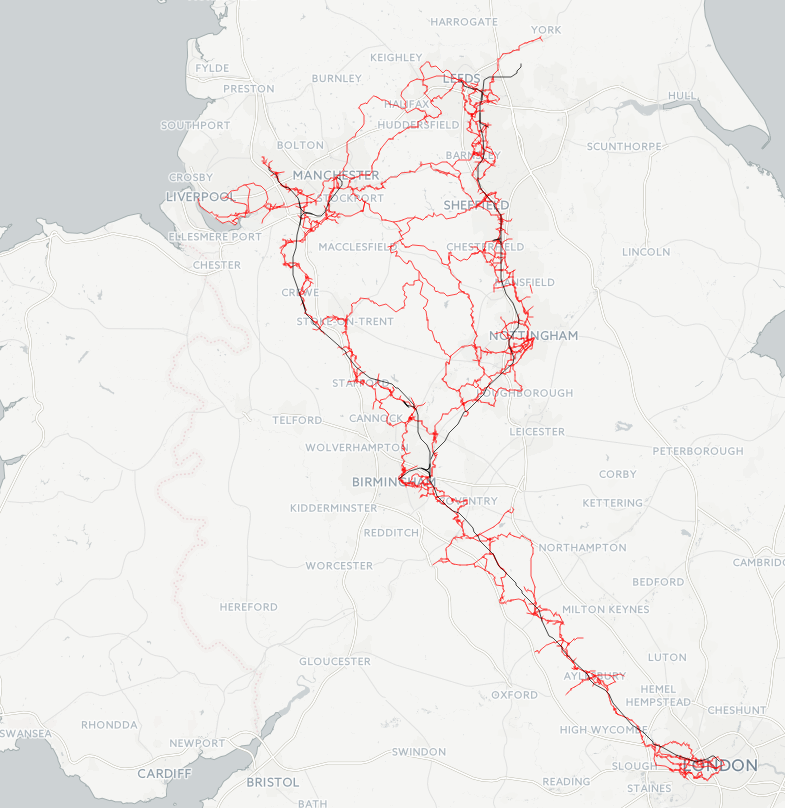
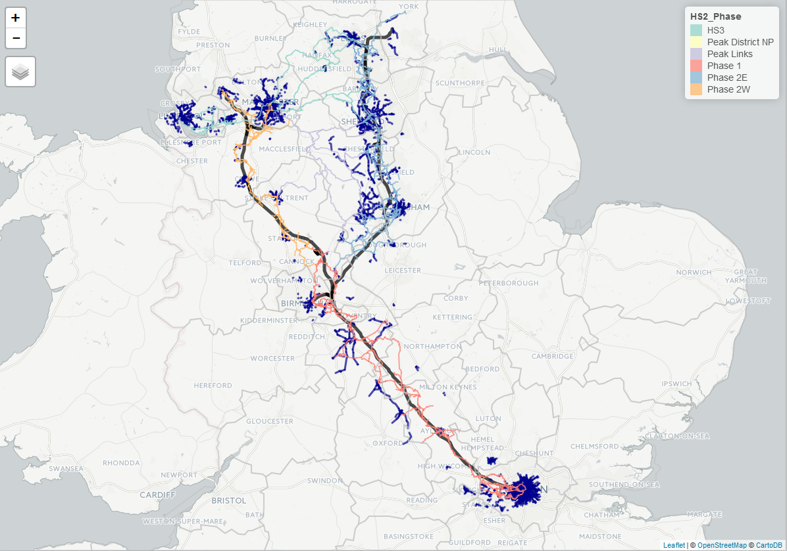
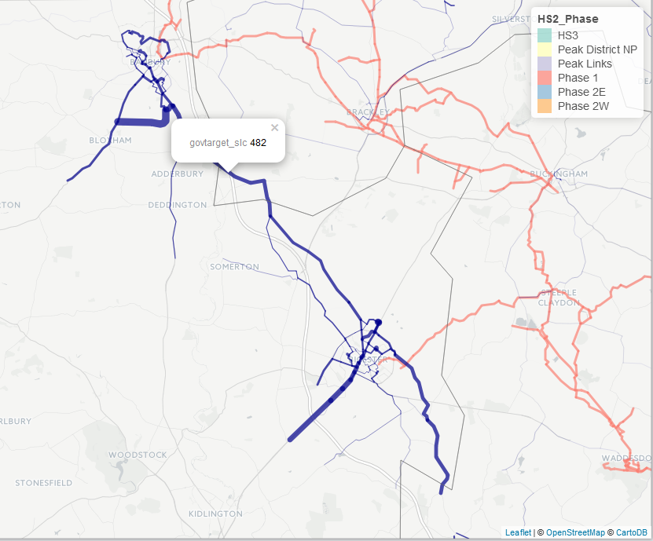
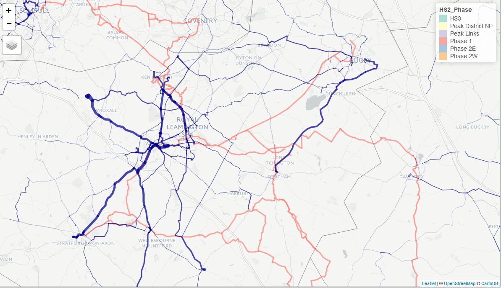
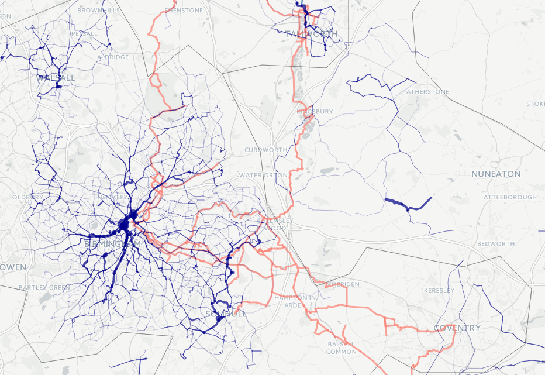

```{r setup, include=FALSE}
knitr::opts_chunk$set(echo =FALSE, warning=FALSE, message=FALSE, echo = FALSE, fig.align = "center", out.width = "100%")
source("../pct-load/set-up.R")
```

# Introduction

The original plan for this analysis was to assess the cycling potential along the HS2 route.
The new plan, based on feedback from the DfT about what would be most useful, is to assess the cycling potential along the *cycle path network* designed by consultants to be constructed in tandem with construction of the HS2 route. We refer to this network, which has a **total length of 3,213 km** as the HS2 Cycle Path Network (HS2CN).

This reports on the level of overlap between teh HS2CN and the Route Network layer generated by the PCT. Both have complex and at times intricate shapes, that are not conducive to simple quantification (as was the case with the comparatively simple route analysed in the '[Lewes Uckfield report](https://github.com/npct/pct/blob/master/lewes-uckfield.Rmd)'. Furthermore, both layers should be interpreted in the context of the local demographic, transport and physical environment. Therefore this report is based on visual inspection and interpretation of each layer in tandem, and as some of the recommendations are open to debate, based on the interpretation of the available (primarily visually displayed) data.

Thus, for the local results the format of the report is as follows: it will begin with a map of the local area (which readers are encouraged to inspect in detail, in combination with the online results, described below) and proceed with text describing the analyst's interpretation of the data. The interpretation stage was based on the assesment of the following questions:

- What is the overall correspondence between the HS2CN and the Route Network generated by the PCT?
- Where are there notable discrepancies between the two layers?
- What recommendations could stem from these differences, taking into account the data on which the PCT is based (2011 commute data at the MSOA level)?

## Online vs full versions of the data

Due to time constraints and to ensure consistency between the maps for each of the areas under investigation, we base the following analysis on the Government Target scenario in the PCT. This scenario is useful because it accounts for both the current level of cycling and unmet potential. Thus the segments highlighted under this scenario have either a high current level of cycling, a high potential level of cycling, or both. Please refer to the main results at www.pct.bike for an in-dept exploration of areas of interest, which provides additional scenarios and levels of visualisation (Quietest Route, Fastest Route, and Desire Line levels).

There is only so much information that can be displayed on printed images. To overcome this issue, and to encourage decision makers at the DfT and elsewhere to draw their own conclusions from the data, we have, as with the PCT itself, made the results of the work available on an interactive web map: see [npct0.vs.mythic-beasts.com/hs2cn.html](http://npct0.vs.mythic-beasts.com/hs2cn.html).

Note that the map hosted at npct0.vs.mythic-beasts.com omits much of the detail of the full PCT to enable the HS2CN and the PCT's Route Network layer to load on a normal web browser and any analysis based on this online map should take these simplifications into account:

- Simplification: Both the HS2CN and PCT Route Network Layer were 'simplified' so that intricated details of the path were removed. For this reason at high zoom levels the route segments will not always perfectly follow roads exactly.
- Only segments with **200 or more cycle commuters under the Government Target** were included from the Route Network layer.
- Only segments of the Route Network with a distance of at least 50 m were included.

To enable an analysis of the data based on the complete data, the full Route Network associated with the HS2CN will be made available. The figures presented at the local level are based on the full Route Network data.

## Descriptive analysis of route

An overview of this plan is presented in Figure \@ref(fig:overview). The proposal is split the HS2CN into 6 phases, including Phase 1, Phase 2 (East and West), Peak District links and HS3. The analysts at Royal Haskoning have done some preliminary analysis on the proposed HS2CN, which is briefly summarised below for context. 

```{r overview, out.width="100%", fig.cap="Overview of the HS2 cycle network (HS2CN)."}
library(knitr)

```

```{r, echo=FALSE, warnings=FALSE, message = FALSE}
source("R/load-infrastructure.R")
over_table = hs2net@data %>% 
  group_by(HS2_Phase) %>% 
  summarise(
    `Lenth (km)` = sum(Shape_Leng) / 1000,
    `Main county` = names(which.max(table(CountyUA))),
    `Main nearest city` = names(which.max(table(NearestCit)))
  )
kable(over_table, digits = 1, row.names = F, caption = "Summary of the length and main county/city related to each Phase of the planned cycle network surrounding HS2.")
```

\newpage

# The propensity to cycle around the HS2 cycle network

The first stage in the analysis was to subset the Route Network layer generated by the PCT to include only segments within a close distance to the HS2CN. This was set to 10 km, based on the knowledge that most people will not cycle more than around 8 miles to work (10 km Euclidead distance corresponds to around 8 mile route distance, depending on how circuitous the roads are in the local area).

To do this, all PCT regions that the HS2CN passed through were identified (Figure \@ref(fig:regions)).
<!-- The distance of cycle paths associated with these regions is summarised in Table @\ref -->
These were: Buckinghamshire, Cheshire, Derbyshire, Greater Manchester, 
 Hertfordshire, Leicestershire, Liverpool City Region, London, 
 Northamptonshire, North Yorkshire, Nottinghamshire, Oxfordshire, 
 South Yorkshire, Staffordshire, Warwickshire, West Midlands and
 West Yorkshire.

```{r, echo=FALSE}
# library(sf)
library(sp)
# regions = st_read("../pct-data/regions.geojson")
regions = geojson_read("../pct-data/regions.geojson", what = "sp")
proj4string(regions) = proj4string(hs2net)
regions$region_name = capitalize_region(regions$Region)
# hs2sf = st_as_sf(hs2net)
hs2points = spsample(hs2net, n = 1000, type = "random")
hs2buff = stplanr::buff_geo(hs2points, width = 10000)
# hs2buff = rgeos::gBuffer(hs2net, width = 10000)
regions_sel = regions[hs2net,]
region_names = regions$Region
# plot(regions_sel, lty = 3)
# plot(regions, add = TRUE, lty = 3)
# plot(regions_sel, col = "yellow", add = TRUE, lty = 3)
# plot(hs2buff, col = "grey", add = TRUE)
# plot(hs2net, add = T, col = hs2net$HS2_Phase)
# plot(regions_sel, lty = 3, col = NA, add = T)
```

```{r regions, fig.cap="Regions that HS2 pass through (dotted lines, highlighted in yess) and the HS2CN surrounded by a 10 km buffer (grey area)."}
include_graphics("figures/hs2-over-reg.png")
```


<!-- The route network was extracted from our analysis for each of these regions using the following commands: -->

<!-- ```{r, eval=FALSE} -->
<!-- rnet = readRDS("../pct-data/avon/rnet.Rds") -->
<!-- for(i in 2:length(region_names)){ -->
<!--   f = paste0("../pct-data/", region_names[i], "/rnet.Rds") -->
<!--   rnet = bind(rnet, readRDS(f)) -->
<!-- } -->
<!-- saveRDS(rnet, "../pct-bigdata/rnet-england-msoa.Rds") -->
<!-- ``` -->

```{r, echo=FALSE, eval=FALSE}
# rnet = readRDS("../pct-bigdata/rnet-england-msoa.Rds")
# rnet = rnet[hs2buff,]
# saveRDS(rnet, "input-data/rnet-hs2.Rds")
rnet = readRDS("input-data/rnet-hs2.Rds")
scen = "govtarget_slc"
rnet@data[,scen][rnet@data[,scen] > 5000] = 5000
summary(rnet$govtarget_slc)
rnet_high = rnet[rnet$govtarget_slc > 200,]
tmap_mode("view")
tm_shape(hs2net) +
  tm_lines(col = "HS2_Phase", lwd = 3) +
  tm_shape(rnet) +
  tm_lines(col = "darkblue", lwd = "govtarget_slc", scale = 50) +
  tm_shape(regions) +
  tm_borders(col = "grey", lwd = 2) +
  qtm(hs2, line.col = "black", lwd = 5)

# Create simple, usable output
object.size(hs2net) / 1000000
object.size(rnet) / 1000000
object.size(rnet_high) / 1000000

rnet_high$length = stplanr::line_length(rnet_high)
summary(rnet_high$length)
rnet_high = rnet_high[rnet_high$length > 50,]

rnet_high_simple = ms_simplify(rnet_high)
hs2net_simple = ms_simplify(hs2net)
object.size(rnet_high_simple) / 1000000
object.size(hs2net_simple) / 1000000

mpub =   tm_shape(hs2) +
  tm_lines(col = "black", lwd = 5) +
  tm_shape(rnet_high_simple) +
  tm_lines(col = "darkblue", lwd = 3) +
  tm_shape(hs2net_simple) +
  tm_lines(col = "HS2_Phase", lwd = 2) +
  tm_shape(regions) +
  tm_borders(col = "grey", lwd = 2) 

mpub

saveRDS(mpub, "input-data/hs2mpub.Rds")
save_tmap(mpub, "hs2cn.html")
```

\newpage

## Overall pattern at the national level

An overview of the overlap between the HS2CN and the national Route Network layer produced by the PCT is displayed in Figure \@ref(fig:rnetover). Overall there is a good degree of correspondence between the two route network layers. 

```{r rnetover, echo=FALSE, fig.cap="National overview of the overlap between the Route Network generated by the PCT and the HS2CN. The Route Network is displayed in dark blue, with thickness corresponding to cycling potential under the Government Target scenario, with width representing a maximum of 5000 (although the results go to 20000 in London) and a minimum of 200 estimated commuters per segment. See [npct0.vs.mythic-beasts.com/hs2cn.html](http://npct0.vs.mythic-beasts.com/hs2cn.html) for an online version of this map."}

```

At the national level, the most noticeable difference between the HS2CN and the result generated by the PCT is the density of the Route Network in urban/rural areas. Although the HS2CN clearly was designed to be denser in urban areas, the proportion of cycling potential estimated by the PCT that is in urban areas appears to be greater than the proportion of HS2CN that is in urban areas, by distance.

Another pattern is that while the PCT's Route Network layer tends to emphasise main roads, the HS2CN favours smaller roads which are generally more circuitous. The PCT deliberately is based on the 'fastest route' option from the CycleStreets.net routing algorithm, based on evidence that people are more likely to cycle if there is a direct cycling route and that older people and women are disproportionally averse to the longer distances implied by more cirquitous routes.

What follows is an analysis of notable areas where there is a notable divergence between the results of the PCT and the HS2CN. A simplified version of the results has been made on-line for policy-makers to explore, at www.pct.bike/hs2cn.

\newpage

## London to Birmingham

Between London and Birmingham, there appears to be more cycling potential directly to the west of the HS2CN than along its main route or to the east, implying extension in this direction (particularly between Bicester and Banbury, for example) could be an effect way to improve the utility of the HS2CN for commuting. The B4100 could be a potential candidate for such a route were it to be build on-road, as it follows a fairly direct path but stays away from the M40 and the existing rail track in along the travel corridor (Figure \@ref(fig:banbi)).


```{r banbi, fig.cap="Example of where shifting the HS2CN to the west between London and Birmingham could benefit commuters, between Banbury and Bicester.", out.width="75%"}

```

\newpage

## Coventry, Rugby and Leamington Spa

Overall there is good correspondence between the PCT and the HS2CN in this area, with part of the 'fastest route' results of the Route Network following the path of the HS2CN between Leamington Spa and Stratford-upon-Avon, for example. There is high cycling potential in this area overall, with an estimated ~500 commuters using the thick blue lines illustrated in Figure \@ref(fig:leam), so it makes sense to expand the HS2CN away from a single, linear route in this region, as has been done. However, there is potential to improve the overlap further, for example by building a more direct route between Rugby and Southam/Long Itchington (currently the HS2CN detours west before bearing northeast along small country lanes from Southam rather than taking the more direct A426 route).

Interestingly there is also no cycle path proposed between Coventry and Rugby, despite there being evidence of cycling potential between the two settlements and Brandon (located halfway between them) from the PCT.

```{r leam, fig.cap="Overlay of the PCT's Route Network layer and the HS2CN around Leamington Spa"}

```

\newpage

## Birmingham region

As a major city, Birmingham has very high cycling potential yet low current rates, reflecting very high potential for cycling uptake at city and regional levels there. The HS2CN designers seem to have recognised this, as there is a substantial densification and deliberate detour into Birmingham city centre. This seems to be very sensible based on the results of the PCT, which show high cycling potential along all arterial routes leading into Birmingham (especially on North-South corridors), some of which are picked up by the HS2CN (see Figure \@ref(fig:birm)).

From the perspective of cost-benefit, which would imply building along segments of highest cycling potential, it would seem that even more could be done to serve the dense urban populations to the east of Birmingham and surrounding Solihul (which incidentally has one of the lowest levels of cycling in England). While the HS2CN in dense around the largely suburban/rural settlments of Hampton in Arden, Meriden and Balsal Common, the PCT's Route Network layer is thickest along Hagley Road (the A456), which feeds Birmingham from the East and Bristol/Pershore Road (the A38 and A441 respectively).

The PCT also suggests that there is high cycling potential around Solihull (especially to the north and south, and to the West, towards Birmingham) and Walsall that is not catered for by the HS2CN.


```{r birm, fig.cap="Overlay of the PCT's Route Network layer and the HS2CN around Leamington Spa"}

```

\newpage

