```{r setup, include=FALSE}
knitr::opts_chunk$set(echo =FALSE, warning=FALSE, message=FALSE, echo = FALSE, fig.align = "center", out.width = "100%")
source("../pct-load/set-up.R")
```

# Introduction

The original aim of this analysis (as set out in Deliverable 5.2 in the December 2014 Stage 2 contract) was to assess the commuter cycling potential along the HS2 *train* route.  The revised plan, based on subsequent feedback from Shane Snow about what would be most useful, is to assess the commuter cycling potential along the *cycle path network* designed to be constructed in tandem with construction of the HS2 route. We refer to this cycle network, which has a **total length of 3,213 km** as the HS2 Cycle Path Network (HS2CN).

This document reports on the level of overlap between the HS2CN and the Route Network layer generated by the PCT. Both have complex and at times intricate shapes that are not conducive to simple quantification (as was the case with the comparatively simple route analysed in the '[Lewes Uckfield report](https://github.com/npct/pct/blob/master/lewes-uckfield.Rmd)'. Furthermore, both layers should be interpreted in the context of the local demographic, transport and physical environment. Therefore this report is based on visual inspection and interpretation of each layer in tandem, based on which some suggestions are made.

Thus, for the local results the format of the report is as follows: it will begin with a map of the local area (which readers are encouraged to inspect in detail).  Each map is followed by text describing the analyst's interpretation of the data. The interpretation stage was based on the assessment of the following questions:

- What is the overall correspondence between the HS2CN and the Route Network generated by the PCT?
- Where are there notable discrepancies between the two layers?
- What recommendations could stem from these differences, taking into account the data on which the PCT is based (2011 commute data at the MSOA level)?

## Descriptive analysis of the HS2CN route

An overview of this plan is presented in Figure \@ref(fig:overview); a more detailed version of the HS2CN is available online at  [npct0.vs.mythic-beasts.com/hs2cn.html](http://npct0.vs.mythic-beasts.com/hs2cn.html).
We recommend this route is viewed in conjunction with regional versions of the PCT, e.g. www.pct.bike/staffordshire/ for the results that affect the Staffordshire region.

The proposal is split the HS2CN into 6 phases, including Phase 1, Phase 2 (East and West), Peak District links and HS3. The analysts at Royal Haskoning have done some preliminary analysis on the proposed HS2CN, which is briefly summarised below for context. 

```{r overview, out.width="100%", fig.cap="Overview of the HS2 cycle network (HS2CN). See npct0.vs.mythic-beasts.com/hs2cn.html for an interactive online version."}
library(knitr)
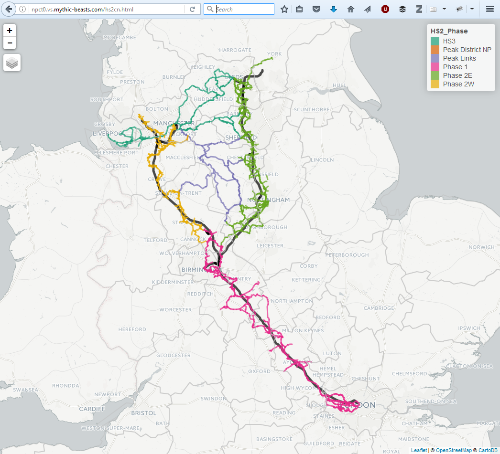
```

```{r, echo=FALSE, warnings=FALSE, message = FALSE}
source("R/load-infrastructure.R")
over_table = hs2net@data %>% 
  group_by(HS2_Phase) %>% 
  summarise(
    `Lenth (km)` = sum(Shape_Leng) / 1000,
    `Main county` = names(which.max(table(CountyUA))),
    `Main nearest city` = names(which.max(table(NearestCit)))
  )
kable(over_table, digits = 1, row.names = F, caption = "Summary of the length and main county/city related to each Phase of the planned cycle network surrounding HS2.")
```

\newpage

# The propensity to cycle around the HS2 cycle network

We base the following analysis on the Government Target scenario in the PCT, based on the target of doubling cycling nationally. Please refer to the main PCT interface at www.pct.bike for an in-depth exploration of areas of interest, which provides additional scenarios and levels of visualisation (Quietest Route, Fastest Route, and Desire Line levels).

The first stage in the analysis was to subset the Route Network layer generated by the PCT to include only segments within a close distance to the HS2CN. This was set to 10 km, based on the knowledge that most people will not cycle more than around 8 miles to work (8 mile route distance correponds to around 10 km Euclidean distance, depending on how circuitous the roads are in the local area).
To do this, all PCT regions that the HS2CN passed through were identified (Figure \@ref(fig:regions)).
<!-- The distance of cycle paths associated with these regions is summarised in Table @\ref -->
These were: Buckinghamshire, Cheshire, Derbyshire, Greater Manchester, 
 Hertfordshire, Leicestershire, Liverpool City Region, London, 
 Northamptonshire, North Yorkshire, Nottinghamshire, Oxfordshire, 
 South Yorkshire, Staffordshire, Warwickshire, West Midlands and
 West Yorkshire.


```{r, echo=FALSE, include=FALSE}
# library(sf)
library(sp)
rnet = readRDS("input-data/rnet-hs2.Rds")
regions = geojson_read("../pct-shiny/regions_www/regions.geojson", what = "sp")
proj4string(regions) = proj4string(hs2net)
proj4string(rnet)
regions$region_name = capitalize_region(regions$Region)
# hs2sf = st_as_sf(hs2net)
hs2points = spsample(hs2net, n = 1000, type = "random")
hs2buff = stplanr::buff_geo(hs2points, width = 10000)
# hs2buff = rgeos::gBuffer(hs2net, width = 10000)
regions_sel = regions[hs2net,]
# plot(regions_sel, lty = 3)
# plot(regions, add = TRUE, lty = 3)
# plot(regions_sel, col = "yellow", add = TRUE, lty = 3)
# plot(hs2buff, col = "grey", add = TRUE)
# plot(hs2net, add = T, col = hs2net$HS2_Phase)
# plot(regions_sel, lty = 3, col = NA, add = T)
```
```{r regions, fig.cap="Regions that HS2 pass through (dotted lines, highlighted in yess) and the HS2CN surrounded by a 10 km buffer (grey area)."}
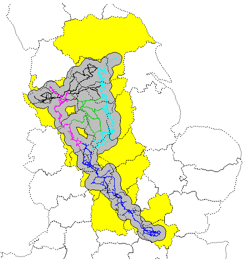
```


<!-- The route network was extracted from our analysis for each of these regions using the following commands: -->
<!-- ```{r, eval=FALSE} -->
<!-- rnet = readRDS("../pct-data/avon/rnet.Rds") --> 
<!-- for(i in 2:length(region_names)){ -->
<!--   f = paste0("../pct-data/", region_names[i], "/rnet.Rds") -->
<!--   rnet = bind(rnet, readRDS(f)) -->
<!-- } -->
<!-- saveRDS(rnet, "../pct-bigdata/rnet-england-msoa.Rds") -->
<!-- ``` -->

```{r, echo=FALSE, eval=FALSE}
# rnet = readRDS("../pct-bigdata/rnet-england-msoa.Rds")
# rnet = rnet[hs2buff,]
# saveRDS(rnet, "input-data/rnet-hs2.Rds")
scen = "govtarget_slc"
nolondon = regions[!grepl(pattern = "london", x = regions$Region),]
rnet = rnet[nolondon,]
# rnet = rnet[rnet$govtarget_slc > 20,]
# rnet$length = stplanr::line_length(rnet)
# summary(rnet_high$length)
# rnet = rnet[rnet$length > 50,]
# summary(rnet$govtarget_slc)
nrow(rnet)
rnet_high = rnet[rnet$govtarget_slc > 200,]


nrow(rnet)

tmap_mode("view")
tm_shape(hs2) +
  tm_lines(col = "black", lwd = 5) +
  tm_shape(hs2net) +
  tm_lines(col = "HS2_Phase", lwd = 3, palette = "Dark2") +
  tm_shape(rnet_high) +
  tm_lines(col = "darkblue", lwd = "govtarget_slc", scale = 50) +
  tm_shape(regions) +
  tm_borders(col = "grey", lwd = 2) +
  tm_scale_bar()

library(leaflet)
leaflet() %>% 
  addTiles() %>% 
  addPolylines(data = rnet, weight = rnet$govtarget_slc / 100)
# Create simple, usable output
object.size(hs2net) / 1000000
object.size(rnet) / 1000000
object.size(rnet_high) / 1000000


rnet_high = rnet_high[rnet_high$length > 50,]
rnet_high_simple = ms_simplify(rnet_high)
hs2net_simple = ms_simplify(hs2net)
object.size(rnet_high_simple) / 1000000
object.size(hs2net_simple) / 1000000

mpub =   tm_shape(hs2) +
  tm_lines(col = "black", lwd = 5) +
  tm_shape(hs2net_simple) +
  tm_lines(col = "HS2_Phase", lwd = 3, palette = "Dark2") +
  tm_shape(regions) +
  tm_borders(col = "grey", lwd = 2) 

smpub

saveRDS(mpub, "input-data/hs2mpub.Rds")
save_tmap(mpub, "hs2cn.html")
```

\newpage

## Overall pattern at the national level

An overview of the overlap between the HS2CN and the national Route Network layer produced by the PCT is displayed in Figure \@ref(fig:rnetover). 

```{r rnetover, echo=FALSE, fig.cap="National overview of the overlap between the Route Network generated by the PCT and the HS2CN (red). The Route Network is displayed under the Government Target scenario."}
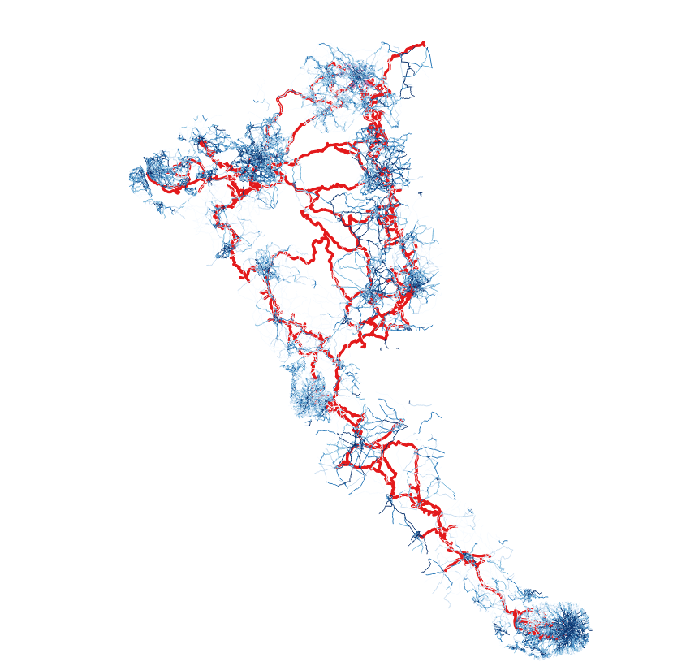
```

At the national level, the most noticeable difference between the HS2CN and the result generated by the PCT is the density of the Route Network in urban/rural areas. Although the HS2CN clearly was designed to be denser in urban areas, the proportion of commuter cycling potential estimated by the PCT that is in urban areas appears to be greater than the proportion of HS2CN that is in urban areas, by distance.  In part this reflects the fact that the PCT route network layer is only created within each PCT region, and does not capture inter-regional flows.  It also stems from the aspiration of the HS2CN to create a continuous national cycle network, which necessarily sometimes involves passing through relatively sparsely populated areas when travelling between towns and cities.

Another pattern is that while the PCT's Route Network layer tends to emphasise main roads, the HS2CN favours smaller roads which are generally more circuitous. The PCT uses the 'fastest route' option from the CycleStreets.net routing algorithm, based on evidence that people are more likely to cycle if there is a direct cycling route and that older people and women are disproportionally averse to the longer distances implied by more circuitous routes.

What follows is an analysis of the PCT and the HS2CN around some of the major towns and cities served by the cycle network.

\newpage


## Warwick, Coventry and Rugby

Overall there is good correspondence between the PCT and the HS2CN in this area, with part of the 'fastest route' results of the Route Network following the path of the HS2CN between Leamington Spa and Stratford-upon-Avon, for example. There is relatively high commuter cycling potential in this area overall, with Warwick being in the top 40% of local authorities in England and Wales with respect to modelled cycling increase in the Government Target scenario.  As such it makes sense to expand the HS2CN away from a single, linear route in this region, as has been done. One possible benefit of the PCT in this context is to highlight direct routes for consideration, for example between Rugby and Coventry. 
Interestingly there is no cycle path proposed between Coventry and Rugby, despite evidence of some commuter cycling potential between the two settlements and Brandon (located halfway between them).

```{r, eval=FALSE, echo=FALSE}
rnet_war = readRDS("../pct-data/warwickshire/rnet.Rds")
tmap_mode("view")
tm_shape(hs2) +
  tm_lines(col = "black", lwd = 5) +
  tm_shape(hs2net) +
  tm_lines(col = "HS2_Phase", lwd = 3, palette = "Dark2") +
  tm_shape(rnet_war) +
  tm_lines(col = "darkblue", lwd = "govtarget_slc", scale = 50) +
  tm_shape(regions) +
  tm_borders(col = "grey", lwd = 2) +
  tm_scale_bar()
```


```{r leam, fig.cap="Overlay of the PCT's Route Network layer and the HS2CN around Leamington Spa."}
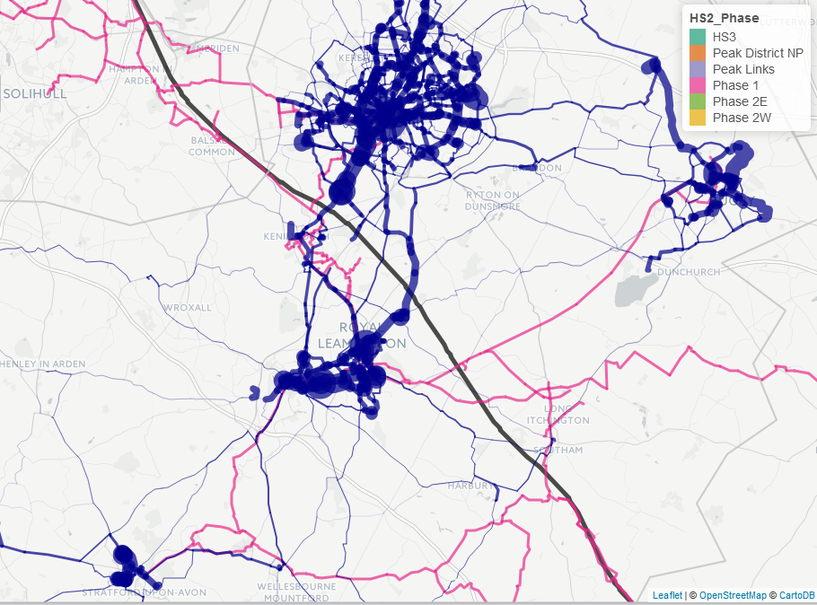
```

\newpage

## Birmingham region

As a major city, Birmingham has very high commuter cycling potential yet low current rates, which translates into very high potential for cycling uptake at city and regional levels. The HS2CN designers seem to have recognised this, as there is a substantial densification and deliberate detour into Birmingham city centre. This seems to be in line with the results of the PCT, which shows high cycling potential along all arterial routes leading into Birmingham (especially on North-South corridors), some of which are picked up by the HS2CN (see Figure \@ref(fig:birm)).

From the perspective of maximising cycling uptake by building along segments of highest commuter cycling potential, it would seem that even more could be done to serve the dense urban populations to the east of Birmingham. While the HS2CN is dense around the largely suburban/rural settlements of Hampton in Arden, Meriden and Balsal Common, the PCT's Route Network layer is thickest along Hagley Road (the A456), which feeds Birmingham from the East and Bristol/Pershore Road (the A38 and A441 respectively).  We appreciate that some of these connections may be made by Birmingham City Council under the auspices of the Cycling City Ambition scheme.

The PCT also suggests that there is high commuter cycling potential around Solihull and Walsall that is not catered for by the HS2CN.  Seeking to cater for this potential could be valuable as Solihull and Walsall currently are among the local authorities in England and Wales with the lowest commuter cycling relative to their potential (calculated as observed cycling / predicted cycling), being on the 7th and the 11th percentiles.  For example, one could consider extending HS2CN such that a direct connection is made between Solihull and Birmingham city centre.

```{r, eval=FALSE, echo=FALSE}
rnet_war = readRDS("../pct-data/west-midlands/rnet.Rds")
tmap_mode("view")
tm_shape(hs2) +
  tm_lines(col = "black", lwd = 5) +
  tm_shape(hs2net) +
  tm_lines(col = "HS2_Phase", lwd = 3, palette = "Dark2") +
  tm_shape(rnet_war) +
  tm_lines(col = "darkblue", lwd = "govtarget_slc", scale = 50) +
  tm_shape(regions) +
  tm_borders(col = "grey", lwd = 2) 
```

```{r birm, fig.cap="Overlay of the PCT's Route Network layer and the HS2CN around Birmingham."}
 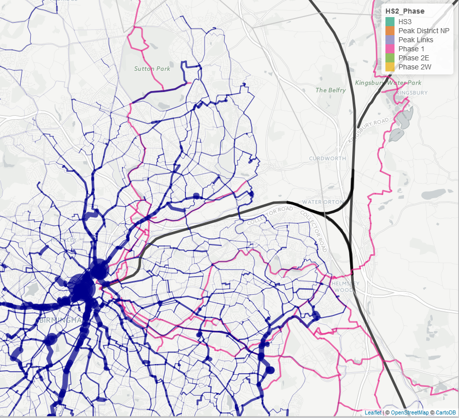
```

\newpage

## Nottingham and Derby

```{r, eval=FALSE, echo=FALSE}
rnet_not = readRDS("../pct-data/nottinghamshire/rnet.Rds")
rnet_der = readRDS("../pct-data/derbyshire/rnet.Rds")
rnet_not$id = NULL
rnet_not = sbind(rnet_not, rnet_der)
tmap_mode("view")
tm_shape(hs2) +
  tm_lines(col = "black", lwd = 5) +
  tm_shape(hs2net) +
  tm_lines(col = "HS2_Phase", lwd = 3, palette = "Dark2") +
  tm_shape(rnet_not) +
  tm_lines(col = "darkblue", lwd = "govtarget_slc", scale = 20) +
  tm_shape(regions) +
  tm_borders(col = "grey", lwd = 2) 
```

```{r notts, fig.cap="Overlay of the PCT's Route Network layer and the HS2CN around Nottingham and Derby region"}
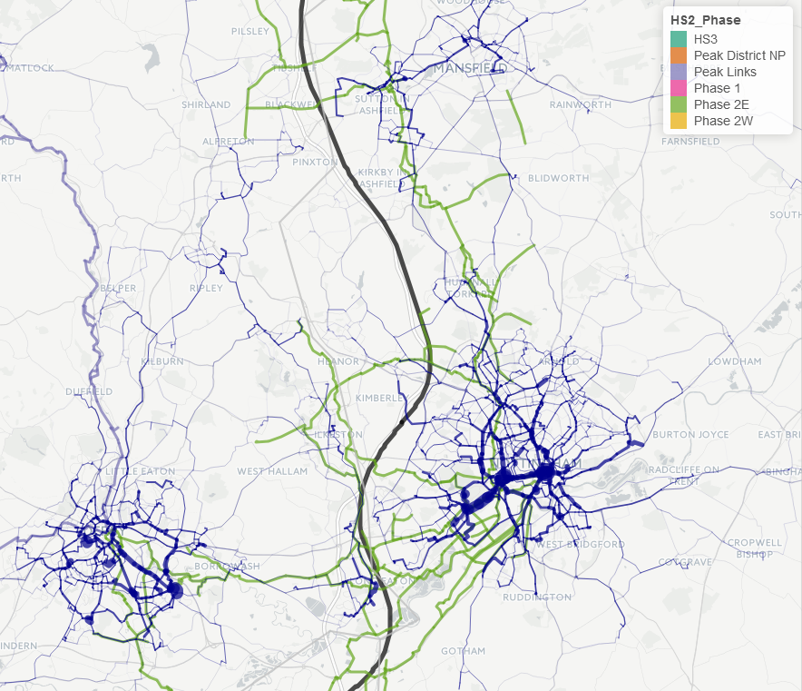
```

There is high commuter cycling potential around Nottingham and this is reflected in the HS2CN, which branches out substantially around the centres of both cities, especially Nottingham. There HS2CN is denser to the south of Nottingham than to the north. The Route Network suggests that there is high commuter cycling potential to both the north and south, however, suggesting the opportunity to extend the HS2CN to the north, to increase the density of the cycle network in that part of the city.

The HS2CN is denser to the east of the HS2 route (serving Nottingham) than to the west (serving Derby), yet there is high commuter cycling potential both sides of the main track with both being in the top quarter of local authorities in England and Wales for cycling in the Go Dutch scenario. Indeed, both current cycle commuting and modelled commuter cycling potential is modelled as being slightly higher in Derby (cycle mode share 4.0% at present, 7.4% in Government Target) than in Nottingham (cycle mode share 3.7% at present, 7.0% in Government Target).  As such, it would seem worthwhile considering extending the HS2CN such the Derby is served as well as Nottingham.

(Note that our PCT analysis will not capture flows between Nottinghamshire and Derbyshire, and so will underestimte the potential for commuter cycling between settlements on the east versus west of the HS2 train tracks, e.g. between Nottingham and Derby).

\newpage

## Sheffield and Chesterfield

```{r, eval=FALSE, echo=FALSE}
rnet_not = readRDS("../pct-data/south-yorkshire/rnet.Rds")
rnet_der = readRDS("../pct-data/derbyshire/rnet.Rds")
rnet_not$id = NULL
rnet_not = sbind(rnet_not, rnet_der)
tmap_mode("view")
tm_shape(hs2) +
  tm_lines(col = "black", lwd = 5) +
  tm_shape(hs2net) +
  tm_lines(col = "HS2_Phase", lwd = 3, palette = "Dark2") +
  tm_shape(rnet_not) +
  tm_lines(col = "darkblue", lwd = "govtarget_slc", scale = 20) +
  tm_shape(regions) +
  tm_borders(col = "grey", lwd = 2) 
```

```{r sheff, fig.cap="Overlay of the PCT's Route Network layer and the HS2CN around Chesterfield and Sheffield."}
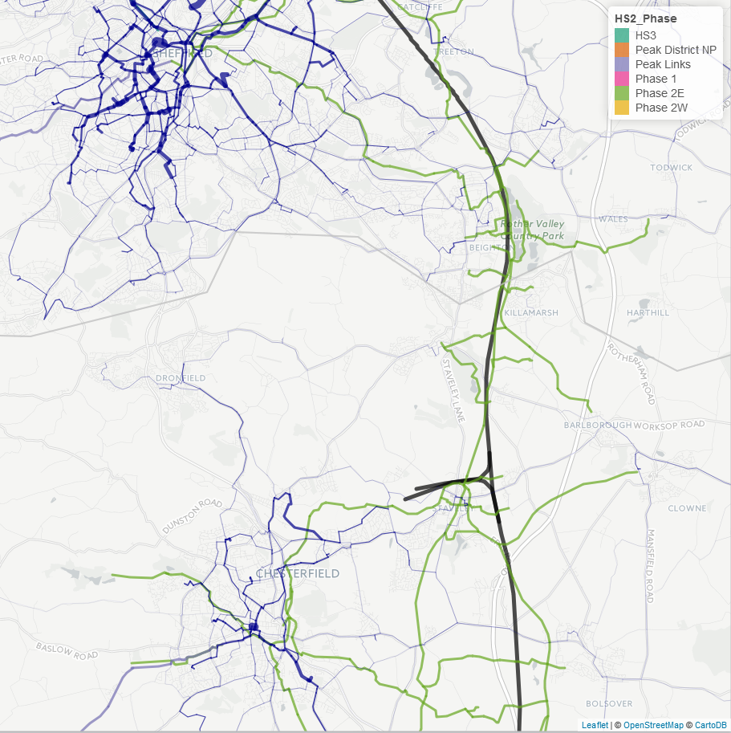
```

Sheffield and Chesterfield in particular are well-served by the HS2CN, with the HS2CN being denser around Chesterfield.  This dense network in Chesterfield could be beneficial in unlocking the area's considerable untapped commuter cycling potential - Chesterfield currently is one of the local authorities in England and Wales with the lowest commuter cycling relative to its potential (calculated as observed cycling / predicted cycling), being on the 3rd percentile. Sheffield performs better on this metric, being on the 73rd percentile, suggesting a relatively lower level of untapped cycling potential (although the potential for increase in Sheffield is still large, e.g. from the current 1.8% to 11.4% in the Go Dutch scenario).  Nevertheless because Sheffield has a population 5 times larger than Chesterfield, the absolute increase in number of cyclists is larger in Sheffield than in Chesterfield in the Government Target.  As such it might be worth considering expanding the HS2CN in Sheffield. For example, additionally building provision along the A6135 between Intake and Sheffield city centre would build on the existing plans for the HS2CN while providing direct routes where there is evidence of relatively high commuter cycling potential.

(Note that our PCT analysis will not capture flows between South Yorkshire and Derbyshire, and so will underestimte the potential for north-south commuter cycling, e.g. between Sheffield and Chesterfield).

\newpage

## Barnsley, Wakefield and Leeds

```{r, eval=FALSE, echo=FALSE}
rnet_not = readRDS("../pct-data/west-yorkshire/rnet.Rds")
rnet_der = readRDS("../pct-data/south-yorkshire/rnet.Rds")
rnet_not$id = NULL
rnet_not = sbind(rnet_not, rnet_der)
tmap_mode("view")
tm_shape(hs2) +
  tm_lines(col = "black", lwd = 5) +
  tm_shape(hs2net) +
  tm_lines(col = "HS2_Phase", lwd = 3, palette = "Dark2") +
  tm_shape(rnet_not) +
  tm_lines(col = "darkblue", lwd = "govtarget_slc", scale = 20) +
  tm_shape(regions) +
  tm_borders(col = "grey", lwd = 2) 
```

```{r lds, fig.cap="Overlay of the PCT's Route Network layer and the HS2CN around Barnesley, Wakefield and Leeds."}
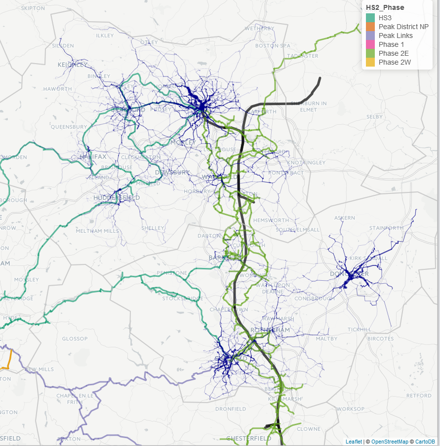
```

There is high commuter cycling potential on both sides of HS2 in the almost continuously populated area within the 10 km buffer of its route between Barnesley and Leeds. There is currently poor provision for cycling in this area, except for the relatively narrow and rural Pennine way off-road cycle path.

A dense network of routes with relatively high commuter cycling potential is supported by the HS2CN around Barnsley, with many crossings reducing the potential for severance impacts of HS2, for example between Wakefield and Pontefract. One area of slight divergence between the route network layer of the PCT and the HS2CN in this area is with respect to the relative density of cycling networks in urban centres and their surroundings. The PCT suggests that the density of cycle networks should be much denser in city centres, for example around Leeds, Huddersfield, Halifax and Wakefield. The HS2CN, by contrast, has a relatively uniform density in these areas compared with their suburban and rural surroundings. This is a pattern that applies throughout the HS2CN-PCT comparison but which is particularly noticeable in this area. To address this issue, the HS2CN could be supplemented by additional cycle tracks and other interventions encouraging cycling close to the city centres.

The HS2CN duplicates the route of the CityConnect Leeds-Bradford route for much of the way and makes use of the existing canal tow-path in the area, while omitting Otley Road, which has the highest commuter cycling potential of all arterial routes in Leeds (and West Yorkshire overall) under the Government Target scenario used for this analysis. Another discrepancy between the PCT analysis and the HS2CN in the region is the density of east-west routes to the south of Leeds in the proposed network compared with the relative absence of proposed routes going due east further north, e.g. from Leeds city centre towards Garforth. There is clearly high commuter cycling potential along York Road (which is only partly served by a thin extension of the CityConnect route a couple of km in that direction) and Selby Road that could be well served by extensions to the HS2CN.

(Note that our PCT analysis will not capture flows between South Yorkshire and West Yorkshire, and so will underestimte the potential for north-south commuter cycling, e.g. between Barnesley and Wakefield).

\newpage

## Staffordshire and Cheshire

```{r staf, fig.cap="Overlay of the PCT's Route Network layer and the HS2CN in Staffordshire."}
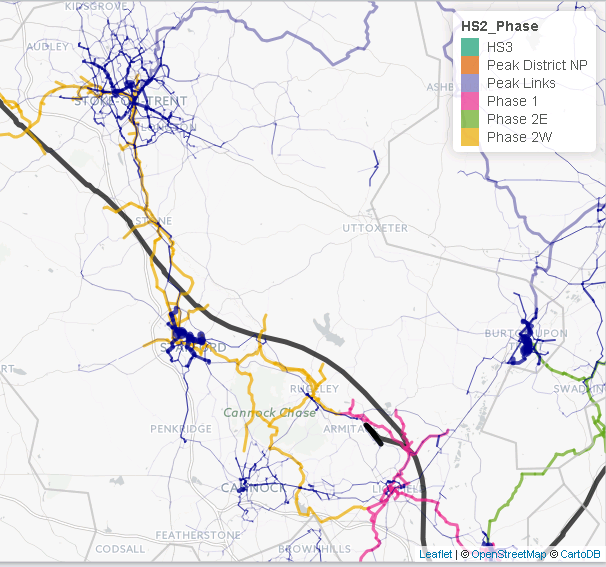
```

Stoke-on-Trent and Stafford are the only two major settlements in Staffordshire well-served by the HS2CN. There is a relatively dense proposed network around Cannock, Lichfield and Rugeley to the south of the region yet, interestingly, no HS2CN route into Cannock itself, which has relatively high commuter cycling potential compared with its rural surroundings.

In Stafford the HS2CN opens up and becomes substantially more dense, serving potential along east-west corridors and north of the city well. However, there is little provision for cycling potential directly south of the city, e.g. towards Stafford Grammar School and beyond along the A449 and Silmore Lane.

The route going from Stafford to Stone and onward to Stoke-on-Trent is well thought-out, providing multiple options out of Stafford in the northern direction and providing plenty of opportunities to cross the HS2 route, reducing severance.  Stoke-on-Trent is slightly less well catered for than Stafford, despite being larger and having similar modelled potential increase in commuter cycling in the Government Target scenario (2.6% in Stoke-on-Trent, vs. 3.2% in Stafford) and twice the population. There are no routes out directly to the north (e.g. to Hanley) or to the North-east (e.g. to Longport), despite relatively high cycling potential; instead the only route going north is to the far west of Stoke-on-Trent. This suggests that a north-then-west route between Stoke-on-Trent and Crewe might be favourable to cycling uptake than the west-then-north route currently planned, despite the latter option following more closely the HS2 route (although both routes could be complementary). 

In Crewe the highest commuter cycling potential is out towards the neighbouring settlement of Nantwich, but the HS2CN avoids Nantwich altogether. Instead, it provides two routes out to the north and east to Sandbach, which is smaller and therefore has less commuter cycling potential in terms of total numbers of cyclists.

\newpage

## Greater Manchester

```{r man, fig.cap="Overlay of the PCT's Route Network layer and the HS2CN in Greater Manchester."}
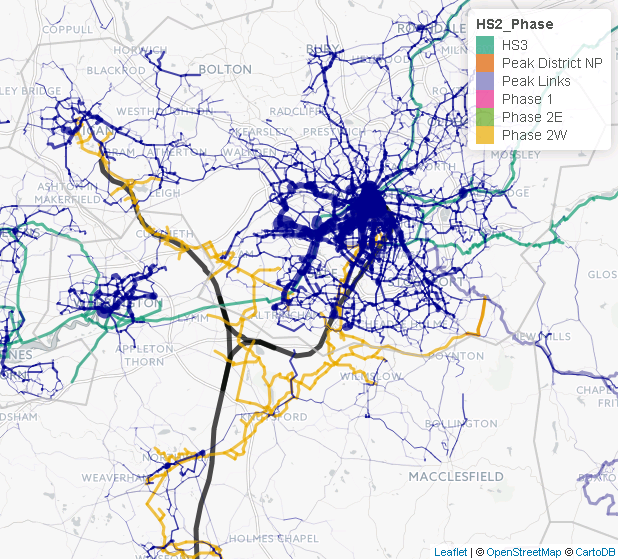
```

As a densely populated conurbation with a strong regional economy, Greater Manchester has very high cycling potential.  For example, Manchester itself is on the 95th percentile for local authorities in England and Wales in terms of its modelled cycling potential. It therefore makes sense for the HS2CN to become more dense in this region. However, the densification does not correspond with the areas of highest commuter cycling potential inferred from the Route Network layer of the PCT. There is a dense proposed network surrounding Knutsford and north of Wilmslow. However, there is only one route into Manchester city centre in the Phase 2 plans (although another is proposed in Phase 3), which has much higher levels of commuter cycling potential. This suggests opportunities either for extending the HS2CN to better meet the latent demand for utility cycling in the region; or for ensuring the HS2CN infrastructure connects with the networks planned under the auspices of the Cycle City Ambition scheme.

When the HS2CN travels west towards Wigan it does not do so from Manchester via Salford, Stretford and Hindley (where there is substantial east-west commuter cycling potential), but instead closely follows the HS2 train route in coming from Altrinchan, which has lower commuter cycling potential.

(Note that our PCT analysis will not capture flows between Cheshire and Greater Manchester, and so will underestimte the potential for commuter cycling between settlements on the east versus west of the HS2 train tracks, e.g. between Warrington and Manchester).

\newpage

## Liverpool City Region

```{r liv, fig.cap="Overlay of the PCT's Route Network layer and the HS2CN in Liverpool City Region."}
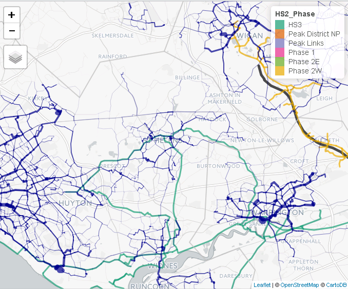
```

Strictly speaking the HS2CN does not pass through Liverpool City Region. It is only the proposed cycle paths associated with HS3 that go west of Wigan (HS3CN). This network passes through south and central Warrington (avoiding a route with high commuter cycling potential to the northeast of Warrington centre) and on west and northwest.  This creates a triangular network between Warrington, St Helens and Widnes, the cycling potential of which will be underestimated in Figure \@ref(fig:liv) because we have not modelled flows between Cheshire (where Warrington is) and Liverpool City Region (where St Helens and Widnes are). The short route over the Silver Jubilee Bridge between Widnes and Runcorn is omitted from the HS3CN, despite having high commuter cycling potential.

There is very high commuter cycling potential in all directions fanning out from the monocentric Liverpool city centre. This potential is picked-up by only a single HS3CN route, which follows the River Mersey and therefore misses the areas of highest commuter cycling potential to the north of the river.

\newpage

# Discussion

This report has provided visual evidence on the geographic correspondence between the results of the PCT, presented in the form of the higher-potential sections of the Route Network layer under the Government Target scenario within a 10 km buffer of the HS2 route, and the routes comprising the plans for the HS2CN. This evidence is analysed verbally based on visual inspection and some knowledge of the surroundings, based partly on the use of the main PCT hosted at www.pct.bike.

Overall, the density of the HS2CN follows areas and routes of high commuter cycling potential, based on the Route Network layer of the PCT under the Government Target scenario, reasonably well. The following general patterns of divergences were identified, however:

- The densification of the HS2CN in large urban centres such as Birmingham, Derby, Leeds and Nottingham did not reflect the great increase in commuter cycling potential in these densely populated cities.  We appreciate that this may reflect an aspiration on DfT's part to focus in HS2CN on creating a *national* inter-regional network between towns and cities, while improvements within towns and cities are expected to be led by local authorities (or under the auspices of alternative DfT schemes like the Cycling Cities Ambition grants).

- There was a general tendency for the HS2CN to follow more rural and circuitous routes compared with the relatively direct routes favoured by the PCT's use of the 'fastest route'.

- While the HS2CN tended to emphasis inter-city cycling routes, the PCT tends to emphasise intra-city cycling routes.

In seeking to optimise HS2CN, we believe it is useful to consider the latent demand for commuter cycling as modelled by the various PCT scenarios. Nevertheless, the interpretation of this analysis of the two large and complex route network layers should be based on knowledge of the assumptions underlying the PCT and the intentions of the HS2CN. It is not the case that one is necessarily more 'correct'. Leisure cycling and non-commuter utility cycling, for example, are not represented in the results generated by the PCT, and the ability of cycle routes to serve destinations such as schools also needs to be considered in planning. Another important caveat is that the flows modelled in PCT are intra-regional, and so several of our Figures above will undersestimate the potential for flows between regions (we have sought to highlight where this is the case).  In addition, while the fastest routes are highlighted by the PCT may maximise cycling uptake, it may in some cases be easier to create high quality cycling provision along an alternative route. These caveats should be borne in mind when determining whether to consider adopting any of the possible adjustments to the HS2CN suggested in this report, with a view to seeking to maximise the ability of HS2CN to unlock cycling potential.
