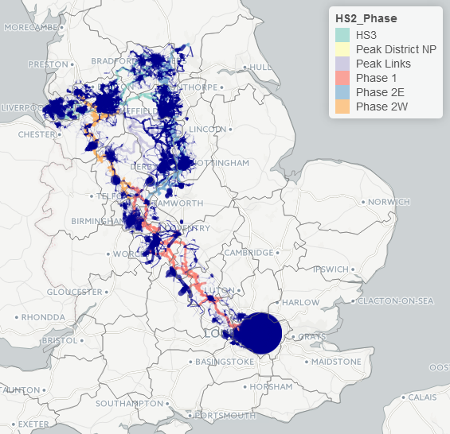

```{r setup, include=FALSE}
knitr::opts_chunk$set(echo =FALSE, warning=FALSE, message=FALSE, echo = FALSE)
source("../pct-load/set-up.R")
```

# Introduction

The original plan for this analysis was to assess the cycling potential along the HS2 route.
The new plan, based on feedback from the DfT about what would be most useful, is to assess the cycling potential along the *cycle path network* designed by consultants to be constructed in tandem with construction of the HS2 route. We refer to this network, which has a **total length of 3,213 km** as the HS2 Cycle Path Network (HS2CN).

## Descriptive analysis of route

An overview of this plan is presented in Figure \@ref(fig:overview). The proposal is split the HS2CN into 6 phases, including Phase 1, Phase 2 (East and West), Peak District links and HS3. The analysts at Royal Haskoning have done some preliminary analysis on the proposed HS2CN, which is briefly summarised below for context. 

```{r overview, out.width="100%", fig.cap="Overview of the HS2 cycle network (HS2CN)."}
library(knitr)
include_graphics("figures/hs2-overview.png")
```

```{r, echo=FALSE, warnings=FALSE, message = FALSE}
source("R/load-infrastructure.R")
over_table = hs2net@data %>% 
  group_by(HS2_Phase) %>% 
  summarise(
    `Lenth (km)` = sum(Shape_Leng) / 1000,
    `Main county` = names(which.max(table(CountyUA))),
    `Main nearest city` = names(which.max(table(NearestCit)))
  )
kable(over_table, digits = 1, row.names = F, caption = "Summary of the length and main county/city related to each Phase of the planned cycle network surrounding HS2.")
```

# The propensity to cycle around the HS2 cycle network

The first stage in the analysis was to subset the Route Network layer generated by the PCT to include only segments within a close distance to the HS2CN. This was set to 10 km, based on the knowledge that most people will not cycle more than around 8 miles to work (10 km Euclidead distance corresponds to around 8 mile route distance, depending on how circuitous the roads are in the local area).

To do this, all PCT regions that the HS2CN passed through were identified (Figure \@ref(fig:regions)).
<!-- The distance of cycle paths associated with these regions is summarised in Table @\ref -->
These were: Buckinghamshire, Cheshire, Derbyshire, Greater Manchester, 
 Hertfordshire, Leicestershire, Liverpool City Region, London, 
 Northamptonshire, North Yorkshire, Nottinghamshire, Oxfordshire, 
 South Yorkshire, Staffordshire, Warwickshire, West Midlands and
 West Yorkshire.

```{r, echo=FALSE}
# library(sf)
library(sp)
# regions = st_read("../pct-data/regions.geojson")
regions = geojson_read("../pct-data/regions.geojson", what = "sp")
proj4string(regions) = proj4string(hs2net)
regions$region_name = capitalize_region(regions$Region)
# hs2sf = st_as_sf(hs2net)
hs2points = spsample(hs2net, n = 1000, type = "random")
hs2buff = stplanr::buff_geo(hs2points, width = 10000)
# hs2buff = rgeos::gBuffer(hs2net, width = 10000)
regions_sel = regions[hs2net,]
region_names = regions$Region
# plot(regions_sel, lty = 3)
# plot(regions, add = TRUE, lty = 3)
# plot(regions_sel, col = "yellow", add = TRUE, lty = 3)
# plot(hs2buff, col = "grey", add = TRUE)
# plot(hs2net, add = T, col = hs2net$HS2_Phase)
# plot(regions_sel, lty = 3, col = NA, add = T)
```

```{r regions, fig.cap="Regions that HS2 pass through (dotted lines, highlighted in yess) and the HS2CN surrounded by a 10 km buffer (grey area)."}
include_graphics("figures/hs2-over-reg.png")
```


<!-- The route network was extracted from our analysis for each of these regions using the following commands: -->

<!-- ```{r, eval=FALSE} -->
<!-- rnet = readRDS("../pct-data/avon/rnet.Rds") -->
<!-- for(i in 2:length(region_names)){ -->
<!--   f = paste0("../pct-data/", region_names[i], "/rnet.Rds") -->
<!--   rnet = bind(rnet, readRDS(f)) -->
<!-- } -->
<!-- saveRDS(rnet, "../pct-bigdata/rnet-england-msoa.Rds") -->
<!-- ``` -->

```{r, echo=FALSE, eval=FALSE}
# rnet = readRDS("../pct-bigdata/rnet-england-msoa.Rds")
# rnet = rnet[hs2buff,]
# saveRDS(rnet, "input-data/rnet-hs2.Rds")
rnet = readRDS("input-data/rnet-hs2.Rds")
scen = "govtarget_slc"
rnet@data[,scen][rnet@data[,scen] > 5000] = 5000
summary(rnet$govtarget_slc)
rnet_high = rnet[rnet$govtarget_slc > 100,]
tmap_mode("view")
tm_shape(hs2net) +
  tm_lines(col = "HS2_Phase", lwd = 3) +
  tm_shape(rnet) +
  tm_lines(col = "darkblue", lwd = "govtarget_slc", scale = 50) +
  tm_shape(regions) +
  tm_borders()
```

An overview of the overlap between the HS2 route and the national Route Network layer produced by the PCT is displayed in Figure \@ref(fig:rnetover).

```{r rnetover, echo=FALSE}

```


