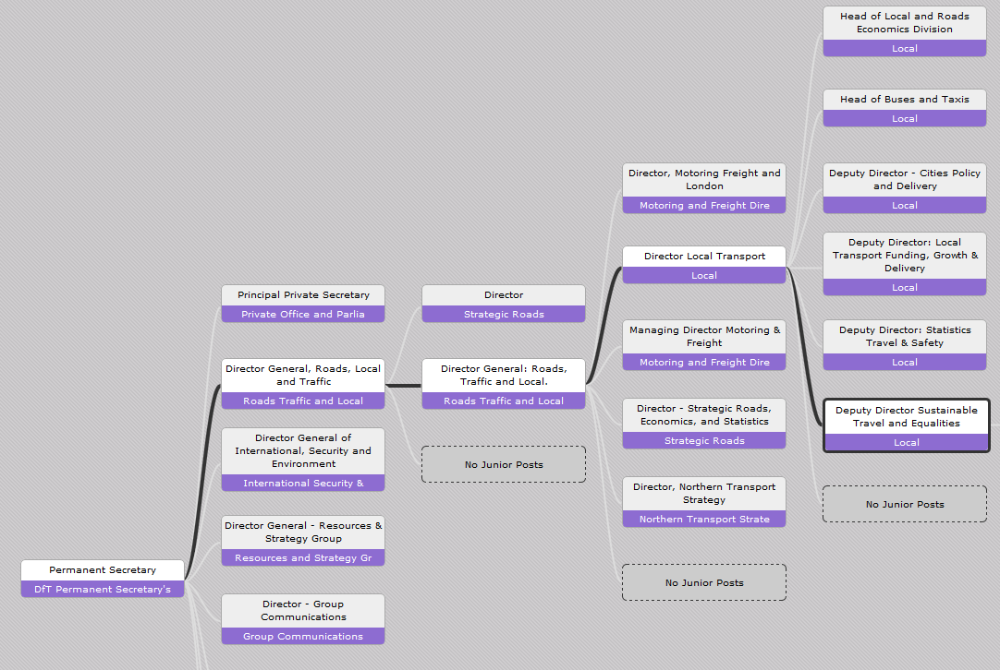

```{r setup, include=FALSE}
knitr::opts_chunk$set(echo = FALSE)
# References are from the cycling-potential library
# in the group 'energy-and-transport' on zotero:
# https://www.zotero.org/groups/energy-and-transport/
# bib = httr::GET("https://www.zotero.org/api/groups/418217/collections/JBXTRB93/items/top?limit=100&format=bibtex&v=1", httr::write_disk("references.bib", overwrite = T))
```

# Abstract {-}

Cycling is already an effective means of transport for millions of people worldwide. In the future, evidence suggests that a shift to cycling as the main mode for short trips could transform urban transport systems, making them healthier, cleaner and more socially equitable. Building on academic evidence, political attention and funding has been allocated to encourage cycling many cities and countries. However, cycling is still marginalised in many transport planning institutions. This paper explores this issue, with the aim of identifying opportunities for embedding cycling at every stage of the planning process. A brief review of the history of transport planning illuminates this marginalisation, and suggests institutional restructuring may be needed to ensure active travel is taken seriously. Less politically disruptive opportunities for embedding cycling are also explored. These include innovative 'soft infrastructure' products, open source digital tools, and new technologies and methods for monitoring and evaluation. We conclude that these opportunities must be taken at every stage of the transport planning process for active travel to become central to the discipline.

# Introduction

```{r get-citations, eval=FALSE}
# Find number of papers referencing cycling in top transport journals over time
devtools::install_github("ropensci/rcrossref")
library(rcrossref)
library(dplyr)
f = c(type = "journal-article", `container-title` = "Risk Analysis")
cyrefs = cr_works(query = "Bicycle", limit = 20, filter = f)
cdf = cyrefs$data
```

It is well-known that the transport system in the majority of settlements across the world are not conducive to environmental sustainability or human health. Much has been written about this problem [e.g. @rouse_energy:_1975;@peake_transport_1994;@han_assessment_2008]. Many grand remedies have been proposed [e.g. @wang_strategic_2013;@raux_transport_2010;@cuenot_prospect_2012]. But such high-level recommendations have seldom been implemented in practice. Perhaps part of the reason for this research-policy mismatch is that the recommendations are directed towards world leaders and not transport planning professionals, who actually influence local decisions on the ground. Furthermore, the remedies suggested in the afforementioned papers risk being seen as too general and conceptual to be easily translated into practice. For this reason the present paper has a narrow focus on a single mode of transport. In the context of seemingly intractable environmental and health problems associated with transport at the global level, the paper explores solutions at the level of local and regional transport plans.

Much has been written about how to make transport systems overall more sustainable, and the topic has become a prominent concern in the transport literature [@schwanen_scientific_2011;@banister_sustainable_2008]. Still, such broad academic advocacy has been slow to filter into real-world transport plans. This paper is deliberately more focussed: its focus on active transport modes, and cycling in particular, results in actionable guidance *for transport planners* and academics actively engaging with the planning process. This approach is designed to complement, rather than replace, the high level or purely conceptual advice contained in position papers. Transport planning is a *practical* discipline, so the paper deliberately focusses on factors over which transport planners have some control (e.g. not the state of the economy or national political priorities).

A premise of this paper is the perceived disconnect between the discipline of transport planning and transport policies. An example of this disconnect is the UK, where decades of academic evidence culminating in a government-commissioned white paper by @goodwin_transport_1991, have been sidelined by successive governments in favour of road expansion. This has continued into the 21^st^ century: despite a letter signed by 32 leading transport academics urging him not to [@millward_professors_2013], George Osborne announced in 2016 a large increase in the budget allocated to roads (£15 billion over the next 5 years, amounting to over £50 per person per year), while cutting central government funding for cycling (to £0.3 billion or less than £2 per person per year) [@upfold_cycling_2016].
This example illustrates the wider point that transport research often fails to filter into policy *at all*, let alone at the rapid pace needed to mitigate the worst impacts of systems currently in place. This paper's dual focus on transport planning as an academic discipline *and* a vocational practice is designed to the address the dissonance between research and practice.

But why focus on active modes? In the transport planning literature there has been much written about sustainability but less focus on active modes specifically, despite strong evidence on the ability of these modes to deliver health and environmental benefits *simultaneously* at low cost. This unique mix of 'co-benefits' from active travel is something that 'techno fixes' are unable to provide, especially in an age of austerity and finite resources. Electric cars, for example, are in fact coal-fired cars when driven in the majority of countries where this most polluting of energy sources has yet to be phased out [@van_vliet_energy_2011]. Further, electric cars cannot deliver the health benefits of walking and cycling. Bus rapid transit schemes, to provide another example, can encourage walking [@lemoine_transmilenio_2016] but can be costly [@wirasinghe_bus_2013].

The marginalisation of walking and cycling in transport planning has led to work seeking to tackle this imbalance: the importance of cycling for a sustainable future is clearly not reflected by the amount of attention, let alone funding, cycle friendly transport interventions receive. One of the most cogent and widely cited papers in this area is @pucher_making_2008, who use evidence from three countries where a high (10% or more) proportion of trips are made by cycling (The
Netherlands, Denmark and Germany) to illustrate the kinds of policies that make cycling 'irresistable'. The authors focus on policies in these nations (in contrast to the USA) rather than the transport planning *process*, the focus of the present paper. Beyond cycling being acknowledged as an important mode in central government (a factor over which most planners have limited control), @pucher_making_2008 found that subtle factors (beyond simply building segregregated cycle paths) played an important role in making cycling an attractive option. These included investment in and management of cycle parking facilities; good integration with public transport; cycle training for all children and extensive training of car drivers; *strict liability* (a legal device which uses a hierarchy of assumed responsibility whereby the larger and more dangerous vehicle is assumed to be responsible for road traffic casualties until proven otherwise); and a range of measures to discourage car dependency in urban areas.

There is a substantial body of research into the social and psychological factors preventing people from walking and cycling. This research body recognises that mode choice is personal decision, often influenced by structural factors linked to car-orientated transport systems.   @pooley_policies_2013, for example, found that the widespread perception of cycling as a dangerous and unnusual mode of transport discouraged its wider uptake in the English towns of Leeds, Leicester, Worcester and Lancaster. The policy recommendations that flow from this evidence coincide with those of @pucher_making_2008 and include: a safe physical environment; legistlating for motorists' consideration for active modes; and land use policies to encourage more local economic activity [@pooley_policies_2013].

@geus_psychosocial_2008 provided a quantitative evidence base about the psychological, social and environment factors affecting cycling uptake. In support of @pooley_policies_2013, the study suggested that a combination of high quality infrastructure and supportive social and policy framework was effective in encouraging cycling uptake. Of relevance to transport planners, @geus_psychosocial_2008 found that proximity to parks and other green spaces was associated with more cycling, implying that exposure to traffic and unfriendly urban environments is a substantial barrier. The implication is that directing cycle paths through parks and off busy roads could make cycling more attractive, particularly for people for whom perceived danger and self-esteem is a barrier. This finding was supported in a more recent natural experiment of cycling uptake for commuting following the implementation of an off-road cycle path [@heinen_changes_2015].

@buehler_bikeway_2016 synthesised the evidence on the impacts of cycle infrastructure interventions, on *links* (e.g. cycle paths), *nodes* (e.g. road intersection treatments) and entire cycle *networks*, on cycling uptake. Overall it was found that there was a strong evidence base linking cycling infrastructure to higher rates of cycling. However, evidence on the relative importance of different types of intervention, particularly in relation to node, network and non-infrastructural interventions, was limited. From a planning perspective, @buehler_bikeway_2016 recommend that practitioners should seek to employ more network-level measures of cycling provision. A network-level approach to cycle planning could help create more joined-up cycling interventions to tackle barriers across the entire travel network. This differs from many cycle plans, which have tended to focus attention along a few specific (and in some cases arbitrarily selected) travel corridors.

To summarise this section, there are reasons to focus on cycling as a key part of a wider sustainable transport strategy, yet few academic papers have focused cycling can be embedded in the transport planning process. 
Research on mode choice suggests that a range of barriers block cycling uptake in many contexts. These operate at many levels, from national transport priorities down to personal self esteem (wich can in turn be influenced by transport infrastructure).
Framing cycle planning in terms of how to remove these barriers can help to assess the range of options at the outset of the planning process, rather than homing in on a single intervention (e.g. provision of cycle paths or advertising the benefits of cycling) at the outset.
The logical next question, from the perspective of transport planning practitioners, is 'how?'. Specifically, how to acheive the prioritised ellimination of the most damaging barriers to cycling in local and regional transport plans? Before tackling this question it is important to understand the historical reasons for the marginalisation of active modes in the discipline. This is covered in the next section.

# The marginalisation of cycling in transport policy

In their comprehensive history of transport modelling, @boyce_forecasting_2015 demonstrate that the field emerged in a very specific context: the explosive growth of suburbia and car dependency in the USA. Although the policy objectives of transport policy have progressed substantially beyond the accomodation of growth in car use, this historical legacy still exerts an enormous influence over the field. Transport modelling, which plays an important role in deciding how funding is allocated, was never designed to accomodate walking and cycling and this issue persists today.

There is little doubt that the intentions of the early modellers were admirable and that it was an exciting time: "urban travel forecasting was definitely 'where the action was' for young transportation engineers and planners entering the field in the 1960s" [@boyce_forecasting_2015, p. 67]. In hindsight, however, it seems the resulting models facilitated a predict and provide paradigm leading to car dependency and associated negative externalities, including pollution, road traffic casualties and transport inequality. Would it have been impossible to for early models to create alternative future scenarios where active travel played more of a central role in transport plans? @boyce_forecasting_2015 do not discuss this, although it is clear that warnings from dissenting voices in academic research [@fels_comparative_1975] were not heeded.

During the conditions of economic growth and increased car economic ownership, which prevailed throughout most of the postwar period, facilitating expansion of motor traffic was the primary objective in most transport planning institutions. The political reasons for this prioritisation of the motor car  were simple: the car was a symbol of modernity, wealth and economic growth. Walking, and cycling in particular, were viewed as outdated modes of travel for the poor and eccentric while the rest of society shifted to the luxury of cars. In this context cycling was not merely marginalised from transport planning: it was almost completely absent.

An interesting example of the historical marginalisation of cycling in mainstream transport planning comes from the 1970s USA, which coincided with oil price shocks and societal questions around energy use [e.g. @illich_energy_1974]. The only major study on cycling during this period conducted by the US government was not from the Department of Transport, however, but the Environmental Protection Agency [@dougherty_bicycle_1974]. This 72 page report, Bicycle Transportation, was motivated by the "unprecedented boom" in bicycle sales during the early 1970's and goes on to outline, in great detail, the social, health and environment benefits of the mode. The report also comments on the marginalisation of the mode from mainstream planning, noting that "Government has general viewed the bicycle as a recreational vehicle" [@dougherty_bicycle_1974, p. 2].

When the oil price stabilised growth in car use accelerated again in the USA and this trend was followed in most nations across the world. Despite noting the economic benefits for cycling infrastructure, with segregated cycle paths costing roughly 50 times less per metre than highways ($20,000 vs $1 million per mile), @dougherty_bicycle_1974 were unsuccessful in persuading the US Government to invest heavily in cycling. 

Instead, following the US model, transport planners focussed on the car. Cycling was generally seen as a form of recreation rather than transport and, as such, did not deserve dedicated space on the travel network. Cycle infrastructure, in the few places where there was any at all, tended to be placed in ad-hoc places to minimalise costs. The acronym SLOAP (space left over after planning) encapsulates this approach to cycle planning, in the minority of plans where cycling was accounted for, that has prevailed in most countries, following the USA's model of car-based transport systems.

As @pucher_making_2008 point out, there were a few exceptions to this rule. In the Netherlands in particular, there was a concerted effort during the 1970s to ensure that cycling *was* promoted as a legitimate mode of transport. The history of transport planning in the Netherlands shows that it was an overtly political movement, in opposition to the dominance of the motor car, that created the conditions in which cycling infrastructure could be properly designed and funded.

It is interesting to note that, far from always being a cycling paradise, the Netherlands experienced dramatic *declines* in cycling during the 1960s and 1970s, following the motorisation of urban transport in other cities. Cycle use roughly halved between 1960 and 1980, falling from around 1400 km to around 700 km per person per year. This shows that even in the Netherlands, cycling was becoming marginalised by the motor car and it took vociferous public campaigns to change the tide: "Outrage at the scale of road deaths, especially of children, the oil crisis of 1973, and a general sense that enough had been conceded to the motor car, were factors bringing about a change in public attitudes" [@wardlaw_history_2014]. Central government funding followed, allowing the distance cycle paths in the Netherlands to increase from around 9,000 km to 16,000 km between the late 1970s (when the reinvestment in cycling began) until 1988. 

One could argue that even in the Netherlands, cycling is still marginalised by the car. The Netherlands is a heavily car dependendent country and the distance travelled by car each ear by far outweighs the amount of travel taking place by cycling. Even on high quality Dutch infrastructure conflict arises and cycles are at times marginalised by mopeds. Furthermore, partly as a consequence of the quality and extent of cycle networks in the Netherlands, pedal cycles are marginalised from roads. Therefore, despite impressive investments in and uptake of cycling in the Netherlands, the country still fits into the prevailing transport paradigm in which active modes are marginal.

@banister_sustainable_2008 discussed transport paradigms in detail and suggested that the current transport planning paradigm was not conducive to delivering sustainable policies. To remedy this situation a series of reforms were suggested. These were primarily conceptual and high-level in character but include some actionable guidance for transport planners, including the importance of public engagement in the planning process and adaptability. These themes are returned to in the next section, which builds on the history of transport planning as it relates to the marginalisation of cycling, by using it to identify specific opportunities in the practice of transport planning for cycling become central to transport plans.

# Opportunities for embedding active travel in the planning process

Transport planning is not a linear process. It is iterative. The insights gleaned from plans that have been implemented should feed back into subsequent plans in a cyclicle process [@ortuzar_modelling_2001]. The transport planning cycle does have an order, however, as illustrated in figure \@ref(fig:stages). These five stages build on the 8 stages described by @ortuzar_modelling_2001, with the four stages they use use to describe modelling (contruction, generation, forecasting and testing) merged into one, and with the addition of public engagement. This addition reflects the shift to more participatory methods in transport planning @banister_sustainable_2008. These stages are useful for thinking about how opportunities to embed active travel travel in transport planning exist at every stage in the process. Note that public engagement is discussed last not because it is the final stage (there is no final stage as the process is cyclicle) but because it relates to all the other stages.

```{r stages, echo=FALSE, out.width="70%", fig.show='hold', fig.align='center', fig.cap="Stages of the transport planning process."}
knitr::include_graphics(c("../figures/stages.png"))
```

It should be noted that the structure of this section was also influenced by @gallagher_planning_2014, who provide guidlines on planning for cycling. The report begins with the observation that cycling was a major mode of transport in the UK but has been 'neglected' by practitioners since the proliferation of cars in the 1950s and progresses to outline opportunities for embedding cycling in the following areas of transport planning practice: the regulatory context in which transport planning operates; strategic transport plans; the design of new transport networks and routes and the promotion of behavioural change. These suggestions are freely accessible to practitioners and the public, thanks to the Chartered Institution of Highways & Transportation, who commissioned the report and upladed the it on their website [ciht.org.uk](http://www.ciht.org.uk/en/media-centre/news/index.cfm/ciht-launches-new-planning-for-cycling-guidelines). The guidelines in @gallagher_planning_2014 are not repeated here. Instead, the section extends and generalises their recommendations that relate to the wider planning process, rather than those related to cycling interventions only.

Transport planning does not take place inside a vacuum but within a dynamic and often highly politicised institutional context. This is tacitly acknowledged by @ortuzar_modelling_2001, who put "formulation of the problem" at the beginning of their 8 stages. But how does the formulation occur? Often the 'framing' of the problem is a result of the institutional structures. For this reason this aspect of transport planning is discussed before the the other stages.

## Institutional structures

A common problem faced by planners designing for active modes is that transport planning institutions were generally set-up at a time when 'transport planning' was virtually synomymous with 'highway planning'. As outlined in the previous section, cycling and walking were barely considered to be legitimate transport modes at all. Although this is changing, the structure of transport planning organisations has generally not, as government institutions are subject to a high degree of inertia. Figure \@ref(fig:organo) illustrates the point, with a case study of the UK's Department for Transport (DfT). The DfT staff member responsible for cycling is the 'Deputy Director Sustainable Travel and Equalities'. It is interesting to note that their brief also includes oversight of the multi-modal Local Sustainable Transport Fund (LSTF) and its successors, disabilities and equalities agendas, hence the lack of the words 'walking' or 'cycling' in their job description. Despite the breadth of this brief, the 'organogram' depicted in Figure \@ref(fig:organo) shows that the post is a long way down the DfT's managerial hierarchy and must report to 3 other people (the Director of Local Transport, Director General: Roads Traffic and Local, and Director General, Roads, Local and Traffic). Contrasting the lack of mention of 'walk' or 'cycle' against the car-orientated term 'roads' (which is mentioned 5 times in Figure \@ref(fig:organo) and at every level of the DfT's structure) demonstrates the extent to which motorised modes are embedded in the DfT's institutional structure. This suggests there is a huge opportunity for an organisational restructuring to embed walking and cycling into the DfT so that it has an equal or superior status to cars within the institutional hierarchy, mirroring the social importance of active modes.

```{r organo, echo=FALSE, out.width="100%", fig.cap="The organisational structure of the UK's Department for Transport. See http://reference.data.gov.uk/gov-structure/organogram/ for further information."}

```

The DfT provides a clear example of opportunities for embedding active travel in transport planning via institutional restructuring, but the issue is by no means isolated to the national level in the UK. The same issues can be found at the local authority level across the UK, where the Traffic Engineering branches of local and regional councils tend to be higher up institutional hierarchies, and receive more funding, than branches responsible for active modes. Moreover, the same problem is international. The 11 Directors of the US Department of Transport, for example, contain no one responsible for active travel, while security, crisis management and business feature prominently (see
[www.transportation.gov](https://www.transportation.gov/mission/administrations/intelligence-security-emergency-response/operations-division)).
Similarly, motorised transport infrastructure such as highways and high-speed rail feature prominently in China's Ministry of Transport, while walking and cycling are absent from the ministry's website (see [www.mot.gov.cn/](http://www.mot.gov.cn/)). Even the Dutch Directorate for Mobility and Transport (which sits within the Ministry of Infrastructure and the Environment) has a structure that is biased towards high energy transport: 4 of its 6 sub-directorate job titles explicitly mention motorised modes (Roads and Safety, Public Transportation and Rail, Maritime Affairs and Civil Aviation) and none are tasked with further embedding walking and cycling (see [www.government.nl/ministries/](https://www.government.nl/ministries/ministry-of-infrastructure-and-the-environment/documents/leaflets/2015/01/21/organisation-structure-ministry-of-infrastructure-and-the-environment)).

## Data collection

Applied to transport, the saying "measure what you value" suggests that the modes of transport of greatest interest should be monitored most closely. By this measure, cycling is marginalised in most transport contexts: the majority of automated transport data collection devices installed around the world measure motorised traffic. The scale of this problem from a US perspective was outlined by @lindsey_minnesota_2013:

"[Transport authorities] have established sophisticated, comprehensive monitoring systems to produce estimates of vehicular traffic on federal, state, and local roads. However, comparable systems for monitoring non-motorized traffic ---
bicyclists and pedestrians ---
have not been established, and transportation planners and engineers generally lack basic information about bicycle and pedestrian traffic volumes needed to plan for these modes."

Applied worldwide, this lack of quantitative data is a major barrier preventing transport planners from taking walking an cycling seriously, let alone acting on the best available evidence to improve provision for active modes. The benefits of measuring cycling behaviour range from the technical to the political. First, detailed information about the contexts in which people *do not* cycle can provide evidence about what the local barriers are, allowing planners to target their interventions more effectively. Second, measuring cycling helps prevent the marginalisation of the mode *within* the transport planning organisation: technical staff will be needed to analyse the resulting data and this will help ensure that the mode is treated seriously. Finally, data on cycling behaviour can be used to communicate the importance of the mode, for example through visualisations, which raise the profile of cycling in the public consciousness.

There are many ways to measure cycling. The most basic measure is the simple 'traffic count', a point data collection device that records the presence of a particular vehicle (or pedestrian) on the network at a particular time. As detailed by @lindsey_minnesota_2013, such count data can help allocate resources to and assess the effectiveness of interventions aiming to increase the number of walking and cycling trips. The main methods for counting cyclists outlined by @lindsey_minnesota_2013 were manual field counts, infrared monitors, magnetic loop detectors, piezometric and pnuematic movement sensors and video imaging. To this list we can add the inclusion of cycling in non-transport surveys (e.g. 'what is your main mode of travel to work?' followed by options that include cycling); transport surveys asking more detailed questions about cycling (e.g. 'what are the main barriers preventing you from cycling?'); the collection of data on the human factors influencing mode choice (discussed below); and Big Data sources such as GPS data provided by smartphone 'apps' and origin-destination matrices derived from mobile telephones connecting to cellphone towers.

Here is not the place to discuss the relative merits of each option --- see @lindsey_minnesota_2013 for that. It suffices to say that there is a wide range of options for measuring cyclists and, provided that transport planners have the resources to make sense of such data, this can help to embed cycling in the heart of the transport planning process, which prides itself on being an evidence-based discipline. With the rapid uptake of personal activity monitoring by athletes, enthusiasts and the interested public, Big Data provides an increasingly viable and potentially low cost way of augmenting the data produced by physical devices. Furthermore, there is still merit in actually speaking to people who use local travel networks to inform cycle plans.

Transport planning and the transport sector overall has traditionally been seen as an objective realm, where numbers speak louder than words. However, there are many ways to take human factors into account in transport planning, as described by @deegan_planning_2011. The authors developed a systematic approach for incorporating local knowledge into cycle network plans, to assist practitioners deal with the complexity of options available. Although modelling tools have advanced since the method was implemented (as described in the next section), there is no doubt that allowing space for community input can greatly enhance the design of pro-cycling interventions. During the course of the project, over 200 studies were conducted resulting in more than 2000 specific recommendations.

Undertaken between 2005 and 2007, before the term Big Data became widely used, @deegan_planning_2011 represents a form of crowd-sourced data, from some of the best informed residents of the local area. Additional advantages of this 'stakeholder led' approach include the engagement and 'buy-in' of the local community into new schemes before they are constructed, and the assurance that planners will visit the site in question, cycling. Incorporating human factors into the data collection process, as demonstrated in practice by @deegan_planning_2011, thus represents a major opportunity for embedding cycling at an early stage in the planning process.

## Metrics and indeces

The abundance data on transport systems, including from new sources outlined above, is worthless if it cannot be acted on. Work must be done to analyse, aggregate communicate the valuable information collected (the important modelling step is outlined in the next section). Indices and metrics present an opportunity to further condense the vast amount of data now available to transport planners into something actionable.

Key performance indicators about the transport system, such as average vehicle speed on the network, have long been used to guide decision making for motorised modes. Frequent reporting of of such indeces help to embed the outcomes they represent into the core objects of the planning process. Historically there has been a lack of similarly simple indeces for non-motorised modes. However, recent research has led to the development of new cycle and walking specific indeces, many of which are generalisable to new contexts where sufficient data is available. A handful of these are outlined in this section, in increasing order of sophistication.

Probably the simplest metric of transport system performance with respect to active travel is the **proportion of trips** that are made using these modes. These 'modal split' estimates are widely reported at national, regional and local levels, having the advantage that, being unit-less coefficients, they are not influenced by the scale of the transport system they represent. Mode split can therefore be used to compare cycling levels locally with the national average: in Cambridgeshire, for example, around 10% of the population cycled to work in 2011 wheras in West Yorkshire barely 1% did. By comparing such simple metrics with the national average of 3%, policy makers can check how well they are doing overall. Beyond simply communicating modal split figures more frequently, an additional opportunity is to combine walking and cycling percentages to create an 'active travel mode split' metric.

Another simple metric of walking and cycling provision is the total distance on the travel network dedicated to these modes. The total length of Dutch cycle paths increased from 9,000 km to 29,000 km in between the 1970s and the 2010s, demonstrating the long-term embedding of cycling as a central mode of transport in the country. Similarly, London's cycle path network has grown dramatically since the turn of the 21^st century, measuring 683 km in 2010 and with further plans for expansion [@deegan_cycling_2015]. By dividing the total distance of the network by meaningful denominators such as the number of people served, or the total cost of the project, further value can be extracted from this seemingly oversimplistic measure. In inner London, for example, new cycling infrastructure built between 2002 and 2010 cost an average of £346 per metre, compared with £283 per metre in outer London [@deegan_cycling_2015]. To allow network length to be compared between different contexts, distance per person can be used: dividing previously mentioned figures on cycle network distance by the total population results in network indeces of 
<!-- 29000 / (16.8) -->
<!-- 683 / (8.5) -->
1.7 km and 80 m of cycle paths per capita
in London and the Netherlands respectively, implying that the Netherlands
has proportionally 20 times more cycle network than does London.

A long cycle network does not necesarily mean a high quality cycle network. In addition to the cost per metre of new cycleways (with more money per metre presumably representing higher quality), there are a number of measures on network quality. As with cycling metrics overall, there is a hierarchy of cycle infrastructure quality metrics, ranging from the simple and crude to complex and sophisticated. Cycle path width is an important example of the former. The UK's recommended (but not mandatory) width of 2.0m and a minimum suggested width of 1.5m in the [Design Manual for Roads and Bridges](http://www.standardsforhighways.co.uk/dmrb/vol5/section2/ta9105.pdf) is an example of how consideration for cycling can be embedded into high level planning documents through recommended values for simple metrics about the travel network.

More sophisticated metrics combine a range of quantitative measures into a single street or network level value. The Cycling Level of Service (CLoS) metric, for example, provides a way to combine a range of indicators into a single number for each piece of infrastructure evaluated. Focussed on the six design outcomes of safety, directness, coherence, comfort, attractiveness and adaptability, the CLoS has 35 sub-metrics, which are intended to be evaluated by transport planners to identify how best to improve any particular segment on the travel network [@transport_for_london_london_2015].

Beyond simple aggregate and segment-specific metrics, @buehler_bikeway_2016 recommend a shift towards network level metrics for cycling provision. Progress in this direction has been made by @schoner_missing_2014, who provided a wide range of quantitative metrics on cycle network characteristics, including on the directness of cycling infrastructure, connectivity and network density.
<!-- (reported in units of km/km^2^).  -->
To test the utility of these network level indices, @schoner_missing_2014 tested their ability to explain observed variability in cycling rates across 74 cities in the USA. The results were impressive: network indices based on secondary data could explain half of the variability in cycling levels. These results suggest that network-wide indeces on cycle networks offer great potential to embed cycling considerations in strategic transport plans.

## Modelling

Transport modelling was developed in largely in response to the policy question of how to accomodate for future increases car use [@boyce_forecasting_2015]. Due largely to this historical context, cycling has "generally been ignored in ... traffic management modelling and scheme implementation" [@deegan_planning_2011]. However, with the increased interest in cycling over the past few years, there have been efforts to better account for cycling in transport models. This provides a powerful opportunity for embedding cycling more firmly in transport planning. Models can have a large impact on real world outcomes, as the decision making process is heavily reliant on model results [@hollander_who_2015]. Making models that are better suited to the needs of cycling infrastructure and policy design therefore represents a major opportunity for embedding the mode at one of the earliest stages in the transport planning process. Before outlining these opportunities, it's worth mentioning four specific problems with current transport models. 

First, many transport models simply do not represent cycling as a distinct mode. There are models that group cycling and walking together into a single mode, greatly reducing their ability to generate realistic results for either mode. This is partly because cycles are difficult to represent on the road network: they are not constrained by the same rules that define where cars can and cannot go. (Cycles can be carried up stairs for example, something that is impossible for cars.)

<!--' Second,  -->


<!--' A recent development in the UK context, but which has the potential to scale internationally is the Propensity to Cycle Tool (PCT), funded by the UK's Department for Transport @lovelace_propensity_2016. -->

<!--' @payne_removing_2014 -->

<!--' @transport_for_london_analysis_2010 -->

<!--' @larsen_build_2013 -->

<!--' A recurring cricism of transport models is that they are 'black boxes' [@saujot_making_2016].  -->


## Implementation

<!--' @melia_urban_2015 used the term 'filtered permeability' to refer to small interventions that can make cycling more attractive than driving in urban areas. -->

## Monitoring and evaluation

## Public engagement

# Conclusion

This paper set out to identify opportunities to make active travel more central within transport planning, with a focus on cycling. In the process, it has identified many structural barriers preventing active modes from being taken seriously in transport planning institutions which originate in the origins of the field. This insight, that many of the factors contributing to the marginalisation of active travel are structural and 'systemic' in nature [@beddoe_overcoming_2009], has implications for practitioners and academics hoping to make walking and cycling more central to real world transport plans and policies. Technical fixes and a barrage of evidence about the social benefits of active travel are unlikely to be sufficient to ensure that walking and cycling receive the attention they deserve.

Having identified these structural issues, which affect all stages of the transport planning process, from data collection to public engagement, the next question was how to tackle them. It was this process of identifying the barriers that led to the concept of 'embedding' in the title of this paper. To 'embed' means to "[implant] so that it becomes ingrained within a particular context" according the [English Oxford Dictionary](http://www.oxforddictionaries.com/definition/english/embed). A key conclusion of this paper is therefore that active travel must become mainstream concerns within transport planning institutions to avoid walking and cycling projects being seen as 'side projects', to be 'bolted on' to interventions favouring motorised modes.


# References