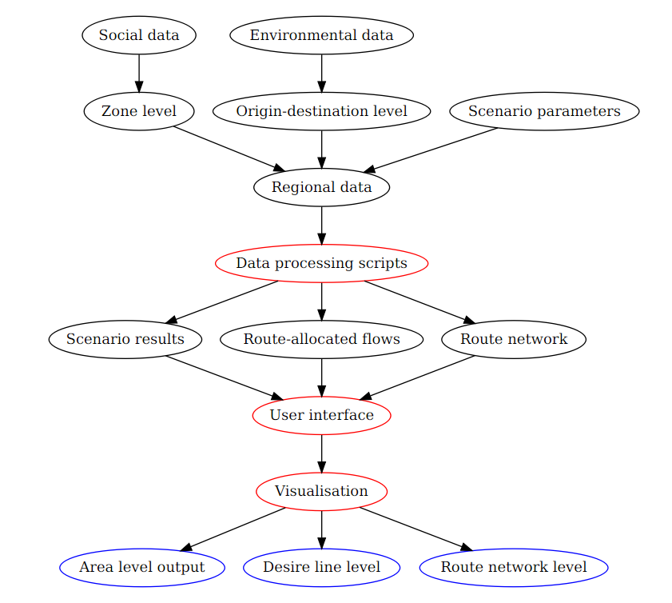

```{r, echo=FALSE, include=FALSE}
# date: '`r format(Sys.time(), ''%d %B %Y'')`'
# output:
#   pdf_document:
#     fig_caption: yes
#     number_sections: yes
#     toc: yes
# header-includes: \usepackage{amsmath}
#                  \usepackage{longtable}
#                  \usepackage{booktabs}
# author:
# - Robin Lovelace (University of Leeds)
# - Anna Goodman (London School of Hygiene and Tropical Medicine)
# - Rachel Aldred (University of Westminster)
# - Nikolai Berkoff (independent web developer)
# - Ali Abbas (University of Cambridge)
# - James Woodcock (University of Cambridge)

# output: rticles::els_article
if(grepl(pattern = "pct$", x = getwd())){
  setwd("documents")
}
# source("../set-up.R")
pkgs <- c("stplanr", "knitr", "xtable", "sp", "grid", "png", "RefManageR")
to_install <- !vapply(pkgs, require, character.only = T, FUN.VALUE = logical(1))
if(to_install) install.packages(pkgs[to_install])

# Bibliography dl
# download.file("https://github.com/citation-style-language/styles/raw/master/elsevier-harvard.csl", "documents/elsevier-harvard.csl")
# generated via https://github.com/ZotPlus/zotero-better-bibtex
# download.file("https://www.zotero.org/api/groups/418217/collections/TUEXXIV4/items/top?limit=100&format=bibtex&v=1", destfile = "references.bib")
# # 
# # 
# b1 <- readLines("references.bib")
# b2 <- readLines("documents/Transport.bib")
# writeLines(c(b1, b2), con = "documents/Transport.bib")

# biblio <- ReadZotero(group = "energy-and-transport",  .params = list(qmode = "everything", collection = "TUEXXIV4"))

# To do:
# Add speed-bumps/speed cameras/cycling priority or remove lanes for motorised traffic
```

## Abstract


Encouraging cycling is an increasingly common objective in transport planning institutions worldwide. 
Evidence shows that high-quality infrastructure 
can boost local cycling rates.
Yet it is important for interventions to happen in appropriate places, such as along
'desire lines' of high latent demand.
This creates the need for tools to communicate the geographical distribution of cycling potential. 
The Propensity to Cycle Tool (PCT) is an online, interactive planning support system to explore and map this potential under different scenarios of the future.
Using origin-destination data, the PCT estimates where cycling has the greatest potential to grow.
Localised 'cycling futures' for commuter trips in England were generated as a function of route distance, hilliness and gender, including scenarios examining the potential role of electrical cycles.
Central to the PCT's approach is the online browser-based user interface
(see [pct.bike](http://pct.bike/)).
The PCT is intended to serve as a tool for transport planners while also enabling public participation in transport planning.
Its open source license enables its adaptation for new contexts and the creation of local scenarios.
Discussion of directions for future research outline how the approach could encourage public participation in the transport planning process for more sustainable transport systems worldwide.

# Introduction

Cycling can play an important role in creating
sustainable, healthy and equitable transport systems.
Cycling provides fast, affordable,
and convenient mobility to millions of people each day [@Komanoff2004]
and is growing in popularity and political importance in large cities such as London,
New York and Barcelona [@fishman_cycling_2016].
There is mounting evidence of the external costs of car-based
transport systems [@Newman1999;@Han2008;@Mizutani2011;@Shergold2012],
and the benefits of cycling [e.g. @Oja2011;@Woodcock2013;@DeNazelle2011],
pushing making cycling increasingly central to sustainable transport strategies.
This is illustrated by cycling investment projects^[Several examples
of multi-million Euro projects are provided by the
[European Cyclist' Federation](http://www.ecf.com/advocary/eu-funding-2/examples-of-cycling-projects-co-funded-by-the-eu/), the
[FIA Foundation](http://www.unep.org/transport/sharetheroad/PDF/SharetheRoadReportweb.pdf) and the
[World Cycling Atlas](http://www.worldwidecyclingatlas.com/).
There has been little academic research on the proportion of transport budgets
allocated to cycling worldwide, hence the use of resources from
NGOs here.
]
and the
proliferation of publicly subsidized 'bike share' schemes
[@OBrien2014a] worldwide.^[An
interactive web map associated with @OBrien2014a
illustrates the distribution of many of the
largest
bike share schemes worldwide. See
[bikes.oobrien.com](http://bikes.oobrien.com).]

High-quality infrastructure can play a key role in modal shift to cycling [@Parkin_2012].
Off-road cycle paths, for example, can help make cycling a safe, accessible and convenient
option for people of all ages and abilities [@Heinen2015].
Further, modified cycles such as quadricycles and handcycles can enable idependent mobility for disabled people [@Aldred2008], where appropriate infrastructure allows.


But where should this infrastructure be built? And where are policy interventions such as reduced speed limits, better enforcement of road traffic laws and space realocation likely to have the greatest impact?
This paper seeks to demonstrate a reproducible and accessible methodology for answering that question with reference to the Propensity to Cycle Tool (PCT), an online planning support system funded by the UK's Department for Transport (DfT). The aim is to illustrate the potential for online mapping technology to provide a publicly available evidence-base for sustainable transport planning.

```{r, echo=FALSE}
# As such, rather than focus on the specific policy and geographical context of the PCT's development, we endeavour to present the tool in a generalisable way.
# 
# The paper is structured as follows. The Literature Review (Section 2) provides an overview of existing tools for the prioritisation of investment in cycling and active travel. Section 3 describes the data and methods underlying the PCT, with reference to a technical Appendix. Section 4 provides an outline of the scenarios developed for the DfT with reference to alternative scenarios that could be envisioned using the PCT. Finally, in Section 5, we discuss some of the limitations of the approach taken in the developement of the PCT and outline promising directions for future research and development in the nascent area of planning support systems for sustainable transport.
```

## Transport tools for active travel infrastructure

The design (Heath et al., 2006; Transport for London, 2014; Welsh Government, 2014) and geographic location (Aultman-Hall et al., 1997; Minikel, 2012) of cycle paths are important factors influencing the attractiveness of cycling and the rate of cycling (Pucher et al., 2010). Thus the question of where to construct new cycle infrastructure is of strategic importance (Larsen et al., 2013). There is increasing interest in evidence-based tools for active travel (Payne, 2014) where the 'predict and provide' paradigm fails (Naess et al., 2014). In particular, planning support systems have recently received attention from transport and land-use planning communities (Brommelstroet, 2010).  These decision support tools provide a range of information to the user to inform evidence-based policy (Pettit et al., 2013), including through interactive map-based systems (Geertman and Stillwell, 2009).
In this context, the PCT was commissioned by the UK's Department for Transport to identify "parts of [England] with the greatest propensity to cycle" to help prioritise strategic investment in cycling (Department for Transport, 2015).  The aim of the tool was produce a full transport-land use model, nor to provide a full mode choice model. Instead, the tool seeks to assist decision makers and planners in considering, visualizing and analysing what cycling growth might look like – and what such growth might necessitate in terms of infrastructure provision. Within the English context at least, ambitious local and national cycling targets are often set in terms of mode share, but without any detailed consideration of what this might mean in terms of cycling flows along specific routes. The PCT provides a representation of what, if such targets are achieved, the spatial distribution of cycling trips might look like at the area and network level in practice.
The PCT is, to the authors' knowledge, the first online and interactive planning support system that focuses specifically on cycling.  Other innovative features of the PCT include:
Estimation and visualisation of cycling potential at both the ‘area’ level and the 'desire line' level. This contrasts with most previous models of modal shift, which typically only produce outputs the area level (e.g. Lovelace et al., 2011; Müller et al., 2008). In relation to cycling, Parkin et al. (2008) used a multiple regression model to estimate levels of commuter cycling at an area level. Similarly local survey data has been used to identify areas with high numbers of 'potentially cycleable trips' in London (Transport for London, 2010). However, neither analysis identified the travel corridors along which these simulated cycle trips would be made.  
Route-allocation of the desire lines. This facilitates the identification of specific segments of the transport network to be targeted for improvement. Such an approach has considerable potential for creating an evidence-base for prioritising investment in cycle paths locally (Broach et al., 2012; Ehrgott et al., 2012), for example by identifying routes that would "achieve maximum impacts early on"(Zhang et al. 2014).
Ability to produce outputs at multiple geographic levels.  Users of the PCT choose whether to examine cycling potential at a very local level (e.g. just a few streets) or at a more regional level (e.g. across a large metropolitan area). Line-level outputs can be aggregated to networks, while area-level outputs can be aggregated to the regional or national level.  This contrasts with previous national-level scenario-based transport models, which often lack any local geographical detail (e.g. McCollum and Yang, 2009).  In addition, the PCT is well suited to local-level analysis of the impacts of achieving a regional or national target level of cycling, highlighting one way in which this is a strategic tool.
Focus on wide ranging scenarios for cycling growth, including long-term, ambitious scenarios. This expands the 'option space' visible to transport planners, encouraging consideration of short and long-term planning horizons simultaneously.  This addresses one identified limitation of many existing models, namely that they do not simulate long-term scenarios and "do not sufficiently support the generation of new strategies" (Brommelstroet, 2010).
Making results available through a freely-accessible interface and open access model. In the past, transport planning has tended to be "closed to public over-sight", preventing public engagement with strategic transport plans (Golub et al. 2013). There is, however, now a trend in transport research towards greater transparency in software development and collaboration (Novosel et al., 2015; Tamminga et al., 2012).   The PCT is part of this trend, having been created with open access software, with the underlying code having been made publicly available under an open source AGPL licence (github.com/npct).


```{r, echo=FALSE, fig.cap="Flow diagram illustrating the input data, processes and visual outputs produced by the PCT. These are represented with oval shapes with black, red and blue outlines respectively."}

```

# Data

The PCT relies on two key input datasets:

- *Origin-destination* (OD) data relating the number of trips
taking place between administrative zones. These can be represented as
straight 'desire lines' or allocated to the route network.
- *Geographical data* providing the coordinates of trip
origins and destinations.

The OD model described in this paper can work for
anywhere that has access to such data.
Hilliness and route network distance were also included in the regression model.
To link the OD and geographic datasets together, *zone ids* are needed in both
datasets. An R package, **stplanr**, was developed to assist with this and
other data processing tasks [@lovelace_stplanr_2015].

```{r, echo=FALSE}
# ^[The
# source code of `gFlow2Lines()` has been made available
# online, as part of an R package for sustainable transport planning,
# **stplanr**. See [github.com/Robinlovelace/stplanr/](https://github.com/Robinlovelace/stplanr/blob/master/R/gFlow.R).]
```

Tables 1 and 2 illustrate the two input datasets. Fig. 1
shows the output, straight lines with attributes for
each OD pair in both directions. These are also referred to as 'desire lines' when
represented as straight lines on the map [see @Tobler1987; @Chan2003].
The visualisation of the OD data builds
on published work on cartographic visualisation [@Rae2009;@Wood2010].
The model for England described in this paper uses the following open datasets
(similar OD datasets are available for cities across the world):

- OD data representing the number of trips between origin destination pairs,
disaggregated by mode of travel.
We used the file `wu03ew_v2.csv`, obtained from the UK Data Service
(see Table 2 for a sample of this dataset)^[See [wicid.ukdataservice.ac.uk/cider/wicid/downloads.php](https://wicid.ukdataservice.ac.uk/cider/wicid/downloads.php).]  This dataset is based the English Census 2011 question on travel to work. 

- The population-weighted centroids of local
administrative zones (see Table 1). We used 'Medium Super
Output Areas' (MSOAs), with an average population of around 7,800 people,
as the zonal system for both origins and destinations. MSOAs were the highest
geographical resolution at which the mode-specific OD data were available.
MSOA zone boundaries were provided under the UK's Open Government
Licence.^[See [data.gov.uk/dataset/lower-layer-super-output-areas-ew-2011-population-weighted-centroids](http://data.gov.uk/dataset/lower-layer-super-output-areas-ew-2011-population-weighted-centroids).]

- Route distance, assigned to each desire line
using the CycleStreets.net
API.^[To implement this functionality in a generalisable way
a custom function, `route_cyclestreet()`, was
written for the R package **stplanr**.]

- Hilliness of zones and routes. There are various ways to generate this data,
ranging from the simple (e.g. vertical displacement between origin and
destination) to the complex (e.g. total amount of climb along the route network
in both directions). We calculated mean gradient per MSOA zone using publicly available
digital
elevation model (DEM) data supplied by NASA.^[See 
[srtm.csi.cgiar.org/](http://srtm.csi.cgiar.org/) for the data and the
[steepness.R](https://github.com/npct/pct/blob/master/loading-data/steepness.R)
file in the project's repository for the processing algorithm used. "Version 4"
of the dataset was used. To allocate this area-based hilliness metric to OD
pairs, we calculated the average hilliness of origin and destination zones. This
method has the disadvantage that accuracy decreases with increased trip
distance.]

Table: Sample of the OD input dataset, representing the number of people who
commute from locations within and between administrative zones (MSOAs)

```{r tflow, echo=FALSE, results='asis'}
# For latex version: use xtable:
# t1 <- xtable(head(flow[c(1:3, 12)]), caption = "Sample of the 'flow' input dataset, representing the number of people who commute from locations within and between administrative zones (MSOAs)", label = "tbl:flow")
# print(t1, type = "latex", comment = FALSE, caption.placement = "top")

# For docx and latex: use kable
data("flow")
names(flow) <- gsub("\\.", " ", names(flow))
names(flow)[3] <- "Total no. commuters"
names(flow)[12] <- "No. cycle commuters"
kable(head(flow[c(1:3, 12)]), row.names = F)
```

Table: Sample of the zone level input dataset. The coordinates represent the population-weighted centroids of MSOA zones, whose codes are also presented in Table 1.

```{r tcents, echo=FALSE, results='asis'}
# t2 <- xtable(as.data.frame(cents[1:3,-c(3,4)]), caption = "Sample of the 'cents' input dataset, representing the geographical location of the population-weighted centroids of MSOA zones described in Table~\\ref{tbl:flow}", label = "tbl:cents")
# print(t2, type = "latex", comment = FALSE, caption.placement = "top")
data("cents")
sel <- which(cents$geo_code == flow$`Area of residence`[1])
cents1 <- as.data.frame(cents[c(1:3, sel),-c(3,4)])
names(cents1) <- c(
  "Area of residence",
  "Area name",
  "Longitude",
  "Latitude")
kable(cents1, row.names = F)
```

```{r, echo=FALSE, fig.cap="Overview of the PCT map interface. The lines represent trips between origin and destination pairs for Coventry. Width represents the total number of trips. Note the use of population-weighted (as opposed to geographic) centroids for the point of departure and destination."}
# data("flowlines")
# plot(flowlines, lwd = flowlines$All / 10)
grid.raster(readPNG("../figures/coventry-centroids.png"))
```

We used the Census 2011 travel to work dataset for its comprehensive coverage of
the population, high geographic resolution and assurances surrounding data
quality. It is worth noting that
a variety of emerging sources could be used instead to
provide OD data. This includes 'Big Data'
[@Kitchin2013] sources such as: mobile
telephone service providers [@smoreda2013spatiotemporal];
public transport data, which can highlights local demand short trips;
household travel surveys [@TransportforNSW2014];
geolocated social media [@Stefanidis2013];
and output from transport demand models controlled by local government.

```{r, echo=FALSE}
# In practice using multiple datasets may be the most appropriate option.
# Individual and areal data can, for example, be combined using spatial
# microsimulation, allowing transport policies to be modelled at the
# individual level [@Lovelace2014-jtg].
# Even when travel surveys contains geographical information,
# sample sizes are generally comparatively small, less than 1% of the population,
# making them inappropriate as the sole source of input data for
# geographical modelling at the local level.
# Flows inferred from mobile phones are a promising new dataset for inferring
# travel behaviour. Recent
# work has been able to accurately reconstruct travel flow patterns from millions
# of anonymous users, including inference of purpose of travel [@Alexander2015].
# If origin-destination flow estimates resulting from such datasets
# become more widely available to researchers, this could constitute one of the
# most single most valuable data sources for transport planners worldwide.
```

# Data manipulation and modelling

## Geographic data

To ensure reproducibility and enable deployment of the model outside the
original case study cities, a systematic data loading method was
developed. The computational work to load the various datasets
was developed in a series of modular scripts that were subsequently
integrated into a single script: `load.Rmd`. This approach ensures that
each component of the data (e.g. OD data, administrative zones,
topography data) can be loaded separately with a single 'master'
script to bring together the diverse data
sources.^[See
[github.com/npct/pct/tree/master/loading-data](https://github.com/npct/pct/tree/master/loading-data) for a full list of the loading scripts used for the PCT.]

Instead of running the model for the entirety of England, the loading
script, OD model and output visualisations were run on a region-by-region basis.
This was partly because transport decisions
tend to be made at the local level [@Gaffron2003] and partly to reduce the
computational requirements of each regional 'build' for scalability.
Using only one regional geographic level could also has limitations,
for example reducing emphasis on 'edge zones' straddling two
or more regions (Fig. 2). To overcome this issue the PCT scripts were updated
to enable 'builds' for various geographical levels.
Another solution to the problem of 'edge zones'
is to create buffers around the regions (as discussed below).

```{r, echo=FALSE}
# The wider national policy context should be considered when selecting
# the regional geographies that are appropriate for the model.
# In Phase I of the work to implement the PCT for the UK we used LADs, then switched to CUAs after user testing.  TTWs also possible, and in the long term perhaps LEPS.  Our recommendation is to build it at the CUA level
```

```{r, echo=FALSE}
# ^[Highway
# Authorities and LADs will coincide in places where there are ‘unitary authorities’ (e.g. in England’s large conurbations, and the whole of Scotland and Wales). However in many parts of rural England, the Highway Authority will cover several District Authority areas. in any event though, the regions used as the building blocks of the PCT can adapt to reflect either, or alternative, funding structures (e.g. England’s Combined Authorities or Local Enterprise Partnerships
# (LEPs)).
# ]

# As well as CUA level an increasing proportion of transport funding in
# England is also being allocated to Local Enterprise Partnerships (LEPs)
# and Combined Authorities (CAs) which are larger than, and often overlapping with, CUAs.
# Based on these insights, and feedback from practitioners, our
# recommendation for Phase II is to build the PCT for every CUA in
# the nation and for selected LEPs and CAs where strategic
# cycling plans are being planned. These suggestions may change based on
# feedback from the Department for Transport.
#
# We will also explore the possibility of
# running the model at the national level. This would involve setting
# appropriate selection criteria to filter-out the majority of
# origin-destination pairs to avoid exceeding computational resources.
# The demarcation of regional boundaries is deemed useful for focusing
# on one region at a time.
#
# Phase I of the PCT project focused instead on smaller administrative units:
# Local Authority Districts (LADs). There are 324 LADs across England.
# For the case study towns of Manchester and Coventry, the choice between
# CUA and LAD levels
# made no difference as LADs and CUAs have the same boundaries for these areas.
# For Norwich, however, the LAD is much smaller than the CUA and is less
# practical for strategic transport planning at the MSOA level (Fig. 2).
# For this reason
# we implemented a buffer selection methodology to expand the scope of the
# selection, as described in the next section. Before describing the
# buffer selection method, it is worth briefly considering some
# of the other regional geographies that could be used: Travel to Work Areas (TTWAs),
# which could be applicable in many contexts and Local Enterprise Partnerships
# (LEPs) which are specific to the UK context.
#
# TTWAs are 'commuting watersheds' that correspond to
# cohesive regions, the centres of which are known employment centres [@Coombes2008].
# Versions of the PCT model developed for more scientific purposes would benefit
# from using TTWAs as the regional geography for local scenario development and
# visualisation.
```

```{r cuas-lads, echo=FALSE, fig.cap="The regional units used to iteratively load the geographical data. These were English Local Authority Districts (LADs, above) and County and Unitary Authorities (CUAs, below) levels of transport planning."}
grid.raster(readPNG("../figures/cuas-las.png"))
```

## Variable zone and OD pair selection criteria

Flows assigned to the transport network were generated when OD pairs were
mapped onto the current
travel network.
This network-level data generation
was undertaken by CycleStreets.net (a routing service for
planning cycle trips), constituting the most computationally intensive part of the model.
It is important to note that the routes provided by CycleStreets.net
are not used to represent the paths that cyclists currently take:
route choice models based on GPS data
have been developed for this purpose [@Broach2012;@Ehrgott2012].
The 'fastest' routes produced defined by CycleStreets.net will often
involve travelling on large, busy roads.
But cyclists express a strong preference for direct routes [@crow2007]
suggesting that these are where the highest latent demand
for safe routes are located.

To reduce data processing and visualisation times
a sub-sample of OD pairs was used.
The aim was to reduce the number of OD pairs whilst retaining the overall
travel pattern. To do this a minimum number (labelled `mflow`)
of trips between OD pairs was specified. OD pairs with less than
`mflow` trips were removed from the analysis.
This decision was taken on the basis that the distribution of number of commuters per OD pair is skewed:
a relatively small number of OD pairs along major travel corridors
account for a disproportionately high proportion of travel.
In the City of Manchester, for example,
setting `mflow` to 30 reduced the number of OD pairs by 85%, yet
still accounted for almost 70% of commuters.
Different values for `mflow` were tested to reach a reasonable
balance between comprehensive coverage and speed of saving and loading data.
Another way to subset OD pairs is to set the maximum Euclidean
(or "crow-flies") distance between OD pairs (labelled `mdist`).
We tested various values for `mdist` and settled on
15 km. This translates to around 20 km
on the route network assuming a *circuity* value of 1.3, as reported by
[@Cole_King_1968].
Only 1.4% of cycle commutes recorded in the
National Travel Survey exceeded a distance of 20 km.

## Modelling cycling uptake at the desire line level

The output of the data processing phase, described above, formed
the basis of a model which estimates the rate of cycling
under various scenarios.
It is important to note that a wide range of scenario-based or
predictive models could be used to estimate future cycling rates.
The results of a wide range of such 'back end' models, which could even include agent-based approaches, could be visualised by the PCT, provided the results are aggregated to the desire line level. Although the model choice is important to the PCT, it is often the
making sense of and visualisation of its output that affects decision making.
This section is therefore a case study of one particular model for generating context-specific scenarios.
Future users of the PCT will likely choose to use different models to examine different scenarios.

For all scenarios except *gender equality*, a regression model was used
to estimate the potential rate of cycling at the OD level.
It does so using Ordinary Least Squares (OLS) to
optimize a number of model parameters
linking distance ($d$) and hilliness ($H$) to the *dependent variable*:
the proportion of trips made per OD pair ($pcycle$).
The concept of 'distance decay' [@Martinez2013]
was used in the model to describe the (non-linear) relationship
between the route distance of OD pairs and the proportion of trips made by cycling.
Euclidean distance could be used in contexts where route distance is not known.

It is well-known that the proportion of trips made by cycle (henceforth
$pcycle$) tends to decrease with increasing distance [@Iacono2010].
Based on this work and exploratory analysis of the data we estimated
the $log$ of $pcycle$ rather than $pcycle$ directly.
Hilliness was included as a continuous variable in our
model and was found to have a linear relationship with $pcycle$,
based on data from the National Travel Survey.
The formula chosen was:

(@) $$ log(pcycle) = \alpha + \beta_1 d + \beta_2 d^{0.5} + \gamma H $$

```{r, echo=FALSE}
# {#eq:description}
```

where $d$ is distance (km, route distance between population weighted centroids) and
$H$ is the hilliness (average angular degrees of origin and destination zones)
per OD pair. The remaining values are scalar
coefficients to be estimated.
$\alpha$ represents the intercept (the rate of cycling very short
trips). $\beta_1$ (which must be negative for $pcycle$ to tend to zero as
distance tends to infinity) and $\beta_2$ represent the rate of distance decay.
$\gamma$ represents the impact of hilliness on cycling.
A 'quasipoisson' general linear model was used to implement this formula
using the base R function `glm`, which predicts $log(pcycle)$
to account for the aforementioned exponential decay.

## Zone Buffer

Running the PCT region-by-region means
ignoring all zones outside the region. If the region is a
self-contained transport system this makes sense.
If the region is part
of a larger travel network, however, this could be problematic.
To solve this problem, buffers were used to expand regions
deemed to be part of a wider system.^[Various criteria were considered
to decide whether or not a buffer was needed and to select the size of the
buffer, for example
whenever the number of MSOA zones fell below some threshold
and the amount of inter-region travel. Ultimately it was decided to
add buffers on an ad-hoc basis, where they were deemed necessary.]
To illustrate how the buffers worked,
buffer was used to select zones
outside the City of Manchester (see Fig. 7 below).
This protocol increased the sample size by including all
zones whose population-weighted centroid lies inside the
buffer, the width of which can also be set based on knowledge of
the local area.

## The Model Output tab

Users can view a summary of the model via the 'Model Output' tab (Fig. 3).
The tab was added in response to feedback during the user testing sessions to
communicate the results of the model. It
includes key statistics, diagnostic plots and model-results on a per-region
basis. Because the content is created 'live' for each regional 'build',
a different summary document is provided depending on
the region currently being viewed.

```{r, echo=FALSE, fig.cap="Sample content from the Model Output Tab of the Propensity to Cycle Tool"}
grid.raster(readPNG("../figures/model-output.png"))
```

# Model scenarios

Four scenarios were developed to
explore cycling futures in England.
These can be framed in terms of the removal of different infrastructural, cultural and technological barriers that currently prevent cycling being the natural mode of choice for urban trips. 
The scenarios are context-specific and based partly on
political commitments to cycling (see *govtarget*).
Use of the PCT in other contexts will likely benefit from new scenarios that
relate to both the current policy context and long-term aspirations.
The scenarios are not intended to be predictions of the future.
They are snapshots that indicate how the spatial distribution of cycling is
likely to shift as cycling grows.
The scenarios have also have an
order, ranging from near-term to longer term visions. They are: 

- Government target (*govtarget*). This scenario represents a doubling of
the number of cycling trips in England.
Although this is a substantial increase in relative terms, cycle use still
remains low in this scenario compared with countries such as the Netherlands,
rising from 3% to 6% of commutes.
*govtarget* allows for different rates of growth in different places.
Above-average percentage point increases (i.e. more than a 3% point increase) are projected in areas
with many short (i.e. potentially cycleable)
trips and a low current rate of cycling.
Conversely, areas with higher cycle use and a low proportion
of short commutes will have below-average growth.
*govtarget* represents a slight reduction
(but not elimination) of the localised infrastructural or cultural
constraints which deter cycle use more in some places than in others and
is designed to indicate where investment might have the greatest short-term impact.

- Gender Equality (*gendereq*). This scenario illustrates the increase in cycling
that would result if women were as likely as men to cycle a given trip.
Specifically, the scenario sets the proportion of female cycle commuters to be equal
to the current proportion of males in each OD pair.
The scenario is based on the observation that in places where cycling is the norm,
women cycle at least as much as men (Pucher et al 2010).
*gendereq* thus represents
the elimination of one specific cultural constraint.
This scenario has the greatest relative impact in areas where
the rate of cycling is highly gender-unequal (Fig. 4).
In absolute terms, cycling increases most in this scenario where cycling
is already a common mode of transport.

- Go Dutch (*godutch*).
While *govtarget* and *gendereq* build on current cycling behaviour,
'Go Dutch' focuses on long-term potential.
*godutch* represents what would happen if English people were as likely as Dutch people to cycle a trip of a given distance and level of hilliness.
It works by assigning Dutch
distance decay parameters to English travel patterns.
The scenario represents the elimination of the
infrastructural and cultural constraints which currently hold back cycle
use in England, including all localised differences.
As such, whereas the *govtarget* and *gendereq* scenarios take current levels as a starting point, the predicted levels of cycle use in  *godutch*
are unrelated to current levels, and are constrained
only by local trip distance distributions and hilliness.

- E-bikes (*ebikes*). This scenario models the additional increase
in cycle use that would be achieved through the widespread uptake of electric
cycles ('E-bikes').
E-bikes enable longer journeys and make cycling a more viable option for
a number of people, including those with low fitness and people
with impaired mobility.
This scenario is currently implemented as an extension of the Go Dutch scenario.
In future research it could also be implemented for other scenarios.

These scenarios are described more fully below.

## Government Target

The Government Target scenario (*govtarget*)
is based on the UK government's proposed target
(as set out in its draft Cycling Delivery Plan [@DepartmentforTransport2014])
to double cycling in England, from 0.8 billion stages currently to 1.6 billion stages by 2025.
However @DepartmentforTransport2014 says nothing about where these additional
trips would come from. The *govtarget* scenario is therefore based on our own
assumptions about this. It aims to assist transport
planners in identifying where new demand for cycling is likely to be greatest in
the near term.

The key point about this scenario is that cycling does not double in all
areas. Instead, the increase is related to the current
commuter trips and the trip distance.

At the heart of the *govtarget* scenario is the previously discussed
regression model (labelled $natmod$) estimating
the dependent variable, namely the percentage of commuters who cycle (*pcycle*).
The new percentage of commuters who cycle ($pcycle(govtarget)$)
for each desire line is calculated as the current rate of
cycling plus this model-based estimate:

(@) $$ pcycle(govtarget)_{ij} = (pcycle_{ij} + pcycle(natmod)_d) $$

where $pcycle_{ij}$ is the 2011 Census proportion of commuters who cycle for an OD pair $ij$
of distance $d$ apart and $pcycle(natmod)_d$ is the proportion of commuters expected to
cycle the distance $d$ based on the national-level regression model.
The sum of these values
can be multiplied by the total number of commuters for all modes $tflow_{ij}$
to convert the proportion into a number of cyclists, i.e.:

(@) $$ SLC(govtarget)_{ij} = (pcycle_{ij} + pcycle(natmod)_d) * tflow_{ij} $$

where $SLC(govtarget)_{ij}$ is the *Scenario-based Level of Cycling* for this scenario for the $ij$ OD pair.
An example of this scenario for an imaginary OD pair $ab$ with Euclidean
distance 4.5 km is as follows.
In a representative sample of OD pairs in the UK
of distance 4-5km, the average proportion of cycle commuters was 5%.
Under the 'national doubling',
assume an additional 5% of commuters now cycle for all
trips of 4.5km --- i.e. $pcycle(natmod)_{4.5} = 0.05$.
For our specific OD pair $ab$ in the Census there are
200 commuters, of whom only 2 are cyclists ($pcycle_{ab} = 0.01$).
The scenario adds an additional 5% of commuters, i.e. an additional 10 cyclists which more than doubles the total number of cyclists from 2 to 12.
The same methodology is applied to all distances represented in the OD
matrix.^[Thus
this particular OD pair has gone from a current proportion of cyclists to 1% (five times lower than the national average of 5%) to having a scenario proportion of cyclists of 6% (just over half the national average of 10%).  This illustrates the point that this scenario tends to equalize, but does not remove, pre-existing differences in cycling levels.
]

The approach assumes that cycling potential against a given national
increase is always a positive number.
When only modest increases in cycling are assumed
(e.g. from 3% to 6% as an overall mode share),
the pre-existing cycling demographic contributes considerably to the new demographic.
In more ambitious cycling scenarios the pre-existing distribution matters less.
This corresponds to the insight that, with sustained investment in overcoming the infrastructural and
cultural constraints which limit cycle use,
the long-term potential becomes more important
than the current rate of cycling.

## Gender equality

The next scenario to be discussed is Gender Equality (*gendereq*). In this
scenario cycling tends to grow more in areas that already have a high
rate of cycling. The scenario
recognizes that this disparity is reduced or absent in
countries with a high rate of cycling [@Fishman2015].
The Gender Equality scenario (*gendereq*) builds on such insights
and is based *observed level of cycling* (*OLC*) from the 2011 Census.

On average in England around three quarters of cycle commuters
are male, although this varies geographically [@Aldred2015].
*gendereq* assumes that gender equality is reached in cycling.
A prerequisite is a model-based estimate of the number of male
and female cyclists between origin and destinations for
the observed data.
This involves splitting the number of cyclists estimated by the model,
the *Scenario-based Level of Cycling*, into
male ($SLC(gendereq)_m$) and female ($SLC(gendereq)_f$) components:

(@) $$ SLC(gendereq) = SLC(gendereq)_m + SLC(gendereq)_f $$

More males cycle to work than females in every Local Authority in England
(Fig. 4). For this reason, the *gendereq* scenario
is based on the assumption that the rate of cycling amongst
females increases to match the rate of cycling amongst males.
Under *gendereq* $SLC(gendereq)_m = OLC_m$, there are no additional male cyclists.
Note that this is not as simple as $SLC(gendereq)_f = SLC(gendereq)_m$,
as the absolute number of female and male cyclists will also depend on the gender split of the total commuting population within each OD pair.^[To
illustrate this point, consider an OD pair in which the total number of female
commuters is larger than the total number of male commuters.
In this case, the number of female cyclists would exceed the
number of male cyclists in the *gendereq* scenario.
]
It is the *proportion* of males and females
per OD pair who cycle that becomes equal, as follows.

(@) $$ pcycle(gendereq)_f = pcycle_{m}$$

(@) $$ \frac{SLC(gendereq)_f}{tflow_f} = \frac{OLC_m}{tflow_m} $$

(@) $$ SLC(gendereq)_f = tflow_f * \frac{OLC_m}{tflow_m}$$

$OLC_m$ is the observed number of male cycle commuters
(in the 2011 Census in this case),
$SLC(gendereq)_f$ is number of female cycle commuters in the gender equality scenario, and
$tflow_m$ and $tflow_f$ are the total numbers of males
and females in the OD pair respectively.

$tflow_m$ and $tflow_f$  are both available at the OD level in the 2011 Census,
as is the total number of cyclists ($OLC$).  The proportion of cyclists who are male
in each OD pair ($pmale_(cyclist)$) is not available in the published 2011 datasets.
The smallest level at which the gender breakdown of cyclists is currently available
is the zone level ('$pmale_{cyclist}(zone)$'), and we assume that all OD pairs have
this same proportion of male cyclists. This allows the estimation
the number of male cycle commuters as $OLC_m = OLC * pmale_{cyclist}(zone)$, so that

(@) $$ SLC(gendereq)_f = OLC * pmale_{cyclist}(zone) *  \frac{tflow_f}{tflow_m} $$

and therefore the total number of trips for gender equality $SLC(gendereq)$ would be

(@) $$ SLC(gendereq) = OLC_m + SLC(gendereq)_f $$

(@) $$ SLC(gendereq) = OLC * pmale_{cyclist}(zone) * (1 + \frac{tflow_f}{tflow_m}) $$

```{r, echo=FALSE, fig.cap="Cycling and the gender balance of cycling in England. The choropleth maps illustrate the spatial distribution of the two variables. The scatter plot illustrates the relationship between the two variables cycle commuting (x axis) against the proportion of commuter cyclists who are male (y axis) for all 326 Local Authorities (including Districts) in the UK."}
grid.raster(readPNG("../figures/las-gender-pcycle.png"))
```

To illustrate how this method works in practice, imagine an OD pair in which
50 from a total of 500 people commute by cycle ($tflow = 500; OLC = 50$).
300 of the total trips in the OD pair are made by males
($tflow_m = 300$) and 200 by females ($tflow_f = 200$).
In addition, 70% of commuter cycling in the wider zone is by
males ($pmale_{cyclist}(zone) = 0.70$). This means that
an estimated $50 * 0.70 = 35$ cycle commuters are male ($OLC_m = 35$) and
15 are female ($OLC_f = 15$).

Applying the formulae presented previously:

(@) $$ SLC(gendereq)_f = OLC * pmale_{cyclists}(zone) * (1 + \frac{tflow_f}{tflow_m}) $$

(@) $$ SLC(gendereq) = 50 * 0.70 * (1 + \frac{200}{300} ) = 58.3 $$

```{r, echo=FALSE}
tflow <- 500
olc <- 50 #  the currect rate of cycling between origin (o) and destination (d)
tflow_m <- 0.6 # the proportion of all trips o and d by males
pcyclez_m <- 0.75 # the proportion of cycle trips in the zone/region made by males
tflow_m <- tflow * tflow_m
tflow_f <- tflow * (1 - tflow_m)
olc_m <- olc * pcyclez_m
olc_f <- olc - olc_m
pmale_c <- olc_m / tflow_m
slc_gendereq_f <- tflow_f * pmale_c
# print(olc_f)
# print(slc_gendereq_f)
```

The increase from 50 cyclists to 58.3 represents an increase
of 17% from the observed rate of cycling
in total numbers of cyclists.  All of these extra 8.3
cyclists are female, giving a new total of 15 + 8.3 = 23.3 female cyclists
(and still 35 male cyclists).
Gender equality in cycling has been reached, such that an estimated 11.7%
of commute trips are made by cycling among both men (35/300)
and women (23.3 / 200).

## Go Dutch

The 'Go Dutch' scenario represents the rate of cycling that would occur
if people had the same propensity to cycle as the Dutch do, for trips of
the same length and hilliness. It is
important to note that this is not a 'top down' scenario in which the national
level of cycling is set to levels found in The Netherlands. The scenario is
'bottom up' because the proportion of trips being cycled is set per OD pair
and the end result for any particular region depends on the local distribution
of trip distances.
Although the Dutch currently cycle far more frequently than the
English for short trips, their propensity to cycle still drops rapidly with
distance, with relatively few utility trips being made beyond around 15 km.

Based on these insights, the essence of the 'Go Dutch' scenario
is the application of distance decay parameters
found in the Netherlands to each OD pair in the study area.

In contrast to *govtarget* and *gendereq* scenarios,
*godutch* is unrelated to the current rate of cycling. The scenario
thus represents the elimination of localised
constraints which inhibit cycle use more in some area than others.
Local cycle use in *godutch* is therefore constrained
only by trip distances and hilliness.

## E-bikes

This scenario aims to provide insight into how cycling
could shift with the uptake of electric cycles ('E-bikes').
The scenario builds on 'Go Dutch' and represents
a reduction in the degree to which cycle use is
constrained by trip distances and technology.
This is the most ambitious and speculative
scenario presented in this paper.

The results are
based on the decision to increase by a small amount the $\beta_1$ distance decay parameter,
which corresponds to distance as a linear term.
Specifically, we increased this value by 0.025, as we found
this to be sufficiently small to avoid generating an
implausibly high rate of cycling but sufficiently large to create a noticeable effect.
This allows us to illustrate the type of output that will
be possible in this model. In future work we plan to
update this scenario, basing the changes to the distance decay
parameters on real data from the Dutch National Travel Survey.
This will build on analysis of the influence of E-bikes on propensity to cycle
in the Netherlands, research that is being undertaken in parallel to the work
presented in this paper.

# Results

To demonstrate
how the scenarios work in practice and to provide an overview of the results,
Fig. 5 illustrates the observed level of cycling
($OLC$, from the
2011 Census) and the scenario-based level of cycling
in two Local Authorities (Manchester and Norwich).
These case study cities were chosen by the Department for Transport to demonstrate the tool's performance in different contexts: one is a poly-centric city with a low but growing rate of cycling (Manchester) while the other is mono-centric and has a high historical rate of cycling (Norwich).
While Manchester has more trips than Norwich overall, the proportion of those
trips that are made by cycling is lower. There is noticeable distance decay
for all modes of transport, especially for cycle trips in Norwich,
where cycle trips above 7.5 km observed from 2011 census data are
comparatively rare (Fig. 5).

Note that although Manchester and Norwich have very
different initial levels of cycling, the final level estimated from the
*godutch* and *ebike* scenarios there are similar. This is because
trip distance distributions in the two cities are comparable and because long-term
scenarios are not influenced by the current rate of cycling.
In Manchester the *govtarget* scenario
has a considerably higher rate of cycling than the *gendereq*
scenario, whereas in Norwich these scenarios are very similar. This is because
Manchester is starting from a lower baseline, so a doubling nationwide
results in a relatively high absolute increase in cycling locally. In Norwich,
by contrast, the current rate of cycling is considerably greater than the
national average, so the *govtarget* scenario represents less than a doubling in
cycling.

```{r, echo=FALSE, fig.cap="Results of observed and scenario-based levels of cycling from PCT model runs for the city of Manchester (left) and Norwich (right)."}
grid.raster(readPNG("../figures/man-nor-output-2.png"))
```

The difference between the spatial distribution in cycling potential between
the Government Target (*govtarget*) and Go Dutch
(*godutch*) scenarios is illustrated in Fig. 6 for Norwich.
The top 20 OD pairs
in Norwich in *govtarget* are dominated by the current rate of cycling,
with the most travelled desire lines projected to continue to be found towards the east of
the city (this can be explained by the location of the University of
East Anglia to the east of the city).
Under *godutch* assumptions, by contrast,
the pattern of cycling shifts substantially to the west.
The cycling patterns under the *godutch* scenario
are more representative of short-distance trips across the city overall.
In both cases the desire lines are focused around Norwich city centre: the region
has a mono-centric regional economy, making commute trips beyond around 5 km from the
centre much less likely to be made by cycling.

```{r, echo=FALSE, fig.cap="Model output illustrating the top 20 most cycled OD pairs in Norwich under Government Target and Go Dutch scenarios."}
grid.raster(readPNG("../figures/nor-cdp-dutch.png"))
```

The equivalent results are shown for the city of Manchester in Fig. 7. This shows that
Manchester has a poly-centric structure, favouring the construction of cycle
routes between the various sub-centres, not just in radial routes to a single
centre. As shown in the scale bar up the left-hand side,
the absolute level of cycling is much lower in *govtarget*
(which represents only a doubling nationwide)
than in the much more ambitious *godutch* scenario.

```{r, echo=FALSE, fig.cap="Model output illustrating the top 20 most cycled OD pairs in Manchester under Government Target and Go Dutch scenarios."}
grid.raster(readPNG("../figures/man-cdp-dutch.png"))
```

As described earlier, Cyclestreets.net was used to allocate OD pairs to
the travel network. 'Fastest' and
'quietest' routes were estimated by the service and the difference between
these routes can be important from a transport planning perspective.
Fig. 8 illustrates this by showing route in Manchester with the highest cycling
potential under the *govtarget* scenario.
The 'quietest' route is substantially longer: 2.8 km
(as shown by clicking on the line). The 'fastest'
route is more direct (with a route distance of 2.3 km) but passes
along Trinity Way (the A6042), a busy dual carriage way.
The PCT (with the 'Straight Lines' option) tells us that Euclidean distance
associated with this OD pair is 1.6 km, resulting in circuity values of
1.44 and 1.75 respectively. We refer to the difference between the 'fastest'
and 'quietest' routes as the 'quietness diversion factor' ($qdf = 1.2$
in this case).

Dutch evidence suggests that cyclists are generally unwilling to
take a path that is more than around 1.3 to 1.5 times the length of the
'crow-flies' Euclidean distance (defined as $q$ above).
The same research suggests that circuity values for
"for cycle provision should be 1.2" [@crow2007].
This suggests that high quality cycle infrastructure along the Trinity Way route
would be much better used by commuters than an
alternative quiet route that diverges greatly from the shortest path.
The decline in cycling propensity with distance supports this approach.
The faster decline for women and older people, combined with their greater
preference for protected infrastructure, highlights the importance of
providing direct and safe routes to encourage cycling amongst
groups who currently cycle the least.

```{r, echo=FALSE, fig.cap="Close-up of the 'fastest' and 'quietest' routes from CycleStreets.net of the OD pair with highest cycling potential under the *govtarget* scenario in Manchester. This provides an indication of the local 'quietness diversion factor'"}
grid.raster(readPNG("../figures/fast-quiet-man.png"))
```

# Discussion

The flexibility of the PCT methodology
enables its use for applications that go beyond those described
in this paper. Because the underlying
methods and computer code are transparent and open source, the PCT can be readily used as a platform for further research and applied transport planning.
This flexibility
has been demonstrated by the tool's ability to be deployed in any
Local Authority (or other administrative area)
in England. Extensibility has been demonstrated by the addition of
new scenarios. Three user testing sessions have helped identify shorter-term
changes to the interface (such as 'freeze scope') and longer-term needs
(such as the use of additional data sources).

Planners can use the different scenarios to consider shorter (e.g. 'Government Target') and
longer (e.g. 'Go Dutch') time-scales for local cycling potential along specific routes.
In this context, the tool can provide an evidence base to support local knowledge.
Furthermore, future (more sophisticated) versions of the PCT could provide a visual evidence base to help following question,
previously raised by  @Sloman2014 and @Aldred2014:
Should cycling investment prioritise
areas of relatively low current propensity but high potential, or those of relatively
high current propensity but lower potential?

In the Netherlands (representing long-term ambition),
cycling is equally popular
among males and females and across
different socio-economic and age groups,
although some ethnic and religious differences exist [@Fishman2015].
Demographics should therefore play less of a
role in estimating cycling potential for strategic purposes
than for identifying 'quick-win' policies based on current propensities.

Based on this understanding, the PCT has the potential to represent spatial
*and* demographic shifts in cycling as it grows. An indication of how the
pattern of cycling could shift to new transport corridors in the
hypothetical future represented by 'Go Dutch' was illustrated with examples
from Norwich and Manchester. These showed
a shifting cycling 'centre of gravity', to areas with high latent demand but
low current rates of cycling.
This feature of the PCT was
described as 'very useful' by transport planners during user testing,
coinciding with the finding that 'visioning' has great potential
to improve transport planning for the long-term [@Tight2011].

The results of user testing indicated the utility of online, interactive and open source
web applications for cost-effective
allocation of investment. Local Authority transport planners working in active
travel said that the tool
could be useful for setting local targets, supporting business cases and implementing
locally-specific policies to meet national ambitions.
To follow-up on such feedback, modifications of the methods
described in this paper are planned, to help determine the suitability of localised
cycling targets in relation to investment
options.^[Targets have proliferated in recent years. For instance, an official
target to reach 10% of trips made by bicycle has been
made by authorities in Dublin, Leicester and across
all of Scotland over various time-scales [@Beatley2012]. A mode share of
"20% by 2020" has been set for several cities including San Francisco and
Orlando.]
Moreover, as illustrated by the *govtarget* scenario, the method can be used to
translate national targets into local aspirations.

As with any model, the implementation of the PCT in this paper has
limitations: the reliance on 2011 Census OD data means that the results are
not up to date; there are no scenarios representing specific infrastructure
interventions; and the user interface is constrained to a few discrete scenarios.
These limitations open-up the potential for future work, including:
using more up-to-date sources of OD data; creating a version of the model
to represent the impact of specific improvements to the route network
(e.g. by modifying the 'quietness diversion factor', described above);
and the implementation of continuous variables to define future scenarios.
Wider extensions of the model that could build on the framework
presented here include:

- Additional 'output tabs' in the PCT's user interface, to estimate the
quantitative benefits of cycling uptake at the local (and potentially
route-allocated) level. Benefits estimated could include
health gains due to increased physical activity, as estimated using models such as
the Health Economic Assessment Tool
(HEAT), endorsed by the World Health Organisation [@Fraser2011].
The tool could also be used as a basis for estimating and communicating the local energy and
carbon savings of cycling uptake, previously estimated at city levels [e.g. @Lovelace2011c].

- Deployment of the PCT for entire countries.
This would depend on having appropriate OD data and could
build on emerging 'Big Data' sources for origin-destination
flows [@Alexander2015].

- International comparisons of cycling potential.
This could include an exploration of
the relationship between places of high potential and investment.
We have already begun this by using Dutch distance decay functions in an English
context, but more could be done by fully implementing the model in different
country contexts.

- The extension of the model to cover variation between different demographic
groups. This could be done using the method of spatial microsimulation, which
enables the use of additional individual-level variables,
such as access to a cycle,
to inform more targeted interventions [@Lovelace2014-jtg].

- Additional purposes of trips in the model.
An 'education layer' would enable prioritisation of 'safe routes to school',
building on methods analysing 'school commute' data [@Singleton2014a].

- The extension of the tool to take into account additional data such as the location of new developments and road traffic speed and volumes. This work could build on recently developed GIS for route planning in relation to safety and air pollution [@Farrell_Weichenthal_Goldberg_Hatzopoulou_2015;@larsen_build_2013].

The PCT's open source license allows others to
modify it for their own needs. We encourage practitioners
to 'fork' the project [@lima2014coding],
to modify the scenarios, input data and display of the results to suit
local contexts. This could, for example, help to visualise city-level targets for
the proportion cycling by a certain year and
which will vary considerably from place to place in ways not yet well understood.
Modifying the code base would also allow transport planners
to decide on and create the precise set of online tools that are most useful for their work.
Building on participatory models at the macro-level [@Macmillan2014], extensions
to the model could include using the PCT methodology to
enable public engagement in the strategic planning process around
sustainable transport.

Transport policy is a
complex and contested field [@Banister2008].
Policy, politics, leadership and vision are key ingredients for sustainable
urban mobility that computer models alone cannot supply [@Melia2015a].
The approach described here can assist in this wider context by providing
new tools for assessing the best available evidence,
particularly given the open source and freely available nature to the tool.
The PCT thus supports the informed and open transport decision making
advocated @golub_making_2013, @Tamminga2012 and others.

```{r, echo=FALSE}
# However, we would argue that cycle path quality is not something
# that needs to be modelled at the meso-level in a tool such as the PCT. The
# tool's niche is strategic planning for cycling uptake: once areas, travel
# corridors and road segments have been prioritised by the PCT, it is up to
# local transport engineers to ensure that the quality of the new paths is sufficient.
# Further work in this direction could explore the impact of high levels
# of 'telecommuting', for example, based on Finnish data [@Helminen2007].
```

The flexibility of the approach outlined in this paper means that the
PCT can be seen not only as a tool but as a framework for strategic
transport planning.
Under this interpretation the case study of cycling in England is
just one of many potential applications.
Still, a number of the lessons learned throughout the
development and user testing of the tool are generalisable internationally.
Indeed, one of the major motivations for writing this paper is to showcase the method
for use by others to avoid 'reinventing the wheel' to help answer the common question of where to build.

```{r, echo=FALSE}
# Future work will focus on enabling practitioners to add
# new features to the PCT. This is based on the understanding
# that the people who best understand the
# requirements of transport planners are the transport planners themselves.
# By reducing barriers to entry in scenario-based transport modelling,
# the PCT methodology can empower decision-makers, planners and citizens to
# supplement their understanding of transport systems with evidence and plausible
# visions of the future.
```

In conclusion, the PCT is highly policy relevant.
By identifying specific routes where intervention is expected to be most effective,
it can help to build business cases for further investment and policy change.
Moreover, by highlighting the importance of 'arterial' routes to key destinations,
the PCT can help rejuvenate long-standing debates
such as the re-allocation of road space away from
private cars [@Jones2014;@Sharples2009;@Black1992].
As such, new tools such as the PCT can inform the decision of where to construct
new cycling infrastructure and, more widely,
strengthen the evidence-base needed for a transition
towards sustainable transport systems.

```{r, echo=FALSE}
# # Acknowledgements:
# 
# We would like to thank the following people for comments on earlier versions of the report and the development of the PCT:
# Roger Geffen (CTC, the national cycling charity), Tom Gutowski (Sustrans),
# Helen Bowkett (Welsh Government),
# John Parkin (University of the West of England) and Phil Tate.
# Thanks to Simon Nutall and Martin Lucas-Smith for access to and instructions
# on the use of the CycleStreets.net API.
# Thanks to developers of open source software we have been able to make
# the PCT free and open to the world.
# We would also like to thank Brook Lyndhurst for assistance with the user testing,
# and all participants in the user testing sessions.
# We would also like to thank Shane Snow and other staff at the DfT for
# specifying the project's aims and providing
# feedback on early versions of the tool.
# 
# # Funding
# 
# The work presented was funded by the Department for Transport (contract no.
# RM5019SO7766: "Provision of Research Programme into Cycling: Propensity to
# Cycle"), with project management by Brook Lyndhurst. RL’s contribution was
# supported by the Consumer Data Research Centre (ESRC grant number ES/L011891/1).
# JW's contribution was supported by an MRC
# Population Health Scientist Fellowship. JW’s and AA’s contribution was supported
# by the Centre for Diet and Activity Research (CEDAR), a UKCRC Public Health
# Research Centre of Excellence funded by the British Heart Foundation, Cancer
# Research UK, Economic and Social Research Council, Medical Research Council, the
# National Institute for Health Research (NIHR), and the Wellcome Trust. AG’s
# contribution was supported by an NIHR post-doctoral fellowship. The views
# reported in this paper are those of the authors and do not necessarily represent
# those of the DfT, Brook Lyndhurst, the NIHR, the NHS or the Department for
# Health.
```

```{r, echo=FALSE}
# # Using the tool
#
# This Appendix summarises the work from the perspective of practitioners
# by describing how the PCT may be used to inform the decision-making process.

# My affiliation: UKCRC Centre for Diet and Activity Research (CEDAR), MRC Epidemiology Unit, University of Cambridge, School of Clinical Medicine, Institute of Metabolic Science, Cambridge Biomedical Campus, Box 285, Cambridge CB2 0QQ, UK
#
# I also need institutional acknowledgement: Dr Woodcock’s contribution was undertaken under the auspices of the Centre for Diet and Activity Research (CEDAR), a UKCRC Public Health Research Centre of Excellence which is funded by the British Heart Foundation, Cancer Research UK, Economic and Social Research Council, Medical Research Council, the National Institute for Health Research, and the Wellcome Trust”
```

# References

```{r, echo=FALSE, eval=FALSE}
# file.copy("~/Documents/Transport.bib", "documents/Transport.bib", overwrite = T)
# this fails
# system("bibtool -x documents/flow-model.aux -o ~/Documents/Transport.bib")

old <- setwd("flow-model")
system("latexdiff flow-model-s1.tex flow-model.tex > dif.tex")
setwd(old)

```

