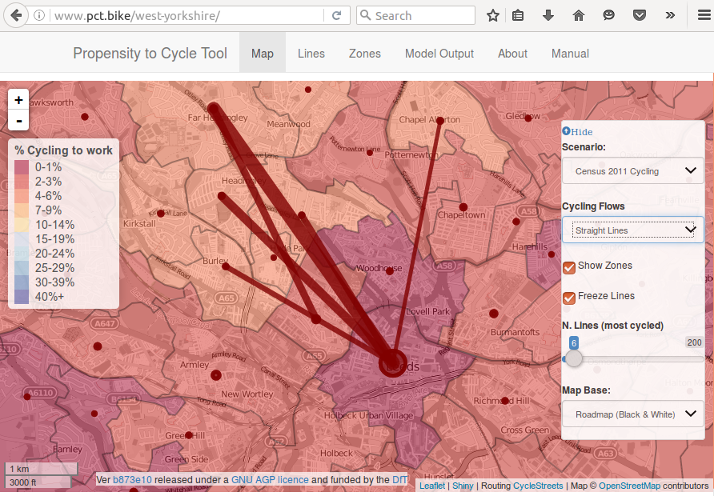
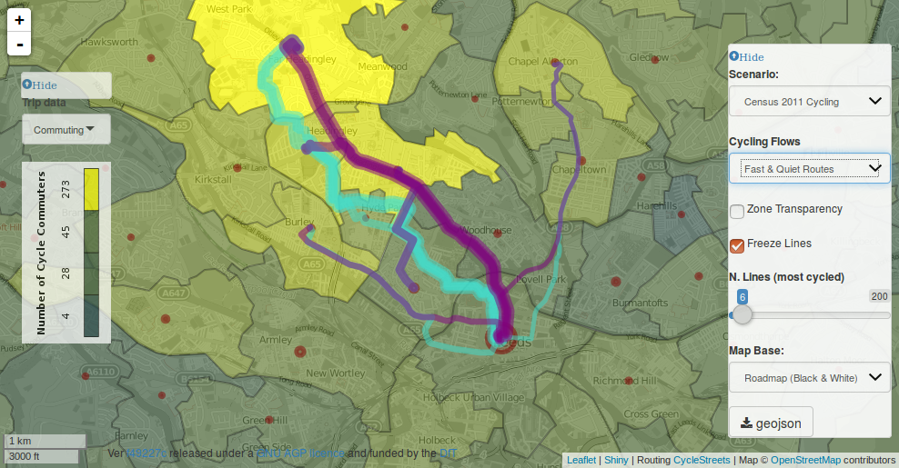
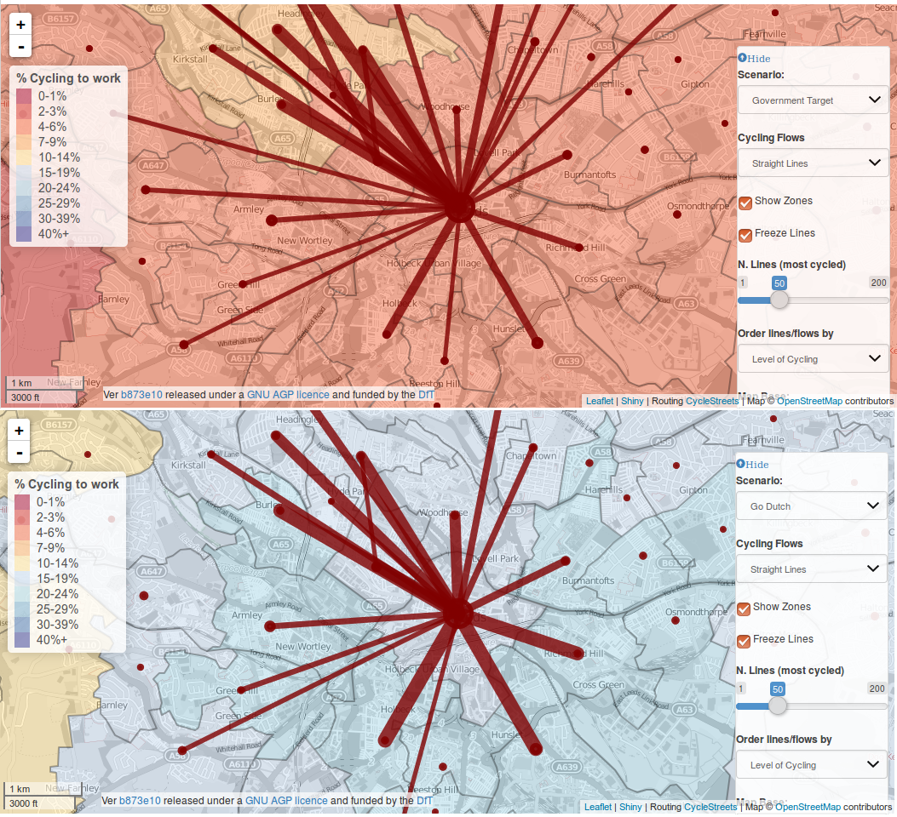
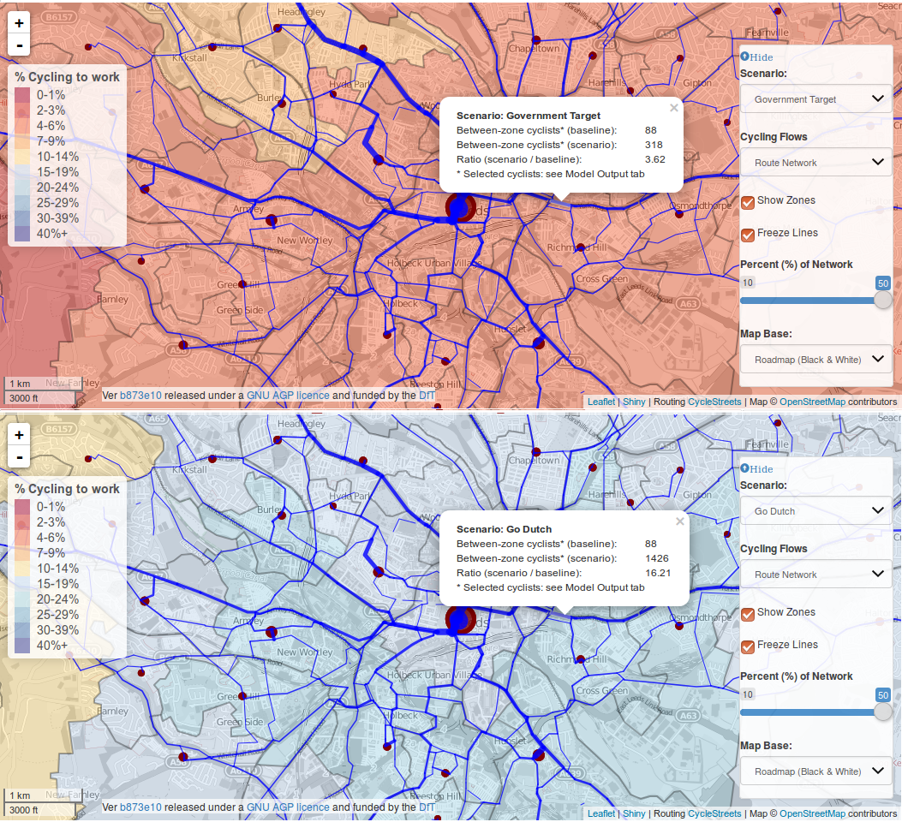
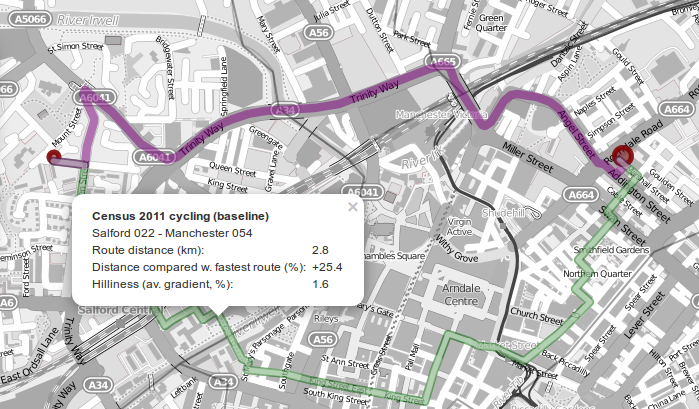
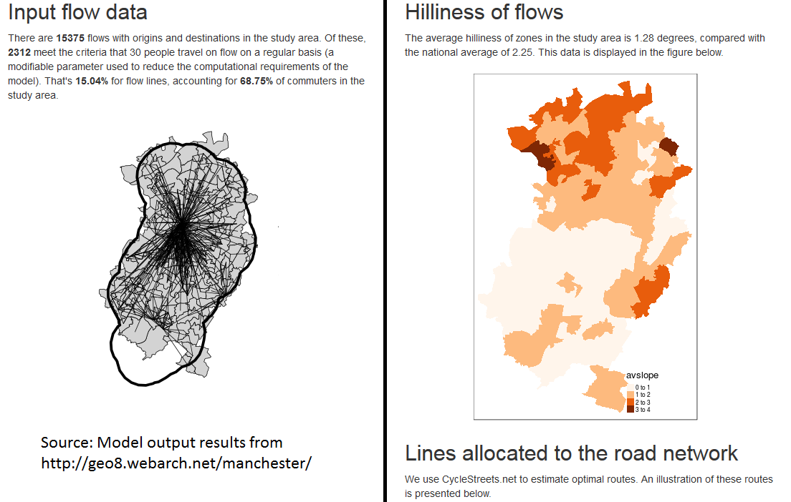

```{r, echo=FALSE, include=FALSE}
# date: '`r format(Sys.time(), ''%d %B %Y'')`'
# output:
#   pdf_document:
#     fig_caption: yes
#     number_sections: yes
#     toc: yes
# header-includes: \usepackage{amsmath}
#                  \usepackage{longtable}
#                  \usepackage{booktabs}
# author:
# - Robin Lovelace (University of Leeds)
# - Anna Goodman (London School of Hygiene and Tropical Medicine)
# - Rachel Aldred (University of Westminster)
# - Nikolai Berkoff (independent web developer)
# - Ali Abbas (University of Cambridge)
# - James Woodcock (University of Cambridge)

# output: rticles::els_article
if(grepl(pattern = "pct$", x = getwd())){
  setwd("documents")
}
# source("../set-up.R")
pkgs <- c("stplanr", "knitr", "xtable", "sp", "grid", "png", "RefManageR")
to_install <- !vapply(pkgs, require, character.only = T, FUN.VALUE = logical(1))
if(to_install) install.packages(pkgs[to_install])

# Bibliography dl
# download.file("https://github.com/citation-style-language/styles/raw/master/elsevier-harvard.csl", "documents/elsevier-harvard.csl")
# generated via https://github.com/ZotPlus/zotero-better-bibtex
download.file("https://www.zotero.org/api/groups/418217/collections/JBXTRB93/items/top?limit=100&format=bibtex&v=1", destfile = "references.bib")
# # This is from the group 'energy-and-transport': https://www.zotero.org/groups/energy-and-transport/items/collectionKey/TUEXXIV4
# b1 <- readLines("references.bib")
# b2 <- readLines("documents/Transport.bib")
# all_refs = c(b1, b2)
# all_refs = unique(all_refs)
# writeLines(c(b1, b2), con = "documents/Transport.bib")

# biblio <- ReadZotero(group = "energy-and-transport",  .params = list(qmode = "everything", collection = "TUEXXIV4"))

# To do:
# Add speed-bumps/speed cameras/cycling priority or remove lanes for motorised traffic
# Mention how the PCT could be used to create a systematic evidence base
```

# Abstract {-}

Getting people cycling is an increasingly common objective in transport planning institutions worldwide. 
Evidence shows that high-quality infrastructure 
can boost local cycling rates.
Yet for infrastructure and other cycling measures to be effective,
it is important to intervene in the right places, such as along desire lines of high latent demand,
creating the need for tools to help answer the question 'where to build?'. 
This paper describes the context, design and potential applications of such a tool.
The Propensity to Cycle Tool (PCT) is an online, interactive planning support system which has
been developed to to explore and map cycling potential across England
(see [pct.bike](http://pct.bike/)).
The PCT is based on origin-destination data, which it uses to model and visualise
cycling levels at area, desire line, route and route network levels.
This can be done both for current data on cycling and for a range of modelled  'cycling futures', representing different levels of ambition.
Scenarios implemented so far include 'Go Dutch' and 'Ebikes'.
These explore what would happen if English people cycled as much as the Dutch and the potential impact of electric cycles on cycling uptake.
The PCT's use of open source software enables the creation of additional scenarios by others, for example to explore the implications of meeting specific local cycling targets on a city's transport network.
The PCT's use of open source software enables others to modify the tool for their own purposes.
This could include the creation of alternative scenarios, for example to explore the implications of meeting local cycling targets on a city's transport network, or its deployment in new cities and countries.
We conclude that new interactive and online tools such as the PCT can provide an accessible evidence base for developing cycling plans help make transport planning a more open and citizen-led process.

# Introduction

Cycling can play an important role in creating
sustainable, healthy and equitable transport systems.
Cycling provides fast, affordable,
and convenient mobility to millions of people each day [@komanoff_bicycling_2004] and
is one of the fastest growing modes of transport in large cities such as London,
New York and Barcelona [@fishman_cycling_2016].
There is mounting evidence about the external costs of car-dominated
transport systems [@newman_costs_1999;@han_assessment_2008;@mizutani_estimation_2011;@shergold_rural_2012],
and the benefits of cycling [@oja_health_2011;@woodcock_health_2013;@de_nazelle_improving_2011],
pushing cycling up the transport policy agenda.
In this context there is growing interest, and in some cases substantial investment,
in cycling infrastructure, including in countries
with historically low rates of cycling.

<!-- ^[ -->
<!-- Several examples -->
<!-- of multi-million Euro projects are provided by the -->
<!-- [European Cyclist' Federation](http://www.ecf.com/advocary/eu-funding-2/examples-of-cycling-projects-co-funded-by-the-eu/), the -->
<!-- [FIA Foundation](http://www.unep.org/transport/sharetheroad/PDF/SharetheRoadReportweb.pdf) and the -->
<!-- [World Cycling Atlas](http://www.worldwidecyclingatlas.com/). -->
<!-- Another illustration of increased interest in cycling investment is provided by -->
<!-- the proliferation of publicly subsidized 'bike share' -->
<!-- [@obrien_mining_2014], which can be viewed in an interactive map at -->
<!-- [bikes.oobrien.com](http://bikes.oobrien.com). -->
<!-- ] -->

Providing high-quality infrastructure can play a key role in promoting cycling uptake [@parkin_cycling_2012].
Off-road cycle paths, for example, have been found to be associated with an increased
share of commute trips made by cycling locally [@heinen_changes_2015].
Overall there is strong evidence from dozens of studies linking cycling infrastructure to an increased rate of cycling [@buehler_bikeway_2016].
But where should this infrastructure be built?
This paper seeks to demonstrate the potential of online, evidence-based tools to help
answer this question, with reference to the Propensity to Cycle Tool (PCT).
The PCT is an online planning support system funded by the UK's Department for Transport
to map cycling potential (Department for Transport, 2015).
The version described in the paper was deployed for England (PCT-England) but we envision additional versions being developed for other countries and cities.

<!-- And where are local policy interventions --- such as reducing speed limits, enforcing road traffic laws, creating cycle hire schemes, providing free cycle training and reallocating road space for walking and cycling --- likely to have the greatest impact? -->

```{r, echo=FALSE}
# As such, rather than focus on the specific policy and geographical context of the PCT's development, we endeavour to present the tool in a generalisable way.
# 
# The paper is structured as follows. The Literature Review (Section 2) provides an overview of existing tools for the prioritisation of investment in cycling and active travel. Section 3 describes the data and methods underlying the PCT, with reference to a technical Appendix. Section 4 provides an outline of the scenarios developed for the DfT with reference to alternative scenarios that could be envisioned using the PCT. Finally, in Section 5, we discuss some of the limitations of the approach taken in the developement of the PCT and outline promising directions for future research and development in the nascent area of planning support systems for sustainable transport.
```

# The Propensity to Cycle Tool in context

The PCT was developed in the context of increasing transport policy attention directed to cycling and, from an academic perspective, two branches of research:
a) methodological developtments for estimating cycling potential and b) Planning Support Systems (PSS).
The subsequent overview of this policy and academic landscape places the PCT in its wider context.

## The policy context

A number of factors influence
the attractiveness of cycling for everyday trips [@pucher_infrastructure_2010].
There is a wide range of interventions related to infrastructure that can be grouped the banner 'space for cycling' [@parkin_planning_2015].
These include reducing speed limits, implementing car free zones and improving the urban realm.
However, the intervention that has received the most attention has been the construction of new cycle paths. With devolved transport budgets, the design of cycling networks is one policy lever over which local authorities have some control.
Planning new cycle paths requires many decisions to be made, including the width [@wegman_urban_1979;@pikora_developing_2002], quality [@heath_effectiveness_2006], directness [@crow_design_2007] and geographic location of the paths.
Yet while much evidence and guidance has been produced regarding the physical design of cycle paths [e.g. @transport_for_london_london_2015;@welsh_government_guidance_2014],
little work has explicitly tackled the question of where this high quality infrastructure should be built
[@aultman-hall_analysis_1997;@minikel_cyclist_2012].
Within this policy context, the PCT focuses explicitly on the question of *where* to build rather than *what* to build (although it does provide evidence on future capacity for different route segments, which is related to width).

<!-- A wider issue related to the broader sustainable urban mobility question is that the tools and concepts within the 'predict and provide' paradigm have limited capacity to inform 'sustainable mobility' policies [@naess_transport_2014]. -->

## Research into cycling potential 

Previous research has explored the impact of infrastructure on cycling, as outlined in the previous section. A major policy challenge is how to 'operationalise' this body of knowledge, to help planners prioritise where to invest.
This research gap was described by
@larsen_build_2013, who identified an "absence of research into how 
to  systematically  prioritize  and  locate  facilities  that  are  to  be  built".
There is, however, an emerging literature exploring cycling potential.
This links to the question of 'where to build' because 
areas and routes with the highest potential are likely to be cost-effective places for investment.
With the notable exceptions of @larsen_build_2013 and @zhang_prioritizing_2014, this body of research has not provided systematic or quantitative evidence for transport planners.
The methods broadly
fit into three categories depending on the level of the input data used:

- Area-based measures are based primarily on data at the level of administrative zones. Outputs from these measures can assist with the location of site-specific transport infrastructure such as cycle parking.

- Individual-based measures are based on individual level survey data, typically a household travel survey. These measures can help target specific groups, e.g. through tailored cycle training schemes, but are not always geographically specific. These measures tend to identify specific demographic groups seen as ‘near-market’ due to, for instance, their professional role, age and gender.

- Route-based measures use origin-destination data which can be used to create 'desire lines' and (using route allocation) estimates of existing and potential demand at each point on the road network.

This work is reviewed in relation to the PCT below and summarised in Table 1.

<!-- ### Area-based measures of cycling potential -->

Motivated by the need for an evidence base to inform where to build new cycle paths,
@larsen_build_2013 created
an area-based 'prioritization index'.
This was based on four variables: the area's current level of cycling,
its cycling potential (estimated based on the shortest path between the origin and destination of short car trips from a travel survey), the number of injuries to cyclists,
and locations prioritised by current cyclists for improvement  [@larsen_build_2013].
The method used to combine these four sources was rasterisation, whereby
the information was aggregated to the level of evenly spread cells covering the study area.
The resulting heat map was used to recommend the construction or upgrade of cycling paths on specific roads in Montreal.

@payne_removing_2014 used the concept of 'filtered permeability' --- providing a more direct route to cyclists than car drivers [@melia_urban_2015] --- to inform the commercially
developed Permeability Assessment Tool (PAT).
The PAT works by combining geographical data, including the location of popular destinations
and existing transport infrastructure, with on-site audit data of areas that have
been short-listed. Unlike the prioritization index of Larsen et al. (2013), which is primarily aimed at informing a strategic cycling network, the results of the PAT are designed to guide smaller, site specific interventions such as 'contraflow' paths and cyclist priority traffic signals.

At the opposite end of the scale spectrum, @parkin_estimation_2008 developed a regression model to estimate the proportion of commuter trips cycled across wards in England and Wales. Factors associated with lower levels of cycling included road defects, high rainfall, hills and a higher proportion of ethnic minority and low-income inhabitants.  Parkin et al. conclude that policy makers must engage with a mixture of physical and social barriers to promote cycling effectively, with the implication that some areas have lower barriers to cycling --- and hence higher propensity to cycle --- than others.

<!-- ### Individiual-based measures of cycling potential -->

@zhang_prioritizing_2014 created an individual-level model of cycling potential to prioritise where to build cycle paths to "achieve maximum impacts early on".
The outputs of this model were aggregated to the level of 67 statistical zones in the study area of Belo Horizonte and used to generate a 'usage intensity index' for potential cycle paths.
This, combined with survey data on cyclists' preferences for where to construct new cycle paths and origin-destination data on travel to work, was used to rank key routes in the city in terms of their cycling potential.

<!-- Another method that used individual-level to identify areas with high numbers of -->
<!-- 'potentially cycleable trips' funded by London's transport authority [@transport_for_london_analysis_2010]. -->
<!-- This method was based primarily on the London Travel Demand Survey and analysed -->
<!-- which segments of the population were most willing to cycle. The results were -->
<!-- presented as a static heatmap and used to prioritise where to build new cycle -->
<!-- paths and cycle hire points. -->

The Analysis of Cycling Potential (ACP) tool [@transport_for_london_analysis_2010] combined area and individual-level data to produce a heat map estimating cycling potential across London. The model examined which types of trips are most likely to be cycled, based on the types of trips that are currently cycled (e.g. time of day, characteristics of the traveller, distance).
Unlike the other tools reviewed in this section, the ACP was practitioner-led. Its results have informed local cycling schemes, such aswhere to build new cycle share points.
The ACP does not use origin-destination data or methods of route allocation.

<!-- A key feature of this tool was its integration of data sources from many different sources. -->
<!-- Unlike @larsen_build_2013, @zhang_prioritizing_2014  Using socio-demographic data, groups who were most likely to cycle were identified.  -->

<!-- Route-allocation of the desire lines. This facilitates the identification of specific segments of the transport network to be targeted for improvement. Such an approach has considerable potential for creating an evidence-base for prioritising investment in cycle paths locally (Broach et al., 2012; Ehrgott et al., 2012), for example by []. -->

<!-- \newpage -->

```{r, echo=FALSE, results='asis'}
dft = readr::read_csv("../data-sources/cycle-tools.csv")
# knitr::kable(dft)
library(pander)
# pander(dft, split.table = Inf)
# stargazer::stargazer(dft, summary = FALSE)
library(xtable)
xt = xtable(dft, caption = "Summary of tools and methods to prioritise where to invest in cycling.")
align(xt) = "Xp{3cm}|p{2cm}p{2cm}XXp{1.8cm}"
print(xt, comment = FALSE, include.rownames = FALSE,  hline.after = 0:nrow(dft),
  tabular.environment = "tabularx", width = "\\textwidth", booktabs = T, caption.placement = "top")
```

<!-- \newpage -->
<!-- \elandscape -->

## Planning support systems

As discussed above, in general tools to identify cycling potential have been created on an ad hoc basis, and are not freely available. The PCT instead draws on the tradition of Planning Support Systems (PSS) to create an interactive map that can be used both by planners and by interested members of the public.

PSS were initially developed to encourage evidence-based policy in land-use planning [e.g. @klosterman_what_1999].
The application of PSS to transport planning has been more recent, with a goal of
"systematically [introducing] relevant (spatial) information to a
specific process of related planning actions" [@te_brommelstroet_developing_2008].
The PCT is systematic in its use of national data for all parts of the study region
(in this case England) and relates to a specific planning process --- strategic cycle networks.

PSS typically work by presenting evidence about the characteristics and needs
of study region in an interactive map.
A central objective is to visualize
alternative scenarios of the future and explore their potential impacts.
The results of traditional scenario-based models of the future 
are typically not presented locally at area, let-alone route-specific, levels
[@mccollum_achieving_2009;@lovelace_assessing_2011;@woodcock_public_2009].
Online PSS can overcome this issue by using interactive maps to show local manifestations
of different scenarios [@pettit_online_2013].
Online PSS has been facilitated by the emergence of libraries for web mapping  [@haklay_web_2008],
allowing public access to the planning process.
Linked with the proliferation of open source software in transport planning
[@tamminga_design_2012;@novosel_agent_2015;@borning_urbansim:_2008],
PSS tackles the issue that transport models are often seen as
'black boxes', closed to public scrutiny [@golub_making_2013].

<!--' Much has been written about the characteristics of an effective PSS -->
<!--' of relavence to the PCT. -->
<!--' Although PSS are primarily technical projects to *develop*, -->
<!--' it has been found that 'soft' factors can impede their utility for practitioners. -->
<!--' In a review of the effectiveness of PSS uptake in the Netherlands, -->
<!--' @brommelstroet_equip_2010 identified timing and limited options for scenario -->
<!--' developement as key 'bottlenecks'. -->
<!--' These insights from the PSS literature influenced the design of the PCT -->
<!--' and the critique of PSS that practitioners should be more involved in -->
<!--' their development is returned to in the Discussion. -->

```{r, echo=FALSE}
# The policy relevance of this work stems from local and national cycling targets, wich are often set in terms of mode share. However, with little insight into what meeting these targets would mean for the rate of cycling flows along specific routes, it is hard to translate ambitious targets  into specific policies and plans. The PCT provides, to the authors' knowledge, the first online and interactive planning support system that tackles these issues for cycling.
```

```{r, echo=FALSE, eval=FALSE}
Other innovative features of the PCT include:
Estimation and visualisation of cycling potential at both the ‘area’ level and the 'desire line' level. This contrasts with most previous models of modal shift, which typically only produce outputs the area level (e.g. Lovelace et al., 2011; Müller et al., 2008). In relation to cycling, Parkin et al. (2008) used a multiple regression model to estimate levels of commuter cycling at an area level. Similarly local survey data has been used to identify areas with high numbers of 'potentially cycleable trips' in London (Transport for London, 2010). However, neither analysis identified the travel corridors along which these simulated cycle trips would be made.  
```

```{r, echo=FALSE, eval=FALSE}
Ability to produce outputs at multiple geographic levels.  Users of the PCT choose whether to examine cycling potential at a very local level (e.g. just a few streets) or at a more regional level (e.g. across a large metropolitan area). Line-level outputs can be aggregated to networks, while area-level outputs can be aggregated to the regional or national level.  This contrasts with previous national-level scenario-based transport models, which often lack any local geographical detail (e.g. McCollum and Yang, 2009).  In addition, the PCT is well suited to local-level analysis of the impacts of achieving a regional or national target level of cycling, highlighting one way in which this is a strategic tool.
Focus on wide ranging scenarios for cycling growth, including long-term, ambitious scenarios. This expands the 'option space' visible to transport planners, encouraging consideration of short and long-term planning horizons simultaneously.  This addresses one identified limitation of many existing models, namely that they do not simulate long-term scenarios and "do not sufficiently support the generation of new strategies" (Brommelstroet, 2010).
Making results available through a freely-accessible interface and open access model. In the past, transport planning has tended to be "closed to public over-sight", preventing public engagement with strategic transport plans (Golub et al. 2013). There is, however, now a trend in transport research towards greater transparency in software development and collaboration (Novosel et al., 2015; Tamminga et al., 2012).   The PCT is part of this trend, having been created with open access software, with the underlying code having been made publicly available under an open source AGPL licence (github.com/npct).
```

## Policy context and features of the Propensity to Cycle Tool

The national policy context of the PCT influenced its design and features.
The PCT was commissioned by the UK's Department for Transport to identify "parts of [England] with the greatest propensity to cycle"  [@department_for_transport_response_2015].
Thus the aim of the tool was not to produce a full transport-land use model,
but to provide an evidence base to prioritise where to create cycle-friendly infrastructure based on scenarios of the future.

Local and national cycling targets are often based on a target mode share by a given date.^[The
local target in Bristol, for example, is for [20% of commuter trips to be cycled by 2020](http://www.bristolpost.co.uk/Bristol-City-Council-s-pound-35million-plan/story-21341172-detail/story.html). [Manchester](http://cycling.tfgm.com/Documents/CCAG2-Executive-Summary.pdf) (10% by 2025),
[Derbyshire](https://www.derbyshire.gov.uk/images/2015-07-07%20Item%207l%20Cycle%20Plan_tcm44-267216.pdf) (to double the number of people cycling by 2025) and [London](http://content.tfl.gov.uk/gla-mayors-cycle-vision-2013.pdf) (to 'double cycling' by 2025) provide further examples of local ambitious time-bound cycling
targets.]
However, there is little evidence about what this might mean in for cycling volumes along specific routes.
The PCT tackles this issue by estimating rate of cycling locally under different scenarios and presenting the results on an interactive map. Its key features include:

- Estimation of cycling potential at area, 'desire line' and route network levels. 

- Route-allocation of the desire lines by a routing algorithm specifically developed for cycling.
This was done by CycleStreets.net, a routing service developed by cyclists, for cyclists.

- Visualisation of outputs at multiple geographic levels. The interactive map enables users to examine cycling potential at a very local level (e.g. just a few streets) or at a more regional level (e.g. across a large metropolitan area). 

- Public accessibility of results and code. The tool is freely available on-line and developers are encourage to modify the PCT (e.g. to create alternative scenarios) by provision of the source code underlying the PCT under the open source AGP License.

As with any tool, the PCT's utility depends on people knowing how to use it.
For that reason a Manual was added as a 'tab' that can be view while using the tool
(the tab headings are displayed in Figure 3 and described in Section 5).
This provides some further details on how to create custom scenarios.

# Data and methods

This section describes the data and methods that generate the input data for the PCT.
This is summarised in Figure 1 and described in detail in the Appendix.
Central to the PCT approach is origin-destination (OD) data recording the travel flow between administrative zones.
Combined with geographical data on the coordinates of the population-weighted centroid of each zones,
these can be represented as
straight 'desire lines' or (using a route-allocation algorithm) as routes allocated to the transport network.

<!-- The route-allocation stage (outlined below) provides -->
<!-- hilliness and route network distance as additional variables at the OD level. -->

```{r, echo=FALSE, fig.cap="Flow diagram illustrating the input data and processing steps used to create the input data used by the PCT."}
knitr::include_graphics("160229x8_NatModel_MSOA.pdf")
```

## Processing OD data

The central input dataset for PCT-England was origin-destination (OD) data from the 2011 Census, from the open access file `wu03ew_v2.csv`, provided by the [UK Data Service](http://wicid.ukdataservice.ac.uk/). This captures the number of commuters travelling between Medium Super Output Area zones (MSOAs, average population: 7,800), by mode of travel (D1 in Figure 1; see Table 2 for a sample).
D1 was derived from responses to questions 40 ("In your main job, what is the address of your workplace?") and 41 ("How do you usually travel to work?") in the [English 2011 Census](http://www.ons.gov.uk/census/).

The R package **stplanr** was developed to assign additional variables to D1 [@lovelace_stplanr:_2016].
This method used the population-weighted centroid of each MSOA to assign geographic coordinates to the OD data, allowing them to be plotted as 'desire lines' (see Figure 1). CycleStreets.net was used estimate of the distance and hilliness (the average gradient, in %) for each desire line (see D3 in Figure 1).
Other input datasets included mortality data per local authority (D2) and an estimate of the gender composition of cyclists in each OD pair (D4) (see the Appendix for further details).

Table: Sample of the OD input dataset, representing the number of people who
commute from locations within and between administrative zones (MSOAs)

```{r tflow, echo=FALSE, results='asis'}
# For latex version: use xtable:
# t1 <- xtable(head(flow[c(1:3, 12)]), caption = "Sample of the 'flow' input dataset, representing the number of people who commute from locations within and between administrative zones (MSOAs)", label = "tbl:flow")
# print(t1, type = "latex", comment = FALSE, caption.placement = "top")

# For docx and latex: use kable
data("flow")
names(flow) <- gsub("\\.", " ", names(flow))
names(flow)[3] <- "Total no. commuters"
names(flow)[12] <- "No. cycle commuters"
kable(head(flow[c(1:3, 12)]), row.names = F)
```

Table: Sample of the zone level input dataset. The coordinates represent the population-weighted centroids of MSOA zones, whose codes are also presented in Table 1.

```{r tcents, echo=FALSE, results='asis'}
# t2 <- xtable(as.data.frame(cents[1:3,-c(3,4)]), caption = "Sample of the 'cents' input dataset, representing the geographical location of the population-weighted centroids of MSOA zones described in Table~\\ref{tbl:flow}", label = "tbl:cents")
# print(t2, type = "latex", comment = FALSE, caption.placement = "top")
data("cents")
sel <- which(cents$geo_code == flow$`Area of residence`[1])
cents1 <- as.data.frame(cents[c(1:3, sel),-c(3,4)])
names(cents1) <- c(
  "Area of residence",
  "Area name",
  "Longitude",
  "Latitude")
kable(cents1, row.names = F)
```


```{r, echo=FALSE, fig.cap="Overview of the PCT map interface, showing area and OD-level data. The zone color represents the number of people who cycle to work in each administrative zone. The lines represent the top 6 most cycled commuter routes in Leeds (moving the slider 'N. Lines (most cycled)' increases the number of lines). Width is proportional to the total number of cycle trips. Note the use of population-weighted (as opposed to geographic) centroids for the point of departure and destination and the variable width of the centroids, which are proportional to intra-zonal (within zone) flow."}
# data("flowlines")
# plot(flowlines, lwd = flowlines$All / 10)

```

<!-- A model estimating cycling uptake as a function of distance, via distance decay curves [@iacono_access_2008], -->
<!-- and hilliness was used to create plausible scenarios of cycling futures. -->
<!-- For the purposes of this study, model parameters were derived from -->
<!-- English and Dutch travel survey data (see the Appendix). -->
<!-- Changing the height and shape of distance decay curves -->
<!-- (and, for the 'Ebike scenario, 'hilliness decay curves') -->
<!-- based on a baseline from the English National Travel Survey -->
<!-- (illustrated in Figure 2) allowed estimates of the model split -->
<!-- of cycling to be generated for every route-allocated OD pair for each scenario. -->

<!-- It is important that even in high-cycling countries such as the Netherlands there -->
<!-- is a strong relationship between cycling levels and trip distance, -->
<!-- influencing the potential for mode shift in different regions. -->
<!-- Where many trips are long and/or hilly, interventions related to land-use planning -->
<!-- (e.g. the creation of local jobs and services) may be a prerequisite for substantial cycling uptake. -->
<!-- Where many are short, by contrast, improvements to the infrastructure -->
<!-- for cycling, in tandem with 'soft' interventions such as cycle training, -->
<!-- may be sufficient for cycling levels to grow. -->
<!-- The PCT focuses explicitly on the latter scenario as it is (currently) -->
<!-- based on current travel patterns. -->

The first step in the process was to model current cycle commuting in England.  We did this using OD data from the 2011 Census, and modelling commuting as a function of the route distance and route hilliness variables that we had assigned.  We did so using logistic regression applied at the individual level, including squared and square-root terms for distance (to capture its non-linear association with likelihood of cycling; see Iacono et al 2008) and including terms to capture the interaction between distance and hilliness.  Model fit is illustrated in Figure 2; see Appendix for details and for the underlying equations.  We also developed equations to estimate commuting mode share among other groups, e.g. those commuting within a specific MSOA, or those with no fixed workplace.   This model of current cycling levels formed the basis for three of our four subsequent scenarios (govtarget, godutch and ebikes; see below), with model parameterization drawing additionally on English, Dutch and Swiss travel survey data (see the Appendix for details).  

```{r, echo=FALSE, fig.cap="The relationship between distance (left) and hilliness (right) and cycling mode share in England based on the the National Travel Survey. The plots show actual (blue) vs predicted (red) prevalence of cycling to work among 17,896,135 English commuters travelling <30km to work."}
knitr::include_graphics("dd-anna.png")
```


```{r, echo=FALSE}
# ^[The
# source code of `gFlow2Lines()` has been made available
# online, as part of an R package for sustainable transport planning,
# **stplanr**. See [github.com/Robinlovelace/stplanr/](https://github.com/Robinlovelace/stplanr/blob/master/R/gFlow.R).]
```

<!-- The raw OD data was preprocessed before being used in the PCT. -->
<!-- The R package **stplanr** was developed for this task [@lovelace_stplanr:_2016]. -->
<!-- Tables 1 and 2 illustrate the two tables that comprise the OD data. Figure 3 -->
<!-- shows a visualisation of the output, straight lines with attributes for -->
<!-- each OD pair in both directions. These are also referred to as 'desire lines' when -->
<!-- represented as straight lines on the map [@tobler_experiments_1987;@chan_multi-criteria_2003]. -->
<!-- The visualisation of the OD data builds -->
<!-- on published work on cartographic visualisation [@rae_spatial_2009;@wood_visualisation_2010]. -->
<!-- The model for England described here uses the following open datasets -->
<!-- (similar OD datasets are available for cities across the world): -->

<!-- - Flow data representing the number of trips between origin-destination (OD) pairs, -->
<!-- disaggregated by mode of travel. -->
<!-- We used the file `wu03ew_v2.csv`, obtained from the UK Data Service -->
<!-- (see Table 2 for a sample of this dataset)^[See [wicid.ukdataservice.ac.uk/cider/wicid/downloads.php](https://wicid.ukdataservice.ac.uk/cider/wicid/downloads.php).]  This dataset was derived by the Office for National Statistics from responses to questions 40 ("In your main job, what is the address of your -->
<!-- workplace?") and 41 ("How do you usually travel to work?") in the English 2011 Census (see [ons.gov.uk/census](http://www.ons.gov.uk/census/2011census/howourcensusworks/howwetookthe2011census/howwecollectedtheinformation/questionnairesdeliverycompletionandreturn) for further information). -->

<!-- - The population-weighted centroids of -->
<!-- administrative zones (see Table 1). Medium Super -->
<!-- Output Areas (MSOAs) (average population: 7,800) -->
<!-- were used for both origins and destinations.^[This -->
<!-- data was provided under the UK's Open Government -->
<!-- Licence [data.gov.uk/dataset/lower-layer-super-output-areas-ew-2011-population-weighted-centroids](http://data.gov.uk/dataset/lower-layer-super-output-areas-ew-2011-population-weighted-centroids).] -->

<!-- - Route distance, generated by the `route_cyclestreet` function -->
<!-- in the **stplanr** R package. -->

<!-- - Hilliness of zones and routes. There are various ways to generate this data, -->
<!-- ranging from the simple (e.g. vertical displacement between origin and -->
<!-- destination) to the complex (e.g. total amount of climb along the route network -->
<!-- in both directions). After experimenting with area-based measures of hilliness -->
<!-- we settled on a route-allocated measure: the average gradient (%) of the 'fastest' -->
<!-- route. -->

<!-- We calculated mean gradient per MSOA zone using publicly available -->
<!-- digital -->
<!-- elevation model (DEM) data supplied by NASA.^[See -->
<!-- [srtm.csi.cgiar.org/](http://srtm.csi.cgiar.org/) for the data and the -->
<!-- [steepness.R](https://github.com/npct/pct/blob/master/loading-data/steepness.R) -->
<!-- file in the project's repository for the processing algorithm used. "Version 4" -->
<!-- of the dataset was used. To allocate this area-based hilliness metric to OD -->
<!-- pairs, we calculated the average hilliness of origin and destination zones. This -->
<!-- method has the disadvantage that accuracy decreases with increased trip -->
<!-- distance.] -->

<!-- We used the Census 2011 travel to work origin-destination dataset for its comprehensive coverage of -->
<!-- the population, high geographic resolution and assurances surrounding data -->
<!-- quality. The MSOA It is worth noting that -->
<!-- a variety of emerging sources could be used instead to -->
<!-- provide OD data. This includes 'Big Data' -->
<!-- [@kitchin_big_2013] sources such as: mobile -->
<!-- telephone service providers [@smoreda_spatiotemporal_2013]; -->
<!-- public transport data, which can highlights local demand short trips; -->
<!-- household travel surveys [@transport_for_nsw_household_2014] -->
<!-- and output from transport demand models controlled by local government. -->

```{r, echo=FALSE}
# In practice using multiple datasets may be the most appropriate option.
# Individual and areal data can, for example, be combined using spatial
# microsimulation, allowing transport policies to be modelled at the
# individual level [@lovelace_spatial_2014].
# Even when travel surveys contains geographical information,
# sample sizes are generally comparatively small, less than 1% of the population,
# making them inappropriate as the sole source of input data for
# geographical modelling at the local level.
# Flows inferred from mobile phones are a promising new dataset for inferring
# travel behaviour. Recent
# work has been able to accurately reconstruct travel flow patterns from millions
# of anonymous users, including inference of purpose of travel [@alexander_validation_2015].
# If origin-destination flow estimates resulting from such datasets
# become more widely available to researchers, this could constitute one of the
# most single most valuable data sources for transport planners worldwide.
```

## Regions

Instead of running the model for the entirety of England, a region-by-region approach
to data generation and visualisation was developed.
The regional focus was selected because transport decisions
tend to be made at the local level [@gaffron_implementation_2003].
The regional approach also reduced the computational
requirements of each regional 'build', by reducing the amount of RAM needed
for key stages in the data generation process.
This increased the scalability of the PCT, allowing nationwide data to be generated on
desktop computers, albeit with large (16 GB+) amounts of RAM.

<!-- A potential limitation of this single regional geographic level is -->
<!-- that 'edge zones', straddling two -->
<!-- or more regions, can become marginalised. -->
<!-- To overcome this issue the 'build' scripts were written to -->
<!-- enable custom regions. London, for example, -->
<!-- was 'built' at 2 different levels, one covering the entirety of the city -->
<!-- and another which divided the city into 4 quadrants based on a zoning system -->
<!-- used by Transport for London -->
<!-- (see [pct.bike/london/](http://pct.bike/london/) and -->
<!-- [pct.bike/london-east/](http://pct.bike/london-east/) respectively) -->
<!-- Another solution to the issue of edge-zones that was tested -->
<!-- (but not implemented following user feedback) -->
<!-- was the creation of buffers around the regions. -->
<!-- This involves expanding the outline of a region, -->
<!-- creating an area of overlap between two regions that are side-by-side. -->


```{r, echo=FALSE}
# The wider national policy context should be considered when selecting
# the regional geographies that are appropriate for the model.
# In Phase I of the work to implement the PCT for the UK we used LADs, then switched to CUAs after user testing.  TTWs also possible, and in the long term perhaps LEPS.  Our recommendation is to build it at the CUA level
```

```{r, echo=FALSE}
# ^[Highway
# Authorities and LADs will coincide in places where there are ‘unitary authorities’ (e.g. in England’s large conurbations, and the whole of Scotland and Wales). However in many parts of rural England, the Highway Authority will cover several District Authority areas. in any event though, the regions used as the building blocks of the PCT can adapt to reflect either, or alternative, funding structures (e.g. England’s Combined Authorities or Local Enterprise Partnerships
# (LEPs)).
# ]

# As well as CUA level an increasing proportion of transport funding in
# England is also being allocated to Local Enterprise Partnerships (LEPs)
# and Combined Authorities (CAs) which are larger than, and often overlapping with, CUAs.
# Based on these insights, and feedback from practitioners, our
# recommendation for Phase II is to build the PCT for every CUA in
# the nation and for selected LEPs and CAs where strategic
# cycling plans are being planned. These suggestions may change based on
# feedback from the Department for Transport.
#
# We will also explore the possibility of
# running the model at the national level. This would involve setting
# appropriate selection criteria to filter-out the majority of
# origin-destination pairs to avoid exceeding computational resources.
# The demarcation of regional boundaries is deemed useful for focusing
# on one region at a time.
#
# Phase I of the PCT project focused instead on smaller administrative units:
# Local Authority Districts (LADs). There are 324 LADs across England.
# For the case study towns of Manchester and Coventry, the choice between
# CUA and LAD levels
# made no difference as LADs and CUAs have the same boundaries for these areas.
# For Norwich, however, the LAD is much smaller than the CUA and is less
# practical for strategic transport planning at the MSOA level (Fig. 2).
# For this reason
# we implemented a buffer selection methodology to expand the scope of the
# selection, as described in the next section. Before describing the
# buffer selection method, it is worth briefly considering some
# of the other regional geographies that could be used: Travel to Work Areas (TTWAs),
# which could be applicable in many contexts and Local Enterprise Partnerships
# (LEPs) which are specific to the UK context.
#
# TTWAs are 'commuting watersheds' that correspond to
# cohesive regions, the centres of which are known employment centres [@Coombes2008].
# Versions of the PCT model developed for more scientific purposes would benefit
# from using TTWAs as the regional geography for local scenario development and
# visualisation.
```

```{r cuas-lads, eval=FALSE, echo=FALSE, fig.cap="The front page of the Propensity to Cycle Tool for England, showing the regional units used load and visualise the data. The tool itself initiates when one of the regions (such as West Yorkshire, shown) is selected."}
knitr::include_graphics("pct-frontpage.png")
```

## Route allocation and network generation

The desire lines allocated to the route network are illustrated in Figure 4.
Note that two route types were computed: the 'fastest' route,
which represents an estimate of the route taken by cyclists to minimise travel time
and the 'quietest' route which preferentially selects small roads.
Overlapping fast routes were aggregated to create the 'Route Network' layer (see Figure 5).
These stages were computationally intensive, leading to a number of steps
being taken to make them fast and scalable:

```{r, echo=FALSE, fig.cap="Illustration of desire lines shown in Figure 3 after they have been allocated to the road network by CycleStreets.net. Purple lines are the 'fastest' routes and turquoise routes were the 'quitest' routes."}

```

- Adjustable selection criteria were used to sample the lines before route allocation. Maximum Euclidean distance (`mdist`) and minimum all-mode number of commutes (`mflow`) parameters were made adjustable for each build.
After some experimentation, these were set to 15 km and more than 10 commuters.

<!-- ^[To illustrate the effectiveness of these selection criteria, -->
<!-- consider the example of Manchester. Setting `mflow` to 30 reduced the number of OD pairs by 85%, yet -->
<!-- still accounted for almost 70% of commuters. -->
<!-- Different values for were tested to reach a reasonable -->
<!-- balance between comprehensive coverage and speed; we settled on `mflow = 10` -->
<!-- for the national build outside London although we plan to test reducing this further. -->
<!-- We also experimented by reducing `mdist` and settled on -->
<!-- 15 km. This translates to around 20 km -->
<!-- on the route network assuming a *circuity* value of 1.3, as reported by -->
<!-- [@cole_quantitative_1968]. -->
<!-- Only 1.4% of cycle commutes recorded in the -->
<!-- National Travel Survey exceeded a distance of 20 km.] -->

- Pre-processing of route-allocated lines. This meant that CycleStreets.net was not called for every build.
Instead, a pre-generated file of downloaded routes was used.

- Parallel code. We used the R package **foreach**  to make the slowest process in the build script run on multiple computer cores.
<!-- This roughly halved the build times. -->

It is important to note that the routes provided by CycleStreets.net
do not necessarily represent the paths that cyclists currently take;
route choice models based on GPS data
have been developed for this purpose [@broach_where_2012;@ehrgott_bi-objective_2012].
Of the available routes provided by CycleStreets.net ('quietest', 'balanced' and 'fastest'),
the 'fastest' option was used
(see [cyclestreets.net/journey/help](https://www.cyclestreets.net/journey/help/howtouse/) for more information).
This option was chosen because when designing infrastructure, planners should consider
cyclists' preference for direct routes [@crow_design_2007]
and that cycling potential falls quickly with increasing distance.

<!-- To reduce data processing and visualisation times -->
<!-- a sub-sample of OD pairs was used. -->
<!-- The aim was to reduce the number of OD pairs whilst retaining the overall -->
<!-- travel pattern. To do this a minimum number (labelled `mflow`) -->
<!-- of trips between OD pairs was specified. OD pairs with less than -->
<!-- `mflow` trips were removed from the analysis. -->
<!-- This decision was taken on the basis that the distribution of number of commuters per OD pair is skewed: -->
<!-- a relatively small number of OD pairs along major travel corridors -->
<!-- account for a disproportionately high proportion of travel. -->

The spatial distribution of cycling potential can be explored interactively by selecting the 'top n' routes with the highest estimated cycling demand.
Information about the *aggregate cycling potential* on on the road network is shown in the Route Network layer.
This layer adds together the number of cycle trips for all routes,
and relates to the *capacity* that infrastructure may need to handle under different scenarios,
as illustrated in Figure 5.
Cycling along Otley Road, under the Go Dutch scenario, rises from 73 to 296
along a single route, but from 301 to 1133 in the Route Network.

<!-- The Route Network was generated with the R function `overline` [@lovelace_stplanr:_2016]. -->

<!-- ^[Thanks to Barry Rowlingson from the University of Lancaster for assistance developing this function.] -->

```{r, echo=FALSE, out.width = '50%', fig.cap="Illustration of route-allocated OD data (left) compared with route network data (right) which was produced by aggregating all overlapping route-aggregated OD pairs, using the 'overline' function from the stplanr R package.", fig.show='hold'}
knitr::include_graphics(c("fastest-headingly.png", "fastest-net-headingly.png"))
```

# Scenarios

The scenarios presented in the PCT operate at the OD level:
change in the rate of cycling is estimated per desire line, and subsequently aggregated up to the level of areas
and, via steps outlined above, down to the Route Network level.
A wide range of models could be used to estimate cycling potential at this level and scenarios are constrained only by the imagination (as considered in the Discussion).
This section outlines the scenarios produced for the English version of the PCT.
These were informed by a government target to double the number of cycle trips
[@department_for_transport_cycling_2014] and evidence from overseas
about which trips *could* be made by cycling,
especially in relation to gender equality in cycling rates and uptake of electric assist cycles (Ebikes).

This section deliberately avoids technical detail about
the functional form of the model and how model parameters
for each scenario were derived (see the Appendix for this technical information).
Instead, it provides a high-level overview of the scenarios and how they were developed, which should be of use to others developing alternative cycling scenarios to inform the transport planning process.

For all scenarios except *gender equality*, a regression model was used
to estimate the potential rate of cycling at the OD level.
The parameters were estimated using trips level data from the National Travel Survey
using a logistic regression model estimating the *dependent variable*,
the probability of a trip being made by cycling $pcycle$, based on
distance ($d$) and hilliness ($H$)
For aggregate data, this translates into the proportion of trips made by cycling.

It is well-known that the proportion of trips made by cycle (henceforth
$pcycle$) tends to decrease with increasing distance [@iacono_access_2008].
Based on this work and exploratory analysis of the data we estimated
the $logit$ of $pcycle$ rather than $pcycle$ directly.
The logit function converts a logistic curve for values between 0 and 1 (typically a probability, $p$)
into a linear curve via the relation:

(@) $$ logit(p) = log(\frac{p}{1 - p}) $$

Preliminary analysis found $h$ to have a linear relationship with $pcycle$,
and interaction with distance, such that routes that were both hilly and
length were disproportionately unlikely to be cycled,
based on data from the National Travel Survey (see Appendix).

<!-- After an iterative process of model testing, the formula chosen was: -->

<!-- (@) $$ logit(pcycle) = \alpha + \beta_1 d + \beta_2 d^{0.5} + \beta_3 d^2 + \gamma h + \delta_1 d h + \delta_2 d^{0.5} h $$ -->

```{r, echo=FALSE}
# {#eq:description}
```

<!-- where $d$ is distance (km, route distance between population weighted centroids) and -->
<!-- $h$ is the hilliness -->
<!-- per OD pair. The remaining values are scalar -->
<!-- coefficients to be estimated. -->
<!-- $\alpha$ represents the intercept (the rate of cycling very short -->
<!-- trips). $\beta_1$, $\beta_2$ and $\beta_3$ represent the rate of distance decay. -->
<!-- $\gamma$ represents the impact of hilliness on cycling and the $\delta$ coefficients represent -->
<!-- the interaction between distance and hilliness (see Appendix). -->

<!-- ## Zone Buffer -->

<!-- Running the PCT region-by-region means -->
<!-- ignoring all zones outside the region. If the region is a -->
<!-- self-contained transport system this makes sense. -->
<!-- If the region is part -->
<!-- of a larger travel network, however, this could be problematic. -->
<!-- To solve this problem, buffers were used to expand regions -->
<!-- deemed to be part of a wider system.^[Various criteria were considered -->
<!-- to decide whether or not a buffer was needed and to select the size of the -->
<!-- buffer, for example -->
<!-- whenever the number of MSOA zones fell below some threshold -->
<!-- and the amount of inter-region travel. Ultimately it was decided to -->
<!-- add buffers on an ad-hoc basis, where they were deemed necessary.] -->
<!-- To illustrate how the buffers worked, -->
<!-- buffer was used to select zones -->
<!-- outside the City of Manchester (see Fig. 7 below). -->
<!-- This protocol increased the sample size by including all -->
<!-- zones whose population-weighted centroid lies inside the -->
<!-- buffer, the width of which can also be set based on knowledge of -->
<!-- the local area.i -->

## Four scenarios of cycling uptake in England

Four scenarios were developed to
explore cycling futures in England.
These can be framed in terms of the removal of different infrastructural, cultural and technological barriers that currently prevent cycling being the natural mode of choice for urban trips. 
The scenarios are context-specific and based partly on
political commitments to cycling (see *govtarget*).
Use of the PCT in other contexts will likely benefit from new scenarios that
relate to both the current policy context and long-term aspirations.
The scenarios are not predictions of the future.
They are snapshots indicating how the spatial distribution
of cycling may shift as cycling grows based on current travel patterns.
The first two are shorter-term and the second two longer-term.

- Government target (*govtarget*). This scenario represents a doubling of
the number of cycling trips in England.
Although substantial in relative terms (rising from 3% to 6% of commutes), the rate of cycling under this scenario
remains low compared with countries such as the Netherlands.
Growth in cycling is not uniform.
Above-average percentage point increases are projected in areas
with many short, flat trips and a low current rate of cycling.
Conversely, areas with higher cycle use and many long-distance hilly commuter routes will have below-average growth.
*govtarget* thus represents a slight reduction
(but not elimination) of local
constraints deterring cycle use more in some places than in others and
is designed to indicate where investment might have the greatest short-term impact.

- Gender Equality (*gendereq*). This scenario illustrates the increase in cycling
that would result if women were as likely as men to cycle a given trip.
Specifically, the scenario sets the proportion of female cycle commuters to be equal
to the current proportion of males in each OD pair.
The scenario is based on the observation that in places where cycling is the norm,
women cycle at least as much as men [@pucher_infrastructure_2010;@aldred_does_2016].
*gendereq* represents
the elimination of one specific cultural constraint.
This scenario has the greatest relative impact in areas where
the rate of cycling is highly gender-unequal.
<!-- In absolute terms, cycling increases most in this scenario where cycling -->
<!-- is already a common mode of transport. -->

- Go Dutch (*godutch*).
While *govtarget* and *gendereq* build on current cycling behaviour,
'Go Dutch' focuses on long-term potential.
*godutch* represents what would happen if English people were as likely as Dutch people to cycle a trip of a given distance and level of hilliness.
It works by assigning Dutch
distance decay parameters to English travel patterns.
The scenario represents the elimination of the
infrastructural and cultural constraints which currently hold back cycle
use in England, including all localised differences.
As such, whereas the *govtarget* and *gendereq* scenarios take current levels as a starting point, the predicted levels of cycle use in  *godutch*
are unrelated to current levels, and are constrained
only by local trip distance distributions and hilliness.

- Ebikes (*ebikes*). This scenario models the additional increase
in cycle use that would be achieved through the widespread uptake of electric
cycles.
Electric assist cycles enable longer journeys and make cycling a more viable option for
people with low fitness and impaired mobility.
This scenario is currently implemented as an extension *godutch*
but could be implemented as an add-on for other scenarios.

<!-- These scenarios are described more fully below. -->

<!-- ## Government Target -->

<!-- The Government Target scenario (*govtarget*) -->
<!-- is based on the UK government's proposed target -->
<!-- (as set out in its draft Cycling Delivery Plan [@department_for_transport_cycling_2014]) -->
<!-- to double cycling in England, from 0.8 billion stages currently to 1.6 billion stages by 2025. -->
<!-- However @department_for_transport_cycling_2014 says nothing about where these additional -->
<!-- trips would come from. The *govtarget* scenario is therefore based on our own -->
<!-- assumptions about this. It aims to assist transport -->
<!-- planners in identifying where new demand for cycling is likely to be greatest in -->
<!-- the near term. -->

<!-- The key point about this scenario is that cycling does not double in all -->
<!-- areas. Instead, the increase is related to the current -->
<!-- commuter trips and the trip distance. -->

<!-- At the heart of the *govtarget* scenario is the previously discussed -->
<!-- regression model (labelled $natmod$) estimating -->
<!-- the dependent variable, namely the percentage of commuters who cycle (*pcycle*). -->
<!-- The new percentage of commuters who cycle ($pcycle(govtarget)$) -->
<!-- for each desire line is calculated as the current rate of -->
<!-- cycling plus this model-based estimate: -->

<!-- (@) $$ pcycle(govtarget)_{ij} = (pcycle_{ij} + pcycle(natmod)_d) $$ -->

<!-- where $pcycle_{ij}$ is the 2011 Census proportion of commuters who cycle for an OD pair $ij$ -->
<!-- of distance $d$ apart and $pcycle(natmod)_d$ is the proportion of commuters expected to -->
<!-- cycle the distance $d$ based on the national-level regression model. -->
<!-- The sum of these values -->
<!-- can be multiplied by the total number of commuters for all modes $tflow_{ij}$ -->
<!-- to convert the proportion into a number of cyclists, i.e.: -->

<!-- (@) $$ SLC(govtarget)_{ij} = (pcycle_{ij} + pcycle(natmod)_d) * tflow_{ij} $$ -->

<!-- where $SLC(govtarget)_{ij}$ is the *Scenario-based Level of Cycling* for this scenario for the $ij$ OD pair. -->
<!-- An example of this scenario for an imaginary OD pair $ab$ with Euclidean -->
<!-- distance 4.5 km is as follows. -->
<!-- In a representative sample of OD pairs in the UK -->
<!-- of distance 4-5km, the average proportion of cycle commuters was 5%. -->
<!-- Under the 'national doubling', -->
<!-- assume an additional 5% of commuters now cycle for all -->
<!-- trips of 4.5km --- i.e. $pcycle(natmod)_{4.5} = 0.05$. -->
<!-- For our specific OD pair $ab$ in the Census there are -->
<!-- 200 commuters, of whom only 2 are cyclists ($pcycle_{ab} = 0.01$). -->
<!-- The scenario adds an additional 5% of commuters, i.e. an additional 10 cyclists which more than doubles the total number of cyclists from 2 to 12. -->
<!-- The same methodology is applied to all distances represented in the OD -->
<!-- matrix.^[Thus -->
<!-- this particular OD pair has gone from a current proportion of cyclists to 1% (five times lower than the national average of 5%) to having a scenario proportion of cyclists of 6% (just over half the national average of 10%).  This illustrates the point that this scenario tends to equalize, but does not remove, pre-existing differences in cycling levels. -->
<!-- ] -->

<!-- The approach assumes that cycling potential against a given national -->
<!-- increase is always a positive number. -->
<!-- When only modest increases in cycling are assumed -->
<!-- (e.g. from 3% to 6% as an overall mode share), -->
<!-- the pre-existing cycling demographic contributes considerably to the new demographic. -->
<!-- In more ambitious cycling scenarios the pre-existing distribution matters less. -->
<!-- This corresponds to the insight that, with sustained investment in overcoming the infrastructural and -->
<!-- cultural constraints which limit cycle use, -->
<!-- the long-term potential becomes more important -->
<!-- than the current rate of cycling. -->

<!-- ## Gender equality -->

<!-- The next scenario to be discussed is Gender Equality (*gendereq*). In this -->
<!-- scenario cycling tends to grow more in areas that already have a high -->
<!-- rate of cycling. The scenario -->
<!-- recognizes that this disparity is reduced or absent in -->
<!-- countries with a high rate of cycling [@Fishman2015]. -->
<!-- The Gender Equality scenario (*gendereq*) builds on such insights -->
<!-- and is based *observed level of cycling* (*OLC*) from the 2011 Census. -->

<!-- On average in England around three quarters of cycle commuters -->
<!-- are male, although this varies geographically [@Aldred2015]. -->
<!-- *gendereq* assumes that gender equality is reached in cycling. -->
<!-- A prerequisite is a model-based estimate of the number of male -->
<!-- and female cyclists between origin and destinations for -->
<!-- the observed data. -->
<!-- This involves splitting the number of cyclists estimated by the model, -->
<!-- the *Scenario-based Level of Cycling*, into -->
<!-- male ($SLC(gendereq)_m$) and female ($SLC(gendereq)_f$) components: -->

<!-- (@) $$ SLC(gendereq) = SLC(gendereq)_m + SLC(gendereq)_f $$ -->

<!-- More males cycle to work than females in every Local Authority in England -->
<!-- (Fig. 4). For this reason, the *gendereq* scenario -->
<!-- is based on the assumption that the rate of cycling amongst -->
<!-- females increases to match the rate of cycling amongst males. -->
<!-- Under *gendereq* $SLC(gendereq)_m = OLC_m$, there are no additional male cyclists. -->
<!-- Note that this is not as simple as $SLC(gendereq)_f = SLC(gendereq)_m$, -->
<!-- as the absolute number of female and male cyclists will also depend on the gender split of the total commuting population within each OD pair.^[To -->
<!-- illustrate this point, consider an OD pair in which the total number of female -->
<!-- commuters is larger than the total number of male commuters. -->
<!-- In this case, the number of female cyclists would exceed the -->
<!-- number of male cyclists in the *gendereq* scenario. -->
<!-- ] -->
<!-- It is the *proportion* of males and females -->
<!-- per OD pair who cycle that becomes equal, as follows. -->

<!-- (@) $$ pcycle(gendereq)_f = pcycle_{m}$$ -->

<!-- (@) $$ \frac{SLC(gendereq)_f}{tflow_f} = \frac{OLC_m}{tflow_m} $$ -->

<!-- (@) $$ SLC(gendereq)_f = tflow_f * \frac{OLC_m}{tflow_m}$$ -->

<!-- $OLC_m$ is the observed number of male cycle commuters -->
<!-- (in the 2011 Census in this case), -->
<!-- $SLC(gendereq)_f$ is number of female cycle commuters in the gender equality scenario, and -->
<!-- $tflow_m$ and $tflow_f$ are the total numbers of males -->
<!-- and females in the OD pair respectively. -->

<!-- $tflow_m$ and $tflow_f$  are both available at the OD level in the 2011 Census, -->
<!-- as is the total number of cyclists ($OLC$).  The proportion of cyclists who are male -->
<!-- in each OD pair ($pmale_(cyclist)$) is not available in the published 2011 datasets. -->
<!-- The smallest level at which the gender breakdown of cyclists is currently available -->
<!-- is the zone level ('$pmale_{cyclist}(zone)$'), and we assume that all OD pairs have -->
<!-- this same proportion of male cyclists. This allows the estimation -->
<!-- the number of male cycle commuters as $OLC_m = OLC * pmale_{cyclist}(zone)$, so that -->

<!-- (@) $$ SLC(gendereq)_f = OLC * pmale_{cyclist}(zone) *  \frac{tflow_f}{tflow_m} $$ -->

<!-- and therefore the total number of trips for gender equality $SLC(gendereq)$ would be -->

<!-- (@) $$ SLC(gendereq) = OLC_m + SLC(gendereq)_f $$ -->

<!-- (@) $$ SLC(gendereq) = OLC * pmale_{cyclist}(zone) * (1 + \frac{tflow_f}{tflow_m}) $$ -->

<!-- ```{r, echo=FALSE, fig.cap="Cycling and the gender balance of cycling in England. The choropleth maps illustrate the spatial distribution of the two variables. The scatter plot illustrates the relationship between the two variables cycle commuting (x axis) against the proportion of commuter cyclists who are male (y axis) for all 326 Local Authorities (including Districts) in the UK."} -->
<!-- grid.raster(readPNG("../figures/las-gender-pcycle.png")) -->
<!-- ``` -->

<!-- To illustrate how this method works in practice, imagine an OD pair in which -->
<!-- 50 from a total of 500 people commute by cycle ($tflow = 500; OLC = 50$). -->
<!-- 300 of the total trips in the OD pair are made by males -->
<!-- ($tflow_m = 300$) and 200 by females ($tflow_f = 200$). -->
<!-- In addition, 70% of commuter cycling in the wider zone is by -->
<!-- males ($pmale_{cyclist}(zone) = 0.70$). This means that -->
<!-- an estimated $50 * 0.70 = 35$ cycle commuters are male ($OLC_m = 35$) and -->
<!-- 15 are female ($OLC_f = 15$). -->

<!-- Applying the formulae presented previously: -->

<!-- (@) $$ SLC(gendereq)_f = OLC * pmale_{cyclists}(zone) * (1 + \frac{tflow_f}{tflow_m}) $$ -->

<!-- (@) $$ SLC(gendereq) = 50 * 0.70 * (1 + \frac{200}{300} ) = 58.3 $$ -->

<!-- ```{r, echo=FALSE} -->
<!-- tflow <- 500 -->
<!-- olc <- 50 #  the currect rate of cycling between origin (o) and destination (d) -->
<!-- tflow_m <- 0.6 # the proportion of all trips o and d by males -->
<!-- pcyclez_m <- 0.75 # the proportion of cycle trips in the zone/region made by males -->
<!-- tflow_m <- tflow * tflow_m -->
<!-- tflow_f <- tflow * (1 - tflow_m) -->
<!-- olc_m <- olc * pcyclez_m -->
<!-- olc_f <- olc - olc_m -->
<!-- pmale_c <- olc_m / tflow_m -->
<!-- slc_gendereq_f <- tflow_f * pmale_c -->
<!-- # print(olc_f) -->
<!-- # print(slc_gendereq_f) -->
<!-- ``` -->

<!-- The increase from 50 cyclists to 58.3 represents an increase -->
<!-- of 17% from the observed rate of cycling -->
<!-- in total numbers of cyclists.  All of these extra 8.3 -->
<!-- cyclists are female, giving a new total of 15 + 8.3 = 23.3 female cyclists -->
<!-- (and still 35 male cyclists). -->
<!-- Gender equality in cycling has been reached, such that an estimated 11.7% -->
<!-- of commute trips are made by cycling among both men (35/300) -->
<!-- and women (23.3 / 200). -->

<!-- ## Go Dutch -->

<!-- The 'Go Dutch' scenario represents the rate of cycling that would occur -->
<!-- if people had the same propensity to cycle as the Dutch do, for trips of -->
<!-- the same length and hilliness. It is -->
<!-- important to note that this is not a 'top down' scenario in which the national -->
<!-- level of cycling is set to levels found in The Netherlands. The scenario is -->
<!-- 'bottom up' because the proportion of trips being cycled is set per OD pair -->
<!-- and the end result for any particular region depends on the local distribution -->
<!-- of trip distances. -->
<!-- Although the Dutch currently cycle far more frequently than the -->
<!-- English for short trips, their propensity to cycle still drops rapidly with -->
<!-- distance, with relatively few utility trips being made beyond around 15 km. -->

<!-- Based on these insights, the essence of the 'Go Dutch' scenario -->
<!-- is the application of distance decay parameters -->
<!-- found in the Netherlands to each OD pair in the study area. -->

<!-- In contrast to *govtarget* and *gendereq* scenarios, -->
<!-- *godutch* is unrelated to the current rate of cycling. The scenario -->
<!-- thus represents the elimination of localised -->
<!-- constraints which inhibit cycle use more in some area than others. -->
<!-- Local cycle use in *godutch* is therefore constrained -->
<!-- only by trip distances and hilliness. -->

<!-- ## E-bikes -->

<!-- This scenario aims to provide insight into how cycling -->
<!-- could shift with the uptake of electric cycles ('E-bikes'). -->
<!-- The scenario builds on 'Go Dutch' and represents -->
<!-- a reduction in the degree to which cycle use is -->
<!-- constrained by trip distances and technology. -->
<!-- This is the most ambitious and speculative -->
<!-- scenario presented in this paper. -->

<!-- The results are -->
<!-- based on the decision to increase by a small amount the $\beta_1$ distance decay parameter, -->
<!-- which corresponds to distance as a linear term. -->
<!-- Specifically, we increased this value by 0.025, as we found -->
<!-- this to be sufficiently small to avoid generating an -->
<!-- implausibly high rate of cycling but sufficiently large to create a noticeable effect. -->
<!-- This allows us to illustrate the type of output that will -->
<!-- be possible in this model. In future work we plan to -->
<!-- update this scenario, basing the changes to the distance decay -->
<!-- parameters on real data from the Dutch National Travel Survey. -->
<!-- This will build on analysis of the influence of E-bikes on propensity to cycle -->
<!-- in the Netherlands, research that is being undertaken in parallel to the work -->
<!-- presented in this paper. -->

# Outputs of the Propensity to Cycle Tool

Because the Propensity to Cycle Tool aims to inform and influence policy, with a launch date in July 2016, it is premature to report on its results in terms of transport planning.
Instead, this section describes and illustrates some outputs from the PCT,
alongside discussion of how these outputs could be used. 

## Model output tabs

Although the main component of the PCT and focus of this paper is the interactive map,
the PCT contains 6 'tabs' (see Figure 3).
The first four provide region-specific information:

- **Map**: This is the interactive map which shows cycling potential at area, desire-line, route and route network levels under different scenarios of the future, as described throughout this paper.

- **Lines**: When lines are displayed, this tab provides the raw data as a table at the desire line level. Variables shown include the origin and destination of the route, current number of commutes by rail, bus, car and bicycle, the increase in cyclists under different scenarios, and geographical data such as straight line distance, hilliness and circuity.

- **Areas**: This tab provides the same data as for the lines tab but at the area level.

- **Model output**: This tab added in response to feedback from users who wanted more detail about the origin of the.
It includes key statistics, diagnostic plots and model-results on a per-region
basis. Since the contents of the this tab are created based on the data for each regional 'build',
it produces a different summary document depending on
the region currently being viewed. By showing the different distance decay curves for each scenario (see Figure 6),
it provides insight into local travel patterns and how they relate to cycling potential in the region overall. 

## Trip distance distributions

Figure 6 shows how the proportion of trips made by cycling
varies as a function of distance in two regions
currently, and under the PCT's four scenarios of change.
It is clear that each region has a different spatial structure:
Oxfordshire, which has a high rate of cycling,
has a tall and steep distance decay curve for all modes.
The high proportion of short trips (e.g. under 4 km)
helps explain the high rate of cycling there.
West Yorkshire, by contrast, has a shallower rate of distance decay for all modes
and a low and comparatively shallow curve for cycling currently.
These results (presented in the Model Output tab in the PCT)
suggest that there is high cycling potential in both regions
but imply that West Yorkshire should prioritise the 'low hanging fruit'
of short trips not currently cycled whereas in Oxfordshire extra cycling
potential is more evenly distributed across all cyclable distances.

```{r, echo=FALSE, fig.cap="Trip frequency-distance distributions of observed and scenario-based levels of cycling from PCT model runs for the city of Manchester (left) and Norwich (right).", eval=FALSE}
# commented out as it's been superceded
knitr::include_graphics("man-nor-output-2.png")
```

```{r, echo=FALSE, out.width = '50%', fig.cap="Modal share of trips made by cycling for English commutes in West Yorkshire (left) and Oxfordshire (right) currently and under 4 scenarios of change.", fig.show='hold'}
knitr::include_graphics(c("../figures/dd-west-yorks.png", "../figures/dd-ox.png"))
```

Although West Yorkshire and Oxfordshire have very
different initial levels of cycling, the final level estimated from the
*godutch* and *ebike* scenarios there are similar. This is because
trip distance distributions in the two cities are comparable and because long-term
scenarios are not influenced by the current rate of cycling.
In Manchester the *govtarget* scenario
has a considerably higher rate of cycling than the *gendereq*
scenario, whereas in Norwich these scenarios are very similar. This is because
Manchester is starting from a lower baseline, so a doubling nationwide
results in a relatively high absolute increase in cycling locally. In Norwich,
by contrast, the current rate of cycling is considerably greater than the
national average, so the *govtarget* scenario represents less than a doubling in
cycling.

## The shifting spatial distribution of cycling demand

The difference between the spatial distribution in cycling potential between
the Government Target (*govtarget*) and Go Dutch
(*godutch*) scenarios is illustrated in Figure 7 for Leeds (which is in West Yorkshire).
The top 6 OD pairs (a low number was used to focus on the city centre)
in Leeds under *govtarget* reflect the current rate of cycling.
As such, cycle commuting is projected to continue to be most common in the
North the city.
Under *godutch* assumptions, by contrast,
the pattern of cycling shifts substantially to the south of the city.
The cycling patterns under the *godutch* scenario
are more representative of short-distance trips across the city overall.
In both cases the desire lines are focused around Leeds city centre: the region
has a mono-centric regional economy, making commute trips beyond around 5 km from the
centre much less likely to be made by cycling.

```{r, echo=FALSE, fig.cap="Model output illustrating the top 6 most cycled OD pairs in Leeds under Government Target and Go Dutch scenarios."}

```

<!-- The equivalent results are shown for the city of Manchester in Figure 8. This shows that -->
<!-- Manchester has a poly-centric structure, favouring the construction of cycle -->
<!-- routes between the various sub-centres, not just in radial routes to a single -->
<!-- centre. As shown in the scale bar up the left-hand side, -->
<!-- the absolute level of cycling is much lower in *govtarget* -->
<!-- (which represents only a doubling nationwide) -->
<!-- than in the much more ambitious *godutch* scenario. -->

The same scenario is illustrated in Figure 8 with the Route Network layer.
This shows how the shift in cycling to become more evenly spread across the city translates into estimates of cyclist flows on specific road segments.
The number of cyclists expected on York Road, highlighted with a popup, more than triples (from 71 to 236)
under *govtarget* and increases more than 10 fold under *godutch* (from 71 to 966).
This contrast with Otley Road (highlighted in Figure 5), which 'only' triples under *godutch*.
These results suggest that as cycling grows, policy interventions in Leeds should shift from
the cycling heatland in the Northwest of the city to desire lines which have low current rates
of cycling but high potential such as York Road to the East.
Cycle paths built to help achieve ambitious targets, such as the *godutch* scenario, should
be of sufficient width to accomodate the estimated flows: around 1000 cycle *commuters* would
use parts of York Road under this scenario and infrastructure design should adapt accordingly.

```{r, echo=FALSE, fig.cap="The Route Network layer illustrating the shifting spatial distribution of cycling flows in Leeds under Government Target (top) and Go Dutch (bottom) scenarios."}

```

Another potentially useful output of the PCT is the difference between
'fastest' and 'quietest' routes.
Figure 9 illustrates this by showing routes in Manchester with the highest cycling
potential under the *govtarget* scenario.
The 'quietest' route is substantially longer: 2.6 km
(as shown by clicking on the line). The 'fastest'
route is more direct (with a route distance of 2.3 km) but passes
along Trinity Way (the A6042), a busy dual carriage way.
The PCT (with the 'Straight Lines' option) tells us that Euclidean distance
associated with this OD pair is 1.6 km, resulting in circuity values of
1.4 and 1.6 respectively. We refer to the difference between the 'fastest'
and 'quietest' routes as the 'quietness diversion factor' ($qdf = 1.2$
in this case).

Dutch evidence suggests that cyclists are generally unwilling to
take a path that is more than around 1.3 to 1.5 times the length of the
'crow-flies' Euclidean distance (defined as $q$ above).
The same research suggests that circuity values for
"for cycle provision should be 1.2" [@crow_design_2007].
This suggests that high quality cycle infrastructure along the Trinity Way route
would be much better used by commuters than an
alternative quiet route that diverges greatly from the shortest path.
The decline in cycling propensity with distance supports this approach.
The faster decline for women and older people, combined with their greater
preference for protected infrastructure, highlights the importance of
providing direct and safe routes to encourage cycling amongst
groups who currently cycle the least. 

```{r, echo=FALSE, fig.cap="Close-up of the 'fastest' and 'quietest' routes from CycleStreets.net of the OD pair with highest cycling potential under the *govtarget* scenario in Manchester. This provides an indication of the local 'quietness diversion factor'"}

```

Figure 9 demonstrates
another feature of the PCT's interactive map: the ability to turn the transparency
of the colours representing the area level of cycling on or off, allowing users to
see more clearly the basemap. Following user testing a range of additional
basemaps were added.
Changing the basemap can show how latent demand for cycling relates to current cycle infrastructure (with the OpenCycleMap basemap), levels of deprivation (with the 'IMD' layer) and road width for space re-allocation for cycle and walking paths (with the satellite basemap) (see [pct.bike](http://pct.bike) to test these).

<!-- ## The Model Output tab -->


```{r, echo=FALSE, fig.cap="Sample content from the Model Output Tab of the Propensity to Cycle Tool", eval=FALSE}
# commented out for now as it's a weak figure

```

# Discussion

In this paper we have outlined a method for estimating and visualising the spatial
distribution of cycling flows, currently and under various scenarios of the future.
Inspired by previous approaches to estimating cycling potential [@larsen_build_2013;@zhang_prioritizing_2014]
and online, interactive planning support systems (PSS) [@pettit_online_2013], the
PCT tackles the important yet largely unresolved issue
of how to create a systematic evidence base to prioritise where to build new cycle paths.
We have presented a couple of illustrative use cases of the PCT which show that the spatial distribution
of cycling demand is likely to shift as cycling grows. 
The underlying code is open source (see [github.com/npct](https://github.com/npct)),
making it easy for others use the project as a basis for further work [@lima_coding_2014].
This flexibility
has been demonstrated by the tool's ability to be deployed in any
Local Authority (or other administrative area)
in England.
<!-- Extensibility has been demonstrated by the addition of -->
<!-- new scenarios, and the addition of new features to the tool following user feedback.  -->

An indication of how the
tool could be used was illustrated
with maps showing the shifting distribution of cling
under 'Government Target' and 'Go Dutch' 
scenarios in Leeds and Manchester. These outputs suggested
the 'centre of gravity' for gravity will shift, towards areas with high
numbers of short distance trips (and therefore high latent demand) but
low current rates of cycling.
The scenarios suggest the PCT could be used for 'visioning' transport futures futures [@tight_visions_2011].

<!-- Such developments could further enhance the PCT's ability to provide an evidence base to support local knowledge. -->
<!-- Future (more sophisticated) versions of the PCT could provide a visual evidence base to help answer the following question [see @Sloman2014; @Aldred2014]:   -->
<!-- Should cycling investment prioritise -->
<!-- areas of relatively low current propensity but high potential, or those of relatively -->
<!-- high current propensity but lower potential? -->

<!-- In the Netherlands (representing long-term ambition), -->
<!-- cycling is equally popular -->
<!-- among males and females and across -->
<!-- different socio-economic and age groups, -->
<!-- although some ethnic and religious differences exist [@Fishman2015]. -->
<!-- Demographics should therefore play less of a -->
<!-- role in estimating cycling potential for strategic purposes -->
<!-- than for identifying 'quick-win' policies based on current propensities. -->

<!-- Based on this understanding, the PCT has the potential to represent spatial -->
<!-- *and* demographic shifts in cycling as it grows. -->

An evaluation of the PCT *after* it has been launched (July 2016) and used by practitioners will be needed to assess the extent to which the approach assists transport-land use planners.
This will test our hypotheses that the tool can help translate national targets into local aspirations (as illustrated by the *govtarget* scenario), set local targets (by indicating what the potential is relative to other regions),^[Targets have proliferated in recent years. For instance, an official
target to reach 10% of trips made by bicycle has been
made by authorities in Dublin, Leicester and across
all of Scotland over various time-scales [@beatley_green_2012]. A mode share of
"20% by 2020" has been set for several cities including San Francisco and
Orlando.]
support business cases (by showing that there is high cycling potential along proposed routes) and plan
for capacity increases in cycling along the route network via the network analysis layer.
Above all, post-launch evaluation will be able to assess the extent to which the approach can
help design strategic cycling networks.

As with any modelling tool, the approach presented in this paper has
limitations: the reliance on 2011 Census OD data means that the results are
not up-to-date;
there are no scenarios representing specific infrastructure
interventions; and the user interface is constrained to a few discrete scenarios.
These limitations open-up the potential for future work, including:
using more up-to-date sources of OD data; creating a version of the model
to represent the impact of specific improvements to the route network
(e.g. by modifying the 'quietness diversion factor', described above);
and the implementation of continuous variables to define future scenarios.
Further extensions of the PCT 
could include:

- Additional scenarios to illustrate a wider range of 'cycling futures', including medium-term and local targets such as 'Go York' (where 12% of commuters cycle to work).

- Additional 'output tabs' in the PCT's user interface, to estimate the
quantitative benefits of cycling uptake at the local (and potentially
route-allocated) level. Benefits estimated could include
health gains due to increased physical activity, as estimated using models such as
the Health Economic Assessment Tool
(HEAT), endorsed by the World Health Organisation [@fraser_cycling_2011].
The tool could also be used as a basis for estimating and communicating the local energy and
carbon savings of cycling uptake, previously estimated at city levels [e.g. @lovelace_assessing_2011].

- Deployment of the PCT for entire countries.
This would depend on having appropriate OD data and could
build on emerging 'Big Data' sources for origin-destination
flows [@alexander_validation_2015].

- International comparisons of cycling potential.
This could include an exploration of
the relationship between places of high potential and investment.
We have already begun this by using Dutch distance decay functions in an English
context, but more could be done by fully implementing the model in different
country contexts.

- The extension of the model to cover variation between different demographic
groups. This could be done using the method of spatial microsimulation, which
enables the use of additional individual-level variables,
such as access to a cycle,
to inform more targeted interventions [@lovelace_spatial_2014].

- Additional purposes of trips in the model.
An 'education layer' would enable prioritisation of 'safe routes to school',
building on methods analysing 'school commute' data [@singleton_gis_2014].

- Use of alternative input data data, such as the location of new developments and road traffic speed and volumes. This work could build on recently developed GIS-based methods for transport planning [@farrell_evaluating_2015].

<!-- The PCT's open source license allows others to -->
<!-- modify it for their own needs. , -->
<!-- to modify the scenarios, input data and display of the results to suit -->
<!-- local contexts. This could, for example, help to visualise city-level targets for -->
<!-- the proportion cycling by a certain year and -->
<!-- which will vary considerably from place to place in ways not yet well understood. -->
<!-- Modifying the code base would also allow transport planners -->
<!-- to decide on and create the precise set of online tools that are most useful for their work. -->
<!-- Building on participatory models at the macro-level [@Macmillan2014], extensions -->
<!-- to the model could include using the PCT methodology to -->
<!-- enable public engagement in the strategic planning process around -->
<!-- sustainable transport. -->

Transport planning is a
complex and contested field [@banister_sustainable_2008].
Policy, politics, leadership and vision are key ingredients for sustainable
urban mobility that computer models alone cannot supply [@melia_urban_2015].
The approach described here can assist in this wider context by providing
new tools for exploring the best available evidence.
By providing transport authorities, campaign groups and the public with access to the same evidence base,
we hypothesise that tools such as the PCT can encourage informed and rigorous debate,
as advocated by @golub_making_2013.
In conclusion, although the PCT aims to inform the specific issue of where to construct
new infrastructure for cycling, it relates to the wider
question of how to create an evidence-base for designing sustainable transport plans.

<!-- Moreover, by highlighting the importance of 'arterial' routes to key destinations, -->
<!-- the PCT can help rejuvenate long-standing debates -->
<!-- such as the re-allocation of road space away from -->
<!-- private cars [@Jones2014;@Sharples2009;@Black1992]. -->

```{r, echo=FALSE}
# However, we would argue that cycle path quality is not something
# that needs to be modelled at the meso-level in a tool such as the PCT. The
# tool's niche is strategic planning for cycling uptake: once areas, travel
# corridors and road segments have been prioritised by the PCT, it is up to
# local transport engineers to ensure that the quality of the new paths is sufficient.
# Further work in this direction could explore the impact of high levels
# of 'telecommuting', for example, based on Finnish data [@Helminen2007].
```

<!-- The flexibility of the approach outlined in this paper means that the -->
<!-- PCT can be seen not only as a tool but as a framework for strategic -->
<!-- transport planning. -->
<!-- Under this interpretation the case study of cycling in England is -->
<!-- just one of many potential applications. -->
<!-- Still, a number of the lessons learned throughout the -->
<!-- development and user testing of the tool are generalisable internationally. -->
<!-- Indeed, one of the major motivations for writing this paper is to showcase the method -->
<!-- for use by others to avoid 'reinventing the wheel' to help answer the common question of where to build. -->

```{r, echo=FALSE}
# Future work will focus on enabling practitioners to add
# new features to the PCT. This is based on the understanding
# that the people who best understand the
# requirements of transport planners are the transport planners themselves.
# By reducing barriers to entry in scenario-based transport modelling,
# the PCT methodology can empower decision-makers, planners and citizens to
# supplement their understanding of transport systems with evidence and plausible
# visions of the future.
```


```{r, echo=FALSE}
# # Acknowledgements:
# 
# We would like to thank the following people for comments on earlier versions of the report and the development of the PCT:
# Roger Geffen (CTC, the national cycling charity), Tom Gutowski (Sustrans),
# Helen Bowkett (Welsh Government),
# John Parkin (University of the West of England) and Phil Tate.
# Thanks to Simon Nutall and Martin Lucas-Smith for access to and instructions
# on the use of the CycleStreets.net API.
# Thanks to developers of open source software we have been able to make
# the PCT free and open to the world.
# We would also like to thank Brook Lyndhurst for assistance with the user testing,
# and all participants in the user testing sessions.
# We would also like to thank Shane Snow and other staff at the DfT for
# specifying the project's aims and providing
# feedback on early versions of the tool.
# 
# # Funding
# 
# The work presented was funded by the Department for Transport (contract no.
# RM5019SO7766: "Provision of Research Programme into Cycling: Propensity to
# Cycle"), with project management by Brook Lyndhurst. RL’s contribution was
# supported by the Consumer Data Research Centre (ESRC grant number ES/L011891/1).
# JW's contribution was supported by an MRC
# Population Health Scientist Fellowship. JW’s and AA’s contribution was supported
# by the Centre for Diet and Activity Research (CEDAR), a UKCRC Public Health
# Research Centre of Excellence funded by the British Heart Foundation, Cancer
# Research UK, Economic and Social Research Council, Medical Research Council, the
# National Institute for Health Research (NIHR), and the Wellcome Trust. AG’s
# contribution was supported by an NIHR post-doctoral fellowship. The views
# reported in this paper are those of the authors and do not necessarily represent
# those of the DfT, Brook Lyndhurst, the NIHR, the NHS or the Department for
# Health.
```

```{r, echo=FALSE}
# # Using the tool
#
# This Appendix summarises the work from the perspective of practitioners
# by describing how the PCT may be used to inform the decision-making process.

# My affiliation: UKCRC Centre for Diet and Activity Research (CEDAR), MRC Epidemiology Unit, University of Cambridge, School of Clinical Medicine, Institute of Metabolic Science, Cambridge Biomedical Campus, Box 285, Cambridge CB2 0QQ, UK
#
# I also need institutional acknowledgement: Dr Woodcock’s contribution was undertaken under the auspices of the Centre for Diet and Activity Research (CEDAR), a UKCRC Public Health Research Centre of Excellence which is funded by the British Heart Foundation, Cancer Research UK, Economic and Social Research Council, Medical Research Council, the National Institute for Health Research, and the Wellcome Trust”
```

# References

```{r, echo=FALSE, eval=FALSE}
old <- setwd("flow-model")
system("latexdiff flow-model-s1.tex flow-model.tex > dif.tex")
setwd(old)

# zip file for arXiv
# zip("flow-model.zip", files = "flow-model")
file.copy("flow-model/flow-model.pdf", "~/Dropbox/PCT/2_WorkInProgress/Robin/flow-model-resubmission/", overwrite = T)
file.copy("flow-model/flow-model.docx", "~/Dropbox/PCT/2_WorkInProgress/Robin/flow-model-resubmission/", overwrite = T)
```

