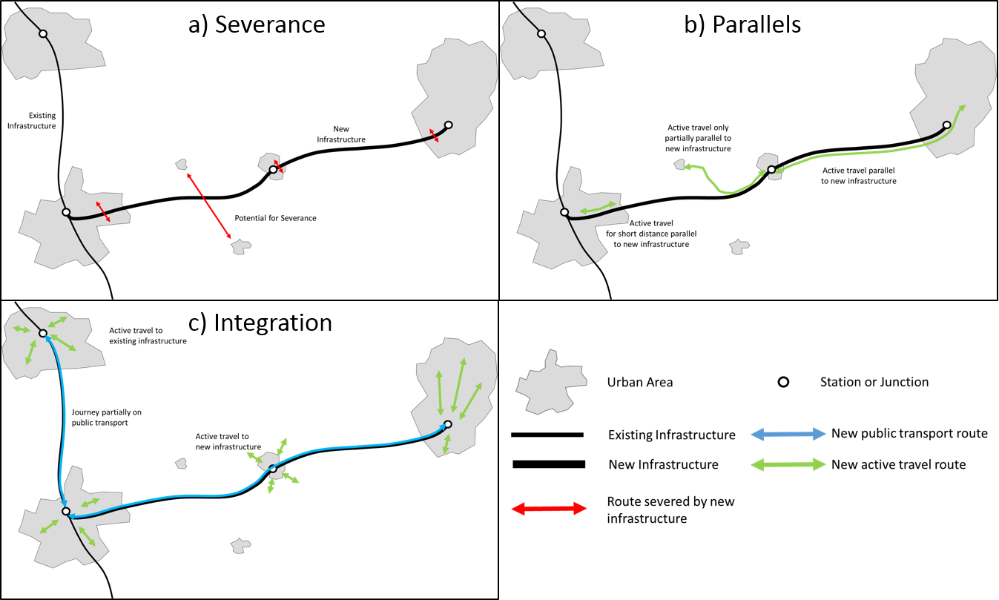
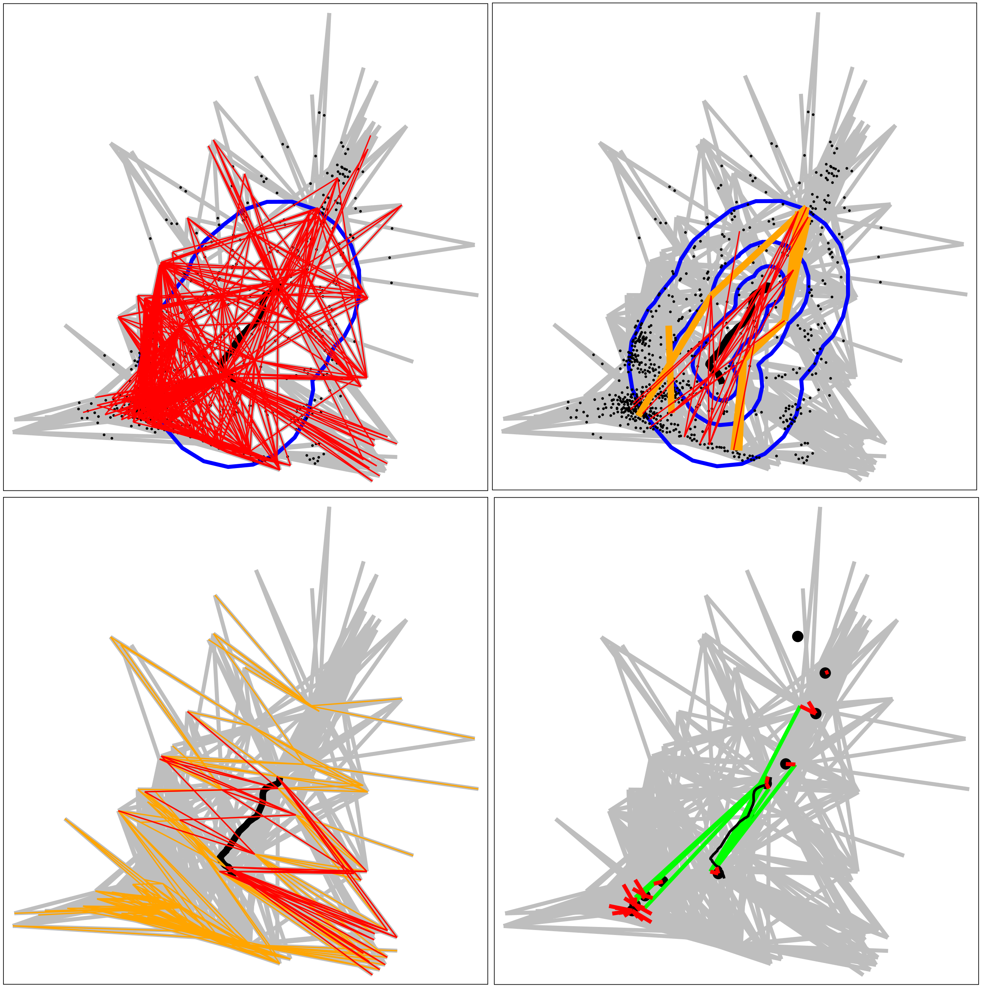
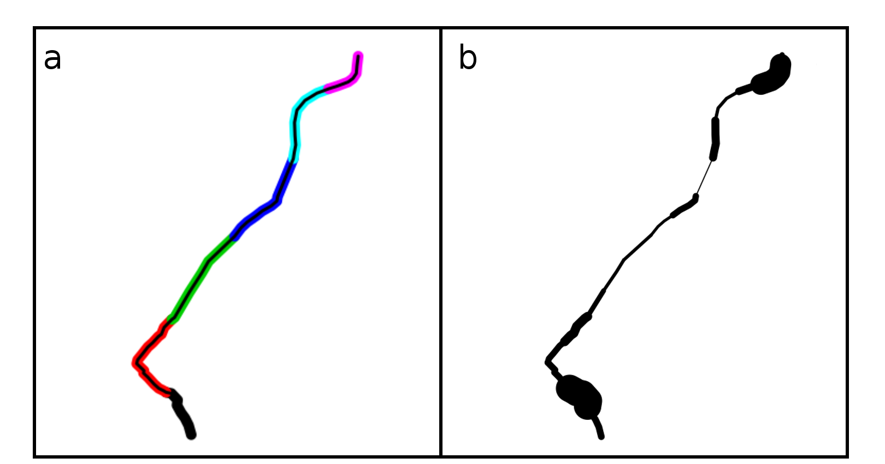
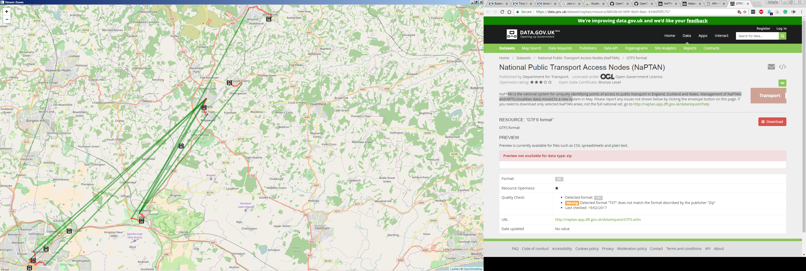

```{r setup, include=FALSE}
knitr::opts_chunk$set(echo = FALSE, warning = F, message = FALSE, fig.align = "center", fig.height = 4, options(scipen=999), out.width = "80%")
pkgs = c("sp", "tmap", "tmaptools", "rgeos", "stplanr", "dplyr")
lapply(pkgs, library, character.only = T)
```

# Abstract {-}

Major transport infrastructure projects affect many aspects of life.
This is well known and sometimes acted on, thanks in part to well-established methods in 
economic appraisal, cost-benefit analysis and environmental impact assessment.
Recently other types of assessment have emerged, including, health, equality and transport impact assessment.
<!-- This is well-documented: a growing academic literature reports methods and findings on the subject. -->
<!-- Have you seen Health impact assessment of active transportation: A systematic review (2015), it would seem to undermin your assertion http://www.sciencedirect.com/science/article/pii/S0091743515001164 -->
However, there has been relatively little work focussing explicitly on active travel impacts, despite the high potential for new schemes to affect walking and cycling and the increased policy interest in these modes of transport in recent years.
<!-- This can partly been explained by the lack of concepts, methods and precedents for estimating how new roads, railways and other projects are likely to affect walking and cycling levels. -->
Motivated by the need to ensure active travel is accounted for, this paper sets out methods for active travel impact assessment, based on three types of impact.
*Severance*, when new infrastructure cuts across routes with high active travel potential;
*parallels*, opportunities for constructing new routes parallel new infrastructure;
and *integration* with existing transport services, where new or different active travel options are unlocked by new infrastructure.
A case study of a proposed railway, between Lewes and Uckfield in Essex, UK, demonstrates the methods' real world application.
<!-- We find that the methods have the potential to identify and act on risks and opportunities associated with proposed developments down to road segment level. -->
<!-- We conclude that new methods, such as those presented in this paper, have the potential to ensure that the impacts of major infrastructure projects on walking and cycling are properly accounted for before building begins. -->

# Introduction

Major transport infrastructure projects are a major beneficiary of large-scale investment of public funding across the world. There are many reasons for this. Major projects such as new roads and railways are seen as an 'engine for growth', stimulating regional economic integration and the increased specialisation of labour, primarily through reduced travel times [@preston_economics_2013]. Secondary benefits may include the reduction of geographical inequalities [@liu_spatial_2016], a modal shift away from highly polluting modes (in the case of rail) [@dobruszkes_high-speed_2011], and improved quality of life [@jamie_montague_fischer_quality_2011].

In some cases, environmental arguments have been made for investment in transport infrastructure, despite the finding that increased transport connectivity tends to increase demand [@akerman_role_2011]. In practice, psychological and political factors may play an important role in explaining preferences for expenditure on major infrastructure in general, rather than revenue expenditure, e.g. on research and education which could boost economic growth through technological development and a more productive workforce [@flyvbjerg_policy_2005].

Regardless of the diverse motivations for transport infrastructure investment, it is clear that they have and will continue to have major impacts. 
There is a substantial body of literature dedicated to the evaluation of the impacts of transport infrastructure, which can be considered a sub-discipline in the field of transport studies in its own right.
Despite the wide range of impacts incorporated in impact assessments, and the widening of assessments to incorporate social impacts [@jones_social_2012], active travel considerations are seldom taken into account, let alone analysed quantitatively.

A recent review of impact assessment methods in the English context found that an increasingly wide range of methods and approaches were being used, including environmental impact assessment (EIA), strategic environmental assessment (SEA), health impact assessment (HIA), gender impact assessment (GIA) and equality impact assessment (EqIA) [@tajima_should_2013].
However, in that paper (and in much practitioner literature) no mention is made of potential impacts on walking and cycling, despite the well-known broad-ranging benefits of these active travel modes, that include:

- Increased life expectancy and physical well-being as a result of regular physical activity, estimated to have a major reduction of disability-adjusted life years lost due to non-communicable disease such as heart attacks [e.g. @gotschi_contrasts_2015].
- Reduced energy use and associated improvements in environmental outcomes through a modal shift away from the motor car [@lovelace_assessing_2011].
- Improved air quality through reduced dependence on motor vehicles accessing urban centres [@xia_traffic-related_2015].
- Improvements in transport equality, as people able to use pedal cycles (and electric and hand-cycles) but excluded from personal car use (e.g. by age, income or disability) become equally able to travel along active travel pathways as car drivers [@mullen_knowing_2014].

<!-- Economic, health and environmental impacts are the focus (each of which link to active travel, as discussed in the subsequent paragraphs). In parallel to such research programs, there has been growing interest from transport researchers in the impacts of major infrastructure projects on transport patterns overall (going beyond the question of utilisation of the transport service provided by the specific piece of new infrastructure). -->
<!-- *Economic impact assessment* ... -->
<!-- *Environmental impact assessment* ... -->

Of existing impact assessment approaches, HIA and TIA have the most obvious links to active travel. Even when these additional assessment exercises are undertaken, or when they are amalgamated with the wider process of Strategic Environmental Assessment (SEA) [@tajima_should_2013], active travel impacts are rarely considered, let alone quantified. This has been noted in the context of road building schemes: "there is very little empirical data on the impact of road transport interventions", aside from injury reduction estimates [@thomson_assessing_2008].

When active travel considerations are taken into account, it is often so under sub-headings of health, air pollution, and other impacts, rather than as a self-standing category of impact in its own right. @cohen_health_2014 are unusual in mentioning active travel impacts of new transport infrastructure projects, but they do so under the sub-categories of physical health, mental health, transport inequalities and road safety. Active travel is mentioned in heading, but only as a sub-sub-heading within road safety: "Active travel and (mis)perceptions of danger". @joffe_framework_2002 provide a more representative example of the HIA literature: it has no mention of walking, cycling or active travel.

There is a clear need for methods and concepts to encourage active travel impacts to be taken into account in the assessment of major infrastructure projects. At the risk of further diluting the impact assessment literature with more acronyms [see @tajima_should_2013] we tentatively refer to this aspect of impact assessment as Active Travel Impact Assessment (ATIA). Because of the scale of implications of worsening active travel conditions, health, environmental and social, we suggest that ATIA (or some alternative to it, perhaps building on the methods outlined in this paper or integrated into wider SEA) forms an integral part of future impact assessment research and applications. The remainder of this paper sets out methods for doing so and discusses the implications for major transport infrastructure plans.

<!-- ## Why is active travel omitted from IA? - commented out for now as not directly relevant -->
<!-- Active transport lies at the opposite end of the spectrum of transport investment. Interventions that increase 'walkability' and 'cyclability' are usually (but not always or necessarily) smaller, cheaper and less disruptive than major infrastructure. They are often localised. They are often the responsibility of local transport authorities, whereas major infrastructure projects are almost always overseen by national transport departments or dedicated organisations reporting directly to central government. -->
<!-- This helps explain why the active travel impacts of major transport infrastructure projects are seldom considered, despite a number of obvious overlaps. -->

"Major transport projects may promote or discourage physical activity in the form of walking and cycling", yet there has been very little quantitative *a posteriori* evaluation of past projects [@ogilvie_evaluating_2006], let alone *a priori* assessment of potential impacts. The present paper seeks to address this research and methodological gap, via geographical methods and emphasis on cycling potential.

The lack of organisational overlap between major transport infrastructure and active travel interventions helps explain why the two are seldom considered. There has been very little research into the active travel impacts of major infrastructure projects. Yet, as we shall see in the next section, major transport infrastructure has the potential to have a wide range of impacts on transport behaviour overall and levels of active travel in particular. The purpose of this paper is to create a framework for the consideration of active travel impacts of major transport infrastructure. More importantly from a practitioner perspective, it outlines and demonstrates methods for assessing these impacts and prioritising interventions that will reduce the negative impacts on walking and cycling. The most radical option to minimise the active transport impacts of building large roads and railways is not to build them at all and invest in a series of smaller walking and cycling interventions instead. Arguments for doing this are discussed in the final section.

# A typology of active transport impacts of major transport infrastructure projects

Major infrastructure can impact upon active transport in a range of different ways. To organise the assessment process, these can be categorised into three broad types of impact, as illustrated in Figure \@ref(fig:type).

```{r type, echo=FALSE, fig.cap="A typology of active travel options.", out.width="100%"}

```

<!-- *Lable indervidual diagrams ... -->

## Severance

Linear infrastructure can become a barrier to travel perpendicular to the new infrastructure, severing routes that were used before the new infrastructure was built. This is especially true for railways and motorways, which may be at a different level to the surrounding road network, and are not crossable by walkers and cyclists without dedicated crossings. Understanding where severance occurs and how many people are affected can aid in effectively planning  the construction of bridges, tunnels, and other crossings.

## Parallels
New linear infrastructure provides an opportunity to construct new footpaths and cycle paths alongside the infrastructure. The marginal cost of adding active transport routes alongside other planned infrastructure can be lower than constructing a dedicated route.  There are several different types of active transport that may take place along a parallel route:

1) People who would have used the new infrastructure choose the active travel option instead;
2) People starting or finishing a journey at a place that is near the linear infrastructure but does not have access to the infrastructure (due to a lack of station or junction). Use active travel for part of their journey to reach the nearest junction/station.
3) People taking journeys that are shorter than the gap between junctions/stations

The number of people who are affected by these scenarios will depend on the type of infrastructure, its design, and the nature of the surrounding area. By analysing parallels, it can aid in understanding if an active travel route would be useful alongside on some or all of the new linear infrastructure.

## Integration of active travel and public transport

New infrastructure can result in an increase in active travel  in nearby areas along the route. For example, a railway extension may result in more people walking or cycling in the centre of town to the local station which previously drove out of town to their destination. This effect can manifest at a substantial distance from the new infrastructure, by linking previously disconnected areas.

# Methodology

A method for assessing each of the three types of active travel impact is outlined in this section in the abstract, such that it could be applied to any linear feature of interest. Then Section 4 provides specific examples using a case study of the Lewes-Uckfield train line.

## Identifying 'parallels' to linear features

To identify parallels to linear features, a five stage methodology was developed.

- Subset cycling desire lines^[
A 'desire line' refers to a straight line connecting an origin-destination pair. In the context of this paper, which uses the outputs of the PCT version 1 as its input dataset, this means straight lines with a distance of 20 km or less connecting Middle Super Output Area population weighted centroids, with data on the number of people commuting in both directions. See @lovelace_propensity_2016 for further details.
] to include only those in which the *centre point  of the line* passes in close proximity to the new infrastructure. This was set as 10 km for this paper;
- Break the linear infrastructure of interest into segments of even distance;
- Calculate the angle of the segments and desire lines;
- Subset the desire lines again, to include only those that are within a threshold angle (set at 30 degrees) of the mean bearing of their closest rail line segment;
- Aggregate the cycling potential of all parallel lines within the threshold distance of each segment and assign the values to the route segments.

## Identifying potential 'severance points'

Severance occurs when active travel along cyclable desire lines with high cycling potential is prevented or made more difficult by obstacles such as rivers, fast roads or railway tracks. A degree of severance can be expected along the full length of linear features, as most desire lines have at least some cycling potential. However, the degree of severance will be greatest in certain *severance pinch points* (henceforth referred to as severance points), for example, points along a rail track which intersects desire lines connecting residential areas with employment zones on the other side.

The methodology used to identify these severance points consists of three stages:

- Identify the desire lines which intersect with the infrastructure;
- Quantify the number of potential cyclists blocked along segments of the infrastructure of even length;
- Subset the segments which block the highest number of potential cyclists and identify potential crossing points;

Note that based on the three-stage methodology outlined above, severance points are in fact more precisely described as 'severance segments', along which a range of points could be chosen for crossing points. However, the term 'severance point' is more intuitive, so we use this term throughout.

## Identifying integrated travel to public transport

Increased travel to public transport is likely to occur near public transport stops and on desire lines that have an origin and destination near connected public transport stops.

The methodology used to identify these severance points consists of six stages:

- Subset desire lines that have both and origin and destination within three kilometres of a station/stop;
- Remove lines that have the same stop as their closest origin and destination;
- Remove lines which are linked by existing public transport, thus will not change with the new linear infrastructure;
- Create new desire lines and routes that are from Origin/Destinations to public transport;
- Remove desire lines and routes where the cycling to and from public transport is greater than 1.1 times the direct cycling route, as these travellers are unlikely to use public transport;
- Calculate change in cycling potential along these new desire lines.

This method makes a number of simplifying assumptions that may or may not be valid depending on the nature of the new linear infrastructure.  Firstly, the method is ignorant of the public transport network and so assumes that travel between any pair of stops is possible and practical.  If this were not the case, it would be necessary to break the analysis into connected parts and analyse each part of the networks separately.  Secondly, the method is not aware of financial and time costs associated with public transport. While the method can identify routes that are likely to be quicker to take a combined active travel and public transport journey than merely active travel directly, it does not consider the relative difference with driving directly. Therefore, care should be taken when assigning cyclist to these new routes.  Finally, the method does not consider the proportion of walking and cycling to and from the public transport stop.  This is likely to be affected by a range of variables such as distance and the ability to take a bike on public transport. 

# A case study of Lewes-Uckfield

The Lewes-Uckfield train line is a proposed project to restore a rail link between Uckfield and Lewes. This is part of wider plans to increase rail capacity in the area. As stated in the project brief, "Such infrastructure has the potential to support cycling if high-quality infrastructure is built alongside." This appendix analyses cycling potential along the proposed route, which is 16 km in length (see Figure \@ref(fig:lc)).

Data on existing an potential future travel active travel patters was taken from the Propencity to CYcle Tool  @lovelace_propensity_2016. The data represents commuter travel between zones created for the 2011 census. These zones are known as Middle layer Super Ouput Areas (MSOA), and the population weighted centroids of each MSOA are used as the origin and destinations in this analysis.

<!-- # Cycling potential surrounding the Lewes-Uckfield trainline -->

```{r, echo=FALSE, warning=FALSE}
# # Basic stats on Lewes-Uckfield route
lewes_uckfield = readRDS("input-data/lewes_uckfield.Rds")
lewes_uckfield_osgb = spTransform(lewes_uckfield, CRS("+init=epsg:27700"))
# gLength(lewes_uckfield_osgb) / 1000
# z = readRDS("../pct-bigdata/ukmsoas-scenarios.Rds")
# l = readRDS("../pct-bigdata/pct_lines_oneway_shapes.Rds")
# l$`Percent cycling` = l$bicycle / l$all * 100
# cents = geojsonio::geojson_read("../pct-bigdata/cents-scenarios.geojson", what = "sp")
# 
# # names(cents)
# # Generate and save objects specific to the project (to save loading large datasets)
# buff = buff_geo(lewes_uckfield, width = 10000)
# proj4string(cents) = proj4string(lewes_uckfield)
# cents_lc = cents[buff,]
# z_lc = z[cents_lc,]
# l_lc = l[buff,]
# save(buff, cents_lc, z_lc, l_lc, file = "input-data/lewes_uckfield_objects.Rdata")
load("input-data/lewes_uckfield_objects.Rdata")
# plot(cents_lc)
# sum(cents_lc$all)
```

There are `r nrow(cents_lc)` MSOAs whose population weighted centroids lie within a 10 km buffer of the train line, representing `r sum(cents_lc$all)` commuters. This area is illustrated in Figure \@ref(fig:lc).

```{r lc, fig.cap="Overview of the Lewes-Uckfield line with a 10 km buffer (blue). Width is proportional to the number of commutes; colour represents the proportion of people who cycle.", out.width="70%"}
# osm_tiles = read_osm(bb(z_lc, 1.05), type = "stamen-toner")
# saveRDS(osm_tiles, "data-sources/osm_tiles_ukfield.Rds")
osm_tiles = readRDS("data-sources/osm_tiles_ukfield.Rds")
qtm(osm_tiles) +
  tm_shape(buff) + tm_borders(col = "blue", lwd = 3) +
  tm_shape(l_lc) + tm_lines(lwd = "all", scale = 20, col = "Percent cycling", alpha = 0.5, n = 5, breaks = 2^(-1:4),
                              palette = "Spectral", auto.palette.mapping = F, ) +
  tm_shape(lewes_uckfield) + tm_lines(lwd = 5, col = "black") 
# knitr::include_graphics("figures/lewes-uckfield-overview.png")
```

The total number of single-stage commuters that pass through the buffer is higher: `r sum(l_lc$all)` commuters. As Figure \@ref(fig:lc) illustrates, however, many of these commuters are not travelling parallel to the train line.
The majority of desire lines intersecting the buffer are between Brighton (see the high density of flows in the far south-west of Figure \@ref(fig:lc)) and its surrounding settlements.
Only a few hundred commuters pass directly parallel to the route, mostly of medium distance from 10 to 20 km (route distance) between MSOAs in Lewes, Ringmer, and Uckfield. This implies that cycle paths running parallel to the train line itself have relatively low commuter cycling potential.

## Cycling potential parallel to the route

```{r gendata, echo=FALSE}
# centre point subsetting
l_cp = gprojected(l_lc, fun = maptools::SpatialLinesMidPoints)
sel_centrepoint = rgeos::gContains(buff, l_cp, byid = T)[,1]

# Line bearing code
l_a = line_bearing(lewes_uckfield)
a = angle_diff(l = l_lc, angle = l_a, bidirectional = TRUE)
sel_para = a < 30

# Parallel subsetting
buff7 = buff_geo(lewes_uckfield, width = 5000)
buff_small = buff_geo(lewes_uckfield, width = 2000)
sel_centrepoint5 = rgeos::gContains(buff7, l_cp, byid = T)[,1]
sel_smallbuff = !is.na(over(l_lc, buff_small))
sel_finalpar = sel_para & sel_centrepoint5 & sel_smallbuff
l_lc$`Parallel selection` = sel_finalpar
l_lc$`Touching buffer` = TRUE

# Perpendicular lines
# l_seg = line_segment(lewes_uckfield, segment_length = 1000)
# saveRDS(l_seg, "data-sources/l_seg.Rds")
l_seg = readRDS("data-sources/l_seg.Rds")
l_lc$Perpendicular = a > 60
sel_intersects = over(l_lc, l_seg)
l_lc$`Perpendicular selection` = !is.na(sel_intersects[,1]) & a > 60
l_agg = aggregate(l_lc["govtarget_slc"], l_seg, FUN = sum)
```

### Subsetting desire lines by centre point proximity

```{r centre points, fig.cap="Illustration of the 'line centre point' subsetting method.", eval=FALSE}
  tm_shape(l_lc) + tm_lines(col = "grey", lwd = 3) +
tm_shape(buff) + tm_borders(col = "blue", lwd = 3) +
  tm_shape(lewes_uckfield) + tm_lines(lwd = 5, col = "black") +
  tm_shape(l_cp) + tm_dots() +
  tm_shape(l_lc[sel_centre point,]) + tm_lines()
```

The centre points of the desire lines intersecting with the Lewes-Uckfield route buffer are presented in Figure \@ref(fig:metafigure)a.
These represent `r round(sum(sel_centrepoint)/length(sel_centrepoint) * 100, 1)`% of the desire lines in the study area, defined by the 10 km buffer.

```{r metafigure, echo=FALSE, fig.cap="The centre point-buffer (a), parallel (b), perpendicular (c) and station access (d) methods of subsetting desire lines affected by the new rail line. In all figures, the subsetted lines are plotted in red. In (b) the updated parallel desire lines, whose centre points lie within 5 km of the route, are illustrated in orange."}

```

### Break the train line into segments

Because the Lewes-Uckfield line is short and relatively straight, we used the entire line as a single segment.
However, if the line were to be broken into segments, the results would resemble Figure \@ref(fig:segs)a. This demonstration of the method could be applied to larger and more complex routes, e.g. that of the proposed HS2 or HS2 cycle network route.

<!-- 
```{r segments, fig.cap="Demonstration of the method for splitting the route into segments (a) ", out.height="7cm", eval=FALSE}
knitr::include_graphics("figures/lewes-uckfield-segments.png")
```
-->

```{r segs, fig.cap="Illustration of the method of splitting the route into discrete segments using the line segment function from the stplanr R package (a) and cycling potential (under the Government Target scenario) severed by the proposed rail line (b), in which line width is proportional to the square root of cycling potential severed.", echo=FALSE}

```


### Calculate the angle of the train routes

The angle of the train track was calculated by a function `line_bearing()` which was developed for the **stplanr** R package specifically to solve this problem.

Using this function, the angle of the route was calculated as follows:

```{r, echo=TRUE}
line_bearing(lewes_uckfield)
```

### Subsetting desire lines parallel with the train line

To find the lines that were close to parallel with the train line, the function `angle_diff()` was developed. All lines within 30 degrees, clockwise or anti-clockwise, to the train line, *and* have their midpoint within the route buffer, are illustrated in the red lines in Figure \@ref(fig:metafigure)b. It is clear from this Figure that a high number of lines were selected which are very unlikely benefit from cycling provision along the route, especially in the south-west segment of the plot. 

```{r para, fig.cap="Illustration of the paralell lines subsettting method", eval=FALSE}
tm_shape(l_lc) + tm_lines(col = "grey", lwd = 3) +
tm_shape(buff) + tm_borders(col = "blue", lwd = 3) +
  tm_shape(lewes_uckfield) + tm_lines(lwd = 5, col = "black") +
  tm_shape(l_cp) + tm_dots() +
  tm_shape(l_lc[sel_para & sel_centre point,]) + tm_lines()
```

To resolve this issue, a smaller buffer was used to select line centre points. This was set at 5 km.
To remove desire lines that were still far from the train line a further subsetting method was developed.
This involved selecting desire lines that pass within an even shorter distance to the train line, 2 km in this case.
The results are presented in Figure Figure \@ref(fig:metafigure)b, in which
the orange lines were included through the centre point selection method but omitted by 'buffer intersection' method.

```{r paranew, fig.cap="Updated 'parallel' desire lines, whose centre-points lie within 5 km of the proposed route (orange) and passes within 2 km of the train line (red). The red lines represent the lines selected through this method.", eval=FALSE}
tm_shape(l_lc) + tm_lines(col = "grey", lwd = 3) +
tm_shape(buff) + tm_borders(col = "blue", lwd = 3) +
tm_shape(buff7) + tm_borders(col = "blue", lwd = 3) +
tm_shape(buff_small) + tm_borders(col = "blue", lwd = 3) +
  tm_shape(lewes_uckfield) + tm_lines(lwd = 5, col = "black") +
  tm_shape(l_cp) + tm_dots() +
  tm_shape(l_lc[sel_para & sel_centre point5 & !sel_smallbuff,]) + tm_lines(col = "orange", lwd = 5) +
  tm_shape(l_lc[sel_finalpar,]) + tm_lines()
```

From the subset of the lines highlighted in red in Figure \@ref(fig:metafigure)b, we can now report summary statistics on the cycling potential of commuter desire lines which run parallel to the Lewes-Uckfield route. These results are presented alongside the equivalent statistics for *all* desire lines which intersect the 10 km buffer surrounding the proposed route.

## The potential for severance along the proposed route

### Subsetting 'perpendicular' desire lines

The subsetting process involved finding which lines ran perpendicular to the proposed rail line and then selecting only those intersecting with it, as illustrated in Figure \@ref(fig:metafigure)c.

```{r perpsel, fig.cap="'Perpendicular' desire lines intersecting with the proposed rail line. Orange lines are within 30 degrees from perpendicular to the proposed train line, red lines are both close to perpendicular to the line and intersect with the rail line.", eval=FALSE}
tm_shape(l_lc) + tm_lines(col = "grey", lwd = 3) +
  tm_shape(lewes_uckfield) + tm_lines(lwd = 5, col = "black") +
  tm_shape(l_lc[a > 60,]) + tm_lines(col = "orange") +
  tm_shape(l_lc[l_lc$`Perpendicular selection`,]) + tm_lines()
```

### Quantifying severance per segments of the train line

The cycling potential of the intersecting 'perpendicular' lines was then summed *per 1 km segment* of the rail line. The results, for the Government Target scenario, are presented in \@ref(fig:segs)b which shows, as one would expect, that severance impacts would be greatest at the ends of the proposed route, where population densities and employment opportunities are greatest.

```{r perpagg, fig.cap="Total cycling potential (under the Government Target scenario) 'severed' by the proposed rail line. Line width is proportional to the square root of the total cycling potential for each segment.", fig.height=5, eval=FALSE}
plot(l_agg, lwd = sqrt(l_agg$govtarget_slc) * 2)
```

### Identifying potential crossing points

From Figure \@ref(fig:segs)b it is clear that the points of highest potential severance lie at either end of the line. Overall, because the proposed line does not separate any large settlements or workplaces, the potential for severance is low. However, to demonstrate the method of identifying places to intervene to minimise severance, Figure \@ref(fig:perpmost) illustrates the 1 km segment of the proposed line with the highest potential for severance in context. This is clearly in a populated part of Lewes, where travel between both sides of the new line could be affected by the route. 

```{r perpmost, fig.cap="The 1 km segment on the proposed rail line with the highest level of severance in cycling potential, under the Government Target scenario."}
l_most = l_agg[which.max(l_agg$govtarget_slc),]
osm_tiles_most = read_osm(bb(l_most, 4))
tm_shape(osm_tiles_most) + tm_raster() +
  tm_shape(l_most) + tm_lines(lwd = 10) +
  tm_shape(lewes_uckfield) + tm_lines(lwd = 2, col = "black") 
```

## Cycling to Public Transport

Beyond direct impacts of the proposed scheme on cycling potential, associated with desire lines in parallel with and crossing perpendicular to the railway, there are indirect impacts created by the potential to cycle to the stations. Because the proposed rail stations are located in areas of high population density, this could generate new cycle trips when they are taken as part of a multi-stage trip (e.g. cycle to the rail station, catch the train towards work, walk from the 'activity end' rail station to work).

Analysis of the OD data in relation to proposed rail station locations suggests that relatively few desire lines, representing 2351 commuters, currently commute between areas served by the new rail stations, within a 3 km buffer (see \@ref(fig:metafigure)d).
The main beneficiaries in the local area would be people north of Uckfield commuting to Lewes and vice versa.  Desire lines between Lewes and Brighton can use the existing railway, while there are no desire lines between Brighton and North of Uckfield. The lack of desire lines likely reflects the current transport network's lack of connectivity between Lewes and Uckfield.  
Changes in travel patterns caused by new rail links are beyond the scope of this paper. However, the method outlined above could be combined with existing techniques to understand the mode shift to rail, and thus predict any cycling increase resulting from a change in rail connectivity.

## Results

Based on the methods presented in the previous sections summary statistics for each of the desire line subsets, based on parallels and severed routes, can be compared with all desire lines in the study area. These are presented in the tables below.
Table 1 contains summary statistics on the total number, car dominance and level and cycling for each subset.
Table 2 contains scenario-specific estimates of cycling potential for each of the desire line subsets.

```{r}
lines_subset = c("Touching buffer", "Parallel selection", "Perpendicular selection")
sc_name_df <- data_frame(
  sc_f_name = c("Census 2011:", "Government Target:", "Gender equality:", "Go Dutch:", "Ebikes:"),
  sc_s_name = c("olc","govtarget","gendereq","dutch", "ebike")
)
l_lc$olc_slc = l_lc$bicycle 
scens = paste0(sc_name_df[[2]], "_slc")
res = NULL
for(j in 1:length(scens)){
  res_p = data.frame()
  for(i in lines_subset){
    l_lc$slc = l_lc[[scens[j]]]
    df_tmp = l_lc@data[l_lc@data[[i]],]
    res_p = rbind(res_p, summarise(df_tmp,
                      `N. commuters` = sum(all),
                      `N. cycling` = round(sum(slc)),
                      `% cycling` = sum(slc) / sum(all) * 100,
                      `Distance (km, Euclidean)` = mean(dist)
    ))
  }
  row.names(res_p) = paste(sc_name_df$sc_f_name[j], lines_subset)
  res = rbind(res, res_p)
}
# saveRDS(res, "input-data/res.Rds") # without stations data
res = readRDS("input-data/res.Rds")
res_stations = readRDS("input-data/res_stns.Rds")
# sel_res = grepl(pattern = "11|Gov", rownames(res))
# res_sub = res[sel_res,]
res_sub = rbind(res[1:3,], res_stations[1,], res[4:6,], res_stations[2,])
names_scens = c(gsub(pattern = "Census 2011: ", replacement = "", row.names(res_sub[1:3,])),
                "Cycling to stations")
names_scens = c("Baseline", names_scens, "Scenario", names_scens)
res_sub[2:4] = apply(res_sub[2:4], 2, round, 1)
empty_string = rep("", ncol(res_sub))
res_sub = rbind(empty_string, res_sub[1:4,], empty_string, res_sub[5:8,])
res_sub = cbind(Scenario = names_scens, res_sub)
knitr::kable(res_sub, digits = 1, caption = "Current and potential future cycle commuters who may be affected by the proposed rail line, under baseline and future scenarios (based on the 2011 Census and a doubline in cycling potential) for the three types of affected desire lines plus all desire lines in the vecinity (touching the 10 km buffer) surrounding the proposed route.", row.names = F)
```

Overall the potential for cycling along routes parallel to the track appears to be somewhat greater than the cycling potential of 'severed' routes.

## Cycling potential around the proposed route

Under the ambitious Ebike scenario, the PCT shows that cycling potential along routes running parallel to the line is uneven geographically. Unsurprisingly, cycling potential is clustered at either end of the proposed route, with relatively high increases modelled along segments of the network between Lewes and Ringmer, along the A26 and along routes running north-south through Uckfield. This is shown in Figure \@ref(fig:pct-uck).

```{r pct-uck, fig.cap="Cycling potential (red lines) along the transport network between Lewes and Uckfield, under the Ebike scenario of the Propensity to Cycle Tool (see [pct.bike/east-sussex/](http://pct.bike/east-sussex/)).", fig.height=7}
# knitr::include_graphics("figures/lewes-uckfield-pct-ebike.png")
osm_tiles_local = read_osm(bb(buff))
rnet = readRDS("../pct-data/east-sussex/rnet.Rds")
rnet = rnet[buff,]
tm_shape(osm_tiles_local) + tm_raster() +
tm_shape(buff) + tm_borders(col = "blue", lwd = 3) +
  tm_shape(rnet) + tm_lines(col = "red", lwd = "ebike_slc", scale = 20) +
  tm_shape(lewes_uckfield) + tm_lines(lwd = 2, col = "black") 
```

## Potential for integation with public transport network
The first stage in identifying people who may use active travel to reach a station is to identify those who wish to travel between two stations. This is done by selecting desire lines, which have both origin and destination within 3km of a station.  From this subset of desire lines, any which have the same station as the closest to both origin and destination are excluded. Finally, lines between stations that are already connected by the existing rail network are removed, as these routes will not be changed by the new Lewes-Uckfield Line, thus travel patterns in these areas are likely to remain the same.

Having identified the desire lines and their corresponding stations, it is possible to calculate routes from each origin/destination to the nearest station.  In this case, the cyclestreets.net routing algorithm was used.
The results of the sub-setting and routing are show in \@ref(fig:segs)d, eight desire lines were identified (green) representing 574 commuters.  Their associated active travel routes are shown in red.  Calculating the increase in active travellers along these routes would be dependent on the number of commuters switching to the new railway after it was constructed.  However, even without a precise quantification the mode shift, the method highlights which areas may have increased active travel.
It is notable that in \@ref(fig:segs)d not every station has an associated active travel route, this is because the new railway would not affect travel options evenly.

```{r stns, echo=FALSE, fig.cap="The potential for active travel to stations on the route network (red lines) and [", out.width= "60%"}

```

```{r stnsin, echo=FALSE, eval=FALSE}
l2stat = readRDS("input-data/l2stat.Rds")
r2stat = readRDS("input-data/routes2station.Rds")
l_short = readRDS("input-data/l_short.Rds")
stops = readRDS("input-data/stops.Rds")
tm_shape(l_lc) + tm_lines(col = "grey", lwd = 3) +
  tm_shape(stops) + tm_bubbles(col = "black", size = 0.2) +
  tm_shape(l_short) + tm_lines(lwd = 3, col = "green") +
  tm_shape(lewes_uckfield) + tm_lines(lwd = 2, col = "black") +
  tm_shape(l2stat) + tm_lines(lwd = 3) 
```


\newpage


# Discussion

In terms of the local case study, it seems there is greater potential parallel to the proposed route than perpendicular to it, indicating the risks of community severance for cycling uptake are likely to be lower than the potential for cycling uptake along lines parallel to the route. 

In total, we estimate that around 2500 commuters make trips that are parallel to the line, of whom 1.1% currently cycle (N=28). We further estimate that under a Go Dutch scenario the proportion of these commuter cycling would be 6.1% (N=158), while under the Ebike scenario it would be 15.4% (N=397).  The Go Dutch and Ebike scenarios assume that English commuters acquire a Dutch cycling culture and Dutch levels of infrastructure: a high quality, traffic-free cycle route along the Lewes-Uckfield train line could be a useful step towards achieving Dutch infrastructure, although it should be remembered that the impact of the cycle path might also depend on the quality of the surrounding cycle network.  It should also be remembered that this analysis only examines commuter cycling; adding in cycling potential for other cycling types, e.g. leisure cycling, might generate considerably higher estimates as to the number of users.

The proposed method raises questions about policy priorities related to mode choice: in cases where there is potential for improving of walking, cycling and public transport, which are favoured?

The methods outlined in this paper have the potential to be used in situations beyond the assessment of new infrastructure. For example, in places where there are linear features that are conducive to conversion into walking and cycling paths such as disused railway lines, roads,or along privately owned routes. The methods outlines above could be used to decide along which parts of these features investments should be prioritised.

It is in terms of the methods for quantifying the potential for desire lines parallel and perpendicular to proposed routes that this report will probably be of most use, as the basis for further work. The Lewes-Uckfield line has served a useful purpose in this regard, as the case study is small enough to identify specific desire lines of interest and explore the methodology on local datasets that are not overwhelmingly large. The work provides many interesting avenues for further development and research, including:

- The estimation of angles on a *per segment* basis, rather than simply for the whole route.
- The automation of the analysis of 'parallels' and 'severance points' by creating functions which take desire lines and a proposed route as inputs and output the results with a single command. This could potentially be implemented in the R package **stplanr**.
- The extension of the method to quantify the level of overlap between proposed cycle networks and a series of desire lines or a route network.

#Conclusions


#Acknowledgements

Thanks to Matthew Whittle who digitised a scanned image of the proposed route.

# References


<!-- ## The impacts of high-speed rail on cycling in the UK -->

<!-- To assess the potential benefits of new crossings for cycling uptake during and after construction of HS2, the method was applied to geographical data about the route and current travel patterns surrounding it. The first stage was to identify all commutes that could potentially be directly affected by the HS2 infrastructure, by selecting all commuter desire lines that pass anywhere within a 20 km buffer. This is illustrated in Figure xx. -->

<!-- ```{r} -->
<!-- hs2 = readRDS("input-data/hs2.Rds") -->
<!-- l = readRDS("input-data/l_mini.Rds") -->
<!-- proj4string(hs2) = proj4string(l) -->
<!-- hs2_buf20 = stplanr::buff_geo(hs2, 20000) -->
<!-- # l = readRDS("../pct-bigdata/pct_lines_oneway_shapes.Rds") -->
<!-- l_sev = l[hs2,] -->
<!-- l_sam = l[sample(nrow(l), 1000),] # work with sample (comment for all) -->
<!-- # osm_tiles = read_osm(bb(hs2, ext = 1.2)) -->
<!-- # saveRDS(osm_tiles, "input-data/osm_tiles_hs2.Rds") -->
<!-- l_buf = l[hs2_buf20,] -->
<!-- osm_tiles = readRDS("input-data/osm_tiles_hs2.Rds") -->
<!-- qtm(osm_tiles) + -->
<!--   qtm(l_buf, line.col = "blue") + -->
<!--   qtm(hs2, line.col = "black", line.lwd = 3) + -->
<!--   tm_shape(hs2_buf20) + -->
<!--   tm_borders(lwd = 4) -->
<!-- # select lines that cross the route -->

<!-- ``` -->

<!-- ###  Cycling potential along the the HS2 route -->

<!-- The section between Sheffield and Rotherham, for example, has relatively high cycling potential. -->

<!-- Ideas: -->
<!-- Use a regression model of distance to transport infrastructure to estimate deterrence of motorways - and therefore how it could be mitigated. Outliers with high cycling relative to road proximity could show how to mitigate negative impact. -->
