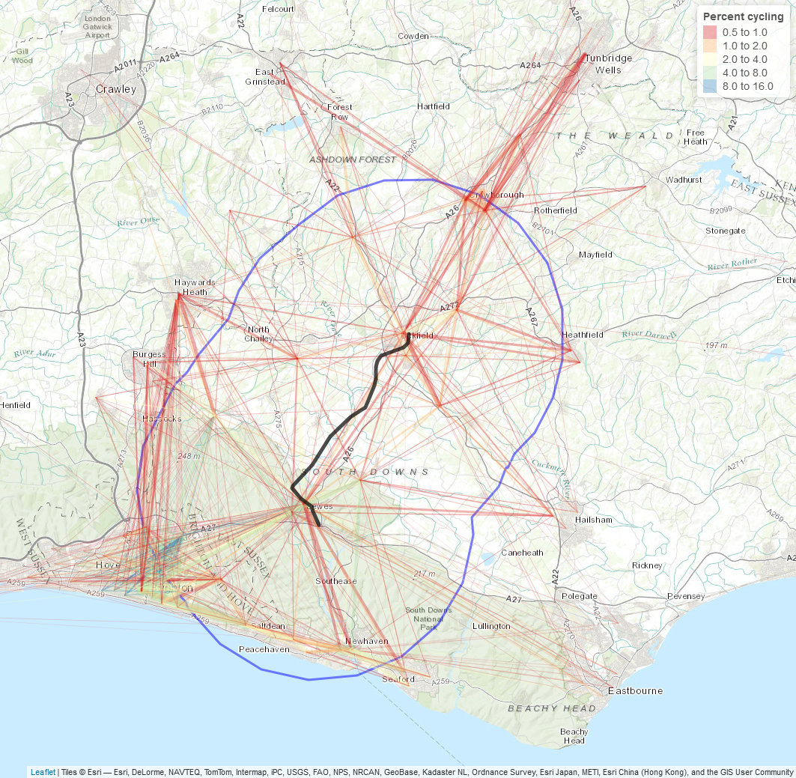
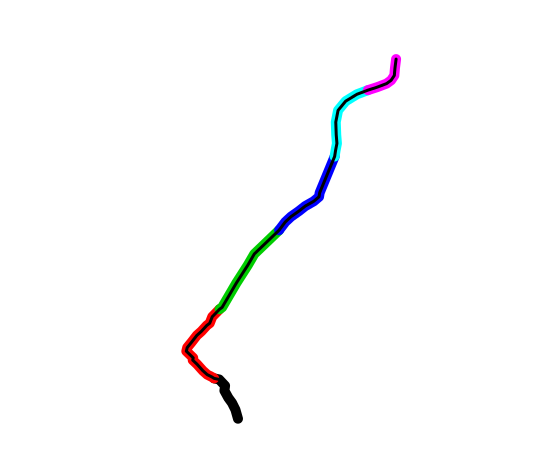
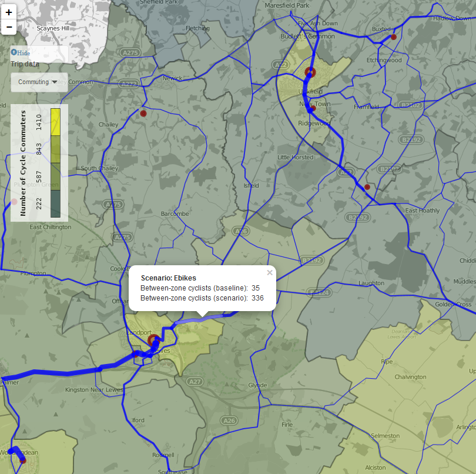

```{r setup, include=FALSE}
knitr::opts_chunk$set(echo = FALSE, warning = F, message = FALSE)
pkgs = c("sp", "tmap", "rgeos", "stplanr", "dplyr")
lapply(pkgs, library, character.only = T)
```

# Introduction

## Rail-related deliverables in the PCT project

Deliverables 5.1, 5.2 and 5.3 in Phase II of the Propensity to Cycle Tool (PCT) project are related to the interaction between cycling and rail.
They are as follows:

- Task 5.1 Modify the PCT methodology to identify ‘parallels’ and ‘severance points’.  Deliverable is a short report, by 30 September 2016.
- Task 5.2 Roll-out of a version of the PCT to highlight cycling opportunities raised by the planned 'High Speed II' (HS2) railway construction project.  Deliverable is a short report, by 30 November 2016.
- Task 5.3 Case study of new railway line in Sussex: 30 September 2016.  Deliverable is a short report, by 30 September 2016.

This document represents the delivery of Tasks 5.1 and 5.3 from the above list and will be used as a foundation to deliver Task 5.2.

In the contract deliverable 5.2 is described as looking at cycling opportunities along the *route of the HS2 train line*. However subsequent discussions with DfT staff (Shane Snow) have indicated that it is the cycling potential around the *proposed cycle path* surrounding HS2 that is of most interest. It has therefore been agreed that 5.3 will analyse the cycling potential in the wider area covered by the proposed path, rather than just the route of the HS2 train line. Because this new piece of work is more challenging, it has further been agreed that, rather than a full quantitative analysis of the cycling potential along every segment of the entire cycle path, the analysis associated with 5.2 will focus on overlaying the proposed cycling network surrounding HS2 with estimates of cycling potential from the PCT.
The aim of this modified deliverable 5.2 is to provide an evidence base for investing in and potentially modifying the proposed cycle path surrounding the HS2.

This report, however, focusses exclusively on the much smaller area surrounded by the proposed Lewes-Uckfield rail route.

# Methodology

## Identifying 'parallels' to linear features

To identify parallels to linear features, a 5 stage methodology was developed. Although this is described below in relation to the Lewes-Uckfield train line, it could be applied to any linear feature of interest:

- Subset cycling desire lines^[
A 'desire line' refers to a straight line connecting an origin-destination pair. In the context of this report, which uses the outputs of the PCT version 1 as its input dataset, this means straight lines with a distance of 20 km or less connecting Middle Super Output Area population weighted centroids, with data on the number of people commuting in both directions. See @lovelace_propensity_2016 for further details.
] to include only those in which the *centrepoint  of the line* passes in close proximity to the train line. This was set as 10 km for this report.
- Break the train line of interest into segments of even distance
- Calculate the angle of the segments of the train line segments and desire lines
- Subset the desire lines again, to include only those that are within a threshold angle (set at 30 degrees) of the mean bearing of their closes rail line segment
- Aggregate the cycling potential of all parallel lines within the threshold distance of each segment and assign the values to the route segments.

## Identifying potential 'severance points'

Severance occurs when active travel along cyclable desire lines with high cycling potential is prevented or made more difficult by obstacles such as rivers, fast roads or railway tracks. A degree of severance can be expected along the full length of linear features, as most desire lines have at least some cycling potential. However, the degree of severance will be greatest in certain *severance pinch points* (henceforth referred to as severance points), for example points along a rail track which intersect desire lines connecting residential areas with employment zones on the other side.

The methodology used to identify these severance points consists of 3 stages:

- Identify the desire lines which intersect with the train line
- Quantify the number of potential cyclists blocked along segments of the train line of even length
- Subset the segments which block the highest number of potential cyclists and identify potential crossing points

Note that based on the three-stage methodology outlined above severance points are in fact more precisely described as 'severance segments', along which a range of points could be chosen for crossing points. However, the term 'severance point' is more intuitive so we use this term throughout.

# A case study of Lewes-Uckfield

The Lewes-Uckfield train line is a proposed project to restore a rail link between Uckfield and Lewes. This is part of wider plans to increase rail capacity in the area. As stated in the project brief, "Such infrastructure has the potential to support cycling if high quality infrastructure is built alongside." This appendix analyses cycling potential along the proposed route, which is 16 km in length (see Figure \@ref(fig:lc)).

<!-- # Cycling potential surrounding the Lewes-Uckfield trainline -->

```{r, echo=FALSE, warning=FALSE}
# # Basic stats on Lewes-Uckfield route
lewes_uckfield = readRDS("input-data/lewes_uckfield.Rds")
lewes_uckfield_osgb = spTransform(lewes_uckfield, CRS("+init=epsg:27700"))
# gLength(lewes_uckfield_osgb) / 1000
# z = readRDS("../pct-bigdata/ukmsoas-scenarios.Rds")
# l = readRDS("../pct-bigdata/pct_lines_oneway_shapes.Rds")
# l$`Percent cycling` = l$bicycle / l$all * 100
# cents = geojsonio::geojson_read("../pct-bigdata/cents-scenarios.geojson", what = "sp")
# 
# # names(cents)
# # Generate and save objects specific to the project (to save loading large datasets)
# buff = buff_geo(lewes_uckfield, width = 10000)
# proj4string(cents) = proj4string(lewes_uckfield)
# cents_lc = cents[buff,]
# z_lc = z[cents_lc,]
# l_lc = l[buff,]
# save(buff, cents_lc, z_lc, l_lc, file = "input-data/lewes_uckfield_objects.Rdata")
load("input-data/lewes_uckfield_objects.Rdata")
# plot(cents_lc)
# sum(cents_lc$all)
```

## Current travel patterns

There are `r nrow(cents_lc)` MSOAs whose population weighted centroids lie within a 10 km buffer of the train line, representing `r sum(cents_lc$all)` commuters. This area is illustrated in Figure \@ref(fig:lc).

```{r lc, fig.cap="Overview of the Lewes-Uckfiled line with a 10 km buffer (blue). Width is proportional to the number of commutes, colour represents the proportion of people who cycle. Thanks to Matthew Whittle who digitised a scanned image of the proposed route."}
# osm_tiles = read_osm(bb(z_lc, 1.05), type = "stamen-toner")
# saveRDS(osm_tiles, "data-sources/osm_tiles_ukfield.Rds")
osm_tiles = readRDS("data-sources/osm_tiles_ukfield.Rds")
qtm(osm_tiles) +
  tm_shape(buff) + tm_borders(col = "blue", lwd = 3) +
  tm_shape(l_lc) + tm_lines(lwd = "all", scale = 20, col = "Percent cycling", alpha = 0.5, n = 5, breaks = 2^(-1:4),
                              palette = "Spectral", auto.palette.mapping = F, ) +
  tm_shape(lewes_uckfield) + tm_lines(lwd = 5, col = "black") 
# 
```

The total number of single-stage commutes that pass through the buffer is higher: `r sum(l_lc$all) / 1000` thousand commuters. As Figure \@ref(fig:lc) illustrates, many of these commuters would not interact with the train line, as they are focused on commutes between Brighton and surrounding settlements in the far southeast of the 20 km buffer. Only a few hundred commutes pass directly parallel to the route, mostly due to 10 to 20 km (route distance) commutes between MSOAs in Lewes, Ringmer and Uckfield. This implies that cycle paths running parallel to the train line itself have quite low commuter cycling potential. The next section analyses this potential in more detail.

## Cycling potential parallel to the route

### Subsetting desire lines by centrepoint proximity

The centrepoints of the desire lines intersecting with the Lewes-Uckfield route buffer are presented in figure \@ref(fig:centrepoints).
These represent `r round(sum(sel_centrepoint)/length(sel_centrepoint) * 100, 1)`% of the desire lines in the study area, defined by the 10 km buffer.

```{r centrepoints, fig.cap="Illustration of the 'line centrepoint' subsetting phase"}
l_cp = gprojected(l_lc, fun = maptools::SpatialLinesMidPoints)
sel_centrepoint = rgeos::gContains(buff, l_cp, byid = T)[,1]

  tm_shape(l_lc) + tm_lines(col = "grey", lwd = 3) +
tm_shape(buff) + tm_borders(col = "blue", lwd = 3) +
  tm_shape(lewes_uckfield) + tm_lines(lwd = 5, col = "black") +
  tm_shape(l_cp) + tm_dots() +
  tm_shape(l_lc[sel_centrepoint,]) + tm_lines()
```

### Break the train line into segments

Because the Lewes-Uckfield line is short, we used the entire line as a single segment.
However, if the line were to be broken into segements, the results would resemble figure \@ref(fig:segments).

```{r segments, fig.cap="Demonstration of the method for splitting the route into segments."}

```

This demonstration of method could be applied to larger and more complex routes, e.g. that of the proposed HS2 or HS2 cycle network route.

### Calculate the angle of the train routes

The angle of the train track was calculated by a function `line_bearing()` which was developed for the **stplanr** R package specifically to solve this problem.

Using this function, the angle of the route was calculated as follows:

```{r, echo=TRUE}
line_bearing(lewes_uckfield)
```

### Subsetting desire lines parallel with the train line

To find the lines that were close to parallel with the train line, the function `angle_diff()` was developed. All lines within 30 degrees, clockwise or anti-clockwise, to the train line, *and* have their midpoint within the route buffer, are illustrated in figure \@ref(fig:para). It is clear from this figure that a high number of lines were selected which are very unlikely benefit from cycling provision along the route, especially in the southwest segment of the plot. 

```{r para, fig.cap="Illustration of the 'line centrepoint' subsetting phase"}
l_a = line_bearing(lewes_uckfield)
a = angle_diff(l = l_lc, angle = l_a, bidirectional = TRUE)
sel_para = a < 30

tm_shape(l_lc) + tm_lines(col = "grey", lwd = 3) +
tm_shape(buff) + tm_borders(col = "blue", lwd = 3) +
  tm_shape(lewes_uckfield) + tm_lines(lwd = 5, col = "black") +
  tm_shape(l_cp) + tm_dots() +
  tm_shape(l_lc[sel_para & sel_centrepoint,]) + tm_lines()
```

To resolve this issue a smaller, 5 km buffer was used. The results are presented in figure \@ref(fig:paranew).

```{r paranew, fig.cap="Updated 'parallel' desire lines, whose centre-points lie within 7 km of the proposed route"}
buff7 = buff_geo(lewes_uckfield, width = 5000)
sel_centrepoint5 = rgeos::gContains(buff7, l_cp, byid = T)[,1]
l_lc$`Parallel selection` = sel_centrepoint5
l_lc$`Touching buffer` = TRUE
tm_shape(l_lc) + tm_lines(col = "grey", lwd = 3) +
tm_shape(buff) + tm_borders(col = "blue", lwd = 3) +
tm_shape(buff7) + tm_borders(col = "blue", lwd = 3) +
  tm_shape(lewes_uckfield) + tm_lines(lwd = 5, col = "black") +
  tm_shape(l_cp) + tm_dots() +
  tm_shape(l_lc[sel_para & sel_centrepoint5,]) + tm_lines()
```

From the subset of the lines highlighted in red in \@ref(fig:paranew) we can now report summary statistics on the cycling potential of commuter desire lines which run parallel to the Lewes-Uckfield route. These results are presented alongside the equivalent statistics for *all* desire lines which intersect the 10 km buffer surrounding the proposed route.

## The potential for severance along the proposed route

### Subsetting 'perpendicular' desire lines

The subsetting process involved finding which lines ran perpendicular to the proposed rail line and then selecting only those touching the it, as illustrated in figure \@ref(fig:perpsel).

```{r perpsel, fig.cap="'Perpendicular' desire lines intersecting with the proposed rail line. Orange lines are within 30 degrees from perpendicular to the proposed train line, red lines are both close to perpendicular to the line and intersect with the rail line."}
# l_seg = line_segment(lewes_uckfield, segment_length = 1000)
# saveRDS(l_seg, "data-sources/l_seg.Rds")
l_seg = readRDS("data-sources/l_seg.Rds")
l_lc$Perpendicular = a > 60
sel_intersects = over(l_lc, l_seg)
l_lc$`Perpendicular selection` = !is.na(sel_intersects[,1]) & a > 60
# plot(l_lc[l_lc$Perpendicular,])
tm_shape(l_lc) + tm_lines(col = "grey", lwd = 3) +
  tm_shape(lewes_uckfield) + tm_lines(lwd = 5, col = "black") +
  tm_shape(l_lc[a > 60,]) + tm_lines(col = "orange") +
  tm_shape(l_lc[l_lc$`Perpendicular selection`,]) + tm_lines()
```

### Quantifying severence per segments of the train line

The cycling potential of the intersecting 'perpendicular' lines were then summed *per 1 km segment* of the rail line. The results, for the Government Target scenario, are presented in \@ref(fig:perpsel).

```{r perpagg, fig.cap="Total cycling potential (under the Government Target scenario) 'severed' by the proposed rail line. Line width is proportional to the square root of the total cycling potential for each segment."}
l_agg = aggregate(l_lc["govtarget_slc"], l_seg, FUN = sum)
plot(l_agg, lwd = sqrt(l_agg$govtarget_slc) * 2)
```

### Identifying potential crossing points

From figure \@ref(fig:perpagg) it is clear that the points of highest potential severence lie at either end of the line. Overall, because the proposed line does not separate any large settlements or workplaces, the potential for severence is low. However, to demonstrate the method of identifying places to intervene to minimise severence, \@ref(fig:perpmost) illustrates the 1 km segment of the proposed line with the highest potential for severence in context. This is clearly in a populated part of Lewes, where travel between both sides of the new line could be affected by the route. 

```{r perpmost, fig.cap="The 1 km segment on the proposed rail line with the highest level of severence in cycling potential, under the Government Target scenario."}
l_most = l_agg[which.max(l_agg$govtarget_slc),]
osm_tiles_most = read_osm(bb(l_most, 4))
tm_shape(osm_tiles_most) + tm_raster() +
  tm_shape(l_most) + tm_lines(lwd = 10) +
  tm_shape(lewes_uckfield) + tm_lines(lwd = 2, col = "black") 
```

## Results

Based on the methods presented in the previous sections summary statistics for each of the desire line subsets, based on parallels and severed routes, can be compared with all desire lines in the study area. These are presented in the table below.

```{r}
scens = c("Touching buffer", "Parallel selection", "Perpendicular selection")
res_p = data.frame()
for(i in scens){
  df_tmp = l_lc@data[l_lc@data[[i]],]
  res_p = rbind(res_p, summarise(df_tmp, `Commuters (all)` = sum(all),
          `Cycling (2011 Census)` = sum(bicycle),
          `Cycling (percent, 2011)` = 100 * sum(bicycle) / sum(all),
          `Government Target (n. cycling)` = sum(govtarget_slc),
          `Government Target (% cycling)` = 100 * sum(govtarget_slc) / sum(all),
          `Average distance (km Euclidean)` = mean(l_lc$dist)
          ))
}
res = as.data.frame(t(res_p))
names(res) = scens
knitr::kable(res, digits = 0)
```

Overall the potentail for cycling along routes parallel to the track appears to be greater than the cycling potential of 'severed' routes. This is likely due to the limited east-west commuter travel that crosses the proposed line.

## Cycling potential around the proposed route

Under the ambitious Ebike scenario, the PCT shows that cycling potential along routes running parallel to the line is uneven geographically. Unsurprisingly, cycling potential is clustered at either end of the proposed route, with relatively high increases modelled along segments of the network between Lewes and Ringmer, along the A26 and along routes running north-south through Uckfield. This is shown in Figure \@ref(fig:pct-uck).

```{r pct-uck, fig.cap="Cycling potential (red lines) along the transport network between Lewes and Uckfield, under the Ebike scenario of the Propensity to Cycle Tool (see [pct.bike/east-sussex/](http://pct.bike/east-sussex/))."}
# 
osm_tiles_local = read_osm(bb(buff))
rnet = readRDS("../pct-data/east-sussex/rnet.Rds")
rnet = rnet[buff,]
tm_shape(osm_tiles_local) + tm_raster() +
tm_shape(buff) + tm_borders(col = "blue", lwd = 3) +
  tm_shape(rnet) + tm_lines(col = "red", lwd = "ebike_slc", scale = 20) +
  tm_shape(lewes_uckfield) + tm_lines(lwd = 2, col = "black") 
```

# Discussion

In terms of the local case study, it seems there is greater potential parallel to the proposed route than perpendicular to it, indicating the risks of community severence for cycling uptake are likely to be lower than the potential for cycling uptake along lines parallel to the route. However, the analysis shows that there are relatively low numbers of commutes affected by the line overall, compared with the wider study area.

It is in terms of the methods for quanitifying the potential for desire lines parallel and perpendicular to proposed routes that this report will probably be of most use, as the basis for further work. The Lewes-Uckfield line has served a useful purpose in this regard, as the case study is small enough to identify specific desire lines of interest, and explore the methodology on local datasets that are not overwhelmingly large. The work provides many interesting avenues for further development and research, including:

- The estimation of angles on a *per segment* basis, rather than simply for the whole route.
- The automation of the analysis of 'parallels' and 'severence points' by creating functions which take desire lines and a proposed route as inputs and output the results with a single command. This could potentially be implemented in the R package **stplanr**.
- The extension of the method to quantify the level of overlap between proposed cycle networks and a series of desire lines or a route network.

# References
