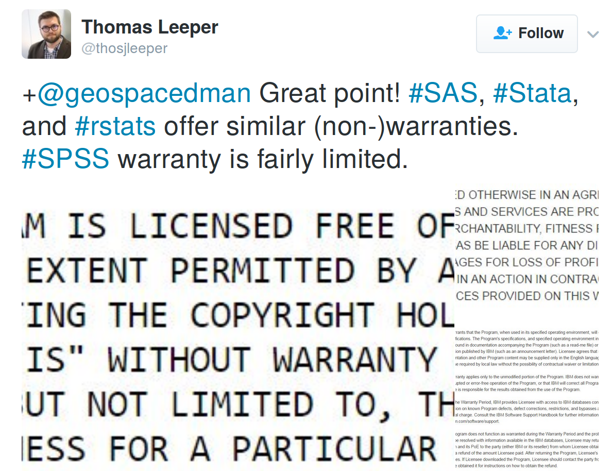

```{r, echo=FALSE}
library(RefManageR)
library(knitr)
# refs = ReadZotero(group = "418217", .params = list(collection = "JFR868KJ"))
# RefManageR::WriteBib(refs, "~/npct/pct/documents/refs.bib")
# names(refs)
library(grid)
library(png)
```

## Contents

2) Context

1) Tools of the trade

3) Case studies (stplanr + PCT)

4) Solutions (discussion)

5) Practical - finding large datasets

# Context

## Premises

- The transport system is not working well for anyone

> - To 'fix' it, policy interventions are needed

- Policy interventions can be more effective when locally targetted

> - However, there are infinite potential interventions at the local level
> - Evidence is needed to prioritise among the infinity of options 

- Only a systematic and objective evidence base will do

> - And that means data + statistics! 🔢

> - And that means computing 🖥️

> - And that means human-computer interaction 👨👩💻

- And that means software is vital for sustainable transport policy

## What's wrong with the transport system? | "Works fine for me"

<iframe width="560" height="315" src="https://www.youtube.com/embed/zI0dPGuP2zE" frameborder="0" allowfullscreen></iframe>

## Locally targetted vs national interventions

- Nationally uniform transport policies have several advantages
    - Avoid 'mixed messages'
    - In some cases essential (e.g. fuel prices)
    - We're all in it together

- BUT, locally specific transport policies can boost cost-effectiveness
    - Should walking/cycle paths be the same width throughout?
    - Point facilities will be used more if they're located sensibly (e.g. bus stops)
    - Cycle share schemes much more effective when spatial configuration matches urban form

## Some transport statistics

- Transport eats time. We spend on average 6% of our lives (sleeping/resting: 37%; commuting: 1%; paid work:  25%)   [@king_worktime_2017].

- Transport eats space. More than half many US cities spaces are occupied by parking (~20%) and streets (~40%). In Texas, for example, 21.3% of land space was taken by surface parking (Source: [oldurbanist.blogspot.co.uk](http://oldurbanist.blogspot.co.uk/2011/12/we-are-25-looking-at-street-area.html))

- Transport eats energy. In 2015 it accounted for **39.9%** of final energy consumption ([DECC](https://www.gov.uk/government/uploads/system/uploads/attachment_data/file/579542/ET_Dec_16.pdf)).

## Space used by transport (USA)

```{r}
knitr::include_graphics("http://2.bp.blogspot.com/-qCJTu0lkA4A/TuVawC6PDTI/AAAAAAAAAZA/Fn0zH8n2CTw/s1600/Parking_Houston_v2.jpg")
```

## Energy use in transport (UK)

```{r}
knitr::include_graphics("../figures/transport-40pc-energy.png")
```

## Energy use in Transport nationally

> Final  energy  consumption  (excluding  non-energy  use)  was  1.9  per  cent  higher  than  in  
2014 [0.3% seasonally adjusted],  with  rises  in  the  domestic,  transport  and  services  sectors  but  with  a  fall  in  the  industrial sector. The  rise  in  consumption  was  due  to  increased  
transport demand likely due to lower petroleum prices.

([DECC 2016](https://www.gov.uk/government/uploads/system/uploads/attachment_data/file/513244/Press_Notice_March_2016.pdf))

## Transport fuel prices | Source: [DECC 2016](https://www.gov.uk/government/uploads/system/uploads/attachment_data/file/513244/Press_Notice_March_2016.pdf)

```{r}
knitr::include_graphics("../figures/transport-fuel-prices-to-2016.png")
```


## The PCT: a Big Data project

> "The PCT is a brilliant example of using Big Data to better plan infrastructure investment. It will allow us to have more confidence that new schemes are built in places and along travel corridors where there is high latent demand."
 
Shane Snow: Head of Seamless Travel Team, Sustainable and Acessible Travel Division 

## That makes it hard!

- 1hr plus to build a single region
- 10,000+ calls to route planning apis
- dozens of file formats

Some of the files were're working with:

  - zone data: custom regional boundaries composed of Local Authorities, 1991 Counties, Combined Authorities and Local Enterprise Partnerships (LEPs)
  - point data: Output Area centroids representing intrazonal flow
  - line data: 2 million+ OD pairs, just for England
  - route-allocated OD data: 2.5 Gb each!

## What is Big Data?

Big data is an ubrella term.

"**unconventional**  datasets  that  are  **difficult**  to  analyze
**using established methods**. Often this difficulty relates to **size** but the form, format, and **complexity** are equally important" [[@lovelace_big_2016]](http://onlinelibrary.wiley.com/doi/10.1111/gean.12081/pdf). 

```{r, echo=FALSE, fig.width=3}
# download.file("https://openclipart.org/image/300px/svg_to_png/170637/1339577112.png",
#               "figure/umbrella.png")
knitr::include_graphics("../figure/umbrella.png")
```

## A worked example

Here's a 'big' dataset courtesy of tech startup [TransportAPI](http://www.transportapi.com/) (see [here](http://fcc.transportapi.com/v3/uk/public/journey/from/lonlat:-1.5490774,53.8007554/to/lonlat:0.121817,52.205337.json?region=southeast&)):

```
{{"request_time":"2016-03-15T16:53:42+00:00","source":"Traveline southeast
journey planning API","acknowledgements":"Traveline
southeast","routes":[{"duration":"03:27:00","route_parts":[{"mode":"foot","from_point_name":"Calverley
Street","to_point_name":"Leeds Rail
Station","destination":"","line_name":"","duration":"00:13:00","departure_time":"17:02","arrival_time":"17:15","coordinates":[[-1.54909,53.80075],[-1.54909,53.8007],[-1.5491,53.80046],[-1.5491,53.79994],[-1.5491,53.79992],[-1.54912,53.79982],[-1.54911,53.79964],[-1.54911,53.79957],[-1.54913,53.79908],[-1.54922,53.79872],[-1.54935,53.7984],[-1.54946,53.79808],[-1.54946,53.79808],[-1.54949,53.79798],[-1.54949,53.79798],[-1.54955,53.79785],[-1.54963,53.79772],[-1.54969,53.79768],[-1.54986,53.79756],[-1.54999,53.79747],[-1.55012,53.79735],[-1.54994,53.79725],[-1.54935,53.79692],[-1.54828,53.79629],[-1.54813,53.79623],[-1.54802,53.79618],[-1.54822,53.79616],[-1.54829,53.79615],[-1.54848,53.79611],[-1.54848,53.79611],[-1.54845,53.79604],[-1.54845,53.796],[-1.54845,53.79597],[-1.5482,53.79597],[-1.54777,53.79428]]},{"mode":"train","from_point_name":"Leeds","to_point_name":"Doncaster","destination":"London
King's
```

## Boiling big data down to its essentials

This code automatically pulls out the geographical essentials.

```{r, eval=FALSE}
request = "http://fcc.transportapi.com/v3/uk/public/journey/from/lonlat:-1.5490774,53.8007554/to/lonlat:0.121817,52.205337.json?region=southeast&"
txt <- httr::content(httr::GET(request), as = "text")
obj <- jsonlite::fromJSON(txt)#
coords <- obj$routes$route_parts[[1]]$coordinates
coords <- do.call(rbind, coords)
```

Credit: Ali Abbas's code from the LandorLinks [TransportHack](http://www.landor.co.uk/smartertravel/2016/hackathon.php).

## Interactive visualisations - to tell a story

This [code]([stplanr](https://cran.r-project.org/web/packages/stplanr/)) makes the above steps user friendly (relatively speaking!) by bundling the code inside a custom function. (Credit Ali Abbas and other software developers.)

```{r, eval=FALSE}
devtools::install_github("ropensci/stplanr")
library(stplanr)
rf = route_transportapi_public("Leeds", "Cambridge, UK")
m = mapview::mapview(rf)@map
htmlwidgets::saveWidget(m, "leeds-cam-data.html")
```

Not pretty but the results are pretty.
...

<!-- ## An interactive map for anyone to see! -->

<!-- ``` -->
<!-- <iframe src="../figures/map-cyclenet.html" width="100%" height="600"></iframe> -->
<!-- ``` -->

<!-- ```{r, engine='zsh', eval=FALSE} -->
<!-- cp ../figures/leeds-cam-data.html ~/repos/robinlovelace.github.io/ -->
<!-- ``` -->

<!-- <iframe src="../figures/leeds-cam-data.html" width="100%" height="600"></iframe> -->

# Computational needs of transport planners

## Tools for the trade

```{r, echo=FALSE, out.width="50%"}
knitr::include_graphics(c("../figures/746px-Pistol-grip_drill.svg.png", "../figures/sdna-san-fran.png"))
```

<!-- ## Institutional structures I: Board | Source: [Department for Transport](https://www.gov.uk/government/uploads/system/uploads/attachment_data/file/500776/dft-organisation-chart.pdf) -->

<!-- ```{r, echo=FALSE, out.width="60%"} -->
<!-- knitr::include_graphics("../figures/dft-organogram-board.png") -->
<!-- ``` -->

<!-- Over half of trips are < 5 miles -->

<!-- ## Institutional structures II: Roads Traffic and Local Group -->

<!-- ```{r, echo=FALSE, out.width="60%"} -->
<!-- knitr::include_graphics("../figures/dft-local.png") -->
<!-- ``` -->

<!-- ## Institutional structures III: Local Transport -->

<!-- ```{r, echo=FALSE, out.width="40%"} -->
<!-- knitr::include_graphics("../figures/dft-local1-2.png") -->
<!-- ``` -->

<!-- Even though my talk is about modelling, it is of course takes place in a political context -->

<!-- ## Institutional structures | A root cause of the 'problem' -->

<!-- ```{r, echo=FALSE, out.width="80%"} -->
<!-- knitr::include_graphics("../figures/dft-organogram-all.png") -->
<!-- ``` -->

## Transport planning needs have a history | Forecasting urban travel

- Book by @boyce_forecasting_2015

```{r}
include_graphics("http://www.e-elgar.com/shop/media/catalog/product/cache/1/image/225x/040ec09b1e35df139433887a97daa66f/9/7/9781848449602_4_1.jpg")
```

## Origins of Transport planning | Credit: Crispin Cooper. See [cardiff.ac.uk/sdna/](http://www.cardiff.ac.uk/sdna/)

```{r, echo=FALSE, out.width="70%"}
knitr::include_graphics("../figures/sdna-san-fran.png")
```

## The origins of modelling

> - "urban travel forecasting was definitely 'where the action was' for young transportation engineers and planners entering the field in the 1960s" [@boyce_forecasting_2015, p. 67].

> - heavily restricted by computing power

> - no consideration of walking or cycling

# Available tools 

## Transport planning tools: expensive...

```{r, echo=FALSE}
grid.raster(readPNG("../figures/software-costs.png"))
```

## And potentially dangerous!


Source: [Who will save us from transport models](http://www.ctthink.com/publications.html) (Hollander 2015)

See also work by [Robert Bain](http://ibtta.org/sites/default/files/The%20Reasonableness%20of%20Traffic%20Forecasts.pdf)

## Open source software for transport planning {.smaller}

```{r, echo=FALSE, message=FALSE, warning=FALSE}
f = "~/repos/foss4t/ossTransportToolsList.csv"
if(file.exists(f)) {
  d = readr::read_csv(f)
  d = d[1:3]
  d = d[!grepl(pattern = "GEOS|GD", x = d$`Softare product`),]
  knitr::kable(d)
}
```

## A broad classification, and use cases

- General purpose products that have found many transport applications

> - Python
> - R
> - QGIS

- Dedicated transport programs

> - MATSim
> - SUMO

- Add-on packages that providing transport planning capabilities to existing (mature) programs

> - stplanr
> - AequilibraE
> - activitysim

## The wider movement

- Open data
- Publicly accessible
- The wider community

## Open source in other sectors

```{r, echo=FALSE, out.height="85%"}
include_graphics("http://thewindowsclub.thewindowsclubco.netdna-cdn.com/wp-content/uploads/2015/01/How-to-Make-Money-Using-Open-Source-Software.png")
```

> - We can learn from 'early adopter' sectors

## Community buy-in

```{r, echo=FALSE, out.width="80%"}
include_graphics("../figures/discussion.png")
```

## Testing many tools | Source: [Camcycle.org](https://www.camcycle.org.uk/blog/2015/10/23/milton-road-elizabeth-way-junction-proposals/)

<iframe allowfullscreen="" frameborder="0" height="375" mozallowfullscreen="" src="https://player.vimeo.com/video/143309697" webkitallowfullscreen="" width="500"></iframe>

## Participatory planning

```{r, echo=FALSE}
knitr::include_graphics("http://robinlovelace.net/figure/cconnect.png")
```

## Envisioning shifting travel patterns | Source: Leeds Cycling Campaign

```{r, echo=FALSE}
knitr::include_graphics("http://leedscyclingcampaign.co.uk/sites/default/files/Residential%20Street%20small_0.jpg")
```

## Incorporation of new (open source?) digital technologies

```{r, echo=FALSE}
knitr::include_graphics("http://images.cdn.stuff.tv/sites/stuff.tv/files/styles/big-image/public/news/see-sense-light.jpg")
```

<!-- ## Summary -->

<!-- - Transport problems are multi-faceted so 'techno-fixes' are not enough -->
<!-- - Transport models are close to the root of the problem -->
<!-- - They were not developed to solve current transport problems -->
<!-- - Open source software has flourished in other sectors -->
<!-- - Open source software offers many benefits for transport planners, including: -->
<!--     - Encourages community particupation -->
<!--     - Reduces costs -->
<!--     - Increases collaboration -->

<!-- > - How do we get there? -->

# Case studies

## Origin-destination data

```{r, eval=FALSE, echo=TRUE}
install.packages("stplanr")
```

```{r, echo=TRUE}
library(stplanr)
data("flow")
nrow(flow)
flow[1:3, 1:3]
```

## Spatial data

```{r, echo=TRUE, warning=FALSE}
data("cents")
cents@data[1:2,]
desire_lines = od2line(flow = flow, zones = cents)
plot(desire_lines)
points(cents)
```

## Transport planning is somthing you *do* | Source: the Propensity to Cycle Tool (PCT) @lovelace_propensity_2016

See http://www.pct.bike/

[](https://github.com/npct/pct/raw/master/figures/rnet-leeds-base-to-godutch.png)

## Hot off the press: the cycle to schools layer | See our [test server](http://npct0.vs.mythic-beasts.com/schools/)

```{r}
knitr::include_graphics("../figures/pct-schools-image.png")
```

## The overlay between travel to school and work layers

- Setup:

```{r, echo=TRUE, warning=FALSE}
# load data
rf_schools = readRDS("~/npct/pctSchoolsUK/pctSchoolsApp/data/west-yorkshire/rnet.Rds")
rf_commute = readRDS("~/npct/pct-data/west-yorkshire/rnet.Rds")

# create bounding box polygon
bbox_poly = stplanr::bb2poly(rf_schools)
proj4string(bbox_poly) = proj4string(rf_commute)

# spatial subset
rf_commute = rf_commute[bbox_poly,]
```

## Visualisation code | Results: see [rpubs.com/RobinLovelace/](http://rpubs.com/RobinLovelace/244545)

```{r, echo=TRUE}
library(tmap)
tmap_mode("view")
m = tm_shape(rf_schools) +
  tm_lines(lwd = "dutch_slc", scale = 20, col = "darkgreen") +
  tm_shape(rf_commute) +
  tm_lines(lwd = "dutch_slc", scale = 20, col = "darkblue")
```

## Headline result: huge potential to optimise network for children and adults

- See [rpubs.com/RobinLovelace/](http://rpubs.com/RobinLovelace/244545) for interactive map

```{r}
knitr::include_graphics("../figures/schools-commuter-overlay.png")
```

# Solutions

## The case for open source software in transport planning

Practical reasons

> - It's cheaper
> - Faster evolving
> - More robust: more eyes on it

Philosophical reasons

> - Transport Planning is intertwined with democracy and power relations
> - People will try to manipulate it for own benefits - transparency/reproducibility = key
> - Control of public sector organisations over their data and analysis capabilities
> - Hypothesis: Use open source -> greater good

## Common objections to open source software

> - It's not user friendly
> - It's not where jobs are (now)
> - It doesn't have the support of trusted suppliers
> - Anyone can come and 'hack' your code!
> - Developer's don't get paid
> - Any more?

## Open source software has no warranty...

See https://twitter.com/thosjleeper/status/793107956632084480

```{r}

```


## What to keep, what to replace?

```{r, echo=FALSE}
difftable = read.csv(text = 
"Keep, Replace, How
Terminology, Inaccessible, Online tools
Equations, Proprietary ownership, Open source licences
Use of scenarios, Ageing software, New software
, Narrow scenarios of future, Flexible models
, Black boxes, Simple and open method"
  )
knitr::kable(difftable)
```

## Overlaps between energy and software transition

- Both require 'systemic' change [@beddoe_overcoming_2009]
- They seem like technical problems on the outset but are highly political
- It takes time, commitment and persuasion
- The benefits take time to realise

Could there be a mutually reinforcing feedback loop:

Shift in (digital) infrastructure -> change in behaviour and priorities?

## We're (accidentally) doing something right in terms of coal | Source: [DECC](https://www.gov.uk/government/uploads/system/uploads/attachment_data/file/579542/ET_Dec_16.pdf). Risk: electric cars.

```{r}
knitr::include_graphics("../figures/coal-stats-2013-2016.png")
```

## Points of contention

Most people agree that:

> - Transport models are not working optimally
> - Open source software is 'good'
> - It would be good to save money and switch

Areas of disagreement:

> - How to get there
> - Whether it's a slow transition or 'cold turkey'
> - Who should write the code
> - Any volunteers (or funders)?

<!-- ## Get tooled up | How to get involved? -->

<!-- > - You ARE involved! -->
<!-- > - Try a range of tools -->
<!-- > - Contribute to the discussion -->
<!-- > - Ask questions in online forums -->
<!-- > - Try out things like Propensity to Cycle Tool and CycleStreets.net -->
<!-- > - Find out how to contribute to existing projects (e.g. osmdata) -->

## Solutions - policy


- Incentivise low carbon, healthy travel

> - Build cycle paths (where they are most needed, of appropriate design)
> - Embed walking and cycling - urban realm improvements, facilities sign-posting
> - Subsidise car sharing solutions

- Disincentivise high carbon solutions

- Creative approaches
> - Reducing worktime hours: "The three best performing scenarios were those that involved
employees working a four-day week as they enabled companies to reduce
energy use, and employees to reduce commuting" [@king_worktime_2017]. 

## References {.smaller}

Lovelace, Robin. 2016. "Mapping out the future of cycling." Get Britain Cycling, 2016. P. 22 - 24. Available from [getbritaincycling.net](http://getbritaincycling.net/)

<!-- [arxiv.org/abs/1509.04425](http://arxiv.org/abs/1509.04425) -->


