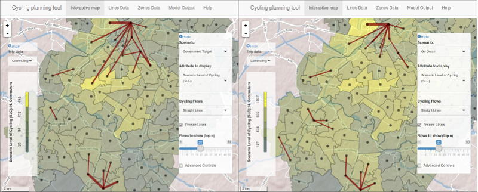
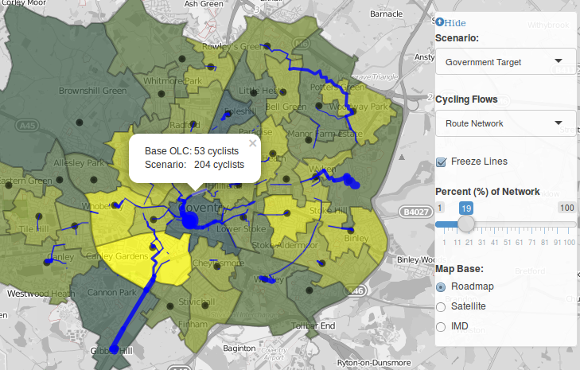
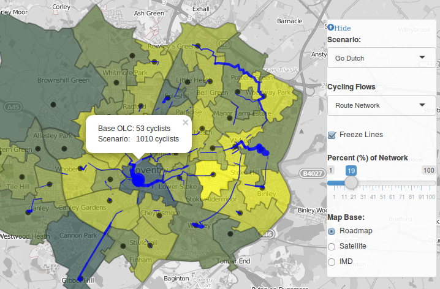
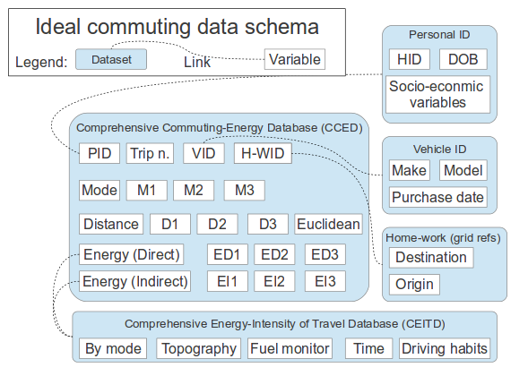
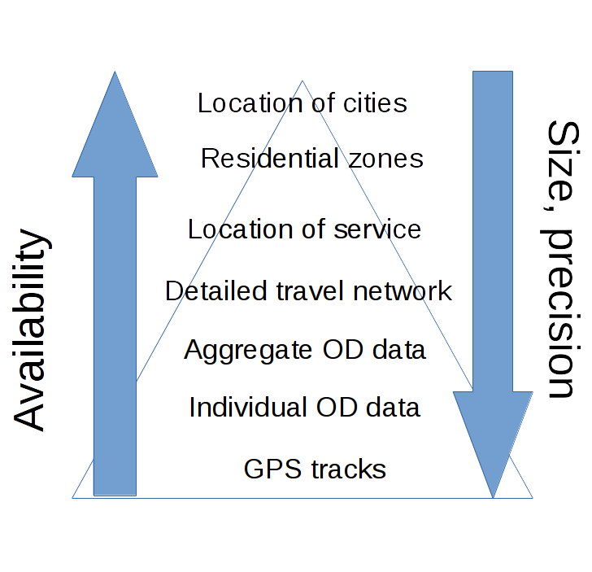

```{r, echo=FALSE}
library(RefManageR)
refs = ReadZotero(group = "418217", .params = list(collection = "JFR868KJ"))
# RefManageR::WriteBib(refs, "refs.bib")
# names(refs)
library(grid)
library(png)
```

## Contents

> - What we did: Big Data in the PCT
> - What is Big Data: worked example (with code!)
> - Implications for obesity research
> - Lessons learned

# How we've used Big Data in the Propensity to Cycle Tool

## The PCT: a Big Data project

```{r, echo=FALSE}
# > "The PCT is a brilliant example of using Big Data to better plan infrastructure investment. It will allow us to have more confidence that new schemes are built in places and along travel corridors where there is high latent demand."
# 
# Shane Snow: Head of Seamless Travel Team, Sustainable and Acessible Travel Division 
```

- 1hr plus to build a single region
- 10,000+ calls to route planning apis
- dozens of file formats

Some of the files were're working with:

  - zone data: custom regional boundaries composed of Local Authorities, 1991 Counties, Combined Authorities and Local Enterprise Partnerships (LEPs)
  - point data: Output Area centroids representing intrazonal flow
  - line data: 2 million+ OD pairs, just for England
  - route-allocated OD data: 2.5 Gb each!

## Simplify large datasets to tell a story

```{r, echo=FALSE, fig.cap="Input: A mass of data"}
knitr::include_graphics("../figures/haystack.png")
```

## Interactive map of current flows


## Route allocation


## Route network analysis


## Zoom to a specific area


## 4 scenarios of change

- Government Target
- Gender Equality
- Go Dutch
- Ebikes

## Scenario shift in desire lines



## Scenario shift in network load I



## Scenario shift in network load II



# What is Big Data? A technical perspective

## Our definition

Big data is an ubrella term.

"**unconventional**  datasets  that  are  **difficult**  to  analyze
**using established methods**. Often this difficulty relates to **size** but the form, format, and **complexity** are equally important" [[@lovelace_big_2016]](http://onlinelibrary.wiley.com/doi/10.1111/gean.12081/pdf). 

```{r, echo=FALSE, fig.width=3}
# download.file("https://openclipart.org/image/300px/svg_to_png/170637/1339577112.png",
#               "figure/umbrella.png")
knitr::include_graphics("../figure/umbrella.png")
```

## A worked example

Here's a 'big' dataset courtesy of tech startup [TransportAPI](http://www.transportapi.com/) (see [here](http://fcc.transportapi.com/v3/uk/public/journey/from/lonlat:-1.5490774,53.8007554/to/lonlat:0.121817,52.205337.json?region=southeast&)):

```
{{"request_time":"2016-03-15T16:53:42+00:00","source":"Traveline southeast
journey planning API","acknowledgements":"Traveline
southeast","routes":[{"duration":"03:27:00","route_parts":[{"mode":"foot","from_point_name":"Calverley
Street","to_point_name":"Leeds Rail
Station","destination":"","line_name":"","duration":"00:13:00","departure_time":"17:02","arrival_time":"17:15","coordinates":[[-1.54909,53.80075],[-1.54909,53.8007],[-1.5491,53.80046],[-1.5491,53.79994],[-1.5491,53.79992],[-1.54912,53.79982],[-1.54911,53.79964],[-1.54911,53.79957],[-1.54913,53.79908],[-1.54922,53.79872],[-1.54935,53.7984],[-1.54946,53.79808],[-1.54946,53.79808],[-1.54949,53.79798],[-1.54949,53.79798],[-1.54955,53.79785],[-1.54963,53.79772],[-1.54969,53.79768],[-1.54986,53.79756],[-1.54999,53.79747],[-1.55012,53.79735],[-1.54994,53.79725],[-1.54935,53.79692],[-1.54828,53.79629],[-1.54813,53.79623],[-1.54802,53.79618],[-1.54822,53.79616],[-1.54829,53.79615],[-1.54848,53.79611],[-1.54848,53.79611],[-1.54845,53.79604],[-1.54845,53.796],[-1.54845,53.79597],[-1.5482,53.79597],[-1.54777,53.79428]]},{"mode":"train","from_point_name":"Leeds","to_point_name":"Doncaster","destination":"London
King's
```

## Boiling big data down to its essentials

This code automatically pulls out the geographical essentials.

```{r, eval=FALSE}
request = "http://fcc.transportapi.com/v3/uk/public/journey/from/lonlat:-1.5490774,53.8007554/to/lonlat:0.121817,52.205337.json?region=southeast&"
txt <- httr::content(httr::GET(request), as = "text")
obj <- jsonlite::fromJSON(txt)#
coords <- obj$routes$route_parts[[1]]$coordinates
coords <- do.call(rbind, coords)
```

Credit: Ali Abbas's code from the LandorLinks [TransportHack](http://www.landor.co.uk/smartertravel/2016/hackathon.php).

## Interactive visualisations - to tell a story

This [code]([stplanr](https://cran.r-project.org/web/packages/stplanr/)) makes the above steps user friendly (relatively speaking!) by bundling the code inside a custom function. (Credit Ali Abbas and other software developers.)

```{r, eval=FALSE}
devtools::install_github("ropensci/stplanr")
library(stplanr)
rf = route_transportapi_public("Leeds", "Cambridge, UK")
m = mapview::mapview(rf)@map
htmlwidgets::saveWidget(m, "leeds-cam-data.html")
```

Not pretty but the results are pretty.
...

## An interactive map for anyone to see!

```
<iframe src="../figures/map-cyclenet.html" width="100%" height="600"></iframe>
```

```{r, engine='zsh', eval=FALSE}
cp ../figures/leeds-cam-data.html ~/repos/robinlovelace.github.io/
```

<iframe src="../figures/leeds-cam-data.html" width="100%" height="600"></iframe>

# Implications for obesity research

## Why Obesity research needs big data

- It's a multidisciplinary field

It depends on data from diverse, non-official sources

> - From commercial companies (e.g. sales data)
> - Highly geographically dependent [@burgoine_associations_2014]
> - Operating on many different levels (national policy > advertising > culture > local environment > opportunities to stay active > families > psychology)

It's crucial that we can share our work to not re-invent the wheel -> 'Data Science'

## The potential for microsimulation

Multi-level methods (e.g. spatial microsimulation and agent-based modelling) needed to represent complexity of real world ([Burgoine and Monsivais](http://download.springer.com/static/pdf/868/art%253A10.1186%252F1479-5868-10-85.pdf?originUrl=http%3A%2F%2Fijbnpa.biomedcentral.com%2Farticle%2F10.1186%2F1479-5868-10-85&token2=exp=1458091279~acl=%2Fstatic%2Fpdf%2F868%2Fart%25253A10.1186%25252F1479-5868-10-85.pdf), 2015).

```{r, echo=FALSE, fig.height=2, fig.width=2}
knitr::include_graphics(rep("../figures/food-exposure.png", 3))
```


## Lessons from other disciplines

> - Economics: The Rogoff scandal [@rogoff_growth_2010] leading to calls that "Data and computer code should be made publicly available at an early stage – [or else"](https://theconversation.com/the-reinhart-rogoff-error-or-how-not-to-excel-at-economics-13646).
> - Psychology: majority of papers found to not be reproducible by the Open Science Collaboration, and subsequent [backlash](http://gking.harvard.edu/files/gking/files/gilbert_king_pettigrew_wilson_2016_with_appendix.pdf?m=1457149210) [@gilbert_comment_2016].
> - Transport: Recent report asking 'who will save us from the misuse of transport models' [@hollander_who_2015].
> - The 'hard' sciences: some papers now insist on publishing data alongside code. Some even insist on publishing code ([Nature](http://www.nature.com/authors/policies/availability.html)): 

"A condition of publication in a Nature journal is that authors are required to make materials, data, code, and associated protocols promptly available to readers without undue qualifications. Any restrictions ... must be disclosed."

## Challenges around making the work accessible

```{r, echo=FALSE}
grid.raster(readPNG("../figures/software-costs.png"))
```

## Future challenges for the PCT

DfT project: flows ‘super’ data set (Census)

- CONTENT:   England residence to work commuter trips (LSOA ->LSOA ). ~25 million daily trips

- FORMAT: Matrix (data frame in R terminology) with over 2 ,000 million cells (8 million rows per 256 columns per flow- categories based on cross tabs- age, gender, ). 

- CONFIDENTIALITY: Instance of Big Data ‘issues’: non-confidential cross-tabbed data (age~sex~travel mode). Half the flows have LESS than 2 individuals!

- DfT 2.0 :  NTS  + microsimulation  +  Dept for Education layer data.
SMS mitigates confidentiality issues?

## Inputting external nonstandard data

Manchester Traffic model 

- Transport for Greater Manchester (3 datasets: sources SATURN-Voyager-GMVDM): 

- 3 basic modes (Walk/Cycle, Public transport, Car trips) based on traffic counts 

- Over 3+ million flows. 3 different zonal geographies- OD + time +  trip purpose 

- Processing: R+ SQL Server DB. ~50 million point-to-point flows aggregated- when converted into MSOAs- scale up (already simplified)
- Outcome: Census-style 500K lines (a->b MSOA level).


# Lessons learned 

## Teamwork on Big Data projects

Big data projects are innevitably complicated and involve multidisciplinary teams.

Lessons learned during the course of the Propensity to Cycle Tool team:

> - Version control is necessary
> - Code sharing and review (e.g. via pull requests) can prevent mistakes
> - Open source code can encourage community involvement, citizen science and public engagement
> - A diverse spread of skills is necessary but there should be team cohesion to prevent fragility

## New technology for collaborative working


## 5 commandments for big data

> 1) thou shalt remember the purpose of thine research regardless of the size of thine dataset
> 2) thou shalt not spend excessive amounts of time making visualising big data for the sake of it (or social media clickbait)
> 3) thou shalt not do big data until thou has done 'small data' first
> 4) thou shalt not hide thine ideas behind complex terminology associated with the terms 'big data' or 'data science', the meaning of which has not been clearly identified.
> 5) if thou wants to be a data scientist thou must program ... "for documentation, sharing and scientific repeatability" ([mount 2016](http://www.r-bloggers.com/some-programming-language-theory-in-r/)).

## discussion: let's make tools that scale globally

Premises:

> - The problems we face are increasingly global
> - With continued globalisation, datasets will become increasingly globally homogeneous (e.g. OSM)
> - New software sharing skills allow the benefits of clever code to spread faster than a single academic team can work
> - Obesity research is intimately linked to society and needs to be accessible to non academics

## Inspiration: Comprehensive Commuting Energy Database

Analogous database applicable to obesity research?

```{r, echo=FALSE, fig.cap="Source: My thesis (Lovelace 2014)"}

```

## Globally scalable tools: data hierarchy

```{r, echo=FALSE, fig.cap="The data hierarchy concept applied to global travel data"}

```

## Conclusions: if we were to do it again

- Skills are vital: share and assess team's skillset early on and use the same tools/software.
- Reaching out to non academic communities (e.g. independent web developer, 'hacking' community, system administrators) is key to the project's success and longevity
- Scalability (e.g. new countries) and generalisability greatly eased by reproducible, open source code
- Using cutting-edge software can cause challenges but was worth it in this case
- Don't make it about the data - make it about what the data can do!

## References {.smaller}

```{r, echo=FALSE}
# ## Abstract
# 
# Big Data, taken to mean emerging large and diverse datasets that are difficult to process using conventional tools, has the potential to greatly enhance our understanding of the behaviours that lead to obesity and non-communicable disease more widely. However, it is self-evident that access to Big Data alone is not sufficient to advance human knowledge in this area,  let alone inform or alter policy. Much work is needed to 'add value' to large datasets, including data cleaning, filtering, manipulation, analysis and modelling.
# 
# This paper illustrates these points with reference to the authors' 
# experience developing an evidence-based tool for guiding active travel policies in relation to cycling. The Propensity to Cycle Tool (PCT) is in many respects a Big Data project, using the latest data analysis and visualisation technology to make sense of large OD matrices on travel to work which would otherwise under-utilised and meaningless to the majority of users. We use the case study to tell the story of how we used open source software development practices, in combination with an open and user-centred interface design process, to make the data 'tell a story' that is of maximum use to policy makers. The use of intuitive scenarios and a 'slippy' web map similar to Google Maps were found to be critical to the tools uptake and use.
# 
# In the final section the implications of the work for future obesity-related research will be considered. We look to the future in the field and comment on the potential of the model underlying the PCT to be refined by using additional Big Data sources, for example from mobile telephone logs and social media. We conclude with comments on how lessons learned during the PCT's development could be applicable to other branches of obesity-related research beyond cycling and active travel.
```


