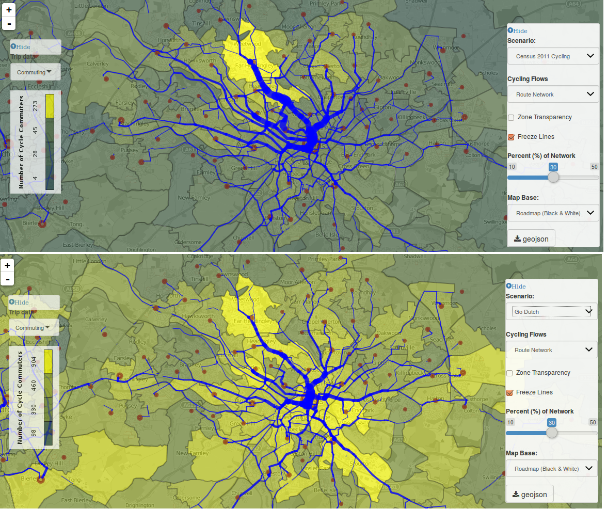

```{r setup, include=FALSE}
knitr::opts_chunk$set(echo = TRUE)
```

## Introduction

The Propensity to Cycle Tool (PCT) will be launched in July 2016 by the Department for Transport, who commissioned the work in early 2015 to identify "parts of [England] with the greatest propensity to cycle" [@DepartmentforTransport2015]. Despite increased interest in planning for cycling, few tools focus explicitly on this mode of transport. Further, there were no widely accessible tools to help local authorities future cycling demand. The PCT overcomes this bottleneck in sustainable transport planning and visualises the results on a publicly available online mapping interface. By showing local health and emissions benefits, the PCT could also provide a powerful business case of investment in cycling. 

The PCT was a multi-university team effort, developed by myself (based at the University of Leeds), Anna Goodman (London School of Hygiene and Tropical Medice), Rachel Aldred (University of Westminster), Nikolai Berkoff (independent web developer) and Ali Abbas, Alvaro Ullrich and James Woodcock (University of Cambridge). At the time of writing (spring 2016) an early version of the PCT is available nationwide, publicly accessible at the project's website: [pct.bike](http://pct.bike). In Phase I of the project (January to June 2015) we developed a prototype for 3 cities and carried out evidence reviews and data analysis. The resulting were published by the DfT as a resource for cycle planning (see [gov.uk/government/publications/national-propensity-to-cycle-first-phase-development-study](https://www.gov.uk/government/publications/national-propensity-to-cycle-first-phase-development-study)). The document includes a study of evidence around infrastructure and cycling uptake, a systematic review of the impact of age and gender on cycle infrastructure preferences, and analysis comparing propensities to cycle in England and The Netherlands. Following the success of Phase I we were commissioned to undertake Phase II, which primarily involved deploying the PCT nationwide. Future versions of the tool will involve more geographical detail and incorporating a range of trip trips.

<!-- This article focusses on the tool itself. Elsewhere, we have written about its policy context, the methodology and technologies used to create it [@lovelace_propensity_2015]. In the context of academic literature, the PCT can be usefully understood as a planning support system (PSS) about which there is a substantial literature. This article walks the reader through the functionality of the PCT, first focussing on its ability to visualise data multiple levels and then describing the scenarios of future cycling possibility. The PCT provides data at area, 'desire line', route and route network levels. The scenarios commissioned by the DfT were Government Target (in which the rate of cycling doubles), Gender Equality (in which women cycle as much as men along each desire line), Go Dutch (which illustrates what could happen if English people cycled as much as Dutch people for given distances and hilliness levels) and Ebikes (representing the potential for electric cycles to enable longer trips to be cycled, building on Go Dutch). -->

This article walks the reader through the functionality of the PCT, its ability to visualise data multiple levels and its scenarios of potential cycling futures. Technical details of the tool's design and implementation are covered in [@lovelace_propensity_2015]. It describes how the PCT provides data at area, 'desire line', route and route network levels for exploring the local impacts of the following scenarios: Government Target (in which the rate of cycling doubles), Gender Equality (in which women cycle as much as men men along each desire line), Go Dutch (which illustrates what could happen if English people cycled as much as Dutch people for given distances and hilliness levels) and Ebikes (representing the potential for electric cycles to enable longer trips to be cycled, building on Go Dutch).

## Visualising current cycling levels

The main aim of the PCT is to visualise and explore future demand for cycling. However, it is also a useful tool for exploring the geographical distribution of current cycling patterns. Understanding how the PCT visualises current levels of cycle commuting will help understand how it can be used to plan for the future, as each visualisation level is available for every scenario.

### Area level data

At the area level, the PCT shows the number of people in each zone ('MSOAs' with average population of 8,000) who reported cycling as their main mode of travel to work in the 2011 Census. In West Yorkshire, for example, the PCT shows the north of Leeds to have the highest rate of cycling in the region.

<!-- This raises, but does not answer, the following question: why do more people cycle to work here than other parts of West Yorkshire? The Index of Multiple Deprivation layer can shed light on this: the north of Leeds is predominantly a wealthy area, close enough to the city centre and major employers such as the University of Leeds and Leeds General Infirmary to enable inhabitants with high skilled jobs to cycle to work. Almost all other areas of West Yorkshire are shown to have low rates of cycling, raising the questions: why is the cycling rate so low? what are the barriers? -->

### Cycling 'desire lines'

'Desire lines' are straight lines connecting where people live to where they want to travel. In the context of the travel to work 'flow data' used by the PCT, this means lines connecting home and work locations. By showing the desire lines with the highest rates of cycling, the PCT can illustrate where there is the highest demand for *cycling flows*.

<!-- This information is more detailed and policy relevant than simply showing where cyclists live, because cycle infrastructure must account for where cyclists pass through, not just where their trips begin and end. In Leeds, for example, the desire lines show that the city is highly 'monocentric', suggesting high latent demand for radial routes. In Manchester, by contrast, the cycling desire lines show that the city is more 'polycentric', with demand for cycling distributed across the city. -->

### Route allocated flows

A key feature of the PCT is its ability to allocate cycling desire lines to the route network. This was done thanks to [CycleStreets.net](https://cyclestreets.net/), a not-for-profit journey planner 'by cyclists, for cyclists'. For each origin-destination pair the PCT can show both the fastest and the quietest routes, as defined by CycleStreets. This distinction can be useful for planning new routes. To get from MSOA Salford 022 to Manchester 054, for example, one must either navigate the busy Trinity Way or take a circuitous route through various side streets. The extra 300 m needed to go via the 'quiet' route is represented on the map in the popups associated with these route allocated flows. This is illustrated in the figure below.

```{r, echo=FALSE, fig.cap="Route allocated flows in Manchester showing the large discrepency between 'fastest' and 'quietest' routes."}
knitr::include_graphics("../figures/man-trinity-way.png")
```

### The route network

While route allocated flows demonstrate routes between an origin and destination, the route network layer goes one further. It is the result of aggregating all overlapping route-allocated desire lines. It is crucial for envisioning cycling scenarios: the route network layer provides an estimate of how many cycle commuters could use specific road segments and therefore plan for the appropriate width and capacity of new infrastructure (see figure below). The PCT uses the fastest routes as the basis of the route network because evidence shows that cyclists, especially women and the elderly, have a strong preference for direct routes.

<!-- It is useful to see the potential uptake along specific desire lines and how these map onto the existing transport network. But what about cases where multiple desire lines feed into a single road? The potential rate of cycling along a specific road segment is not equal to the value of a single desire line, but of all the desire lines whose cyclists pass through. The PCT shows this through perhaps its most useful layer: the route network (see figure). This shows the rate of cycling  -->

## Visualising cycling futures

Each of the layers described above is useful in understanding the spatial distribution of cyclists and their likely routes to work (more trip purposes will be added to the PCT in due course), based on the 2011 census. But if cycling grows substantially, as many transport planners expect, the geographical distribution of demand for cycling demand is likely to change. In other words current data shows where to build for yesterday, but not tomorrow. To address this issue the PCT uses a range of scenarios to show the areas, desire lines and routes with the greatest potential for growth in cycling.  

The scenarios range from short term to long term. All imply the removal of infrastructural, policy, and cultural barriers to cycling.
The scenarios are:

- Government target (*govtarget*), a doubling of
the number of cycling trips in England.
Although this is a substantial increase in relative terms, cycle use still
remains low in this scenario compared with countries such as the Netherlands,
rising from 3% to 6% of commutes.

- Gender Equality (*gendereq*). This scenario illustrates the increase in cycling
that would result if women were as likely as men to cycle a given trip.
Specifically, the scenario sets the proportion of female cycle commuters to be equal
to the current proportion of males in each OD pair.

- Go Dutch (*godutch*).
While *govtarget* and *gendereq* build on current cycling behaviour,
'Go Dutch' focuses on long-term potential.
*godutch* represents what would happen if English people were as likely as Dutch people to cycle a trip of a given distance and level of hilliness.

- E-bikes (*ebikes*). This scenario models the additional increase
in cycle use that would be achieved through the widespread uptake of electric
cycles ('E-bikes').

## Using the Propensity to Cycle Tool

Because the Propensity to Cycle Tool offers a multitude of options for exploring and visualising local cycling patterns, it can be used in a multitude of ways. Perhaps most importantly for local transport planners is its ability to help identify roads on which there is very high cycling potential but low current numbers of cyclists using it. Such roads might not be currently identified as good candidates for investment but could, were conditions different, attract high numbers of cycle commuters. York Road in Leeds is a good example of this. The PCT shows that it is currently used by fewer than 100 commuter cyclists yet under the Go Dutch scenario it is used by over 1000! 

The area level results are also interesting for each scenario: in Leeds the PCT shows that Go Dutch represents a tenfold increase in cycling and a substantial shift in the spatial distribution of cycling flows to the south and east of the city, suggesting where a new 'core network' of cycle paths should be constructed.

```{r, echo=FALSE, fig.cap="The shifting distribution of cycling flows from the 2011 baseline scenario (above) to the Go Dutch scenario (below) in Leeds."}

```

Various options are available to assist the transport planning process in conjunction with the PCT. The ability to turn zone transparency on and off, for example, facilitates exploration of how cycling potential relates to the urban environment. Changing the basemap can show how latent demand for cycling relates to current cycle infrastructure (with the OpenCycleMap basemap), levels of deprivation (with the 'IMD' layer) and road width for space re-allocation for cycle and walking paths (with the satellite basemap).

The fact that the tool is freely available to the public is of huge potential benefit when seeking public engagement in the planning process because campaigners will suddenly have access to the same evidence-based starting point as local authorities. This can help avoid conflicts, for example where a campaign group favours one route whereas the authority favours another. It is likely that the PCT will demonstrate that there is high cycling potential on both routes, given the right infrastructure and policy interventions (e.g. re-allocating road space away from cars and towards cycles, as planners in London have done in Torrington Place).

The tool is available for free online for anyone to use. This is an important aspect of the PCT's design, which aims to make evidence for transport planning as accessible as possible and inform the debate about transport futures.
<!-- However, the PCT is no 'golden bullet' for cycling. Without political will and funding, simply knowing where cycling could grow is not enough to make it happen. -->
The PCT is not designed to replace local knowledge of cycle flows: it is based on commuter cycling from 2011, so misses many actual and potential trips. Instead, the PCT is designed to *supplement* existing evidence bases around cycling, map-based, survey-based and intuitive [see @Payne2014]. The PCT also does something exciting and new: it provides a quantitative vision of ambitious cycling scenarios that is geographically specific, down to the level of roads. 

Unlike many tools for transport planning, the Propensity to Cycle Tool is open source (see the code at [github.com/npct](https://github.com/npct/pct-shiny)). This enables transport planners and others to modify it for their own needs (for instance, to answer questions such 'what will cycling look like in Bristol when we reach the 10% target mode share for cycling?'). As with any technology the PCT cannot answer all questions. But feedback from transport planners and campaigners to date suggests it can provide a powerful supplement to the local planner's toolbox.

## References

