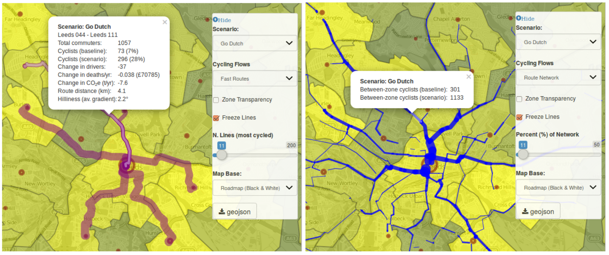

```{r setup, include=FALSE}
knitr::opts_chunk$set(echo = TRUE)
```

## Introduction

The Propensity to Cycle Tool (PCT) will be launched in July 2016 by the Department for Transport, who commissioned the work in early 2015 to identify "parts of [England] with the greatest propensity to cycle" [@DepartmentforTransport2015]. The policy subtext was clear: there is renewed interest in and some funding for cycling, but little in the way of evidence to suggest where this investment should go. With some expenditure being criticised for being sub-optimally allocated, it was important to identify the routes that would have the greatest impact *before* construction started.

Fast forward to spring 2016 and we have a nationally working Propensity to Cycle Tool. It is publicly accessible to use at the project's website, a first for DfT funded planning tools: [pct.bike](http://pct.bike). It seems to have exceeded many expectations (including our own) from its humble beginnings. Phase I of the project (January to June 2015) was to develop a prototype for 3 cities and research the evidence about the preferences that different socio-demographic groups have for different types of cycling infrastructure. These reports are now published by the DfT as a publicly available resource on how best to promote cycling (see [gov.uk/government/publications/national-propensity-to-cycle-first-phase-development-study](https://www.gov.uk/government/publications/national-propensity-to-cycle-first-phase-development-study)). Following the success of Phase I we were commissioned to undertake Phase II of the project, which primarily involved scaling up the tool nationwide.

This article focusses on the tool itself. Elsewhere, we have written about its policy context, the methodology and technologies used to create it [@lovelace_propensity_2015]. In the context of academic literature, the PCT can be usefully understood as a planning support system (PSS) about which there is a substantial literature. This article walks the reader through the functionality of the PCT, first focussing on its ability to visualise data multiple levels and then describing the scenarios of future cycling possibility. The PCT provides data at area, 'desire line', route and route network levels. The scenarios commissioned by the DfT were Government Target (in which the rate of cycling doubles), Gender Equality (in which women cycle as much as men along each desire line), Go Dutch (which illustrates what could happen if English people cycled as much as Dutch people for given distances and hilliness levels) and Ebikes (representing the potential for electric cycles to enable longer trips to be cycled, building on Go Dutch).

## Using the PCT to visualise cycling at multiple geographic levels

### Area level data

The first thing that the PCT shows is the level of cycling per local area. Specifically, that means the number of inhabitants in each Medium Super Output Areas (MSOA is a standard geographic unit used for geographically aggregating statistical data with an average population of almost 8,000) who reported cycling as their main mode of travel to work in the 2011 Census. In West Yorkshire, for example, the PCT instantly reveals the north of Leeds to have the rate of cycling in the region.

This raises, but does not answer, the following question: why do more people cycle to work here than other parts of West Yorkshire? The Index of Multiple Deprivation layer can shed light on this: the north of Leeds is predominantly a wealthy area, close enough to the city centre and major employers such as the University of Leeds and Leeds General Infirmary to enable inhabitants with high skilled jobs to cycle to work. Almost all other areas of West Yorkshire are shown to have low rates of cycling, raising the questions: why is the cycling rate so low? what are the barriers?

### Cycling 'desire lines'

'Desire lines' are straight lines connecting where people live to where they want to travel. In the context of the travel to work 'flow data' used by the PCT, this means lines connecting home and work locations. By showing the desire lines with the highest rates of cycling, the PCT can illustrate where there is the highest demand for *cycling flows*. This information is more detailed and policy relevant than simply showing where cyclists live, because cycle infrastructure must account for where cyclists pass through, not just where their trips begin and end. In Leeds, for example, the desire lines show that the city is highly 'monocentric', suggesting high latent demand for radial routes. In Manchester, by contrast, the cycling desire lines show that the city is more 'polycentric', with demand for cycling distributed across the city.

### Route allocated flows

The next step is to allocate the desire lines to the route network. This was done courtesy of CycleStreets.net, a not-for-profit cycling routing and digital service provider 'by cyclists, for cyclists'. Both the quietest and shortest paths were generated, allowing you to see where cyclists are forced a long way from the direct path to avoid busy traffic. To get from MSOA Salford 022 to Manchester 054, for example, one must either navigate the busy Trinity Way or take a circuitous route through various side streets, which may not be particularly 'quiet' either. The extra 300 m needed to go via the 'quiet' route is represented on the map in the popups associated with these route allocated flows, and could account for the low rate of cycling along this desire line. This is illustrated in the figure below.

```{r, echo=FALSE, fig.cap="Route allocated flows in Manchester showing the large discrepency between 'fastest' and 'quietest' routes."}
knitr::include_graphics("../figures/man-trinity-way.png")
```

### The route network

It is useful to see the potential uptake along specific desire lines and how these map onto the existing transport network. But what about cases where multiple desire lines feed into a single road? The potential rate of cycling along a specific road segment is not equal to the value of a single desire line, but of all the desire lines whose cyclists pass through. The PCT shows this through perhaps its most useful layer: the route network (see figure). This shows the rate of cycling allong Otley Road rises from 73 to 296 based on a single OD pair but a much larger absolute rise of 301 to 1133 when all route-allocated OD pairs are considered.

```{r, echo=FALSE, fig.cap="Illustration of route-allocated OD data (left) compared with route network data (right) which was produced by aggregating all overlapping route-aggregated OD pairs, using the 'overline' function from the stplanr R package."}

```

## Scenarios of cycling futures

Each of the layers described above is useful in understanding the spatial distribution of cyclists and their likely routes to work (more trip purposes will be added to the PCT in due course), currently, based on the 2011 census. But planners need to design for the future, not the past. To address this issue several scenarios of the future were developed to show where growth in cycling has the greatest potential. 

These can be framed in terms of the removal of different infrastructural, cultural and technological barriers that currently prevent cycling being the natural mode of choice for urban trips and were: 

- Government target (*govtarget*), a doubling of
the number of cycling trips in England.
Although this is a substantial increase in relative terms, cycle use still
remains low in this scenario compared with countries such as the Netherlands,
rising from 3% to 6% of commutes.

- Gender Equality (*gendereq*). This scenario illustrates the increase in cycling
that would result if women were as likely as men to cycle a given trip.
Specifically, the scenario sets the proportion of female cycle commuters to be equal
to the current proportion of males in each OD pair.

- Go Dutch (*godutch*).
While *govtarget* and *gendereq* build on current cycling behaviour,
'Go Dutch' focuses on long-term potential.
*godutch* represents what would happen if English people were as likely as Dutch people to cycle a trip of a given distance and level of hilliness.

- E-bikes (*ebikes*). This scenario models the additional increase
in cycle use that would be achieved through the widespread uptake of electric
cycles ('E-bikes').


## Using the Propensity to Cycle Tool

Because the Propensity to Cycle Tool offers a multitude of options for exploring and visualising local cycling patterns, it can be used in a multitude of ways. Perhaps most importantly for local transport planners is its ability to help identify roads on which there is very high cycling potential but low current numbers of cyclists using it. Such roads (e.g. York Road in Leeds) are good candidates for investing in cycling. This is shown in the figure for Leeds which shows that Go Dutch represents a tenfold increase in cycling and a substantial shift in the spatial distribution of cycling flows to the south and east of the city, suggesting where a new 'core network' of cycle paths should be constructed.

```{r, echo=FALSE, fig.cap="The shifting distribution of cycling flows from the 2011 baseline scenario (above) to the Go Dutch scenario (below) in Leeds."}
knitr::include_graphics("../figures/rnet-leeds-base-to-godutch.png")
```


Various options are available to assist the transport planning process in conjunction with the PCT. The ability to turn zone transparency on and off, for example, makes it easier to see the underlying transport infrastructure, especially when using the OpenCycleMap, Index of Multiple Deprivation (which shows how deprived the areas that new cycle plans serve are) and Satellite layers.

The fact that the tool is freely available to the public is of huge potential benefit when seeking public engagement in the planning process because campaigners will suddenly have access to the same evidence-based starting point as local authorities. This can help avoid conflicts, for example where a campaign group favours one route whereas the authority favours another. It is likely that the PCT will demonstrate that there is high cycling potential on both routes, given the right infrastructure and policy interventions (e.g. re-allocating road space away from cars and towards cycles, as planners in London have done in Torrington Place).

Unlike many tools for transport planning [e.g. @Payne2014] the Propensity to Cycle Tool is open source and developed on GitHub. This encourages transport planners and others to modify and improve it for their own needs. This could help answer local questions such 'what will cycling look like in Bristol when we reach the 10% target mode share for cycling?'. Like any technology the PCT cannot answer all questions. Feedback from users to date suggests it can provide a powerful supplement to the local planner's toolbox.

## References

