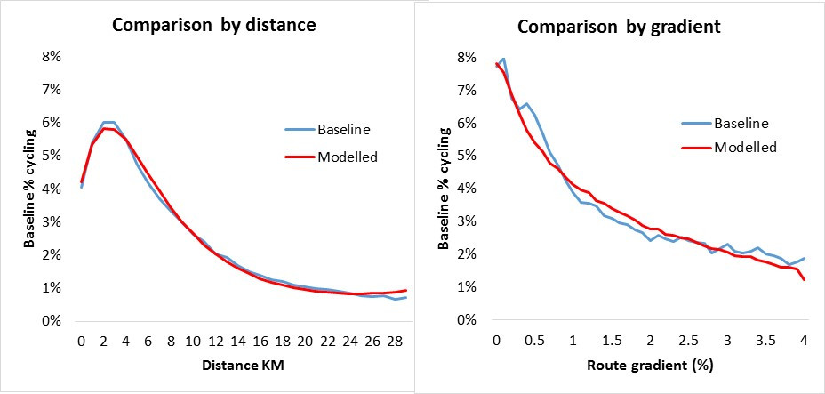

```{r, echo=FALSE, include=FALSE}
# runtime: shiny
pkgs <- c("grid", "png", "knitr")
lapply(pkgs, library, character.only = T)
# Evidence shows that high quality infrastructure can boost local cycling rates, but only if interventions are made in appropriate places. This creates demand for new methods prioritise where to invest. The paper will describe methods for assessing the geographical distribution of cycling potential using case study data from England and Andalucia. An online tool that uses some of these methods has already been built for England (see www.pct.bike for a live demonstration) and suggests that the methods have great potential to scale internationally. Four scenarios have been developed so far, including 'Go Dutch' and 'Ebikes'. We would like to explore the creation of more scenarios to envision a world where cycling is the natural choice for short trips, and to plan effectively to make this happen. The main focus of this paper is how new methods in computing and Geographic Information Systems (GIS) could be useful internationally. This is clearly dependent on available datasets, so substantial energy is devoted to discussion of data opportunities and limitations, including from OpenStreetMap (OSM) and official open data. We discuss the opportunities associated with new methods and datasets and conclude that open source software, supported by a community of researchers, cycling advocates and public sector employees, may be the best way to make the methods for assessing the geographical distribution of cycling potential and strategic planning for cycling accessible and useful worldwide.

# KEYWORDS: cycling potential, modal shift, infrastructure evaluation
# PERIOD: 2015-01-01 until 2017-12-30.
# ACKNOWLEDGEMENTS: The UK’s Department for Transport (DfT) for funding the initial work. Ricardo Marques for assisting with the Andalusian case study. The Region of Andalusia for providing GIS data.
```

## Presentation structure

-  Context
-  Software and methods
-  Implementation in the PCT

# Context

## Motivation I: Practical need
<!--  -->

```{r, echo=FALSE}
knitr::include_graphics("http://static.tweakers.net/ext/f/9PVa9WKvx5SPZw3clpxEPkGA/full.jpg")
```

Disjointed networks 

## Motivation II: Current tools not suitable

```{r, echo=FALSE, out.width="50%"}
knitr::include_graphics(c("../figures/746px-Pistol-grip_drill.svg.png", "../figures/sdna-san-fran.png"))
```

# Software and methods

## Why R?

See the free, open source, online tutorial [github.com/robinlovelace/Creating-maps-in-R](https://github.com/Robinlovelace/Creating-maps-in-R).

- Mature framework for computational work
- Widely used by governments, industry and academia
- Vast support network
- Strong support for spatial data
- Free and open source

## Creating desire lines in code | Reproducible code

```{r}
library(stplanr)
print(flow[1,1:3])
l = od2line(flow = flow, cents)
```

## An OD matrix on a map

```{r}
plot(cents)
plot(l, add = T)
```

## Distance decay

```{r, echo=FALSE}

```

## How it works

See Lovelace, Goodman et al. (2016) for details


## How it works II | It depends on trip distances

```{r, echo=FALSE, out.width = '50%', fig.cap="Modal share of trips made by cycling for English commutes in West Yorkshire (left) and Oxfordshire (right) currently and under 4 scenarios of change.", fig.show='hold'}
knitr::include_graphics(c("../figures/dd-west-yorks.png", "../figures/dd-ox.png"))
```

## Route allocation


## Route network analysis


# Implementation

## Live demo of the PCT

See http://pct.bike/

[](https://github.com/npct/pct/raw/master/figures/rnet-leeds-base-to-godutch.png)


## Policy impact

“The PCT shows the country’s great potential to get on their bikes, highlights the areas of highest possible growth and will be a useful innovation for local authorities to get the greatest bang for their buck from cycling investments  and realise cycling potential.” Andrew Jones, Parliamentary Under Secretary of State for Transport

“A world first from a brilliant academic team. As a Department we should be celebrating this example of innovation in promoting the UK’s capability to deliver innovation in transport planning.” Pauline Reeves, DfT Deputy Director Sustainable Accessible Transport

## Policy impact II
 
“Initial outputs from the PCT for Cornwall have already been useful in evidencing that our relatively hilly area has good cycling potential, concentrated in specific  areas. The areas we are focusing capital investment e.g. Bodmin are indicated as having high potential, despite low current cycling. Given the greater potential under the E-bike scenario, we will be exploring ways to make this option more affordable.” Victoria Fraser, Team Leader, Cornwall Council
 "ECF is pleased to support the PCT and its international potential to use data for the development of bicycle policies" Randy Rzewnicki, European Cycling Federation

## Making it work in other countries

Needs origin-destination data, widely available:

- From census (UK)
- From travel survey (needs to 'scale up')
- From mobile telephone companies
- From a Spatial Interaction model

## In summary...

> - The PCT provides an evidence base about **where** to intervene
> - Freely available for all to use
> - Open source and transparent
> - Complements local knowledge, tools and data
> - Should help get people on same page

<!-- ## The propensity to cycle in Leicester -->

<!-- Local 'build' for the local authority -->

<!-- ```{r, echo=FALSE} -->
<!-- knitr::include_graphics("../figures/leicester.png") -->
<!-- ``` -->

## Thanks for listening!

- Thanks to the institutions behind the PCT team: Universities of Cambridge, Leeds and Westminster.

- The PCT was delivered in partnership with Brook Lyndhurst (Phase I) and Atkins (Phase II).

- Thanks to CycleStreets.net and everyone who has contributed

- Thanks to the Department for Transport for funding and especially to Shane Snow for commissioning the tool, and for support and feedback.

- See `@robinlovelace` for updates from me!

## Links

The PCT website: http://www.pct.bike/

"Mapping out the future of cycling." Introductory article on how it works: Get Britain Cycling, 2016. P. 22 - 24. Available from [getbritaincycling.net](http://getbritaincycling.net/)

Academic paper on the subject: “The Propensity to Cycle Tool: An Open Source Online System for Sustainable Transport Planning.” arXiv:1509.04425 [Cs], 2016. http://arxiv.org/abs/1509.04425.

The source code of the project: https://github.com/npct


<!-- [arxiv.org/abs/1509.04425](http://arxiv.org/abs/1509.04425) -->

