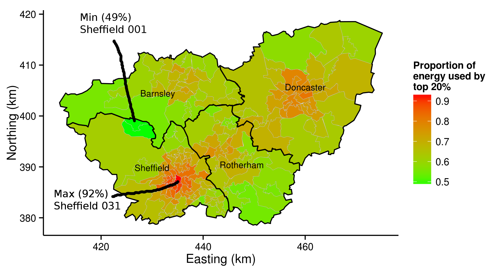
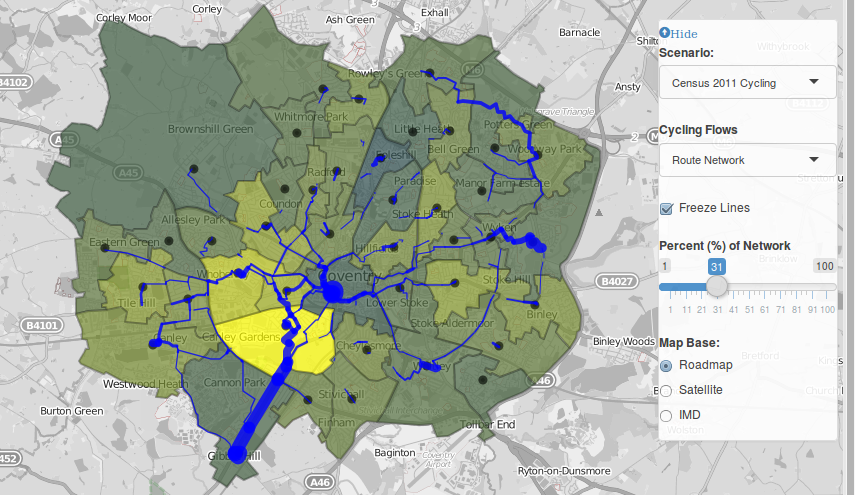
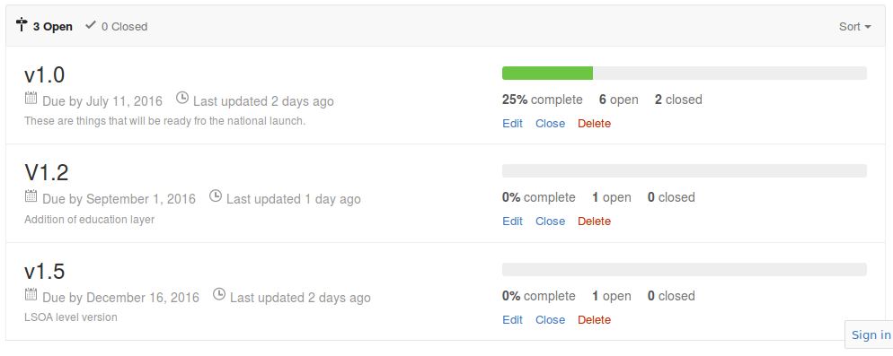
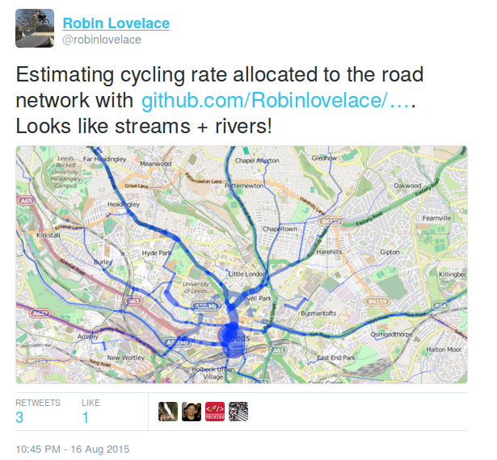
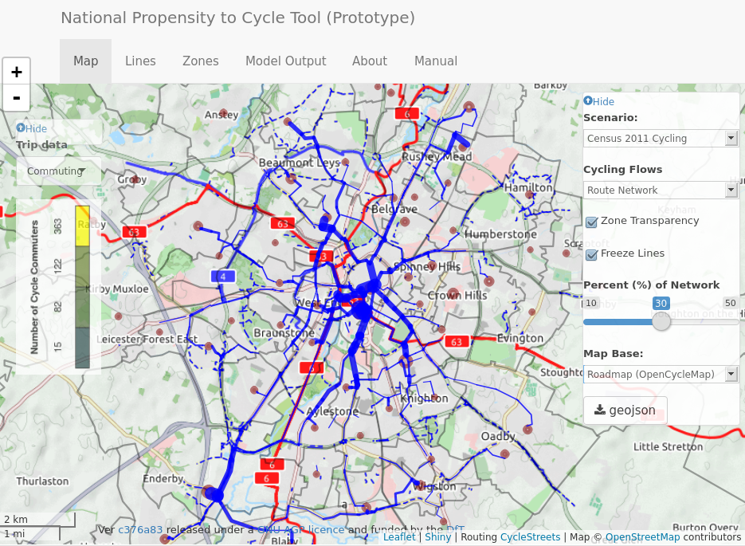

```{r, echo=FALSE, include=FALSE}
# runtime: shiny
pkgs <- c("grid", "png", "knitr")
lapply(pkgs, library, character.only = T)
# bibliography: "~/Documents/R.bib"
# Notes for Judith's talk
# Add paper on replacing car trips with bike trips
# Add stuff on QGIS
# 
```

## Presentation structure

-  Demo of the tool and software for sustainable transport
-  Design and development
-  Uses of the PCT

# Demo of the tool and software for sustainable transport

## Live demo of the PCT

See http://pct.bike/

[](https://github.com/npct/pct/raw/master/figures/rnet-leeds-base-to-godutch.png)

# Design and development

## Motivations
<!--  -->

```{r, echo=FALSE}
knitr::include_graphics("http://static.tweakers.net/ext/f/9PVa9WKvx5SPZw3clpxEPkGA/full.jpg")
```

Disjointed networks 

## Background research

```{r, echo=FALSE}

```

Source: @lovelace_energy_2014.

## The PCT team

A diverse bunch

- James Woodcock (Cambridge University, Health Modelling)
- Anna Goodman (LSHTM, Statistics)
- Rachel Aldred (Westminster, Sociology, Transport Inequalities)
- Robin Lovelace (University of Leeds, Geography, Environmental Science)
- Ali Abbas (University of Cambridge, Computer Science)
- Alvaro Ullrich (University of Cambridge, Data Management)
- Nikolai Berkoff (Independent Developer)

## How it works

See @lovelace_propensity_2015 for details


## Route allocation


## Route network analysis



## Timeline

```{r, echo=FALSE}

```

- See [github.com/npct/pct-shiny/milestones](https://github.com/npct/pct-shiny/milestones) to track the PCT's development

## Phase I (Feb - July 2015)

-  Build and test a prototype model
-  Identify 'desire lines' of greatest potential
-  Make the tool scalable nationally
-  Create a website that will make the Propensity to Cycle Tool a publicly accessible resource

## Phase II (January 2016 - March 2017)

**Version 1 - nationwide (V1 launch: June 2016)**

-  ~Route-allocated hilliness, network layer~
-  ~Include health outcomes (HEAT)~
-  ~National-level results~
-  V1.5 - smaller (LSOA) zones (Jan 2017)
-  Training

**Version 2 - local deployment**

-  Include non-commute trips
-  Compatibility with Local Authority trip demand models
-  Micro-level analysis (V 2.2)

## Bonus extras

<div class="columns-2">

- CO~2~ savings
- Route Network layer
> - See [gis.stackexchange.com](http://gis.stackexchange.com/questions/139681/overlaying-lines-and-aggregating-their-values-for-overlapping-segments) for code!

```{r, echo=FALSE}

```


</div>

# Uses of the PCT

## Currently

> - Strategic network planning
> - Public engagement
> - 'Visioning' [@tight_visions_2011]
> - Estimating health benefits of uptake

## With further work

> - Creating local builds and informing local targets and 
> - Modelling impacts of new developments
> - Crowd-sourced transport planning
> - A global PCT

## Another example use: are 'fast' routes 'quiet'?

Which cities are these? What's the difference?

```{r, echo=FALSE, out.width="100%"}
knitr::include_graphics(c("../figures/rf-lei.png", "../figures/fq-cam.png"))
```


## In summary...

> - The PCT provides an evidence base about **where** to intervene
> - Freely available for all to use
> - Open source and transparent
> - Complements local knowledge, tools and data
> - Should help get people on same page

## The propensity to cycle in Leicester

Local 'build' for the local authority

```{r, echo=FALSE}

```

## Thanks for listening!

See `@robinlovelace` online for more

<!-- [arxiv.org/abs/1509.04425](http://arxiv.org/abs/1509.04425) -->

