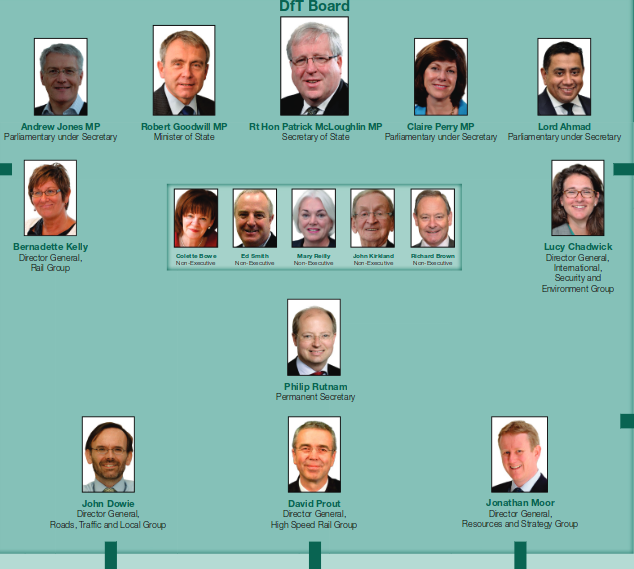
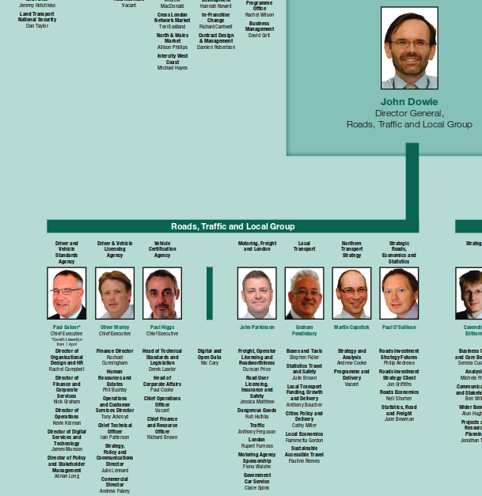
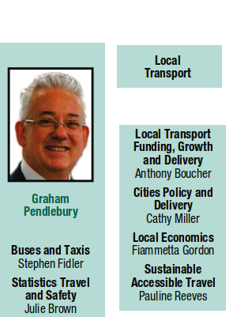
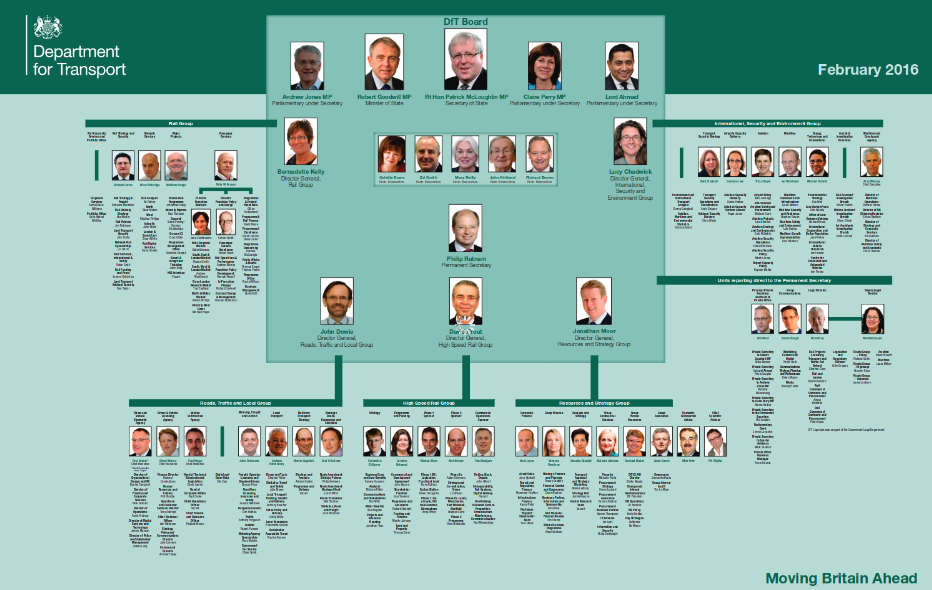
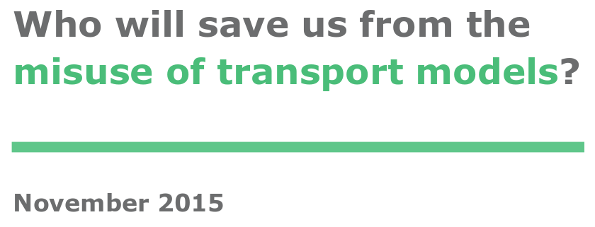
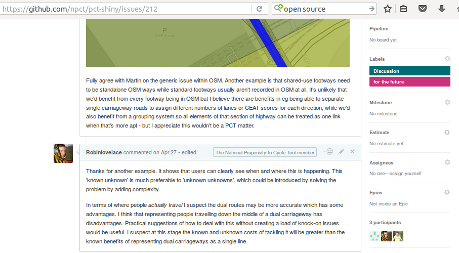

```{r, echo=FALSE, include=FALSE}
# runtime: shiny
pkgs <- c("grid", "png", "knitr")
lapply(pkgs, library, character.only = T)
opts_chunk$set(echo = FALSE)
```

## Talk structure

1) Open source tools in statistics/transport

2) Computing needs of transport planners

3) Case studies (stplanr + PCT)

> - But first some context
> - Then let's talk solutions

# Context

## Premises

- The transport system is not working well for anyone

> - To 'fix' it, policy interventions are needed

- Policy interventions can be more effective when locally targetted

> - However, there are infinite potential interventions at the local level
> - Evidence is needed to prioritise among the infinity of options 

- Only a systematic and objective evidence base will do

> - And that means data + statistics! 🔢

> - And that means computing 🖥️

> - And that means human-computer interaction 👨👩💻

- And that means software is vital for sustainable transport policy

## What's wrong with the transport system? | "Works fine for me"

<iframe width="560" height="315" src="https://www.youtube.com/embed/zI0dPGuP2zE" frameborder="0" allowfullscreen></iframe>

## Some transport statistics

- Transport eats time. We spend on average 6% of our lives (sleeping/resting: 37%; commuting: 1%; paid work:  25%)   [@king_worktime_2017].

- Transport eats space. More than half many US cities spaces are occupied by parking (~20%) and streets (~40%). In Texas, for example, 21.3% of land space was taken by surface parking (Source: [oldurbanist.blogspot.co.uk](http://oldurbanist.blogspot.co.uk/2011/12/we-are-25-looking-at-street-area.html))

- Transport eats energy. In 2015 it accounted for **39.9%** of final energy consumption ([DECC](https://www.gov.uk/government/uploads/system/uploads/attachment_data/file/579542/ET_Dec_16.pdf)).

## Space used by transport (USA)

```{r}
knitr::include_graphics("http://2.bp.blogspot.com/-qCJTu0lkA4A/TuVawC6PDTI/AAAAAAAAAZA/Fn0zH8n2CTw/s1600/Parking_Houston_v2.jpg")
```

## Energy use in transport (UK)

```{r}
knitr::include_graphics("../figures/transport-40pc-energy.png")
```


## Energy use in Transport nationally

> Final  energy  consumption  (excluding  non-energy  use)  was  1.9  per  cent  higher  than  in  
2014 [0.3% seasonally adjusted],  with  rises  in  the  domestic,  transport  and  services  sectors  but  with  a  fall  in  the  industrial sector. The  rise  in  consumption  was  due  to  increased  
transport demand likely due to lower petroleum prices.

([DECC 2016](https://www.gov.uk/government/uploads/system/uploads/attachment_data/file/513244/Press_Notice_March_2016.pdf))

## Transport fuel prices | Source: [DECC 2016](https://www.gov.uk/government/uploads/system/uploads/attachment_data/file/513244/Press_Notice_March_2016.pdf)

```{r}
knitr::include_graphics("../figures/transport-fuel-prices-to-2016.png")
```

## Tools for the trade

```{r, echo=FALSE, out.width="50%"}
knitr::include_graphics(c("../figures/746px-Pistol-grip_drill.svg.png", "../figures/sdna-san-fran.png"))
```

<!-- ## Institutional structures I: Board | Source: [Department for Transport](https://www.gov.uk/government/uploads/system/uploads/attachment_data/file/500776/dft-organisation-chart.pdf) -->

<!-- ```{r, echo=FALSE, out.width="60%"} -->
<!--  -->
<!-- ``` -->

<!-- Over half of trips are < 5 miles -->

<!-- ## Institutional structures II: Roads Traffic and Local Group -->

<!-- ```{r, echo=FALSE, out.width="60%"} -->
<!--  -->
<!-- ``` -->

<!-- ## Institutional structures III: Local Transport -->

<!-- ```{r, echo=FALSE, out.width="40%"} -->
<!--  -->
<!-- ``` -->

<!-- Even though my talk is about modelling, it is of course takes place in a political context -->

<!-- ## Institutional structures | A root cause of the 'problem' -->

<!-- ```{r, echo=FALSE, out.width="80%"} -->
<!--  -->
<!-- ``` -->

# The origins of transport modelling

## Inspiration for this section | Forecasting urban travel

- Book by @boyce_forecasting_2015

```{r}
include_graphics("http://www.e-elgar.com/shop/media/catalog/product/cache/1/image/225x/040ec09b1e35df139433887a97daa66f/9/7/9781848449602_4_1.jpg")
```

## Origins of Transport planning | Credit: Crispin Cooper. See [cardiff.ac.uk/sdna/](http://www.cardiff.ac.uk/sdna/)

```{r, echo=FALSE, out.width="70%"}
knitr::include_graphics("../figures/sdna-san-fran.png")
```

## The origins of modelling

> - "urban travel forecasting was definitely 'where the action was' for young transportation engineers and planners entering the field in the 1960s" [@boyce_forecasting_2015, p. 67].

> - heavily restricted by computing power

> - no consideration of walking or cycling

# Proprietary software vs sustainability

## Transport planning tools: expensive...

```{r, echo=FALSE}
grid.raster(readPNG("../figures/software-costs.png"))
```

## And potentially dangerous!



Source: [Who will save us from transport models](http://www.ctthink.com/publications.html) (Hollander 2015)

See also work by [Robert Bain](http://ibtta.org/sites/default/files/The%20Reasonableness%20of%20Traffic%20Forecasts.pdf)

## Tools for transport planning I | Source: [Pixton.com](https://www.pixton.com/comic/xya3s212)

```{r, echo=FALSE, out.width="60%"}
# download.file("https://en.wikipedia.org/wiki/Black_box#/media/File:Blackbox3D-withGraphs.png",
#               "figures/Blackbox.png", mode = "wb")
knitr::include_graphics("../figures/Blackbox.png")
```

> - Are black boxes

<!-- I had quite rant about this last - won't dwell on it too much and will focus on solutions rather than problems -->

## Tools for transport planning II | Source: [openclipart](https://openclipart.org/download/188748/manwithbighammer.svg)

```{r, echo=FALSE, out.width="30%"}
knitr::include_graphics("https://openclipart.org/download/188748/manwithbighammer.svg")
```

> - Tools are blunt

## Tools for transport planning III | Source: By James Albert Bonsack (1859 – 1924), [Wikimedia](https://commons.wikimedia.org/w/index.php?curid=1267158)

```{r, echo=FALSE, out.width="50%"}
knitr::include_graphics("https://upload.wikimedia.org/wikipedia/commons/thumb/c/ce/Bonsack_machine.png/800px-Bonsack_machine.png")
```

> - Are sometimes too complex!

> - Implications for others

# An open source approach

## Open source software for transport planning {.smaller}

```{r, echo=FALSE, message=FALSE, warning=FALSE}
f = "~/repos/foss4t/ossTransportToolsList.csv"
if(file.exists(f)) {
  d = readr::read_csv(f)
  d = d[1:3]
  d = d[!grepl(pattern = "GEOS|GD", x = d$`Softare product`),]
  knitr::kable(d)
}
```

## A broad classification, and use cases

- General purpose products that have found many transport applications

> - Python
> - R
> - QGIS

- Dedicated transport programs

> - MATSim
> - SUMO

- Add-on packages that providing transport planning capabilities to existing (mature) programs

> - stplanr
> - AequilibraE
> - activitysim

## The wider movement

- Open data
- Publicly accessible
- The wider community

## Open source in other sectors

```{r, echo=FALSE, out.height="85%"}
include_graphics("http://thewindowsclub.thewindowsclubco.netdna-cdn.com/wp-content/uploads/2015/01/How-to-Make-Money-Using-Open-Source-Software.png")
```

> - We can learn from 'early adopter' sectors

## Community buy-in

```{r, echo=FALSE, out.width="80%"}

```

## Testing many tools | Source: [Camcycle.org](https://www.camcycle.org.uk/blog/2015/10/23/milton-road-elizabeth-way-junction-proposals/)

<iframe allowfullscreen="" frameborder="0" height="375" mozallowfullscreen="" src="https://player.vimeo.com/video/143309697" webkitallowfullscreen="" width="500"></iframe>

## Participatory planning

```{r, echo=FALSE}
knitr::include_graphics("http://robinlovelace.net/figure/cconnect.png")
```

## Envisioning shifting travel patterns | Source: Leeds Cycling Campaign

```{r, echo=FALSE}
knitr::include_graphics("http://leedscyclingcampaign.co.uk/sites/default/files/Residential%20Street%20small_0.jpg")
```

## Incorporation of new digital technologies

```{r, echo=FALSE}
knitr::include_graphics("http://images.cdn.stuff.tv/sites/stuff.tv/files/styles/big-image/public/news/see-sense-light.jpg")
```

<!-- ## Summary -->

<!-- - Transport problems are multi-faceted so 'techno-fixes' are not enough -->
<!-- - Transport models are close to the root of the problem -->
<!-- - They were not developed to solve current transport problems -->
<!-- - Open source software has flourished in other sectors -->
<!-- - Open source software offers many benefits for transport planners, including: -->
<!--     - Encourages community particupation -->
<!--     - Reduces costs -->
<!--     - Increases collaboration -->

<!-- > - How do we get there? -->

# Live demo

## Origin-destination data

```{r, eval=FALSE, echo=TRUE}
install.packages("stplanr")
```

```{r, echo=TRUE}
library(stplanr)
data("flow")
nrow(flow)
flow[1:3, 1:3]
```

## Spatial data

```{r, echo=TRUE, warning=FALSE}
data("cents")
cents@data[1:2,]
desire_lines = od2line(flow = flow, zones = cents)
plot(desire_lines)
points(cents)
```

## Transport planning is somthing you *do* | Source: the Propensity to Cycle Tool (PCT) @lovelace_propensity_2016

See http://www.pct.bike/

[](https://github.com/npct/pct/raw/master/figures/rnet-leeds-base-to-godutch.png)

# Discussion

## The case for open source software in transport planning

Practical reasons

> - It's cheaper
> - Faster evolving
> - More robust: more eyes on it

Philosophical reasons

> - Transport Planning is intertwined with democracy and power relations
> - People will try to manipulate it for own benefits - transparency/reproducibility = key
> - Control of public sector organisations over their data and analysis capabilities
> - Hypothesis: Use open source -> greater good

## Common objections to open source software

> - It's not user friendly
> - It's not where jobs are (now)
> - It doesn't have the support of trusted suppliers
> - Anyone can come and 'hack' your code!
> - Developer's don't get paid
> - Any more?

## Open source software has no warranty...

Twitter image of other software

## What to keep, what to replace?

```{r, echo=FALSE}
difftable = read.csv(text = 
"Keep, Replace, How
Terminology, Inaccessible, Online tools
Equations, Proprietary ownership, Open source licences
Use of scenarios, Ageing software, New software
, Narrow scenarios of future, Flexible models
, Black boxes, Simple and open method"
  )
knitr::kable(difftable)
```

## Overlaps between energy and software transition

- Both require 'systemic' change [@beddoe_overcoming_2009]
- They seem like technical problems on the outset but are highly political
- It takes time, commitment and persuasion
- The benefits take time to realise

Could there be a mutually reinforcing feedback loop:

Shift in (digital) infrastructure -> change in behaviour and priorities?

# Solutions

## We're (accidentally) doing something right in terms of coal | Source: [DECC](https://www.gov.uk/government/uploads/system/uploads/attachment_data/file/579542/ET_Dec_16.pdf). Risk: electric cars.

```{r}
knitr::include_graphics("../figures/coal-stats-2013-2016.png")
```


## Points of contention

Most people agree that:

> - Transport models are not working optimally
> - Open source software is 'good'
> - It would be good to save money and switch

Areas of disagreement:

> - How to get there
> - Whether it's a slow transition or 'cold turkey'
> - Who should write the code
> - Any volunteers (or funders)?

<!-- ## Get tooled up | How to get involved? -->

<!-- > - You ARE involved! -->
<!-- > - Try a range of tools -->
<!-- > - Contribute to the discussion -->
<!-- > - Ask questions in online forums -->
<!-- > - Try out things like Propensity to Cycle Tool and CycleStreets.net -->
<!-- > - Find out how to contribute to existing projects (e.g. osmdata) -->

## Solutions - policy

- Reducing worktime hours: "The three best performing scenarios were those that involved
employees working a four-day week as they enabled companies to reduce
energy use, and employees to reduce commuting" [@king_worktime_2017]. 

- Incentivise low carbon solutions

## References {.smaller}

Lovelace, Robin. 2016. "Mapping out the future of cycling." Get Britain Cycling, 2016. P. 22 - 24. Available from [getbritaincycling.net](http://getbritaincycling.net/)

<!-- [arxiv.org/abs/1509.04425](http://arxiv.org/abs/1509.04425) -->

