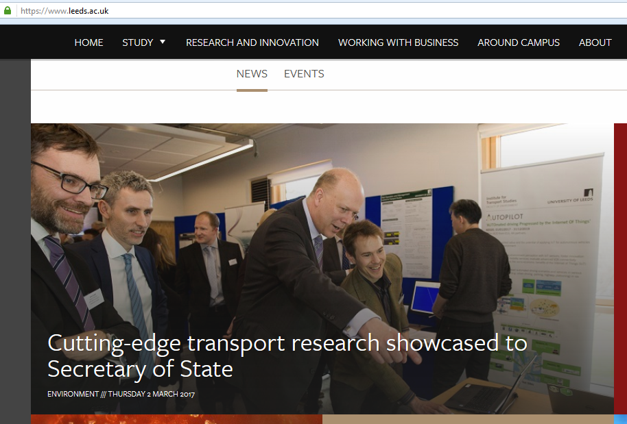
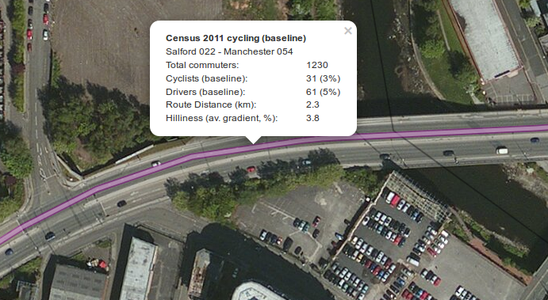
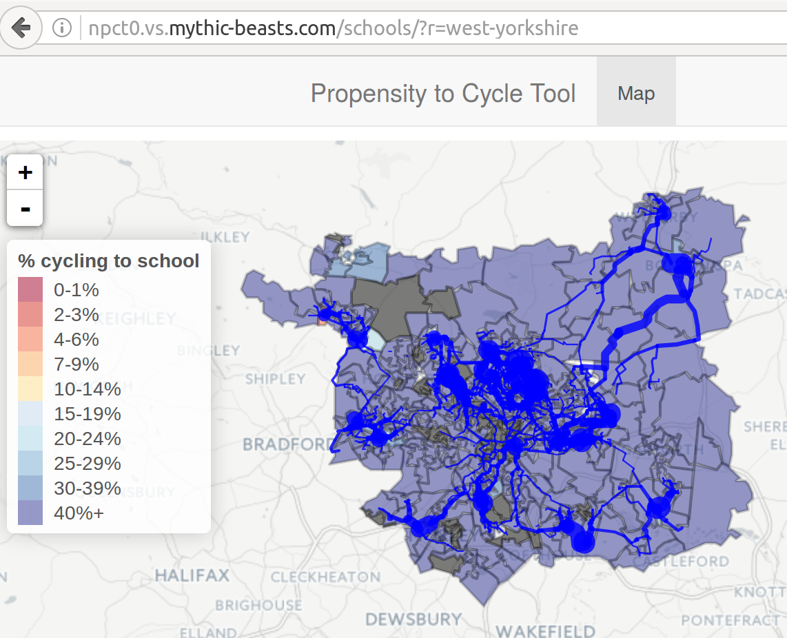
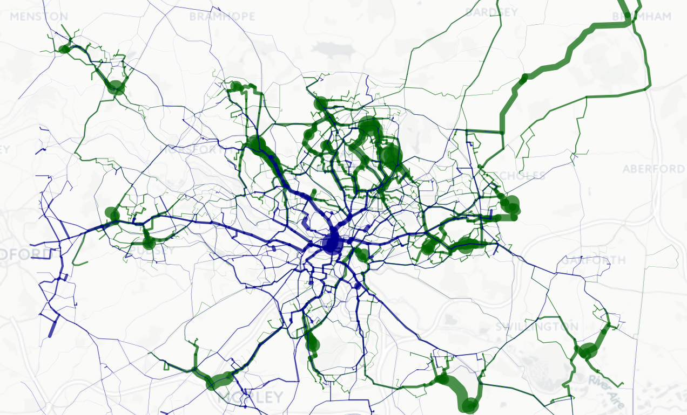

<!-- Comments:  -->

## Contents

> - Context
> - Recent additions to the PCT
> - Conclusion

> - Question: who has heard of the PCT?
> - Who has used the PCT?

# Where will cycling uptake happen?

## Prior work (source: Lovelace et al. 2017)

```{r, echo=FALSE, message=FALSE}
dft = readr::read_csv("../data-sources/cycle-tools-wide.csv")
dft$Tool = gsub("Permeability Assessment Tool", "PAT", dft$Tool)
knitr::kable(dft)
```

## The PCT team | "If you want to go far, go as a team"

Robin Lovelace (Lead Developer, University of Leeds)

- James Woodcock (Principal Investigator, Cambridge University)
- Anna Goodman (Lead Data Analyst, LSHTM)
- Rachel Aldred (Lead Policy and Practice, Westminster University)
- Ali Abbas (User Interface, University of Cambridge)
- Alvaro Ullrich (Data Management, University of Cambridge)
- Nikolai Berkoff (System Architecture, Independent Developer)
- Malcolm Morgan (GIS and infrastructure expert, UoL)

 - Academic write-up [@lovelace_propensity_2017]

 
## Policy feedback

"The PCT is a brilliant example of using Big Data to better plan infrastructure investment. It will allow us to have more confidence that new schemes are built in places and along travel corridors where there is high latent demand."

- Shane Snow: Head of Seamless Travel Team, Sustainable and Acessible Travel Division

## The PCT in CWIS and LCWIP

Included in Cycling and Walking Infrastructure Strategy (CWIS) and the Local Cycling and Walking Infrastructure Plan (LCWIP)

```{r, echo=FALSE}

```

## How the PCT works

Shows on the map where there is high cycling potential,
for 4 scenarios of change

- Government Target
- Gender Equality
- Go Dutch
- Ebikes

## Scenario shift in desire lines | Source: @lovelace_propensity_2017

```{r, echo=FALSE}
knitr::include_graphics("../flow-model/od-data-leeds.png")
```

- Origin-destination data shows 'desire lines'
- How will these shift with cycling uptake

## Scenario shift in network load

```{r, echo=FALSE}
knitr::include_graphics("../flow-model/leeds-rnet-gov-go.png")
```

## A live demo for Leeds | "Actions speak louder than words"

- Test version of [p](http://npct0.vs.mythic-beasts.com/m/?r=west-yorkshire)[ct.bike](http://pct.bike/)

```{r, echo=FALSE, out.width="100%"}

```

# Recent additions to the PCT

## Travel to schools layer | [Prototype online](http://npct0.vs.mythic-beasts.com/schools/?r=west-yorkshire)

```{r, echo=FALSE}

```

## Overlaying propensity to cycle to school and work

```{r, echo=FALSE}

```

## New LSOA layer (Morgan et al. in Press)

```{r, echo=FALSE, out.width="90%"}
knitr::include_graphics("../figures/lsoa-layer-london.png")
```

## Where to prioritise? (CyIPT)

- Cycling Infrastructure Prioritisation Toolkit (CyIPT): DfT-funded toolkit for cycling infrastructure prioritisation 
- Combines many datasets ("PCT + Infra") to identify 'low hanging fruit'

```{r, echo=FALSE, out.width="60%"}
knitr::include_graphics("https://github.com/cyipt/cyipt/raw/master/figures/schematic-flow-diagram.png")
```

# Next steps

## Many potential directions for future work

```{r, echo=FALSE, out.width="70%"}
knitr::include_graphics("../figures/pct-vs-strava-for-leeds.png")
```

## But priority is still on impact

- Case study of usage in specific contexts
- Impact on transport planning approachs
- But whole network design found to be important [@buehler_bikeway_2016]
- Shift in focus: from where to what to build
- Internationalisation

<!-- ## Conclusions -->


## References {.smaller}

> - Thanks for listening. Find me [`@robinlovelace`](https://twitter.com/robinlovelace) or contact me on r . lovelace@leeds.ac.uk