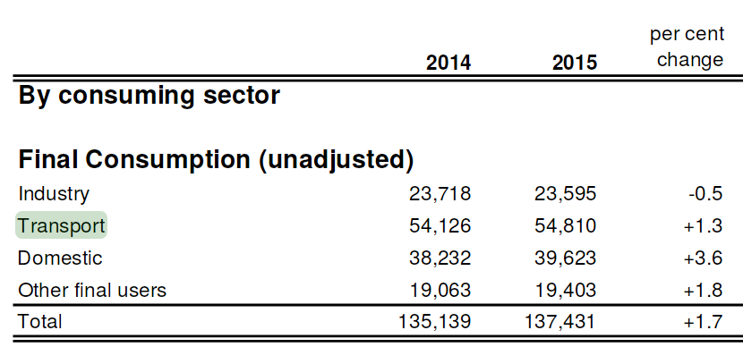
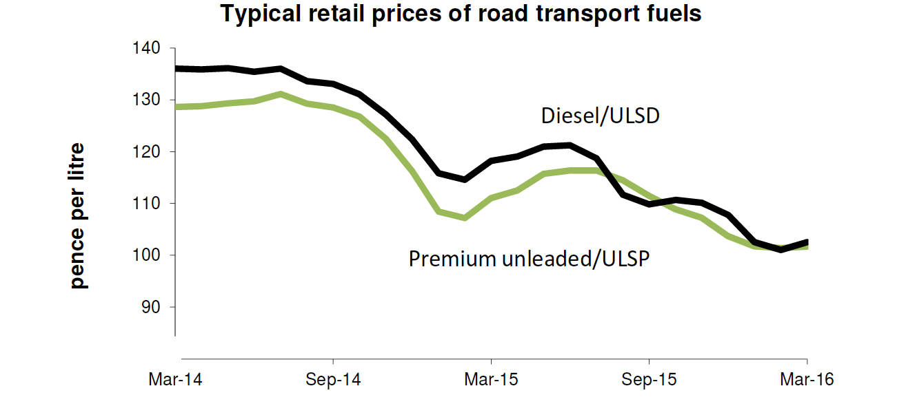
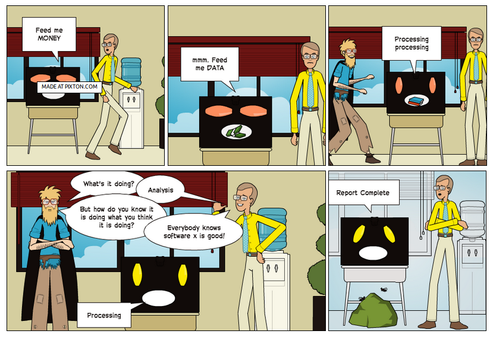
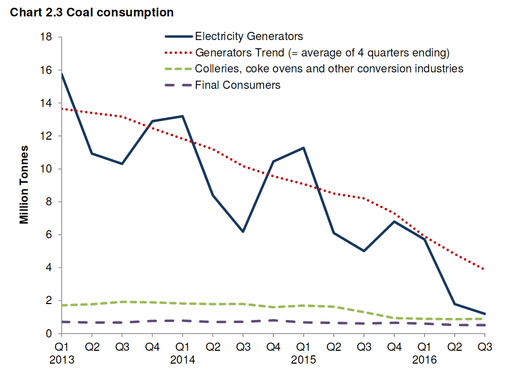

```{r, echo=FALSE, include=FALSE}
# runtime: shiny
pkgs <- c("grid", "png", "knitr")
lapply(pkgs, library, character.only = T)
opts_chunk$set(echo = FALSE)
```

## Talk structure

1) Some comments on the transport system

2) Software for modelling a zero carbon system

3) Case study of the PCT

> - But first some context
> - Then let's talk solutions

# Context

## Premises

- The transport system is not working well for anyone

> - To 'fix' it, policy interventions are needed

- Policy interventions can be more effective when locally targetted

> - However, there are infinite potential interventions at the local level
> - Evidence is needed to prioritise among the infinity of options 

- Only a systematic and objective evidence base will do

> - And that means data + statistics! 🔢

> - And that means computing 🖥️

> - And that means human-computer interaction 👨👩💻

- And that means software is vital for sustainable transport policy

## What's wrong with the transport system? | "Works fine for me"

<iframe width="560" height="315" src="https://www.youtube.com/embed/zI0dPGuP2zE" frameborder="0" allowfullscreen></iframe>

## Some transport statistics

- Transport eats time. We spend on average 6% of our lives (sleeping/resting: 37%; commuting: 1%; paid work:  25%)   [@king_worktime_2017].

- Transport eats space. More than half many US cities spaces are occupied by parking (~20%) and streets (~40%). In Texas, for example, 21.3% of land space was taken by surface parking (Source: [oldurbanist.blogspot.co.uk](http://oldurbanist.blogspot.co.uk/2011/12/we-are-25-looking-at-street-area.html))

- Transport eats energy. In 2015 it accounted for **39.9%** of final energy consumption ([DECC](https://www.gov.uk/government/uploads/system/uploads/attachment_data/file/579542/ET_Dec_16.pdf)).

## Space used by transport (USA)

```{r}
knitr::include_graphics("http://2.bp.blogspot.com/-qCJTu0lkA4A/TuVawC6PDTI/AAAAAAAAAZA/Fn0zH8n2CTw/s1600/Parking_Houston_v2.jpg")
```

## Energy use in transport (UK)

```{r}

```

## Energy use in Transport nationally

> Final  energy  consumption  (excluding  non-energy  use)  was  1.9  per  cent  higher  than  in  
2014 [0.3% seasonally adjusted],  with  rises  in  the  domestic,  transport  and  services  sectors  but  with  a  fall  in  the  industrial sector. The  rise  in  consumption  was  due  to  increased  
transport demand likely due to lower petroleum prices.

([DECC 2016](https://www.gov.uk/government/uploads/system/uploads/attachment_data/file/513244/Press_Notice_March_2016.pdf))

## Transport fuel prices | Source: [DECC 2016](https://www.gov.uk/government/uploads/system/uploads/attachment_data/file/513244/Press_Notice_March_2016.pdf)

```{r}

```

# Software for modelling a zero carbon future

## Tools for the trade

```{r, echo=FALSE, out.width="50%"}
knitr::include_graphics(c("../figures/746px-Pistol-grip_drill.svg.png", "../figures/sdna-san-fran.png"))
```

## Transport planning tools: expensive...

```{r, echo=FALSE}
grid.raster(readPNG("../figures/software-costs.png"))
```

## Tools for transport planning I | Source: [Pixton.com](https://www.pixton.com/comic/xya3s212)

```{r, echo=FALSE, out.width="60%"}
# download.file("https://en.wikipedia.org/wiki/Black_box#/media/File:Blackbox3D-withGraphs.png",
#               "figures/Blackbox.png", mode = "wb")

```

> - Are black boxes

## Tools for transport planning II | Source: [openclipart](https://openclipart.org/download/188748/manwithbighammer.svg)

```{r, echo=FALSE, out.width="30%"}
knitr::include_graphics("https://openclipart.org/download/188748/manwithbighammer.svg")
```

> - Tools are blunt

## Tools for transport planning III | Source: By James Albert Bonsack (1859 – 1924), [Wikimedia](https://commons.wikimedia.org/w/index.php?curid=1267158)

```{r, echo=FALSE, out.width="50%"}
knitr::include_graphics("https://upload.wikimedia.org/wikipedia/commons/thumb/c/ce/Bonsack_machine.png/800px-Bonsack_machine.png")
```

> - Are sometimes too complex!

> - Implications for others

## Open source software for transport planning {.smaller}

```{r, echo=FALSE, message=FALSE, warning=FALSE}
f = "~/repos/foss4t/ossTransportToolsList.csv"
if(file.exists(f)) {
  d = readr::read_csv(f)
  d = d[1:3]
  d = d[!grepl(pattern = "GEOS|GD", x = d$`Softare product`),]
  knitr::kable(d)
}
```

## Envisioning shifting travel patterns | Source: Leeds Cycling Campaign

```{r, echo=FALSE}
knitr::include_graphics("http://leedscyclingcampaign.co.uk/sites/default/files/Residential%20Street%20small_0.jpg")
```

## Incorporation of new (open source?) digital technologies

```{r, echo=FALSE}
knitr::include_graphics("http://images.cdn.stuff.tv/sites/stuff.tv/files/styles/big-image/public/news/see-sense-light.jpg")
```

# Case study of the PCT

## Transport planning is somthing you *do* | Source: the Propensity to Cycle Tool (PCT) @lovelace_propensity_2016

See http://www.pct.bike/

[](https://github.com/npct/pct/raw/master/figures/rnet-leeds-base-to-godutch.png)

## Hot off the press: the cycle to schools layer | See our [test server](http://npct0.vs.mythic-beasts.com/schools/)

```{r}
knitr::include_graphics("../figures/pct-schools-image.png")
```


## Headline result: huge potential to optimise network for children and adults

- See [rpubs.com/RobinLovelace/](http://rpubs.com/RobinLovelace/244545) for interactive map

```{r}
knitr::include_graphics("../figures/schools-commuter-overlay.png")
```

## We're (accidentally) doing something right in terms of coal | Source: [DECC](https://www.gov.uk/government/uploads/system/uploads/attachment_data/file/579542/ET_Dec_16.pdf). Risk: electric cars.

```{r}

```

## Solutions - policy

- Incentivise low carbon, healthy travel

> - Build cycle paths (where they are most needed, of appropriate design)
> - Embed walking and cycling - urban realm improvements, facilities sign-posting
> - Subsidise car sharing solutions

- Disincentivise high carbon solutions

- Creative approaches
> - Reducing worktime hours: "The three best performing scenarios were those that involved
employees working a four-day week as they enabled companies to reduce
energy use, and employees to reduce commuting" [@king_worktime_2017]. 

## The overlay between travel to school and work layers

- Setup:

```{r, echo=TRUE, warning=FALSE}
library(sp)
# load data
rf_schools = readRDS("~/npct/pctSchoolsUK/pctSchoolsApp/data/west-yorkshire/rnet.Rds")
rf_commute = readRDS("~/npct/pct-data/west-yorkshire/rnet.Rds")

# create bounding box polygon
bbox_poly = stplanr::bb2poly(rf_schools)
proj4string(bbox_poly) = proj4string(rf_commute)

# spatial subset
rf_commute = rf_commute[bbox_poly,]
```

## Origin-destination data

```{r, eval=FALSE, echo=TRUE}
install.packages("stplanr")
```

```{r, echo=TRUE}
library(stplanr)
data("flow")
nrow(flow)
flow[1:3, 1:3]
```

## Spatial data

```{r, echo=TRUE, warning=FALSE}
data("cents")
cents@data[1:2,]
desire_lines = od2line(flow = flow, zones = cents)
plot(desire_lines)
points(cents)
```

## Visualisation code | Results: see [rpubs.com/RobinLovelace/](http://rpubs.com/RobinLovelace/244545)

```{r, echo=TRUE}
library(tmap)
tmap_mode("view")
m = tm_shape(rf_schools) +
  tm_lines(lwd = "dutch_slc", scale = 20, col = "darkgreen") +
  tm_shape(rf_commute) +
  tm_lines(lwd = "dutch_slc", scale = 20, col = "darkblue")
```

## References {.smaller}

Lovelace, Robin. 2016. "Mapping out the future of cycling." Get Britain Cycling, 2016. P. 22 - 24. Available from [getbritaincycling.net](http://getbritaincycling.net/)

<!-- [arxiv.org/abs/1509.04425](http://arxiv.org/abs/1509.04425) -->

