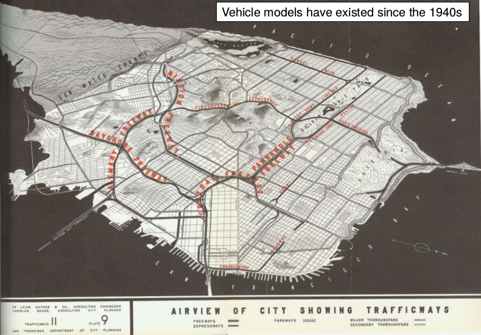

<!-- Plan: 15 minute presentation building on pct work and mlCars stuff -->

## Outline

- Why Go Dutch
- Dutch Leeds
- Where next?

# Why Go Dutch?


## Provided a framework to model any travel phenomenon

> - Vital to the history of transport modelling [@boyce_forecasting_2015]



## The propensity to cycle tool ([www.pct.bike](https://www.pct.bike/))  | [Source:](https://www.jtlu.org/index.php/jtlu/article/view/862) [@lovelace_propensity_2017]

```{r, echo=FALSE}
knitr::include_graphics("../flow-model/leeds-rnet-gov-go.png")
```


