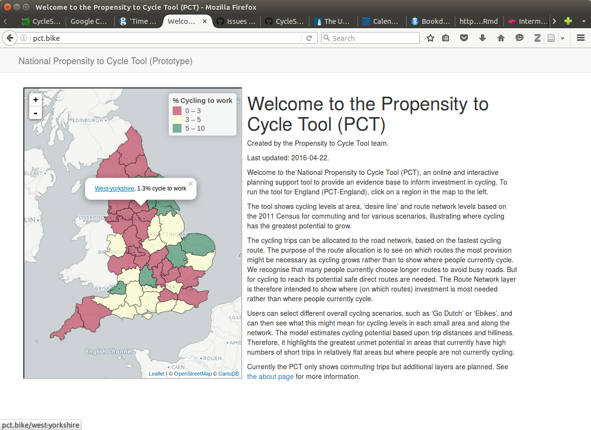

<!-- Plan: 15 minute presentation building on pct work and mlCars stuff -->

## Outline

- Introduction: the Propensity to Cycle Tool
- Packages for transport data
- Where next?

# Introduction

## The Propensity to Cycle Tool - see [w](http://npct0.vs.mythic-beasts.com/shiny_interface/?r=west-yorkshire)[ww.pct.bike](www.pct.bike)

```{r, echo=FALSE, fig.cap="The front page of the open source, open access Propensity to Cycle Tool (PCT).", out.width="100%"}

```

## Context: from concept to implementation

<!-- Not a rabbit out of a hat! -->
> - 3 years in the making
> - Origins go back further

```
Concept (PhD) -> Job at UoL (2009 - 2013)
 Discovery of R programming and shiny (2013)
  'Propensity to Cycle' bid by DfT via SDG (2014)
    Link-up with Cambridge University and colleagues (2015)
     Implementation on national OD dataset, 700k routes (2016)
      Completed LSOA phase (4 million lines!) (2017)
```

 > - 2018: (Global PCT?) 
 
 - Now publised in the Journal of Transport and Land Use (JTLU) [@lovelace_propensity_2017]

 
## Prior work (source: Lovelace et al. 2017)

```{r, echo=FALSE, message=FALSE}
dft = readr::read_csv("~/npct/pct/data-sources/cycle-tools-wide.csv")
dft$Tool = gsub("Permeability Assessment Tool", "PAT", dft$Tool)
knitr::kable(dft)
```

## The PCT team | "If you want to go far, go as a team"

Robin Lovelace (Lead Developer, University of Leeds)

- James Woodcock (Principal Investigator, Cambridge University)
- Anna Goodman (Lead Data Analyst, LSHTM)
- Rachel Aldred (Lead Policy and Practice, Westminster University)
- Ali Abbas (User Interface, University of Cambridge)
- Alvaro Ullrich (Data Management, University of Cambridge)
- Nikolai Berkoff (System Architecture, Independent Developer)
- Malcolm Morgan (GIS and infrastructure expert, UoL)
 
## Policy feedback

"The PCT is a brilliant example of using Big Data to better plan infrastructure investment. It will allow us to have more confidence that new schemes are built in places and along travel corridors where there is high latent demand."

- Shane Snow: Head of Seamless Travel Team, Sustainable and Acessible Travel Division

"The PCT shows the country’s great potential to get on their bikes, highlights the areas of highest possible growth and will be a useful innovation for local authorities to get the greatest bang for their buck from cycling investments  and realise cycling potential."

- Andrew Jones, Parliamentary Under Secretary of State for Transport

## The PCT in CWIS and LCWIP

Included in Cycling and Walking Infrastructure Strategy (CWIS) and the Local Cycling and Walking Infrastructure Plan (LCWIP)

```{r, echo=FALSE}
knitr::include_graphics("~/npct/pct/figures/front-page-leeds-pct-demo.png")
```

## How the PCT works

Shows on the map where there is high cycling potential,
for 4 scenarios of change

- Government Target
- Gender Equality
- Go Dutch
- Ebikes

## Scenario shift in desire lines | Source: @lovelace_propensity_2017

```{r, echo=FALSE}
knitr::include_graphics("~/npct/pct/flow-model/od-data-leeds.png")
```

- Origin-destination data shows 'desire lines'
- How will these shift with cycling uptake

## Scenario shift in network load

```{r, echo=FALSE}
knitr::include_graphics("~/npct/pct/flow-model/leeds-rnet-gov-go.png")
```

## A live demo for Newcastle | "Actions speak louder than words"

- Test version of [p](http://npct0.vs.mythic-beasts.com/m/?r=west-yorkshire)[ct.bike](http://pct.bike/)

```{r, echo=FALSE, out.width="100%"}
knitr::include_graphics("../flow-model/man-trinity-way-satellite.png")
```

# Packages for transport data

## stplanr

**stplanr** lives here: https://github.com/ropensci/stplanr

Package can be installed from CRAN or GitHub (see the package's
[README](https://github.com/Robinlovelace/stplanr) for details),
it can be loaded in with `library()`:

```{r, eval=FALSE}
install.packages("stplanr") # stable CRAN version
# devtools::install_github("ropensci/stplanr") # dev version
```

```{r}
library(stplanr) # also loads spatial package
```


> - Dev version requires rtools on Windows

## Hosted at [ropensci/stplanr](https://github.com/ropensci/stplanr)

> - Why?

- Assisted with documentation: [ropensci/stplanr/commits?author=karthik](https://github.com/ropensci/stplanr/commits?author=karthik)
- Set-up Continuous Integration (CI): https://travis-ci.org/ropensci/stplanr


- Provided peer review of the code: https://github.com/ropensci/onboarding/issues/10 


- Plug Colin's R package courses

## Example of benefits of peer review

> Use `@importFrom` whenever possible. Right now you have `import(openxlsx)` and `import(sp)` in your NAMESPACE file. Just import the functions you need. Same for other pkg deps. 

> Tests: Pleae write tests to cover at least all the major functions before we accept. Use `testthat::skip_on_cran()` for any tests that do web requests, so that CRAN tests don't fail in case a service is temporarily down

## Addition of better API key handling

> I think token's can be a bit easier for the user. Right now you have e.g.,

```{r, eval=FALSE}
if (!Sys.getenv('CYCLESTREET') == "") {
    cckey <- Sys.getenv('CYCLESTREET')
}
if(is.null(cckey)){
    stop("You must have a CycleStreets.net api key saved as 'cckey'")
}
```

## Importance of documentation: test datasets

```{r, echo=FALSE}
d = read.csv(text = "
cents,            SpatialPointsDataFrame of home locations for flow analysis.
destination_zones,example destinations data
destinations,     example destinations data
flow,             data frame of commuter flows
flow_dests,       data frame of invented commuter flows with destinations in a different layer than the origins
flowlines,        SpatialLinesDataFrame of commuter flows
routes_fast,      SpatialLinesDataFrame of commuter flows on the travel network
routes_slow,      SpatialLinesDataFrame of commuter flows on the travel network
zones,            SpatialPolygonsDataFrame of home locations for flow analysis.
           ")
knitr::kable(d)
```

## Example data: 'Flow' or OD data

```{r}
data("flow", package = "stplanr")
head(flow[c(1:3, 12)])
```

## Centroids data

```{r}
data("cents", package = "stplanr")
as.data.frame(cents[1:3,-c(3,4)])
```

## Creating a single desire line

```{r}
flow_single_line = flow[4,] # select only the first line
desire_line_single = od2line(flow = flow_single_line, zones = cents)
```

```{r, echo=FALSE}
plot(cents)
o = cents[cents$geo_code %in% flow$Area.of.residence[4],]
d = cents[cents$geo_code %in% flow$Area.of.workplace[4],]
points(o, cex = 5)
points(d, cex = 5)
```


## What just happened?

- We selected a single 'od-pair' (`flow[4,]`)
- The function `od2line()` matched the cents matching the lines and created a line (the hard bit)
- How? Check the source code!

```{r}
od2line
```

## A hard-coded version:

```{r}
o = cents[cents$geo_code %in% flow$Area.of.residence[4],]
d = cents[cents$geo_code %in% flow$Area.of.workplace[4],]
l_single = Lines(list(Line(rbind(o@coords, d@coords))), ID = 1)
l_sp = SpatialLines(LinesList = list(l_single))
```

## Visualising the result

```{r}
plot(cents)
points(o, cex = 5)
points(d, cex = 5)
flow[4, 1:3]
plot(l_sp, add = TRUE)
```

## Creating 'desire lines' for all flows

```{r, warning=FALSE}
l <- od2line(flow = flow, zones = cents)
# remove lines with no length
l <- l[!l$Area.of.residence == l$Area.of.workplace,]
plot(l, lwd = l$All / 10)
```


## Plot the result on an interactive map

```{r}
library(tmap)
tmap_mode("view")
qtm(cents) + tm_shape(l) +
  tm_lines(col = "Bicycle", palette = "BuPu", lwd = 5)
```


## Allocating flows to the transport network

**stplanr** has various functions for route allocation:

```{r, eval=FALSE}
route_cyclestreet() # UK, cycling
route_graphhopper() # worldwide, any mode
route_transportapi_public() # UK, public transport
viaroute() # worldwide, any mode
```

## Routing many lines

```{r, eval=FALSE}
routes_fast = line2route(l = l)
```

```{r}
plot(l)
plot(routes_fast, add = T, col = "red")
```

# Future plans

## Routing functions

- Add more services (e.g. OpenTripPlanner)
- Integrate interface
- Add support for OSM data download and analysis
- Via interface to **[osmdatar](https://github.com/osmdatar/osmdatar)**

## Applications

- Work with practitioners to make it more useful for them (e.g. ITP)
- Link with industry (e.g. ITP)
- Make more international 
- A global propensity to cycle tool?
- Better handling of GPS data

# Where next?

## Next steps for the Propensity to Cycle Tool

- Plans to create a toolkit for cycling infrastructure prioritisation  - see [cyip.bike](http://www.cyipt.bike/map/#14/53.7956/-1.5456/grayscale)
- Combines many datasets to identify 'low hanging fruit'

```{r, echo=FALSE}
knitr::include_graphics("~/cyipt/cyipt/figures/schematic-flow-diagram.png")
```

Credit: Malcolm Morgan

## Potential for cycling - public transport integration

```{r type, echo=FALSE, fig.cap="A typology of active travel options.", out.width="100%"}
knitr::include_graphics("../infra-active/active-travel-options.png")
```

## Next steps for stplanr

- Finish paper submitted to the RJournal
- Transition to sf (1000+ lines of code, 6 month mission underway)
- Integration with other tools e.g. osmdata and dodgr
- Improvements to the user interface
- Feature requests?

## Thanks, links, references

> - Thanks for listening - get in touch via `r.lovelace@leeds.ac.uk` or `@robinlovelace`

- Download and test the dev version with:

```{r, eval=FALSE}
devtools::install_github("ropensci/stplanr")
```

- Create issues on our [issue tracker](https://github.com/ropensci/stplanr/issues)
- Check out the [vignette](https://cran.r-project.org/web/packages/stplanr/vignettes/introducing-stplanr.html)

