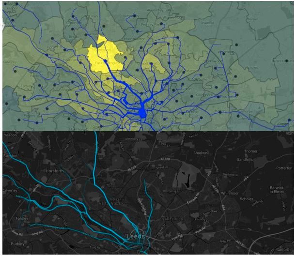

```{r, echo=FALSE, include=FALSE}
# runtime: shiny
pkgs <- c("grid", "png", "knitr")
lapply(pkgs, library, character.only = T)
# bibliography: "~/Documents/R.bib"
# Notes for Judith's talk
# Add paper on replacing car trips with bike trips
# Add stuff on QGIS
# 
```

## Presentation structure

-  Intoduction and demo of the tool 
-  Design and development
-  Uses of the PCT

# Introduction and demo

## A definition of Propensity to Cycle and its uses

> Propensity to cycle refers to the modelled
uptake of cycling at area, desire line and
route network levels under different
scenarios of the future. Policy relevant
scenarios include meeting national or local
targets, the potential uptake if people in the
study area cycled as much as the Dutch do
or the impact of electric bikes on people's
willingness to cycle longer distances. ([see Get Britain Cycling article](http://getbritaincycling.net/wp-content/uploads/2016/05/Get-Britain-Cycling_2016.pdf), 2016)

The tool aims to help prioritise **where** interventions are most needed based on where cyclable trips are most common

## Policy impact

“The PCT shows the country’s great potential to get on their bikes, highlights the areas of highest possible growth and will be a useful innovation for local authorities to get the greatest bang for their buck from cycling investments  and realise cycling potential.” Andrew Jones, Parliamentary Under Secretary of State for Transport

“A world first from a brilliant academic team. As a Department we should be celebrating this example of innovation in promoting the UK’s capability to deliver innovation in transport planning.” Pauline Reeves, DfT Deputy Director Sustainable Accessible Transport

## Policy impact II

 “The PCT provides evidence that is required in justifying the merits of policy and project decisions. The identification of unmet demand for cycling will support future funding bids and negotiations to deliver key cycle projects. Tunbridge Wells Borough Council is very pleased to have been part of the development of the tool.” Bartholomew Wren, Royal Tunbridge Wells
 
“Initial outputs from the PCT for Cornwall have already been useful in evidencing that our relatively hilly area has good cycling potential, concentrated in specific  areas. The areas we are focusing capital investment e.g. Bodmin are indicated as having high potential, despite low current cycling. Given the greater potential under the E-bike scenario, we will be exploring ways to make this option more affordable.” Victoria Fraser, Team Leader, Cornwall Council
 "ECF is pleased to support the PCT and its international potential to use data for the development of bicycle policies" Randy Rzewnicki, European Cycling Federation

## Live demo of the PCT

See http://pct.bike/

[](https://github.com/npct/pct/raw/master/figures/rnet-leeds-base-to-godutch.png)


# Design and development

## Motivations
<!--  -->

```{r, echo=FALSE}
knitr::include_graphics("http://static.tweakers.net/ext/f/9PVa9WKvx5SPZw3clpxEPkGA/full.jpg")
```

Disjointed networks 

## Background research

```{r, echo=FALSE}
knitr::include_graphics("../figures/prop20-top.png")
```

Source: PhD Thesis "The Energy Costs of Commuting" (Lovelace, 2014).

## The PCT team

- James Woodcock (Principal Investigator, Cambridge University)
- Anna Goodman (Lead Data Analyst, LSHTM)
- Rachel Aldred (Implementation Lead, Westminster University)
- Robin Lovelace (Lead Developer, University of Leeds)
- Ali Abbas (User Interface, University of Cambridge)
- Alvaro Ullrich (Data Management, University of Cambridge)
- Nikolai Berkoff (System Architecture, Independent Developer)

## How it works

See Lovelace, Goodman et al. (2016) for details


## How it works II | It depends on trip distances

```{r, echo=FALSE, out.width = '50%', fig.cap="Modal share of trips made by cycling for English commutes in West Yorkshire (left) and Oxfordshire (right) currently and under 4 scenarios of change.", fig.show='hold'}
knitr::include_graphics(c("../figures/dd-west-yorks.png", "../figures/dd-ox.png"))
```


## Route allocation


## Route network analysis


## Timeline

```{r, echo=FALSE}
knitr::include_graphics("../figures/milestones.png")
```

- See [github.com/npct/pct-shiny/milestones](https://github.com/npct/pct-shiny/milestones) to track the PCT's development

## Phase I (Feb - July 2015)

-  Build and test a prototype model
-  Identify 'desire lines' of greatest potential
-  Make the tool scalable nationally
-  Create a website that will make the Propensity to Cycle Tool a publicly accessible resource

## Phase II (January 2016 - March 2017)

**Version 1 - nationwide (V1 launch: June 2016)**

-  ~Route-allocated hilliness, network layer~
-  ~Include health outcomes (HEAT)~
-  ~National-level results~
-  V1.5 - smaller (LSOA) zones (Jan 2017)
-  Training

**Version 2 - local deployment**

-  Include non-commute trips
-  Compatibility with Local Authority trip demand models
-  Micro-level analysis (V 2.2)

## Bonus extras

<div class="columns-2">

- CO~2~ savings
- Route Network layer
> - See [gis.stackexchange.com](http://gis.stackexchange.com/questions/139681/overlaying-lines-and-aggregating-their-values-for-overlapping-segments) for code!

```{r, echo=FALSE}
knitr::include_graphics("../figures/rivers.png")
```


</div>

## The stplanr R package

- We wanted to ensure that our work was reproducible
- So we created an R package, **stplanr**, that enables others to reproduce the results
- This has been downloaded over **3,000** time by researchers around the world

<!-- ## stplanr in action | Credit: Dr Richard Ellison -->

<!-- ```{r, echo=FALSE, fig.height=0.2} -->
<!-- knitr::include_graphics("https://cloud.githubusercontent.com/assets/10625733/17854093/9e0011ec-68b3-11e6-90dc-267a19dc2fdd.png") -->
<!-- ``` -->

# Uses of the PCT

## Currently

> - Strategic network planning
> - Public engagement
> - 'Visioning' 
> - Estimating health and carbon benefits of uptake
> - Overlay demand for cycling with supply of safe infrastructure, e.g. to inform Local Cycling and Walking Infrastructure Plans (LCWIP) (credit: Adrian Lord)
> - Providing ready made mappable data (via data download)

## With further work

> - Creating local builds and informing local targets and 
> - Modelling impacts of new developments
> - Crowd-sourced transport planning (e.g. by integrating data from 'citizens as sensors' and Cycling Environment Assessment Tool)
> - A global PCT?

## Another example use: are 'fast' routes 'quiet'?

Which cities are these? What's the difference?

```{r, echo=FALSE, out.width="100%"}
knitr::include_graphics(c("../figures/rf-lei.png", "../figures/fq-cam.png"))
```

## What about validation? 

```{r, echo=FALSE, out.width="60%"}

```

Source: Lovelace and Whittle (in press)

## In summary...

> - The PCT provides an evidence base about **where** to intervene
> - Freely available for all to use
> - Open source and transparent
> - Complements local knowledge, tools and data
> - Should help get people on same page

## The propensity to cycle in Leicester

Local 'build' for the local authority

```{r, echo=FALSE}
knitr::include_graphics("../figures/leicester.png")
```

## Thanks for listening!

- Thanks to the institutions behind the PCT team: Universities of Cambridge, Leeds and Westminster.

- The PCT was delivered in partnership with Brook Lyndhurst (Phase I) and Atkins (Phase II).

- Thanks to CycleStreets.net and everyone who has contributed

- Thanks to the Department for Transport for funding and especially to Shane Snow for commissioning the tool, and for support and feedback.

- See `@robinlovelace` for updates from me!

## References

Lovelace, Robin, Richard Ellison, Barry Rowlingson, and Nick Bearman. Stplanr: Sustainable Transport Planning, 2016. https://github.com/ropensci/stplanr.

Lovelace, Robin. 2016. "Mapping out the future of cycling." Get Britain Cycling, 2016. P. 22 - 24. Available from [getbritaincycling.net](http://getbritaincycling.net/)

Lovelace, Robin, Anna Goodman, Rachel Aldred, Nikolai Berkoff, Ali Abbas, and James Woodcock. “The Propensity to Cycle Tool: An Open Source Online System for Sustainable Transport Planning.” arXiv:1509.04425 [Cs], 2016. http://arxiv.org/abs/1509.04425.


<!-- [arxiv.org/abs/1509.04425](http://arxiv.org/abs/1509.04425) -->

