```{r, echo=FALSE, include=FALSE}
# runtime: shiny
pkgs <- c("grid", "png", "knitr")
lapply(pkgs, library, character.only = T)

# Who am I? Role is to provide evidence to the debate
# In reality that means being quite geeky and looking at lots of numbers
# You'll be pleased to hear that I've converted most of my numbers in to maps though
# Add paper on replacing car trips with bike trips
# 
```

## Structure of the talk

> - Cycling in context

> - Comments on transport planning

> - Opportunities for embedding walking and cycling


# Cycling in context

## The global context | Source: [WHO](https://github.com/Robinlovelace/Creating-maps-in-R/blob/master/R/worldmap-road-casualties.R)

<!-- - Transport does not take place in a vacuum -->
<!-- Important when thinking about transport to consider global context  -->
<!-- Particularly as transport is the reason we live in a globalised world -->
<!-- And more and more the transport problems in different countries are the same -->
<!-- This is a map of the rate of road traffic casualties worldwide -->
<!-- 8th most common cause of loss to DALYs -> 4th by 2030!! -->
<!-- Best evidence suggests that the biggest problem of all, though, is climate change -->
<!-- The latest evidence on that one is scary, we have a moral obligation to act -->

```{r, echo=FALSE, out.width="70%"}
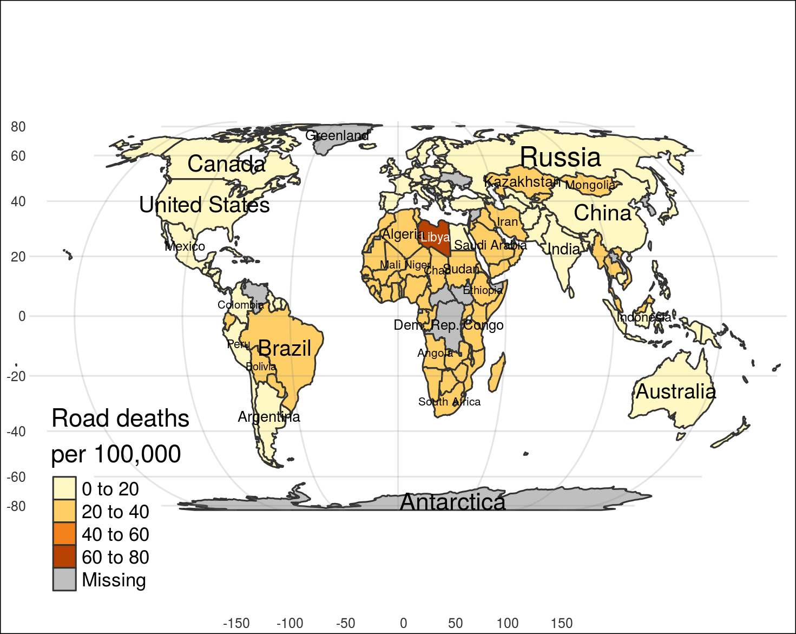
```

## Global oil supply consumed by transport | Source: [iea.org](https://www.iea.org/publications/freepublications/publication/KeyWorld_Statistics_2015.pdf)

```{r, echo=FALSE, out.width="70%"}
knitr::include_graphics("../figures/global-energy-sector.png")
```

> - Transport accounts for just under 1/3^rd^ (27%) of overall energy use

## Transport energy use by mode | Source: [worldenergy.org](https://www.worldenergy.org/wp-content/uploads/2012/09/wec_transport_scenarios_2050.pdf)

```{r, echo=FALSE, out.width="80%"}
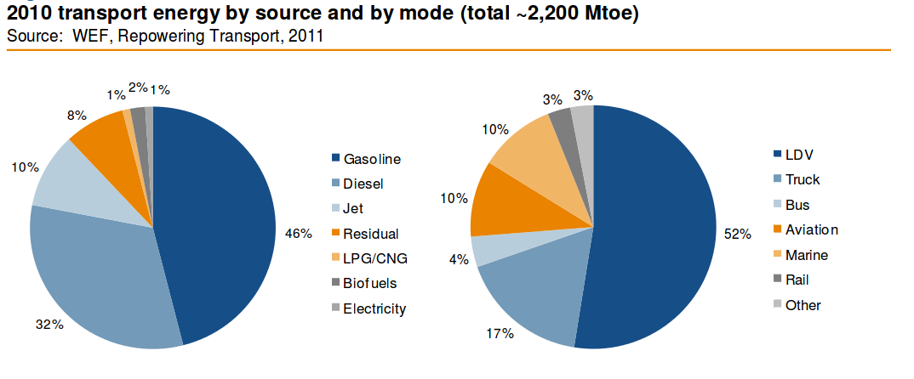
```

> - But over 2/3^rds^ of oil production!
> - hard to decarbonise

## Data on travel patterns over time | Source: BHPS

```{r, echo=FALSE}
knitr::include_graphics("https://raw.githubusercontent.com/Robinlovelace/thesis-reproducible/master/Figures/mode-time-dft2011.png")
```

> - Can lead to perception that travel patterns are stagnant

## Shifting transport patterns | The long view

```{r, echo=FALSE, out.width="60%"}
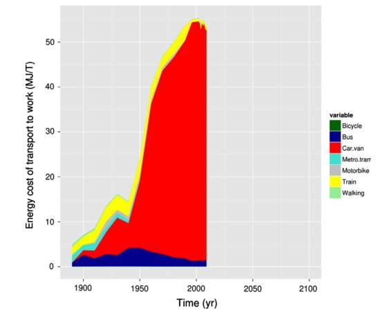
```

> - When scales are exentended it's clear travel patterns change

## Trip rates since the 1970s | Source: NTS

```{r, echo=FALSE}
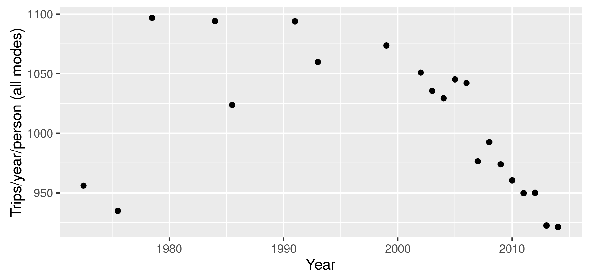
```

> - There may be less demand than expected for roads, freeing up resources

## Trip rates since 1995 | Source: [Crawford and Lovelace (2015)](http://eprints.whiterose.ac.uk/83048/1/CrawfordF-LovelaceR%20cycling%20benefits_Jan2015.pdf)

```{r, echo=FALSE, out.width="70%"}
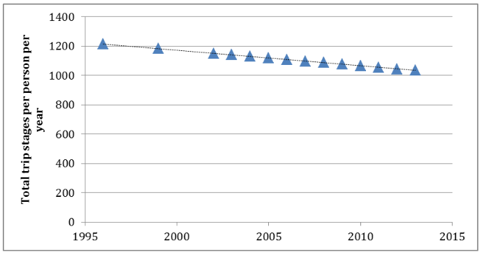
```

> - Less dramatic but still visible with extended Y axis

## The overall external costs of transport | Source: [Cabinet Office, 2009](http://webarchive.nationalarchives.gov.uk/+/http:/www.cabinetoffice.gov.uk/media/307739/wider-costs-transport.pdf)

```{r, echo=FALSE, out.width="70%"}
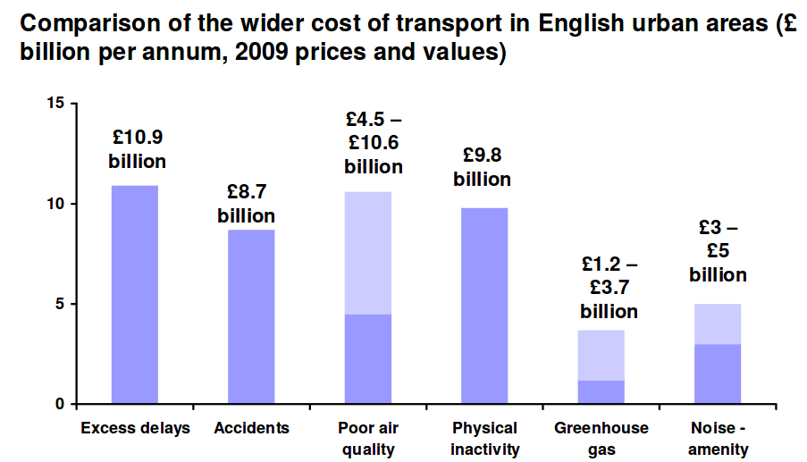
```

## The place of cycling | Source: [Sean Fitzsimons](https://twitter.com/CroydonSean/status/740983628126113792/photo/1?ref_src=twsrc^tfw)

```{r, echo=FALSE, out.width="50%"}
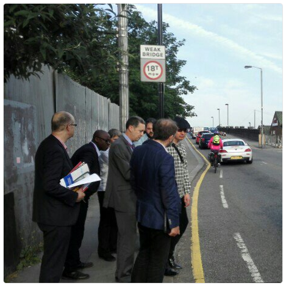
```

- First photo of cycling in London - deliberately not chosen somewhere like Blackfriars bridge becuase there is still lots to be done

## The impact of cycling in context dependent | Source: [Fishman et al. (2014)](http://eprints.qut.edu.au/67026/1/Does_bike_share_reduce_car_use_E_Fishman.pdf)

```{r, echo=FALSE, message=FALSE}
library(dplyr)
df = data_frame(
  City = c("Melbourne", "Brisbane", "Washington, D.C.", "Minnesota", "London"),
  `Bike trips/per day` = c(0.6, 0.3, 3.0, 0.9, 3.1),
  `Replacement ratio` = round(100 / c(19, 21, 7, 19, 2), 1),
  `Reduction in car use per bike` = c(193, 79, 247, 135, 79)
)
knitr::kable(df)
```

> - The impacts of cycling policy depend on context and policies

<!-- It's often hard to see where the humble bicycle fits into these grand plans -->

## The importance of the 'replacement ratio'

- The replacement ratio is "the number of additional bicycle trips required to replace or prevent a single car trip" [@lovelace_assessing_2011]:

$$
RR = \frac{\Delta Trips_{Cycled}}{-\Delta Trips_{Driven}}
$$

```{r, echo=FALSE, out.width="75%"}
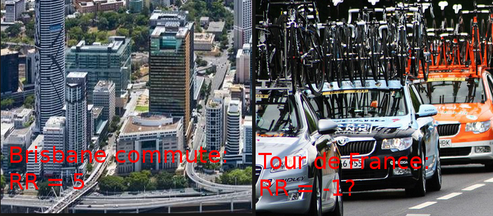
```

# Transport planning

## Origins of Transport planning | Credit: Crispin Cooper

```{r, echo=FALSE, out.width="60%"}
knitr::include_graphics("../figures/sdna-san-fran.png")
```

<!-- - Transport planning isn't a 'pure' academic discipline -->
<!-- - It arose out of a specific context -->

## Institutionalised priorities

```{r, echo=FALSE, out.width="80%"}
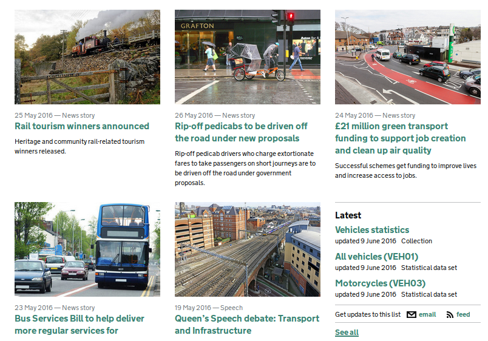
```

Note: TfL's front page has a chairlift going through the centre!

<!-- Out of 11 'policies', not a single one mentions walking or cycling -->
<!--     Aviation and airports -->
<!--     HS2: high speed rail -->
<!--     Rail network -->
<!--     Road network and traffic -->
<!--     Road safety -->

## Institutional structures I: Board | Source: [Department for Transport](https://www.gov.uk/government/uploads/system/uploads/attachment_data/file/500776/dft-organisation-chart.pdf)

```{r, echo=FALSE, out.width="60%"}
knitr::include_graphics("../figures/dft-organogram-board.png")
```


<!-- Over half of trips are < 5 miles -->

## Institutional structures II: Roads Traffic and Local Group

```{r, echo=FALSE, out.width="60%"}
knitr::include_graphics("../figures/dft-local.png")
```

## Institutional structures III: Local Transport

```{r, echo=FALSE, out.width="40%"}
knitr::include_graphics("../figures/dft-local1-2.png")
```

> - How would it look in London? Fortunately different - TfL has a different institutional culture and structure to match

## Institutional structures IV

```{r, echo=FALSE, out.width="80%"}
knitr::include_graphics("../figures/dft-organogram-all.png")
```

## Tools for transport planning I | Source: [Pixton.com](https://www.pixton.com/comic/xya3s212)

```{r, echo=FALSE, out.width="70%"}
# download.file("https://en.wikipedia.org/wiki/Black_box#/media/File:Blackbox3D-withGraphs.png",
#               "figures/Blackbox.png", mode = "wb")
knitr::include_graphics("../figures/Blackbox.png")
```

> - Are black boxes

<!-- I had quite rant about this last - won't dwell on it too much and will focus on solutions rather than problems -->

## Tools for transport planning II | Source: [openclipart](https://openclipart.org/download/188748/manwithbighammer.svg)

```{r, echo=FALSE, out.width="50%"}
knitr::include_graphics("https://openclipart.org/download/188748/manwithbighammer.svg")
```

> - Tools are blunt

## Tools for transport planning III | Source: By James Albert Bonsack (1859 – 1924), [Wikimedia](https://commons.wikimedia.org/w/index.php?curid=1267158)

```{r, echo=FALSE, out.width="50%"}
knitr::include_graphics("https://upload.wikimedia.org/wikipedia/commons/thumb/c/ce/Bonsack_machine.png/800px-Bonsack_machine.png")
```

> - Are sometimes too complex!
> - This has implications for others

# Embedding active modes in transport planning

## My current cycle path in the UK is currently...

<iframe width="854" height="480" src="https://www.youtube.com/embed/tpbd7bottio?t=22" frameborder="0" allowfullscreen></iframe>

## Why?

- Experimental: shows willingness to try things out

- Cost effective: only £5 per metre

- Clearly linked with other travel modes: 'stick and carrot'

- Appeals to all types of cyclists and fits all types of pedal cycles

## Using evidence effectively | Source: [Camcycle.org](https://www.camcycle.org.uk/blog/2015/10/23/milton-road-elizabeth-way-junction-proposals/)

<iframe allowfullscreen="" frameborder="0" height="375" mozallowfullscreen="" src="https://player.vimeo.com/video/143309697" webkitallowfullscreen="" width="500"></iframe>

## Simple innovations | Source: [Central London, this morning!](https://twitter.com/robinlovelace/status/741178265361129472)

```{r, echo=FALSE, out.width="60%"}
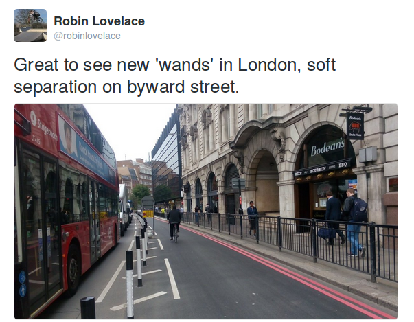
```

## Experiementation

```{r, echo=FALSE}
knitr::include_graphics("https://raisethehammer.org/static/images/long_beach_cycle_track_3rd_street_pasadena.jpg")
```

> - Also integrating into road maintenance plans

## Participatory planning

```{r, echo=FALSE}
knitr::include_graphics("http://robinlovelace.net/figure/cconnect.png")
```

## Envisioning shifting travel patterns | Source: Leeds Cycling Campaign

```{r, echo=FALSE}
knitr::include_graphics("http://leedscyclingcampaign.co.uk/sites/default/files/Residential%20Street%20small_0.jpg")
```

## Institutional recognition

> - CIHT guidance on Planning for Cycling [@gallagher_planning_2014]
> - Cycling officers
> - Design guidance from Highways for England

## Example: the Strategic Road Network

```{r, echo=FALSE, out.width="90%"}
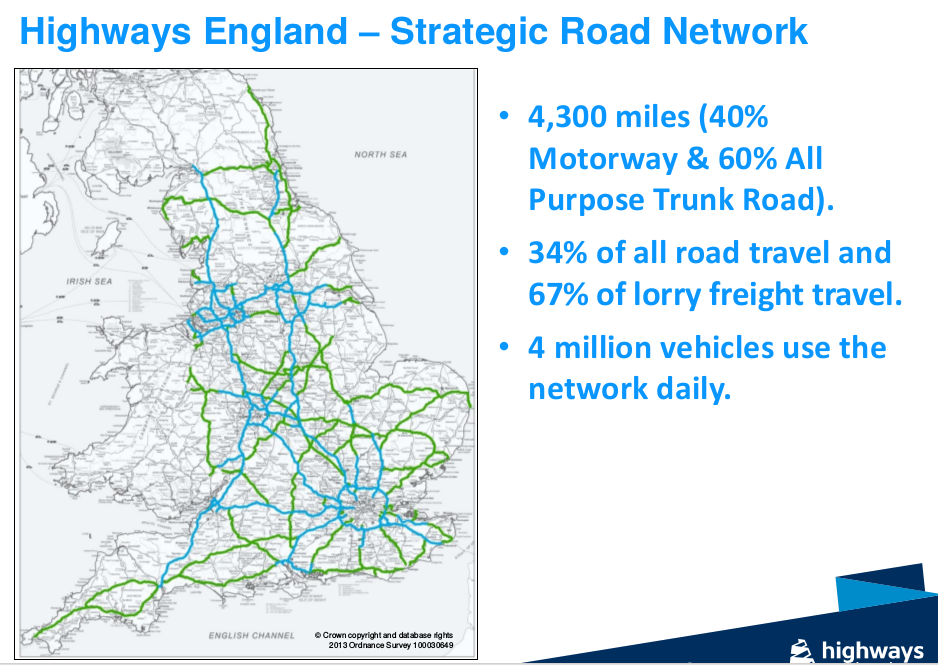
```

## New digital technologies

```{r, echo=FALSE}
knitr::include_graphics("http://images.cdn.stuff.tv/sites/stuff.tv/files/styles/big-image/public/news/see-sense-light.jpg")
```

## A definition of Propensity to Cycle and its uses

> Propensity to cycle refers to the modelled
uptake of cycling at area, desire line and
route network levels under different
scenarios of the future. Policy relevant
scenarios include meeting national or local
targets, the potential uptake if people in the
study area cycled as much as the Dutch do
or the impact of electric bikes on people's
willingness to cycle longer distances. ([see Get Britain Cycling article](http://getbritaincycling.net/wp-content/uploads/2016/05/Get-Britain-Cycling_2016.pdf), 2016)

The tool aims to help prioritise **where** interventions are most needed based on where cyclable trips are most common

## Live demo of the PCT | Source: @lovelace_propensity_2016

See http://pct.bike/london

[](https://github.com/npct/pct/raw/master/figures/rnet-leeds-base-to-godutch.png)


## A predict and provide paradigm for active travel?

```{r, echo=FALSE, out.width="80%"}
knitr::include_graphics("https://62e528761d0685343e1c-f3d1b99a743ffa4142d9d7f1978d9686.ssl.cf2.rackcdn.com/files/62074/area14mp/64f3rnsg-1413542982.png")
```

Source: [The Conversation](http://theconversation.com/hint-of-proper-funding-for-cycling-but-we-must-fight-for-it-with-evidence-33152)


## References

Lovelace, Robin. 2016. "Mapping out the future of cycling." Get Britain Cycling, 2016. P. 22 - 24. Available from [getbritaincycling.net](http://getbritaincycling.net/)

<!-- [arxiv.org/abs/1509.04425](http://arxiv.org/abs/1509.04425) -->

