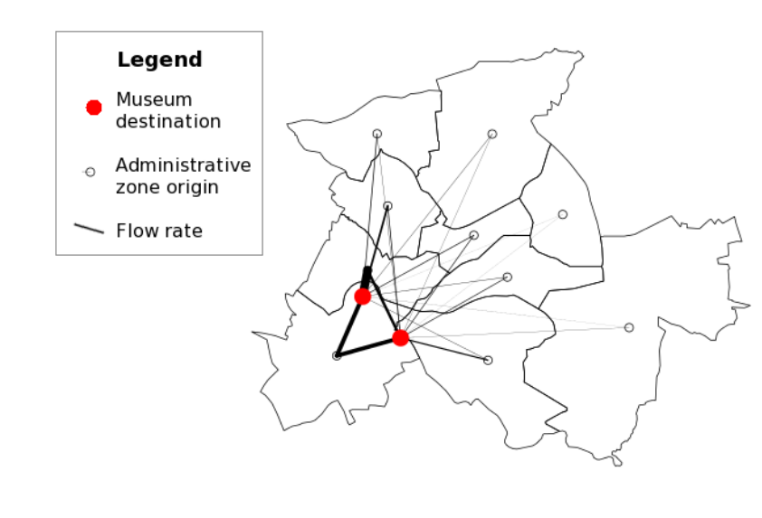
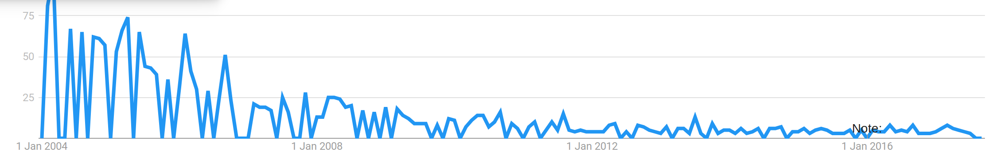
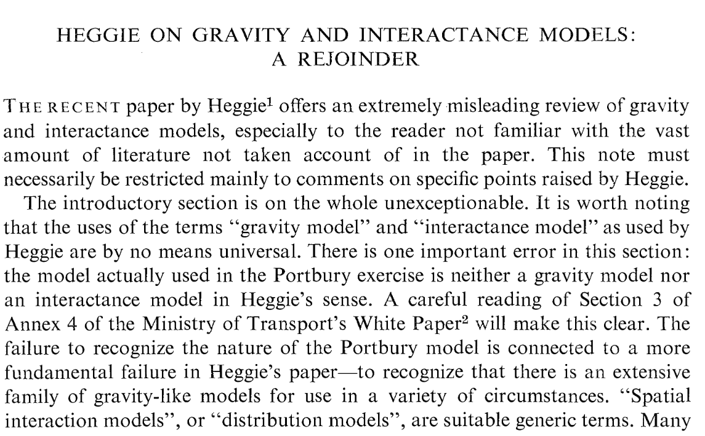
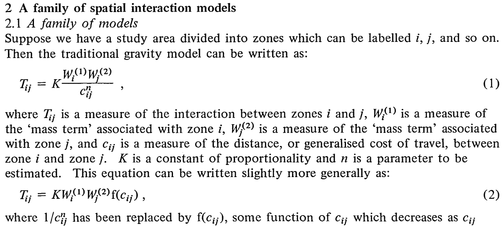
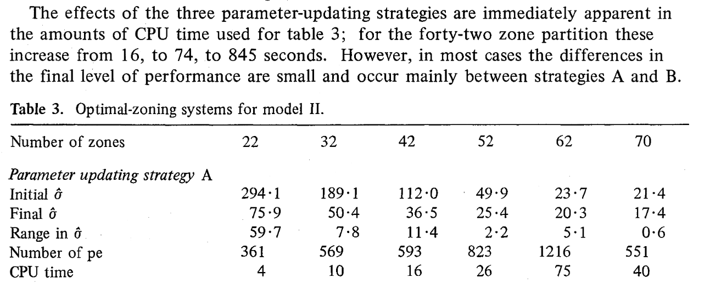
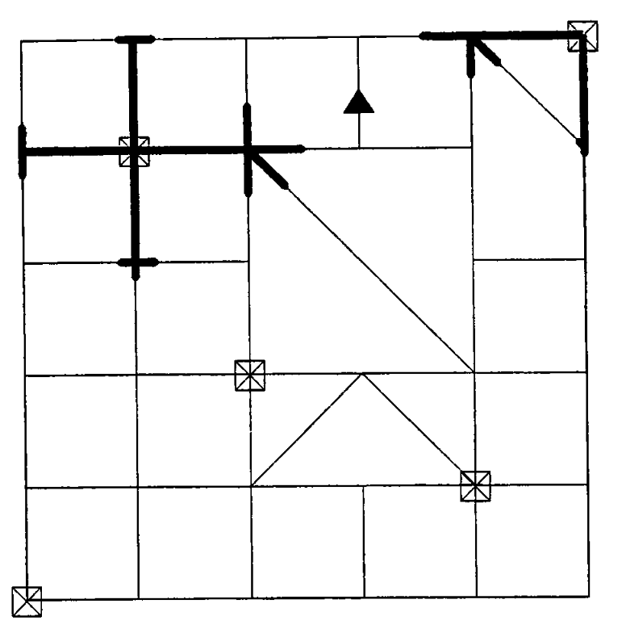
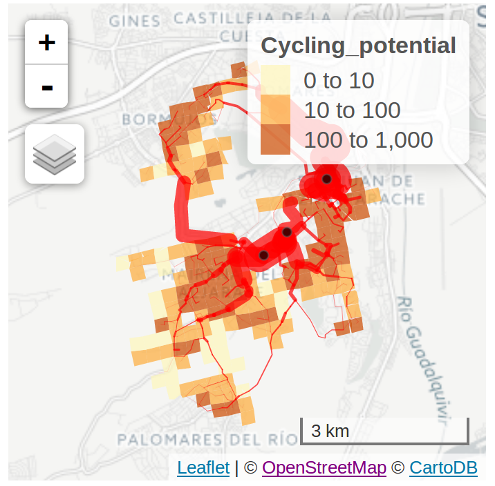

<!-- Plan: 15 minute presentation building on pct work and mlCars stuff -->

## Outline

- Are SIMs still relevant?
- Barriers to scalable SIMs
- Case study and discussion

# Are SIMs still relevant?

## What have SIMs ever done for us?

<iframe width="560" height="315" src="https://www.youtube.com/embed/Y7tvauOJMHo" frameborder="0" allowfullscreen></iframe>

## Allowed us to model travel to museums

- [@lovelace_geotagged_2014]



## Provided a framework to model any travel phenomenon

> - Vital to the history of transport modelling [@boyce_forecasting_2015]


## The propensity to cycle tool ([www.pct.bike](https://www.pct.bike/))  | [Source:](https://www.jtlu.org/index.php/jtlu/article/view/862) [@lovelace_propensity_2017]

```{r, echo=FALSE}
knitr::include_graphics("../flow-model/leeds-rnet-gov-go.png")
```

## Search terms

```{r, echo=FALSE}

```


## Citations over [time](https://scholar.google.com/scholar?q=%22Spatial+Interaction+Model%22+transport&hl=en&num=20&as_sdt=0%2C5&as_ylo=2000&as_yhi=2009) | Articles that mention "Spatial Interaction Model"

```{r, echo=FALSE, include=FALSE}
library(tidyverse)
```

```{r, echo=FALSE}
data_frame(date = c("70s", "80s", "90s", "00s", "10s"),
           papers = c(172, 388, 544, 1280, 1910)) %>% 
  knitr::kable()
```

## SIM literature in context

```{r, echo=FALSE}
brt <-  theme(axis.text.x = element_text(angle=20, color = "black"),
        panel.background = element_rect(fill = "white"),
        panel.grid.major.y = element_line(color = "grey", linetype=3))
ddt <- read.csv("../input-data/dd-terms-scholar.csv")
ggplot(ddt) +
  geom_line(aes(x = Decade, y = Frequency, color = Term, group = Term)) +
  scale_y_log10() + brt +
  ylab("Number of 'transport' papers in Google Scholar")
```

## In the 1960s - Were they called SIMs at all?

(Wilson, 1969):

```{r, out.width="60%", echo=FALSE}

```

## 1970s: Theoretical foundations

```{r, out.width="90%", echo=FALSE}

```

[@wilson_family_1971]

## 1980s: Computerization

```{r, out.width="90%", echo=FALSE}

```

[@openshaw_optimal_1977]

## 1990s: Applications

```{r, out.width="30%", echo=FALSE}

```

(Miller, 1999)

## 2000 onwards: growing sophistication

- Increase in complexity but not necessarily scalability
- Hybrid models, combining with ABM [@heppenstall_simulating_2013]
- Proliferation in the range of applications
- And are they still relevant in the age of GPS?
- But what about scalability?

## 2010s: Add-ons

> - Can be extended towards agent-based modelling (ABM) [@wu_spatial_2008]

> - Integration with NetLOGO [@lovelace_spatial_2016] 
> - Calibration with 'Big Data' [@lovelace_big_2016]

> - Theotical advance: the radiation model [@simini_universal_2012]

## 2010s: The open source software revolution

```{r, echo=TRUE, message=FALSE}
library(stplanr)
cents$pop = 1:nrow(cents)
plot(cents, cex = cents$pop)
```

## The radiation model [@simini_universal_2012]

```{r, message=FALSE, echo=TRUE}
flow_est = od_radiation(p = cents, pop_var = "pop")
plot(flow_est, lwd = flow_est$flow)
```

## What do I mean by 'scalable'

> -  Large surface area (countries, planets)
> -  Reproducible, e.g. for infinite new scenarios of future
> -  Accessible - so results can 'scale' to be seen and *used interactively* by millions of people
> -  Resilient: methods can operate in data rich and data poor environments
> - Rationale: a 'rolled-out' simple method can have a greater impact than a non-scalable complex one

# Barriers to scalable SIMs

## Problem: Reproducibility


## Solution: command-line interfaces

```{r, eval=FALSE}
library(stplanr)
# load some points data
data(cents)
# plot the points to check they make sense
plot(cents)
flowlines_radiation <- od_radiation(cents, pop_var = "population")
```

## Problem: Data

(Ribeiro et al. 2012)

```{r, echo=FALSE, out.width="50%"}
knitr::include_graphics("https://www.researchgate.net/profile/Goncalo_Homem_De_Almeida_Correia/publication/309727462/figure/fig1/AS:425501278904320@1478458818442/Fig-1-Main-trip-generatorsattractors-by-purpose-and-road-hierarchy-in-Tomar.jpg")
```

## Solution: OSM(data)

```{r}
library(osmdata)
unis = opq(bbox = "Leeds, UK") %>% 
  add_osm_feature(key = "amenity", value = "university") %>% 
  osmdata_sf() %>% .$osm_polygons
```

```{r, echo=FALSE}
library(tmap)
tmap_mode("view")
qtm(unis)
```


## Problem: standards

Source: *Geocomputation with R* (Lovelace, Nowosad and Meunchow, forthcoming)


# Case study and discussion

## Case study

> - What is the potential uptake of cycling to rail stations in Seville?

```{r, echo=FALSE, out.width="75%"}
knitr::include_graphics("/home/robin/npct/pctSeville/figures/README-unnamed-chunk-13-1.png")
```

## No OD data: model it

- Reproducible example: [rpubs.com/RobinLovelace](http://rpubs.com/RobinLovelace/275315)

```{r, echo=FALSE}

```

## Discussion

> - A number of problems (reproducibility, data, standards)
> - For scalability generalisability is vital
> - Software engineering/compsci approach
> - Shift in applications: industry -> public sector / active travel?
> - But leadership vital - new open source framework?


## Thanks + References

> - Thanks for listening - get in touch via `r.lovelace@leeds.ac.uk` or `@robinlovelace`


## Abstract

Origin-destination (OD) data forms the basis of much research, in transport, migration and transport studies.
In parallel with the growth in the number and size of such datasets, methods for simulating and updating them have proliferated.
Many of these methods are known as spatial interaction models (SIMs).
SIMs are thus vital for furthering our understanding of large-scale human movemement patterns.
However, much of the academic literature focusses on the development of new and sophisticated methods, rather than the implementation of SIMs on large datasets.
This is problematic for practitioners wishing to use SIMs in their work:
while there is much information on which SIMs are most flexible or effective theoretically, there are few resources for assessing how scalable different methods are 'on the ground'.
Taking a broad definition of scalable, this paper will explore SIMs in terms scalability and computational efficiency.
The results will be demonstrated with reference a planned modelling project, which would use globally scalable SIMs with the aim of informing effective sustainable transport policies worldwide.

## Selected references

